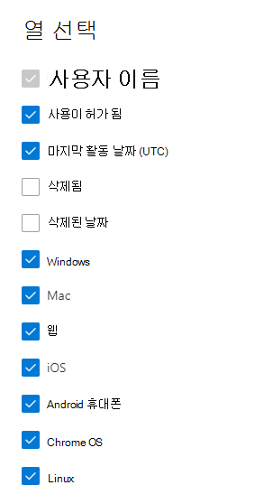

# 관리 센터의 microsoft 365 보고서-Microsoft 팀 장치 사용 현황

Microsoft 365 **보고서** 대시보드에는 조직의 제품 전체에 대 한 활동 개요가 표시 됩니다. 보고서 대시보드를 통해 개별 제품 수준 보고서의 하위 수준을 표시하여 각 제품 내의 활동에 대한 더 세부화된 정보를 확인할 수 있습니다. [보고서 개요 항목](activity-reports.md)을 확인하세요. Microsoft Teams 앱 사용 보고서에서는 조직에서 사용되는 Microsoft Teams 앱에 대한 정보를 확인할 수 있습니다.
  
> [!NOTE]
> 보고서를 보려면 Microsoft 365 또는 Exchange, SharePoint, 팀 서비스, 팀 통신 또는 비즈니스용 Skype 관리자의 전역 관리자, 전역 독자 또는 보고서 독자 여야 합니다.  
 
## Microsoft Teams 앱 사용 보고서에 액세스하는 방법

1. 관리 센터에서 **보고서** \> <a href="https://go.microsoft.com/fwlink/p/?linkid=2074756" target="_blank">사용 현황</a> 페이지를 참조하세요. 
2. 대시보드 홈 페이지에서 Microsoft 팀 활동 카드의 **기타 보기** 단추를 클릭 합니다.
  
## Microsoft Teams 앱 사용 보고서 해석

**장치 사용 탭을** 선택 하 여 팀 보고서에서 디바이스 용도를 볼 수 있습니다. 

**열 선택을** 선택 하 여 보고서에서 열을 추가 하거나 제거 합니다.    

**내보내기** 링크를 선택 하 여 보고서 데이터를 Excel .csv 파일로 내보낼 수도 있습니다. 그러면 모든 사용자의 데이터를 내보내고 향후 분석을 위해 간단하게 정렬 및 필터링을 수행할 수 있습니다. 사용자가 2,000명 미만인 경우 보고서 자체의 표에서 정렬 및 필터링할 수 있습니다. 사용자가 2,000명 이상인 경우 필터링 및 정렬하려면 데이터를 내보내야 합니다. 
  
|항목|설명|
|:-----|:-----|
|**메트릭**|**정의**|
|사용자 이름    |사용자의 표시 이름입니다.    |
|Windows    |사용자가 Windows 기반 컴퓨터의 팀 데스크톱 클라이언트에서 활성 상태 였던 경우 선택 됩니다.    |
|Mac    |사용자가 macOS 컴퓨터의 팀 데스크톱 클라이언트에서 활성 상태 였던 경우 선택 됩니다.    |
|iOS    |사용자가 iOS 용 팀 모바일 클라이언트에서 활성 상태 였던 경우 선택 됩니다.    |
|Android 휴대폰    | 사용자가 Android 용 팀 모바일 클라이언트에서 활성 상태 였던 경우 선택 됩니다.    |
|Chrome OS    |사용자가 ChromeOS 컴퓨터의 팀 데스크톱 클라이언트에서 활성 상태 였던 경우 선택 됩니다.|
|Linux    | 사용자가 Linux 컴퓨터의 팀 데스크톱 클라이언트에서 활성 상태 였던 경우 선택 됩니다.    |
|웹    |사용자가 장치의 팀 웹 클라이언트에서 활성 상태 였던 경우 선택 됩니다.|
|마지막 활동 날짜 (UTC)    |사용자가 팀 활동에 참여 한 마지막 날짜 (UTC)입니다.    |
|사용이 허가 됨|사용자에 게 팀 사용이 허가 된 경우 선택 됩니다.|
|총 팀 활동|선택한 기간 동안의 총 팀 활동 수입니다. |
|||