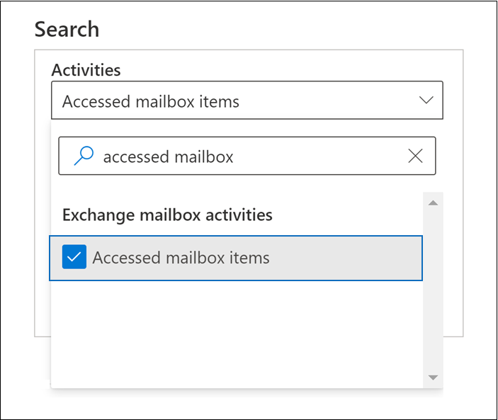
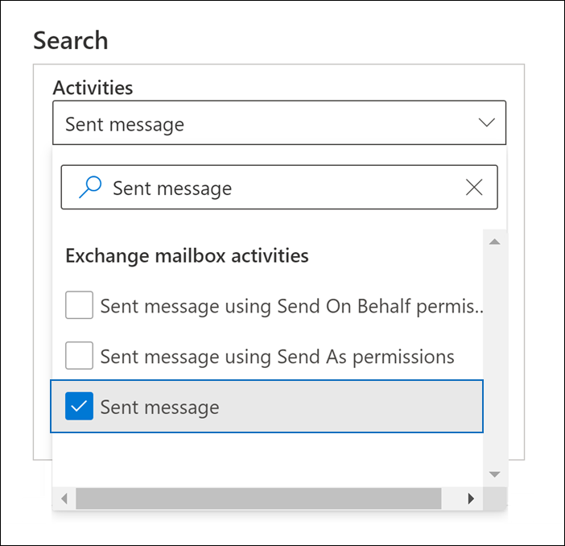
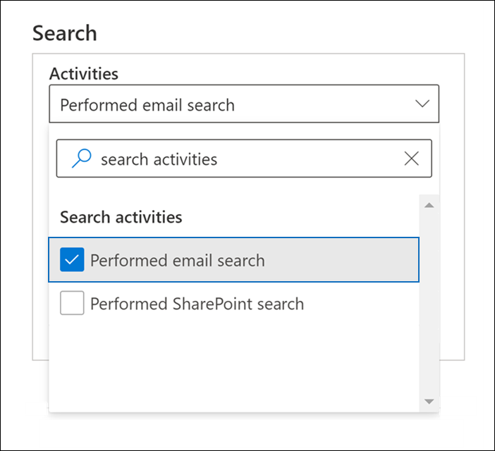
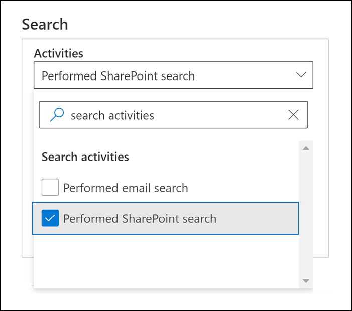

# Microsoft 365의 고급 감사

Microsoft 365의 [통합 감사 기능](search-the-audit-log-in-security-and-compliance.md) 은 Microsoft 365의 다양한 서비스에서 다양한 감사 활동 유형을 볼 수 있게 해주는 기능입니다. 고급 감사를 통해 조직에서 조사를 수행하는 데 필요한 감사 로그 보존을 강화하고, 손상 범위를 확인하는 데 도움이 되는 중요한 이벤트에 대한 액세스를 제공하고, Office 365 관리 작업 API에 빠르게 액세스할 수 있게 해주어 조직에서 법의학 및 규정 준수 조사를 수행하는 데 도움이 됩니다.

> [!NOTE]
> 고급 감사는 Office 365 E5/G5 또는 Microsoft 365 Enterprise E5/G5 구독이 있는 조직에서 사용할 수 있습니다. 또한 감사 로그가 장기 보존되는 경우와 조사에 대한 중요한 이벤트에 액세스하는 경우와 같이 고급 감사 기능에 대한 사용자별 라이선스가 필요한 경우에는 Microsoft 365 E5 준수 또는 E5 eDiscovery 및 감사 추가 기능 라이선스가 사용자에게 할당될 수 있습니다. 라이선싱에 대한 자세한 내용은 [보안 및 준수에 대한 Microsoft 365 라이선스 지침](https://docs.microsoft.com/office365/servicedescriptions/microsoft-365-service-descriptions/microsoft-365-tenantlevel-services-licensing-guidance/microsoft-365-security-compliance-licensing-guidance#advanced-audit)을 참조하세요.

이 문서는 고급 감사 기능에 대한 개요를 제공합니다.

## 감사 로그의 장기 보존

고급 감사는 1년 동안 모든 Exchange, SharePoint 및 Azure Active Directory 감사 기록을 유지합니다. 이 작업은 1년 동안 작업이 발생한 서비스를 표시하는 **작업** 속성에 대한 **Exchange** , **SharePoint** 또는 **AzureActiveDirectory** 값이 포함된 모든 감사 기록을 유지하는 기본 감사 로그 보존 정책을 통해 수행됩니다. 감사 기록을 장기간 유지하면 진행 중인 법의학 또는 규정 준수 조사에 도움이 될 수 있습니다. 자세한 내용은 [감사 로그 보존 정책 관리](audit-log-retention-policies.md#default-audit-log-retention-policy)의 "기본 감사 로그 보존 정책" 섹션을 참조하세요.

또한 10년간 감사 로그를 보존하는 기능도 릴리스하고 있습니다. 감사 로그의 10년 보존은 장기 진행 조사를 지원하고 규제, 법률 및 내부의 의무 사항에 대응하는 데 도움이 됩니다.

> [!NOTE]
> 10년간 감사 로그를 보존하려면 추가적인 추가 기능 라이선스가 필요합니다. 이 새 라이선스는 2021년 초에 사용할 수 있습니다. 자세한 내용은 이 문서의 [고급 감사 관련 FAQ](#faqs-for-advanced-audit) 섹션을 참조하세요.

### 로그 보존 정책 감사

기본 감사 로그 보존 정책에 포함되지 않은 다른 서비스에서 생성된 모든 감사 레코드(이전 섹션에서 설명됨)는 90일간 보존됩니다. 하지만 최대 10년 동안 장기간 다른 감사 레코드를 보존하는 사용자 지정 감사 로그 보존 정책을 만들 수 있습니다. 다음 기준 중 하나 이상을 기준으로 감사 레코드를 보존하는 정책을 만들 수 있습니다.

- 감사되는 활동이 발생하는 Microsoft 365 서비스입니다.

- 감사되는 구체적 활동

- 감사되는 활동을 수행하는 사용자입니다.

또한 정책과 우선 순위 수준이 일치하는 감사 레코드를 보존하는 기간을 지정하여 특정 정책이 다른 정책 보다 우선 순위를 가지도록 할 수도 있습니다. 또한 조직의 일부 또는 모든 사용자에 대해 1년 미만(또는 10년)으로 Exchange, SharePoint 또는 Azure Active Directory 감사 레코드를 보존해야 할 경우에는 사용자 지정 감사 로그 보존 정책이 기본 감사 보존 정책 보다 우선적으로 적용됩니다. 자세한 내용은 [감사 로그 보존 정책 관리](audit-log-retention-policies.md)를 참조하세요.

## 조사에 대한 중요 이벤트 액세스

고급 감사는 메일 항목에 액세스하는 경우 또는 메일 항목에 회신하고 전달하는 경우 그리고 사용자가 언제 무엇을 Exchange Online 및 SharePoint Online에서 검색했는지와 같은 중요한 이벤트에 대한 액세스를 제공하여 법의학 및 준수 조사를 수행하는 데 도움이 됩니다. 이러한 중요한 이벤트는 발생 가능성이 있는 위반을 조사하고 손상 범위를 결정하는 데 도움이 될 수 있습니다. 고급 감사는 다음과 같은 중요한 이벤트를 제공합니다.

- [MailItemsAccessed](#mailitemsaccessed)

- [보내기](#send)

- [SearchQueryInitiatedExchange](#searchqueryinitiatedexchange)

- [SearchQueryInitiatedSharePoint](#searchqueryinitiatedsharepoint)

### MailItemsAccessed

MailItemsAccessed 이벤트는 사서함 감사 작업 으로서 메일 프로토콜과 메일 클라이언트가 메일 데이터에 액세스할 때 트리거됩니다. MailItemsAccessed 작업은 조사자가 데이터 유출을 식별하고 손상되었을 수 있는 메시지 범위를 결정하는 데 도움이 됩니다. 공격자가 전자 메일 메시지에 액세스한 경우 실제로 메시지를 읽었다는 명시적인 신호가 없는 경우에도 MailItemsAccessed 작업이 트리거됩니다(즉, 바인딩 또는 동기화 등의 액세스 유형이 감사 레코드에 기록됨).

새로운 MailItemsAccessed 사서함 작업은 Exchange Online의 사서함 감사 로깅에서 MessageBind를 대체하고 다음과 같은 향상된 기능을 제공합니다.

- MessageBind는 AuditAdmin 사용자 로그온 유형으로만 구성할 수 있었습니다. 대리인 또는 소유자 작업에는 적용되지 않았습니다. MailItemsAccessed는 모든 로그온 유형에 적용됩니다.

- MessageBind는 메일 클라이언트를 통한 액세스에만 적용되고 동기화 작업에는 적용되지 않았습니다. MailItemsAccessed 이벤트는 바인딩 및 동기화 액세스 유형 모두로 인해 트리거됩니다.

- MessageBind 작업은 동일한 전자 메일 메시지에 액세스할 때 여러 감사 레코드의 생성을 트리거하여 결과적으로 "노이즈" 감사가 발생합니다. 반대로 MailItemsAccessed 이벤트는 더 적은 감사 레코드로 집계됩니다.

MailItemsAccessed 작업의 대한 감사 레코드에 대한 자세한 내용은 [고급 감사를 사용하여 손상된 계정 조사](mailitemsaccessed-forensics-investigations.md)를 참조하세요.

MailItemsAccessed 감사 레코드를 검색하려면 Microsoft 365 보안 및 준수 센터의 [감사 로그 검색 도구](search-the-audit-log-in-security-and-compliance.md)의 **Exchange 사서함 활동** 드롭다운 목록에서 **액세스한 사서함 항목** 에 대한 활동을 검색할 수 있습니다.

Exchange Online PowerShell에서 [Search-UnifiedAuditLog -Operations MailItemsAccessed](https://docs.microsoft.com/powershell/module/exchange/search-unifiedauditlog) 또는 [Search-MailboxAuditLog -Operations MailItemsAccessed](https://docs.microsoft.com/powershell/module/exchange/search-mailboxauditlog) 명령을 실행할 수도 있습니다.

### 보내기

보내기 이벤트는 또한 사서함 감사 작업이며 사용자가 다음 작업 중 하나를 수행할 때 트리거됩니다.

- 전자 메일 메시지 전송

- 전자 메일 메시지에 회신

- 전자 메일 메시지 전달

조사관은 보내기 이벤트를 사용하여 손상된 계정에서 보낸 전자 메일을 식별할 수 있습니다. 보내기 이벤트에 대한 감사 레코드에는 메시지를 보낸 시간, InternetMessage ID, 제목 줄, 메시지에 첨부 파일이 포함되었는지 등의 메시지에 대한 정보가 포함됩니다. 이 감사 정보를 통해 조사자는 손상된 계정에서 보내거나 공격자가 보낸 전자 메일 메시지에 대한 정보를 식별하는 데 도움을 받을 수 있습니다. 또한 조사자는 Microsoft 365 eDiscovery 도구를 사용하여 메시지를 검색하여(제목 줄 또는 메시지 ID) 메시지를 받는 사람과 보낸 메시지의 실제 내용을 식별할 수 있습니다.

감사 레코드 보내기를 검색하려면 Microsoft 365 준수 센터 [감사 로그 검색 도구](search-the-audit-log-in-security-and-compliance.md)의 **Exchange 사서함 활동** 드롭다운 목록에서 **보낸 메시지** 활동을 검색할 수 있습니다.

또한 Exchange Online PowerShell에서 [Search-UnifiedAuditLog -Operations Send](https://docs.microsoft.com/powershell/module/exchange/search-unifiedauditlog) 또는 [Search-MailboxAuditLog -Operations Send](https://docs.microsoft.com/powershell/module/exchange/search-mailboxauditlog) 명령을 실행할 수도 있습니다.

### SearchQueryInitiatedExchange

SearchQueryInitiatedExchange 이벤트는 사용자가 OWA(웹용 Outlook)에서 검색 창을 사용하여 사서함의 항목을 검색하는 경우에 트리거됩니다. 조사자는 SearchQueryInitiatedExchange 이벤트를 사용하여 계정을 손상시킬 수 있는 공격자가 사서함의 중요한 정보를 찾거나 액세스하려고 시도했는지를 확인할 수 있습니다. SearchQueryInitiatedExchange 이벤트에 대한 감사 레코드에는 검색 쿼리의 실제 텍스트와 같은 정보가 포함되어 있습니다. 조사자는 공격자가 수행했을 수 있는 검색 쿼리를 살펴보고 검색한 전자 메일 데이터의 의도를 더 잘 이해할 수 있습니다.

SearchQueryInitiatedExchange 감사 레코드를 검색하려면 준수 센터에서 [감사 로그 검색 도구](search-the-audit-log-in-security-and-compliance.md)의 **검색 활동** 드롭다운 목록에서 **수행한 전자 메일 검색** 활동을 검색할 수 있습니다.

Exchange Online PowerShell에서 [Search-UnifiedAuditLog-Operations SearchQueryInitiatedExchange](https://docs.microsoft.com/powershell/module/exchange/search-unifiedauditlog)를 실행할 수도 있습니다.

> [!NOTE]
> Exchange Online PowerShell에서 다음 명령을 실행하여 SearchQueryInitiatedExchange 이벤트(지정된 E5 사용자가 수행한)가 감사 로그 검색 결과에 포함되도록 합니다.`Set-Mailbox <user identity> -AuditOwner @{Add="SearchQueryInitiated"}`

### SearchQueryInitiatedSharePoint

사서함 항목 검색과 마찬가지로 SearchQueryInitiatedSharePoint 이벤트는 사용자가 조직의 SharePoint 홈 사이트에서 항목을 검색할 때 트리거됩니다. 조사관은 SearchQueryInitiatedSharePoint 이벤트를 사용하여 SharePoint에서 공격자가 중요한 정보를 찾으려고(또한 잠정 액세스) 했는지 확인할 수 있습니다. SearchQueryInitiatedSharePoint 이벤트에 대한 감사 레코드에는 검색 쿼리의 실제 텍스트도 포함됩니다. 공격자가 수행했을 수 있는 검색 쿼리를 확인하여 조사관은 검색하고 있는 파일 데이터의 의도와 범위를 더 잘 이해할 수 있습니다.

SearchQueryInitiatedSharePoint 감사 레코드를 검색하려면 준수 센터에서 [감사 로그 검색 도구](search-the-audit-log-in-security-and-compliance.md)의 **검색 활동** 드롭다운 목록에서 **수행한 SharePoint 검색** 활동을 검색할 수 있습니다.

또한 Exchange Online PowerShell에서 [Search-UnifiedAuditLog -Operations SearchQueryInitiatedExchange](https://docs.microsoft.com/powershell/module/exchange/search-unifiedauditlog)를 실행할 수도 있습니다.

> [!NOTE]
> Exchange Online PowerShell에서 다음 명령을 실행하여 SearchQueryInitiatedSharePoint 이벤트(지정된 E5 사용자가 수행한)가 감사 로그 검색 결과에 포함되도록 합니다.`Set-Mailbox <user identity> -AuditOwner @{Add="SearchQueryInitiated"}`

## Office 365 관리 작업 API에 대한 고대역폭 액세스

Office 365 관리 작업 API를 통해 감사 로그에 액세스하는 조직은 게시자 수준의 제한 한도로 인한 제약이 있었습니다. 즉, 게시자가 여러 고객을 대신하여 데이터를 가져오는 경우, 해당 한도가 모든 사용자와 공유되었습니다.

고급 감사가 릴리스됨에 따라 Microsoft는 게시자 수준의 한도에서 테넌트 수준의 한도로 이동하고 있습니다. 그 결과로 각 조직에서는 감사 데이터에 액세스하기 위한 자체적인 완전히 할당된 대역폭 할당량을 받게 됩니다. 대역폭의 제한이 미리 정의되어 정적이지 않고 조직의 사용자 수를 포함한 요인들의 조합에 대해 모델링되어, E5 조직에서는 이에 속하지 않은 조직 보다 더 많은 대역폭을 받게 됩니다.

모든 조직에는 초기에 분당 2,000개의 요청 기준이 할당됩니다. 조직의 사용자 수와 라이선스 구독에 따라 이 한도는 동적으로 증가합니다. E5 조직은 이에 속하지 않은 조직 보다 약 두 배의 대역폭을 받게 됩니다. 서비스의 상태를 보호하기 위해 최대 대역폭에도 상한선이 있습니다.

자세한 내용은 [Office 365 관리 작업 API 참조](https://docs.microsoft.com/office/office-365-management-api/office-365-management-activity-api-reference#api-throttling)의 "API 제한" 섹션을 참조하십시오.

## 고급 감사를 위한 FAQ

**고급 감사를 활용하려면 모든 사용자에게 E5 라이선스가 필요한가요?**

사용자 수준의 고급 감사 기능을 활용하려면 사용자에게 E5 라이선스가 할당되어야 합니다. 사용자에게 기능을 표시하기 위해 적절한 라이선스를 확인하는 몇 가지 기능이 있습니다. 예를 들어, E5 라이선스가 할당되지 않은 사용자에 대 한 감사 레코드를 90일 이상 보존하려고 하면, 시스템에서 오류 메시지를 반환합니다.

**내 조직에 E5 구독이 있는 경우에 중요한 이벤트의 감사 레코드에 대한 액세스 권한을 얻기 위해 제가 수행할 작업이 있나요?**

적정 라이선스가 할당된 적격 고객 및 사용자에 게는 중요한 감사 이벤트에 대한 액세스 권한을 얻는 데 취할 조치가 없습니다.

**새 10년 감사 로그 보존 추가 항목 라이선스를 언제 사용할 수 있나요?**

새 10년 감사 로그 보존 추가 기능은 2021년 초에 E5 구독이 있는 고객이 구매할 수 있습니다.

**10년 감사 로그 보존 정책을 만들고 해당 기능이 일반 출시되지만 필수 추가 항목 라이선스를 사용할 수 있는 2021년 초 이전에 릴리스되는 경우, 내 조직의 감사 로그 데이터는 어떻게 되나요?**

일반 출시 이후에 만든 10년 감사 로그 보존 정책이 적용되는 모든 감사 로그 데이터는 10년 동안 보존됩니다. 10년 감사 로그 보존 추가 항목 라이선스를 2021년 초에 사용할 수 있는 경우, 감사 데이터가 기존 10년 감사 보존 정책에 의해 보존되고 있는 사용자에 대해 추가 항목 라이선스를 구매해야 합니다. 또한 2021년 초에 추가 항목 라이선스를 사용할 수 있게 되면, 새 10년 감사 로그 보존 정책을 만들 때 적정 라이선싱이 적용됩니다.

**고급 감사의 새 이벤트는 Office 365 관리 작업 API에서 사용할 수 있나요?**

예. 해당 라이선스가 있는 사용자에 대한 감사 레코드가 생성되는 한, Office 365 관리 작업 API를 통해 이러한 레코드에 액세스할 수 있습니다.

**대역폭이 높을수록 대기 시간이 개선되거나 SLA이 높아짐을 의미하나요?**

현재 높은 대역폭을 사용하면 더 나은 파이프라인을 제공하고, 이는 특히 감사 신호가 많고 상당한 소비량 패턴을 보유하고 있는 조직에 적합합니다. 대역폭이 높을수록 대기 시간이 더욱 개선될 수 있습니다. 그러나 고대역폭과 관련된 SLA는 없습니다. 표준 대기 시간은 문서화되어 있으며 이러한 대기 시간은 고급 감사의 릴리스로 인해 변경되지 않습니다.
