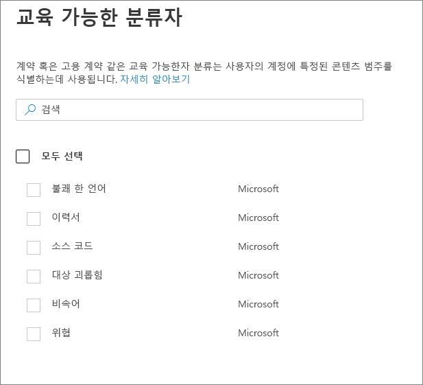

# 민감도 레이블을 콘텐츠에 자동으로 적용

민감도 레이블을 만들 때 민감한 정보가 포함된 콘텐츠에 해당 레이블을 자동으로 할당하거나 사용자에게 권장 레이블을 적용하라는 메시지를 표시할 수 있습니다.

콘텐츠에 자동으로 민감도 레이블을 적용하는 기능도 다음과 같은 이유로 중요합니다.

- 사용자에게 모든 분류를 교육할 필요가 없습니다.

- 모든 콘텐츠를 올바르게 분류하기 위해 사용자에게 의존할 필요가 없습니다.

- 사용자가 더 이상 정책을 알아야 할 필요가 없으며, 그 대신 업무에 집중할 수 있습니다.

Windows용 Office 앱의 자동 레이블 지정은 Azure Information Protection 통합 레이블 클라이언트에서 지원됩니다. Office 앱에서 기본 제공되는 레이블 지정 기능은 [일부 앱에서 미리 볼 수 있습니다.](sensitivity-labels-office-apps.md#support-for-sensitivity-label-capabilities-in-apps)

[민감도 레이블을 만들거나 편집](create-sensitivity-labels.md)할 경우 Office 앱에 대한 자동 레이블 지정 설정을 사용할 수 있습니다.

## Office 앱에 대한 자동 레이블 지정을 구성하는 방법

민감도 레이블의 가장 강력한 기능 중 하나는 특정 조건과 일치하는 콘텐츠에 자동으로 레이블을 적용하는 기능입니다. 이 경우 조직의 사용자는 민감도 레이블을 적용할 필요가 없습니다. Office 365에서 이 작업을 수행합니다.

해당 콘텐츠가 특정 유형의 중요한 정보를 포함하는 경우 자동으로 민감도 레이블을 콘텐츠에 적용하도록 선택할 수 있습니다. 중요한 정보 유형 또는 분류자 목록에서 선택합니다.

> [!NOTE]
> 현재 **분류자**의 옵션은 제한된 미리 보기 상태이며, 테넌트에 대해 이 기능을 사용하려면 Microsoft에 양식을 제출해야 합니다. 자세한 내용은 블로그 포스트 [기본 제공되는 분류자를 사용하여 Office 앱에서 자동 레이블 지정 발표 - 제한된 미리보기](https://techcommunity.microsoft.com/t5/security-privacy-and-compliance/announcing-automatic-labeling-in-office-apps-using-built-in/ba-p/1192889)를 참조하세요.

이 민감도 레이블이 자동으로 적용되면 사용자는 Office 앱에서 알림을 보게 됩니다. 예시:

### 레이블에 대한 중요한 정보 유형 구성

**중요한 정보 유형** 옵션을 선택하면 DLP(데이터 손실 방지) 정책을 만들 때 같은 중요한 정보 유형 목록이 표시됩니다. 예를 들어 신용 카드 번호 또는 주민등록번호와 같은 고객의 PII(개인 식별 정보)를 포함하는 모든 콘텐츠에 자동으로 기밀 유지 레이블을 적용할 수 있습니다.

중요한 정보 유형을 선택하면 인스턴스 수 또는 일치 정확도를 변경하여 조건을 구체화할 수 있습니다. 자세한 내용은 [규칙을 조정하여 더욱 쉽게 또는 더욱 일치하기 어렵게 하기](data-loss-prevention-policies.md#tuning-rules-to-make-them-easier-or-harder-to-match)를 참조하세요.

또한 조건이 모든 민감 정보 유형을 감지해야 하는지 또는 한 가지 유형만 감지하면 되는지를 선택할 수 있습니다. 조건을 더 유연하게 만들거나 복잡하게 만들려면 그룹을 추가하고 그룹 간에 논리 연산자를 사용할 수 있습니다. 자세한 내용은 [그룹화 및 논리 연산자](data-loss-prevention-policies.md#grouping-and-logical-operators)를 참조하세요.

### 레이블의 분류자 구성

**분류자** 옵션을 선택하는 경우 기본 제공 분류자를 하나 이상 선택합니다.

이러한 분류자에 대한 자세한 내용은 [교육 가능한 분류자 시작(미리 보기)](classifier-getting-started-with.md)를 참조하세요.

미리 보기 기간 동안 다음 앱이 민감도 레이블에 분류자를 지원합니다.

- [Office Insider](https://office.com/insider)의 Windows용 Office 365 ProPlus 데스크톱 앱:
    - Word
    - Excel
    - PowerPoint

- [SharePoint 및 OneDrive에서 Office 파일에 대한 민감도 레이블을 사용(공개 미리보기)](sensitivity-labels-sharepoint-onedrive-files.md)하는 경우 웹 앱용 Office:
    - Word
    - Excel
    - PowerPoint
    - Outlook

## 사용자가 민감도 레이블을 적용할 것을 권장합니다

원하는 경우 사용자에게 레이블을 적용할 것을 권장할 수 있습니다. 이 옵션을 사용하면 사용자가 분류 및 관련 보호를 수락하거나, 레이블이 콘텐츠에 적합하지 않은 경우에는 권장 사항을 취소할 수 있습니다.

다음은 사용자 지정 정책 팁을 사용하여 레이블을 권장 작업으로 적용하도록 조건을 구성할 때 Azure Information Protection 통합 레이블 지정 클라이언트에서 표시되는 프롬프트의 예입니다. 정책 팁에 표시될 텍스트를 선택할 수 있습니다.

## 자동 또는 권장 레이블이 적용되는 방식

Office 앱에서 구현되는 자동 및 권장되는 레이블 지정은 Office에 기본 제공되는 레이블을 사용할지 또는 Azure Information Protection 통합 레이블 지정 클라이언트를 사용하는지에 따라 다릅니다. 그러나 두 경우 모두에 다음이 적용됩니다.

- 이전에 수동으로 레이블을 지정했거나, 이전에 더 높은 민감도로 레이블이 자동으로 지정된 문서 및 전자 메일에는 자동 레이블 지정을 사용할 수 없습니다. 문서 또는 전자 메일에는 단일 보존 레이블 외에 단일 민감도 레이블만 적용할 수 있습니다.

- 이전에 더 높은 민감도로 레이블이 지정된 문서 또는 전자 메일에는 권장 레이블 지정을 사용할 수 없습니다. 콘텐츠에 더 높은 민감도로 레이블이 지정되면 사용자에게 권장 사항 및 정책 팁이 포함된 프롬프트가 표시되지 않습니다.

기본 제공 레이블 지정과 관련된 내용:

- 모든 Office 앱이 자동(및 권장) 레이블 지정을 지원하는 것은 아닙니다. 자세한 내용은 [앱에서의 민감도 레이블 기능에 대한 지원](sensitivity-labels-office-apps.md#support-for-sensitivity-label-capabilities-in-apps)을 참조하세요.

- 데스크톱 버전의 Word에서 권장되는 레이블의 경우 사용자가 권장되는 민감도 레이블을 적용하는 대신, 중요한 콘텐츠를 검토하고 제거할 수 있도록 권장 사항을 트리거한 중요한 콘텐츠에 플래그가 지정됩니다.

- Office 앱에서 이러한 레이블을 적용하는 방법에 대한 자세한 내용과 예제 스크린샷 및 중요한 정보를 검색하는 방법에 대한 자세한 내용은 [Office에서 파일 및 전자 메일에 자동으로 민감도 레이블 적용 또는 추천](https://support.office.com/en-us/article/automatically-apply-or-recommend-sensitivity-labels-to-your-files-and-emails-in-office-622e0d9c-f38c-470a-bcdb-9e90b24d71a1)을 참조하세요.

Azure Information Protection 통합 레이블 지정 클라이언트와 관련된 내용:

-  자동 및 권장되는 레이블은 문서를 저장할 때는 Word, Excel 및 PowerPoint에 적용되고, 전자 메일을 보낼 때는 Outlook에 적용됩니다.

- Outlook에서 권장되는 레이블 지정을 지원하려면 먼저 [고급 정책 설정](https://docs.microsoft.com/azure/information-protection/rms-client/clientv2-admin-guide-customizations#enable-recommended-classification-in-outlook)을 구성해야 합니다.

- 문서 및 전자 메일의 본문 텍스트와 머리글 및 바닥글에서는 중요한 정보를 검색할 수 있지만, 전자 메일의 제목 줄이나 첨부 파일에서는 중요한 정보를 검색할 수 없습니다.

## 두 개 이상 레이블에 적용했을 때 여러 조건의 평가 방식

레이블은 정책에서 지정한 위치에 따라 평가되도록 정렬됩니다. 먼저 배치된 레이블은 가장 낮은 위치에 있고(가장 민감하지 않음) 마지막에 위치한 레이블은 가장 높은 위치에 배치됩니다(가장 민감합니다). 우선 순위에 대한 자세한 내용은 [레이블 우선 순위 (순서 관련 문제)](sensitivity-labels.md#label-priority-order-matters)를 참조하십시오.

## 상위 레이블이 자동으로 적용되거나 권장되도록 구성하지 않음

상위 레이블(하위 레이블이 있는 레이블)은 콘텐츠에 적용할 수 없습니다. 상위 레이블은 Azure Information Protection 통합 레이블 지정 클라이언트를 사용하는 Office 앱에서 콘텐츠에 적용되지 않으므로 상위 레이블이 자동으로 적용되거나 권장되도록 구성하지 않도록 합니다. 상위 레이블 및 하위 레이블에 대한 자세한 내용은 [하위 레이블(레이블 그룹화)](sensitivity-labels.md#sublabels-grouping-labels)을 참조하세요.
