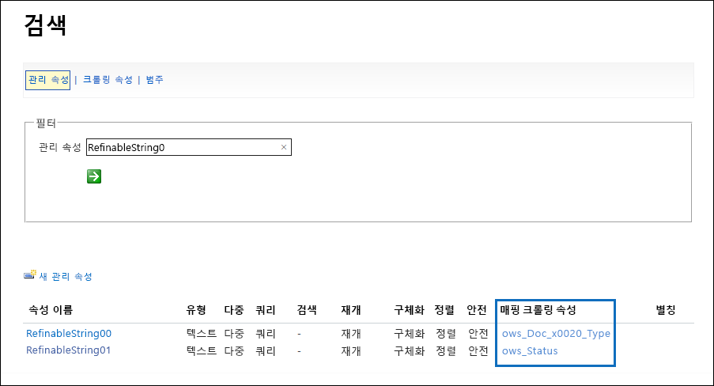
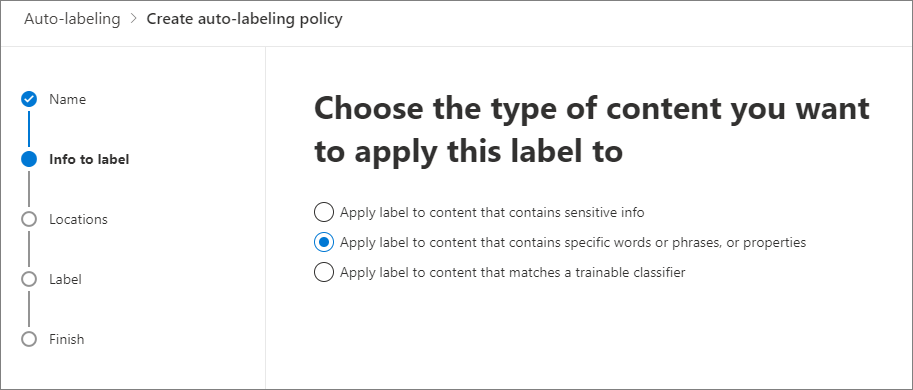
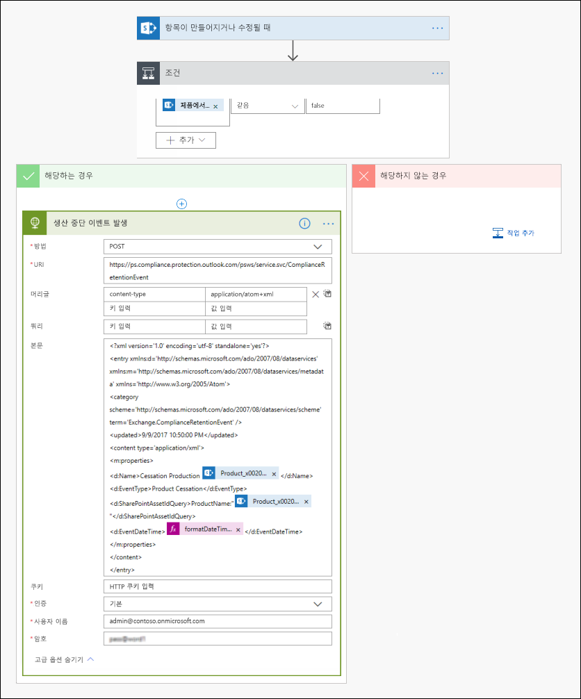

# <a name="manage-the-lifecycle-of-product-documents-stored-in-sharepoint-with-retention-labels"></a>보존 레이블을 사용하여 SharePoint에 저장된 제품 문서의 수명주기 관리

>*[보안 및 규정 준수를 위한 Microsoft 365 라이선싱 지침](https://aka.ms/ComplianceSD).*

이 문서에서는 자동으로 적용된 보존 레이블을 사용하고 이벤트 기반 보존을 구성하여 SharePoint에 저장된 제품 관련 문서의 라이프사이클을 관리하는 방법에 대해 설명합니다.

자동 적용 기능은 문서 분류에 SharePoint 메타데이터를 사용합니다. 이 문서의 예는 제품 관련 문서에 대한 것이지만 다른 시나리오에서도 동일한 개념을 사용할 수 있습니다. 예를 들어, 석유 및 가스 산업에서 석유 플랫폼, 웰 로그 또는 생산 라이센스와 같은 물리적 자산에 대한 문서의 라이프사이클을 관리하는 데 사용할 수 있습니다. 금융 서비스 산업에서는 은행 계좌, 담보 대출 또는 보험 계약 문서를 관리할 수 있습니다. 공공 부문에서는 건축 허가서나 세금 양식을 관리할 수 있습니다.

이 기사에서는 정보 아키텍처와 보존 라벨의 정의를 살펴보겠습니다. 그럼 라벨을 자동 적용하여 서류를 분류하겠습니다. 마지막으로 보존 기간을 시작하는 이벤트를 생성합니다.

## <a name="information-architecture"></a>정보 아키텍처

당사의 시나리오는 SharePoint를 사용하여 회사가 개발하는 제품에 대한 모든 문서를 저장하는 제조 회사입니다. 이러한 문서에는 제품 사양, 공급자와의 계약 및 사용자 매뉴얼이 포함됩니다. 이러한 문서가 엔터프라이즈 콘텐츠 관리 정책을 통해 SharePoint에 저장되면 문서 메타데이터가 정의되어 이를 분류하는 데 사용됩니다. 각 문서에는 다음과 같은 메타 데이터 속성이 있습니다.

- **Doc 유형**(제품 사양, 계약서 또는 사용자 설명서 등)

- **제품 이름**

- **상태** (초안 또는 최종)

이 메타데이터는 모든 문서에 대해 *생산 문서*라는 기본 콘텐츠 유형을 구성합니다.


> [!NOTE]
> **문서 유형** 및 **상태** 속성은 시나리오의 뒷부분에 나오는 보존 정책에서 보존 레이블을 분류하고 자동 적용하는 데 사용됩니다.

여러 유형의 문서를 나타내는 여러 콘텐츠 유형이 있을 수 있지만 제품 설명서에 초점을 맞추겠습니다.

이 시나리오에서는 관리되는 메타 데이터 서비스 및 용어 저장소를 사용하여 *문서 유형*에 대한 용어 집합과 *제품 이름*에 대한 용어 집합을 만듭니다. 각 용어 집합에 대해 각 값에 대한 용어를 만듭니다. SharePoint 조직의 경우 Term Store에서는 다음과 같습니다.


*콘텐츠 유형*은(는) [ 콘텐츠 유형 허브](https://support.office.com/article/manage-content-type-publishing-06f39ac0-5576-4b68-abbc-82b68334889b)를 사용하여 생성하고 게시할 수 있습니다. [PnP 프로비저닝 프레임워크](https://docs.microsoft.com/sharepoint/dev/solution-guidance/pnp-provisioning-framework) 또는 [ 사이트 설계 JSON 스키마](https://docs.microsoft.com/sharepoint/dev/declarative-customization/site-design-json-schema#define-a-new-content-type)와 같은 사이트 프로비저닝 도구를 사용하여 컨텐츠 유형을 생성하고 게시할 수도 있습니다.

각 제품에는 올바른 콘텐츠 유형을 사용하는 하나의 문서 라이브러리가 포함된 전용 SharePoint 사이트가 있습니다. 모든 문서는 이 문서 라이브러리에 저장됩니다.


> [!NOTE]
> 이 시나리오의 제조 회사는 제품당 SharePoint 사이트를 보유하는 대신 제품당 마이크로소프트 팀을 사용하여 지속적인 채팅을 통해 팀원 간의 협업을 지원하고 문서 관리를 위해 팀 내 **파일** 탭을 사용할 수 있습니다. 이 기사에서는 문서에만 초점을 맞추므로 사이트만 사용합니다.

다음은 스피닝 위젯 제품의 문서 라이브러리 보기입니다.


이제 문서 관리를 위한 기본 정보 아키텍처가 마련되었으므로 메타데이터를 사용하는 문서에 대한 보존 및 폐기 전략과 이러한 문서를 분류하는 방법에 대해 살펴보겠습니다.

## <a name="retention-and-disposition"></a>보존 및 폐기

제조 회사의 규정 준수 및 데이터 거버넌스 정책은 데이터 보존 및 폐기 방법을 결정합니다. 제품 관련 서류는 제품 제조 기간과 일정한 추가 기간 동안 보관해야 합니다. 추가 기간은 제품 사양, 계약서 및 사용자 설명서에 따라 다릅니다. 다음 표는 보존 및 폐기 요구 사항을 나타냅니다.

| **문서 유형**          | **보존**                          | **폐기**                              |
| -------------------------- | -------------------------------------- | -------------------------------------------- |
| 제품 사양      | 생산 중단 후 5년  | 삭제                                       |
| 제품 계약서          | 생산이 중단된 후 10년 | 검토                                       |
| 사용자 설명서                | 생산 중단 후 5년  | 삭제                                       |
| 다른 모든 유형의 문서 | 능동적으로 유지하지 않음  | 문서가 3년보다 오래된 경우 삭제<sup>\*</sup>  |
|||

   <sup>\*</sup> 지난 3년 동안 수정하지 않은 문서는 3년이 지난 것으로 간주됩니다.

Microsoft 365 규중 준수 센터를 사용하여 다음 [보존 레이블](retention.md#retention-labels)을 생성합니다.

  - 제품 사양

  - 제품 계약

  - 사용자 매뉴얼

이 문서에서는 제품 사양 보존 레이블을 작성하고 자동 적용하는 방법만을 보여줍니다. 전체 시나리오를 구현하기 위해 다른 두 문서 유형에 대한 보존 레이블을 만들고 자동으로 적용합니다.

### <a name="settings-for-the-product-specification-retention-label"></a>제품 사양 보존 레이블 설정

제품 사양 보존 레이블에 대한 [파일 계획](file-plan-manager.md)은 다음과 같습니다.

- **이름:** 제품 사양

- **관리자에 대한 설명:** 운영 중지 후 5년간 유지, 자동 삭제, 이벤트 기반 보존, 이벤트 유형은 *제품 중단*입니다.

- **사용자에 대한 설명:** 생산 중지 후 5년간 보존합니다.

- **보존 작업:** 유지 및 삭제

- **보존 기간:** 5년 (1,825일)

- **레코드 레이블**: 콘텐츠를 [*레코드*](records.md)(으)로 분류하도록 보존 레이블을 구성합니다. (*레코드*로 분류된 문서는 사용자가 수정하거나 삭제할 수 없습니다.)

- **파일 계획 설명자:**(시나리오를 단순화하기 위해 파일 설명자가 제공되지 않습니다)

다음 스크린샷은 Microsoft 365 규정 준수 센터에서 제품 사양 보존 레이블을 생성할 때의 설정을 보여 줍니다. 보존 레이블을 생성할 때 *제품 중지* 이벤트 유형을 생성할 수 있습니다. 다음 절의 절차를 참조합니다.


> [!NOTE]
> 문서 삭제를 5년 동안 기다리지 않으려면 테스트 환경에서 이 시나리오를 다시 생성하는 경우 보존 기간을 ***1일***일로 설정합니다.

### <a name="create-an-event-type-when-you-create-a-retention-label"></a>보존 레이블을 생성할 때 이벤트 유형을 생성합니다.

1. 드롭다운 목록의 **콘텐츠를 보존 또는 삭제**에서 **이벤트**를 선택합니다.

2. **을(를) 선택합니다. 이벤트 유형**.
    
    

3. **이벤트 유형**을(를) 선택한 다음 **이벤트 유형 선택**에서 **새로운 이벤트 유형 생성**을 선택합니다.

4. ***제품 중단***이라는 이벤트 유형을 만들고 설명을 입력한 후 **완료**를 선택합니다.

5. **이벤트 유형 선택** 페이지로 돌아간 후 사용자가 만든 **제품 중단** 이벤트 유형을 선택한 다음 **추가**를 선택합니다.

   제품 사양 보존 레이블의 설정은 다음과 같습니다. 

   

6. **이 레이블 생성**을 선택 
> [!TIP]
> 자세한 단계는 [을(를) 참조하십시오.유지 기간이 이벤트](event-driven-retention.md#step-1-create-a-label-whose-retention-period-is-based-on-an-event)를 기준으로 하는 레이블을 만듭니다.

이제 제품 사양 컨텐츠에 보존 라벨을 자동으로 적용하는 방법을 살펴보겠습니다.

## <a name="auto-apply-retention-labels-to-classify-content"></a>보존 레이블을 자동으로 적용하여 내용을 분류합니다.

여기에서는 키워드 쿼리 언어(KQL)를 사용하여 [자동 적용](apply-retention-labels-automatically.md) 보존 레이블을 생성하겠습니다. KQL은 검색 쿼리를 작성하는 데 사용되는 언어입니다. KQL에서는 키워드 또는 관리되는 속성을 사용하여 검색할 수 있습니다. 자세한 내용은 [KQL(키워드 쿼리 언어) 구문 참조](https://docs.microsoft.com/sharepoint/dev/general-development/keyword-query-language-kql-syntax-reference)를 참조합니다.

기본적으로 Microsoft 365에 "***최종*** **상태** 및 **문서 유형**이 ***제품 사양***인 모든 문서에 *제품 사양* 보존 레이블을 적용"하라고 주문하고 싶습니다. **상태** 및 **문서 유형**은 [정보 아키텍처](#information-architecture) 섹션에서 제품 문서 콘텐츠 유형에 대해 이전에 정의했던 사이트 열입니다. 이를 위해서는 검색 스키마를 구성해야 합니다.

SharePoint는 콘텐츠를 인덱싱할 때 각 사이트 열에 대해 크롤링된 속성을 자동으로 생성합니다. 이 시나리오에서 우리는 **문서 종류** 및 **상태** 속성에 관심이 있습니다. 탐색된 속성을 만들기 위해 검색하기 위해 올바른 내용 유형이며 사이트 열이 채워진 문서가 라이브러리에 필요합니다.

SharePoint 관리 센터에서 검색 구성을 열고 **검색 스키마 관리**를 선택하여 탐색된 속성을 보고 구성합니다.


**크롤링된 속성** 상자에 ***상태***를 입력하고 녹색 화살표를 선택하면 다음과 같은 결과가 표시됩니다.


우리가 관심을 가지고 있는 속성은 **ows\_\_상태** 속성(이중 밑줄에 주목)입니다.. 생산 문서 컨텐츠 유형의 **상태** 속성에 매핑됩니다.

이제 ***ows\_문서***를 입력하고 녹색 화살표를 선택하면 다음과 같은 것이 표시됩니다.


**ows\_문서\_x0020\_유형** 속성은 우리가 관심을 갖는 두 번째 속성입니다. 생산 문서 컨텐츠 유형의 **문서 유형** 속성에 매핑됩니다.

> [!TIP]
> 이 시나리오에 대해 탐색된 속성의 이름을 확인하려면 프로덕션 문서가 들어 있는 문서 라이브러리로 이동합니다. 그런 다음 라이브러리 설정으로 이동합니다. **열**에서 열 이름 (예: **상태** 또는 **문서 유형**)을 선택하여 사이트 열 페이지를 엽니다. 해당 페이지의 URL에서 *필드* 매개 변수에 필드 이름이 포함되어 있습니다. "ows_" 접두사가 붙는 필드 이름은 크롤링된 속성의 이름입니다. 예를 들어 URL `https://tenantname.sharepoint.com/sites/SpinningWidget/_layouts/15/FldEdit.aspx?List=%7BC38C2F45-3BD6-4C3B-AA3B-EF5DF6B3D172%7D&Field=_Status`은 *ows\_\_상태* 크롤링된 속성에 해당합니다.

찾고 있는 탐색된 속성이 SharePoint 관리 센터의 검색 스키마 관리 섹션에 나타나지 않으면 다음과 같습니다.

- 아마도 문서가 색인화되지 않았을 것입니다. **문서 라이브러리 설정** > **고급 설정**으로 이동하여 라이브러리를 강제로 다시 인덱싱할 수 있습니다.

- 문서 라이브러리가 최신 사이트에 있는 경우 SharePoint 관리자도 사이트 모음 관리자인지 확인합니다.

크롤링된 속성과 관리 속성에 대한 자세한 내용은 [SharePoint Server에서 자동으로 작성된 관리 속성](https://docs.microsoft.com/sharepoint/technical-reference/automatically-created-managed-properties-in-sharepoint)을 참조하세요.

### <a name="map-crawled-properties-to-pre-defined-managed-properties"></a>탐색된 속성을 미리 정의된 관리 속성에 매핑

KQL은 검색 쿼리에서 크롤링된 속성을 사용할 수 없습니다. 관리 속성을 사용해야 합니다. 일반적인 검색 시나리오에서는 관리 속성을 생성하여 필요한 탐색 속성에 매핑합니다. 그러나 보존 레이블 자동 적용의 경우 KQL에서 미리 정의된 관리 속성만 지정할 수 있으며 사용자 지정 관리 속성은 지정할 수 없습니다. 시스템에 사용할 수 있는 *RefableString00* 문자열에서 *RefableString199*에 대한 미리 정의된 관리 속성 집합이 있습니다. 전체 목록은 [기본 미사용 관리 속성](https://docs.microsoft.com/sharepoint/manage-search-schema#default-unused-managed-properties)을 참조하세요. 이러한 기본 관리 속성은 일반적으로 검색 구체화를 정의하는 데 사용됩니다.

KQL 쿼리를 올바른 보존 레이블을 제품 문서 내용에 자동으로 적용하기 위해 크롤링된 속성 **ows\_문서\_x0020\_유형*과 *ows\_\_상태** 를 두 개의 정의 가능한 관리 속성에 맵핑합니다. 이 시나리오의 테스트 환경에서는 **RefinableString00** 및 **RefinableString01**은 사용되지 않습니다. SharePoint 관리 센터의 **검색 스키마 관리**에서 ** 관리 속성**을(를) 확인하여 이 문제를 확인했습니다.


이전 스크린 샷의 **매핑된 크롤링 속성** 열이 비어있는 것을 주목하세요.

**ows\_문서\_x0020\_유형** 크롤링된 속성에 매핑하려면 이 단계를 따릅니다.

1. **관리 속성** 필터 상자에 ***RefinableString00***을 입력하고 녹색 화살표를 선택합니다.

2. 결과 목록에서 **RefinableString00** 링크를 선택한 다음 아래로 스크롤하여 **크롤링된 속성에 매핑** 섹션으로 이동합니다.  

3. **매핑 추가**를 선택하고 **크롤링된 속성 선택** 창의 **크롤링된 속성 이름 검색** 상자에 ***ows\_문서\_x0020\_유형***을 입력합니다. **찾기**를 선택합니다.  

4. 결과 목록에서 **ows\_문서\_x0020\_유형**을 선택한 다음 **확인**을 선택합니다.

   **맵핑된 크롤링 속성** 섹션에 다음 스크린샷과 유사한 내용이 표시됩니다.

   

5. 페이지 하단으로 스크롤하고 **OK**를 선택하여 매핑을 저장합니다.

**RefableString01** 및 **ows\_\_상태**를 매핑하려면 이 단계를 반복합니다.

이제 두 개의 관리되는 속성이 두 탐색된 속성에 매핑되어야 합니다.



엔터프라이즈 검색을 실행하여 설정이 올바른지 확인합니다. 브라우저에서 *https://\<your_tenant>.sharepoint.com/search*.(으)로 이동합니다. 검색 상자에 ***RefableString00:"Product Specification"*** 을 입력하고 Enter 키를 누릅니다. 이 검색에서는**문서 유형** 중 ***제품 사양***이 있는 모든 문서를 반환해야 합니다.

이제 검색 상자에 **RefableString00: "Product Specification" 및 RefableString01을 입력합니다.Final**를 누르고 Enter 키를 누릅니다. 이 경우 ***제품 사양***을 포함하는 모든 문서를 **문서 유형**으로 또한 ***최종*****상태**가 반환됩니다.

### <a name="create-auto-apply-label-policies"></a>레이블 자동 적용 정책을 만들기

이제 KQL 쿼리가 작동 중임을 확인했으므로 KQL 쿼리를 사용하여 적절한 문서에 제품 사양 보존 레이블을 자동으로 적용하는 레이블 정책을 만들겠습니다.

1. [준수 센터](https://compliance.microsoft.com/homepage)에서 **기록 관리** > **레이블 정책**으로 이동하여  > **레이블 자동 적용**을 선택합니다.

   

2. 마법사를 **자동으로 적용할 레이블을 선택**합니다 페이지에서 **자동 적용할 레이블을 선택**합니다.

3. 레이블 목록에서 **제품 규격**을 선택합니다. 그런 다음 **추가** 및 **다음**을 선택합니다.

4. **특정 단어나 구를 포함하는 콘텐츠에 레이블 적용**을 선택한 후 **다음**을 선택합니다.

   

   다음 단계에서는 이전 섹션에서 테스트한 것과 동일한 KQL 검색 쿼리를 제공합니다. 이 쿼리는 상태가 *Final*인 모든 제품 사양 문서를 반환합니다. 레이블 정책에서 동일한 쿼리를 사용하면 제품 사양 보존 레이블이 일치하는 모든 문서에 자동으로 적용됩니다.

5. **키워드 쿼리 편집기** 상자에서 ***RefinableString00:"Product Specification" AND RefinableString01:Final***을 입력하고 **다음**을 선택합니다.

   

6. 이름(예: ***제품 사양 레이블 자동 적용***)과 레이블 정책에 대한 설명(선택 사항)을 입력한 후 **다음**을 선택합니다.

7. **위치 선택** 마법사 페이지에서 정책을 적용하려는 콘텐츠 위치를 선택합니다. 이 시나리오에서는 모든 프로덕션 문서가 SharePoint 문서 라이브러리에 저장되기 때문에 정책을 SharePoint 위치에만 적용합니다. **특정 위치**를 선택한 다음 **Exchange e-메일**, **OneDrive 계정** 및 **Microsoft 365 그룹**의 상태를 꺼짐으로 전환합니다. SharePoint 사이트의 상태가 켜짐으로 설정되어 있는지 확인합니다. 

    

   > [!TIP]
   > 정책을 모든 SharePoint 사이트에 적용하는 대신 **사이트 선택**을 선택하여 특정 SharePoint 사이트의 URL을 추가할 수 있습니다.

8. **다음**을 선택하여 **설정 검토** 페이지를 표시합니다.

    

9. 레이블 정책을 생성하려면 **자동 적용**을 선택합니다.

   >[!NOTE]
   >KQL 검색 질의와 일치하는 모든 문서에 제품 사양 레이블을 자동으로 적용하는 데 최대 7일이 걸립니다.

### <a name="verify-that-the-retention-label-was-automatically-applied"></a>보존 라벨이 자동으로 적용되었는지 확인합니다.

7일 후 규정 준수 센터의 [ 활동 탐색기](data-classification-activity-explorer.md)를 사용하여 생성한 레이블 정책이 보존 레이블을 제품 문서에 자동으로 적용하는지 확인합니다.

문서 라이브러리에 있는 문서의 속성도 살펴봅니다. 정보 패널에서 보존 레이블이 선택된 문서에 적용되어 있음을 확인할 수 있습니다.


보존 레이블이 문서에 자동으로 적용되었기 때문에 보존 레이블이 문서를 *레코드*로 선언하도록 구성되었기 때문에 해당 문서는 삭제되지 않도록 보호됩니다. 이러한 보호의 예로서 다음 문서 중 하나를 삭제하려고 할 때 다음 오류 메시지가 표시됩니다.


## <a name="generate-the-event-that-triggers-the-retention-period"></a>보존 기간을 트리거하는 이벤트를 생성합니다.

이제 보존 라벨이 적용되었으므로 특정 제품의 생산 중단을 나타내는 이벤트에 초점을 맞추겠습니다. 이 이벤트는 보존 레이블에 정의된 보존 기간의 시작을 트리거합니다. 예를 들어 제품 사양 문서의 경우 "생산 종료" 이벤트가 트리거될 때 5년 보존 기간이 시작됩니다.

**관리 기록** > **이벤트**로 이동하여 Microsoft 365 규정 준수 센터에서 수동으로 이벤트를 생성할 수 있습니다. 이벤트 유형을 선택하고 올바른 자산 ID를 설정한 다음 이벤트 날짜를 입력합니다. 자세한 내용은 [이벤트가 발생할 때 보존 시작하기](event-driven-retention.md)를 참조하세요.

그러나 이 시나리오에서는 외부 프로덕션 시스템에서 이벤트를 자동으로 생성합니다. 시스템은 제품이 생산 중인지 여부를 나타내는 단순한 SharePoint 목록입니다. 목록과 연결된 [전원 자동화](https://docs.microsoft.com/flow/getting-started) 흐름이 이벤트를 트리거합니다. 실제 시나리오에서는 다양한 시스템을 사용하여 HR 또는 CRM 시스템과 같은 이벤트를 생성할 수 있습니다. Power Automation에는 Microsoft Exchange, SharePoint, Teams 및 Dynamics 365와 같은 Microsoft 365 워크로드에 대한 많은 사용 가능한 상호 작용 및 구성 요소와 Twitter, Box, Salesforce 및 Workday와 같은 타사 앱이 포함되어 있습니다. 이 기능을 통해 다양한 시스템과 손쉽게 Power Automation을 통합할 수 있습니다. 자세한 내용은 [이벤트 기반 보존의 자동화](automate-event-driven-retention.md)를 참조하세요.

다음 스크린샷은 이벤트를 트리거하는 데 사용되는 SharePoint 목록을 보여줍니다.


**생산** 열의 ***예***에 표시된 것처럼 현재 프로덕션 중인 제품이 두 개 있습니다. 이 열의 값을 제품에 대해 ***아니요***로 설정하면 목록과 관련된 흐름에서 자동으로 이벤트를 생성합니다. 이벤트는 해당 제품 문서에 자동으로 적용된 보존 레이블의 보존 기간 시작을 트리거합니다.

이 시나리오에서는 다음 흐름을 사용하여 이벤트를 트리거합니다.



이 흐름을 만들려면 SharePoint 커넥터에서 시작하여 **항목을 만들거나 수정할 때** 트리거를 선택합니다. 사이트 주소 및 목록 이름을 지정합니다. 그런 다음 **생산 중**에서 목록 열 값이 ***아니오***(또는 조건 카드의 *허위*)로 설정된 시점을 기준으로 조건을 추가합니다. 그런 다음 기본 제공 HTTP 서식 파일을 기반으로 하는 작업을 추가합니다. 다음 섹션의 값을 사용하여 HTTP 작업을 구성합니다. 다음 섹션에서 **URI** 및 **Body** 속성의 값을 복사하여 템플릿에 붙여넣을 수 있습니다.

- **메서드**: POST
- **URI**: `https://ps.compliance.protection.outlook.com/psws/service.svc/ComplianceRetentionEvent`
- **헤더**: Key = Content-Type, Value = application/atom+xml
- **Body**:
    
    ```HTML
    <?xml version='1.0' encoding='utf-8' standalone='yes'>
    <entry xmlns:d='http://schemas.microsoft.com/ado/2007/08/dataservices' xmlns:m='http://schemas.microsoft.com/ado/2007/08/dataservices/metadata' xmlns='https://www.w3.org/2005/Atom'>
    <category scheme='http://schemas.microsoft.com/ado/2007/08/dataservices/scheme' term='Exchange.ComplianceRetentionEvent'>
    <updated>9/9/2017 10:50:00 PM</updated>
    <content type='application/xml'>
    <m:properties>
    <d:Name>Cessation Production @{triggerBody()?['Product_x0020_Name']?['Value']}</d:Name>
    <d:EventType>Product Cessation&lt;</d:EventType>
    <d:SharePointAssetIdQuery>ProductName:&quot;@{triggerBody()?['Product_x0020_Name']?['Value']}<d:SharePointAssetIdQuery>
    <d:EventDateTime>@{formatDateTime(utcNow(),'yyyy-MM-dd')}</d:EventDateTime>
    </m:properties>
    </content&gt>
    </entry>
    ```

이 목록에서는 이 시나리오에 대해 구성해야 하는 작업의 **Body** 속성에 있는 매개 변수를 설명합니다.

- **이름**: 이 매개 변수는 Microsoft 365 규정 준수 센터에서 생성할 이벤트의 이름을 지정합니다. 이 시나리오의 경우 이름은 "처리 운영 *xxx*"입니다. 여기서 *xxx*은(는) 이전에 생성한 **ProductName** 관리 속성의 값입니다.
- **EventType**: 이 매개 변수의 값은 생성된 이벤트가 적용되는 이벤트 유형에 해당합니다. 이 이벤트 유형은 보존 레이블을 생성할 때 정의되었습니다. 이 시나리오의 경우 이벤트 유형은 "제품 중단"입니다."
- **SharePointAssetIdQuery**입니다. 이 매개 변수는 이벤트에 대한 자산 ID를 정의합니다. 이벤트 기반 보존에는 문서의 고유 식별자가 필요합니다. 자산 ID를 사용하여 특정 이벤트가 적용되는 문서를 식별하거나 이 시나리오에서처럼 메타데이터 열 **제품 이름**을 식별할 수 있습니다. 이렇게 하려면 KQL 쿼리에 사용할 수 있는 새 **ProductName** 관리 속성을 생성해야 합니다. 대체적으로 새 관리 속성을 생성하는 대신 **RefableString00**를 사용할 수 있습니다. 또한 이 새로운 관리 속성을 **ows_Product_x0020_Name** 크롤링된 속성에 맵핑해야합니다. 다음은 이 관리 속성의 스크린샷입니다.

    

- **EventDateTime**: 이 매개 변수는 이벤트가 발생한 날짜를 정의합니다. 현재 날짜 형식을 사용합니다.<br/><br/>*날짜 시간(utcNow()), 'yyyy-MM-dd'* 을(를) 포맷합니다.

### <a name="putting-it-all-together"></a>모두 종합해 보면요.

이제 보존 라벨이 생성되고 자동으로 적용되며 흐름이 구성 및 생성됩니다. 제품 목록의 회전 위젯 제품에 대한 **실행에서 ** 열의 값이 ***예***에서 ***아니오***(으)로 변경되면 흐름이 트리거되어 이벤트를 생성합니다. 보안 및 준수 센터에서 이 이벤트를 보려면 **레코드 관리** > **이벤트**로 이동합니다.


이벤트를 선택하여 플라이아웃 페이지에서 세부 정보를 봅니다. 이벤트가 생성되더라도 이벤트 상태는 처리된 SharePoint 사이트나 문서가 없음을 나타냅니다.


그러나 지연 후 이벤트 상태는 SharePoint 사이트와 SharePoint 문서가 처리되었음을 표시합니다.  


 
*처리 생산 회전 위젯* 이벤트의 이벤트 날짜를 기준으로 회전 위젯 제품 문서에 적용된 레이블의 보존 기간이 시작되었음을 나타냅니다. 1일 보존 기간을 구성하여 테스트 환경에서 시나리오를 구현했다고 가정하면 이벤트 생성 며칠 후 제품 문서의 문서 라이브러리로 이동하여 문서가 삭제되었는지(SharePoint의 삭제 작업이 실행된 후) 확인할 수 있습니다.

### <a name="more-about-asset-ids"></a>자산 ID에 대한 자세한 정보

[시작 문서가 이벤트 발생 시 보존 시작](event-driven-retention.md) 문서에 설명된 것처럼 이벤트 유형, 보존 레이블, 이벤트 및 자산 ID 간의 관계를 이해하는 것이 중요합니다. 자산 ID는 SharePoint 및 OneDrive의 문서 속성일 뿐입니다. 이벤트에 의해 트리거되는 보존 기간을 식별하는 데 도움이 됩니다. 기본적으로 SharePoint에는 이벤트 기반 보존에 사용할 수 있는 **자산 ID** 속성이 있습니다.


다음 스크린샷에서 볼 수 있듯이 자산 ID 관리 속성을 **ComplianceAssetId**라고 합니다.


이 시나리오에서와 같이 기본 **Asset Id** 속성을 사용하는 대신 다른 속성을 사용할 수 있습니다. 그러나 이벤트에 대한 자산 ID 또는 키워드를 지정하지 않으면 해당 이벤트 유형의 레이블이 있는 모든 콘텐츠는 이벤트에 의해 보존 기간이 트리거됩니다.

### <a name="using-advanced-search-in-sharepoint"></a>SharePoint에서 고급 검색을 사용합니다.

이전 스크린샷에서 탐색된 속성에 매핑된 **ComplianceTag**라는 보존 레이블과 관련된 또 다른 관리 속성이 있음을 확인할 수 있습니다. **ComplianceAssetId** 관리 속성도 탐색된 속성에 매핑됩니다. 즉, 고급 검색에서 이러한 관리 속성을 사용하여 보존 레이블로 태그가 지정된 모든 문서를 검색할 수 있습니다.

## <a name="credits"></a>크레딧

이 시나리오의 작성자는 다음과 같습니다. 

Frederic Lapierre<br/>Principal Consultant, Microsoft Services
