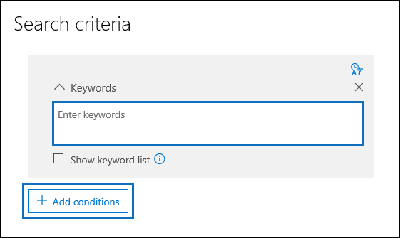

# 검색 쿼리 작성Build search queries

검색 쿼리를 작성 하는 경우 키워드를 사용 하 여 검색 범위를 좁혀 조사에 가장 적합 한 항목을 반환할 수 있습니다.When building search queries, you can use keywords to find specific content and conditions to narrow the scope of the search to return items that are most relevant to your investigation.

## 키워드 검색Keyword searches

검색 쿼리의 **키워드** 상자에 키워드 쿼리를 입력 합니다.Type a keyword query in the **Keywords** box in the search query. 키워드, 전자 메일 메시지 속성 (예: 보낸 날짜 및 받은 날짜가) 또는 문서 속성 (예: 파일 이름 또는 문서를 마지막으로 변경한 날짜)을 지정할 수 있습니다.You can specify keywords, email message properties, such as sent and received dates, or document properties, such as file names or the date that a document was last changed. **AND**, **OR**, **NOT**, **NEAR**와 같은 부울 연산자를 사용하는 좀 더 복잡한 쿼리를 사용할 수 있습니다.You can use more complex queries that use a Boolean operator, such as **AND**, **OR**, **NOT**, and **NEAR**. 전자 메일 메시지에 포함 되지 않은 공유 보안 번호, SharePoint 및 OneDrive의 문서에서 중요 한 정보를 검색 하거나 외부에서 공유한 문서를 검색할 수도 있습니다.You can also search for sensitive information, such as social security numbers, in documents in SharePoint and OneDrive (not in email messages), or search for documents that have been shared externally. **키워드** 상자를 비워 두면 지정 된 콘텐츠 위치에 있는 모든 콘텐츠가 검색 결과에 포함 됩니다.If you leave the **Keywords** box empty, all content located in the specified content locations is included in the search results.
    
또는 **키워드 목록 표시** 확인란을 선택한 다음 각 행에 키워드나 키워드 구를 입력할 수 있습니다.Alternatively, you can select the **Show keyword list** check box and then type a keyword or keyword phrase in each row. 이 작업을 수행 하는 경우 각 행의 키워드는 생성 되는 검색 쿼리의 **OR** 연산자와 유사한 기능을 하는 논리 연산자 ( *c:s*로 표시 됨)에 의해 연결 됩니다.If you do this, the keywords in each row are connected by a logical operator (represented as *c:s*) that is similar in functionality to the **OR** operator in the search query that's created. 즉, 모든 행에 키워드가 포함 된 항목이 검색 결과에 포함 됩니다.This means that items that contain any keyword in any row are included in the search results.

키워드 목록을 사용하는 이유Why use the keyword list? 키워드 목록에서 각 키워드와 일치 하는 항목 수를 보여 주는 통계를 가져올 수 있습니다.You can get statistics that show how many items match each keyword in the keyword list. 이를 통해 가장 (및 최소) 효율적인 키워드를 빠르게 식별할 수 있습니다.This can help you quickly identify the keywords that are the most (and least) effective. 키워드 목록에 있는 행에 괄호로 묶은 키워드 구를 사용할 수도 있습니다.You can also use a keyword phrase (surrounded by parentheses) in a row in the keywords list. 검색 통계에 대 한 자세한 내용은 [검색 통계](search-statistics.md)를 참조 하세요.For more information about search statistics, see [Search statistics](search-statistics.md).

> [!NOTE]
> 큰 키워드 목록으로 인해 발생 하는 문제를 줄이기 위해 키워드 목록에는 최대 20 개의 행만 있을 수 있습니다.To help reduce issues caused by large keyword lists, you're limited to a maximum of 20 rows in the keyword list.

## 조건Conditions
    
검색 조건을 추가 하 여 검색 범위를 좁히고 보다 구체화 된 결과 집합을 반환할 수 있습니다.You can add search conditions to narrow the scope of a search and return a more refined set of results. 각 조건은 검색을 시작할 때 생성 및 실행되는 검색 쿼리에 절을 추가합니다.Each condition adds a clause to the search query that is created and run when you start the search. 조건은 **AND** 연산자의 기능과 비슷한 논리 연산자 ( *c:c*로 표시 됨)에 의해 키워드 상자에 지정 된 키워드 쿼리에 논리적으로 연결 됩니다.A condition is logically connected to the keyword query (specified in the keyword box) by a logical operator (which is represented as *c:c*) that is similar in functionality to the **AND** operator. 즉, 항목은 검색 결과에 포함할 키워드 쿼리와 하나 이상의 조건을 만족 해야 합니다.This means that items have to satisfy both the keyword query and one or more conditions to be included in the search results. 이 방법을 통해 결과를 좁힐 수 있습니다.This is how conditions help to narrow your results. 검색 쿼리에 사용할 수 있는 조건에 대 한 목록 및 설명은 [키워드 쿼리 및 검색 조건의](keyword-queries-and-search-conditions.md#search-conditions)"검색 조건" 섹션을 참조 하십시오.For a list and description of conditions you can use in a search query, see the "Search conditions" section in [Keyword queries and search conditions](keyword-queries-and-search-conditions.md#search-conditions).
