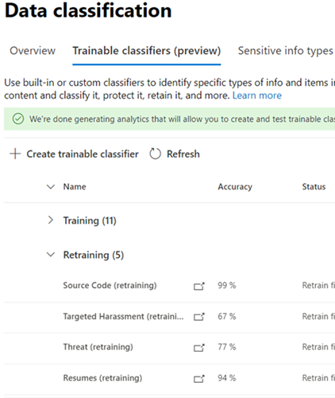

# 방법 재교육 content explorer에서 분류자를 만드는 방법 (미리 보기)

Microsoft 365 trainable 분류자는 다양 한 유형의 콘텐츠를 확인할 수 있도록 교육을 제공 하는 도구입니다. 훈련을 받은 후에는이를 통해 Office 민감도 레이블, 통신 준수 정책 및 보존 레이블 정책의 응용 프로그램에 대 한 항목을 식별할 수 있습니다.

이 문서에서는 사용자 지정 trainable 분류자 및 일부 미리 훈련 된 분류자의 성능을 개선 하는 방법에 대해 설명 합니다 추가 의견을 제공 합니다.

서로 다른 종류의 분류자에 대 한 자세한 내용은 [trainable 분류자 (preview)에 대 한](classifier-learn-about.md)자세한 정보를 참조 하십시오.

## 권한

Microsoft 365 준수 센터의 분류자에 액세스 하려면 다음을 수행 합니다.

- 분류자를 교육 하려면 준수 관리자 역할 또는 준수 데이터 관리자가 필요 합니다.

이러한 시나리오에서 분류자를 사용 하려면 다음과 같은 권한이 있는 계정이 필요 합니다.

- 보존 레이블 정책 시나리오: 레코드 관리 및 보존 관리 역할 

## 전체 워크플로

> [!IMPORTANT]
> 콘텐츠 탐색기에서 보존 레이블 정책을 Exchange 항목에 자동으로 적용 하 고 해당 분류자를 조건으로 사용 하는 사용자 의견을 제공 합니다. **Exchange 항목에 보존 레이블을 자동으로 적용 하 고 분류자를 조건으로 사용 하는 보존 정책이 없는 경우 여기에서 중지 합니다.**

사용자의 분류자를 사용할 때는 자신이 수행 하는 분류의 정밀도를 높일 수 있습니다. 이 작업을 수행 하려면 일치 항목이 아닌 것으로 식별 된 항목에 대해 적용 된 분류의 품질을 평가 합니다. 분류자에 대해 30 개의 평가를 수행한 후에는 해당 사용자의 의견이 자동으로 retrains.

분류자에 대 한 재교육의 전반적인 워크플로에 대 한 자세한 내용은 [프로세스 흐름에 대해 재교육을](classifier-learn-about.md#retraining-classifiers)참조 하십시오.

> [!NOTE]
> 분류자는 retrained 하기 전에 이미 게시 되었으며 사용 중 이어야 합니다.

## 방법 재교육 content explorer에서 분류자를 만드는 방법 (미리 보기)

1. 준수 관리자 또는 보안 관리자 역할 액세스를 사용 하 여 microsoft 365 준수 센터에 로그인 하 고 **microsoft 365 준수 센터**  >  **데이터 분류**  >  **콘텐츠 탐색기**를 엽니다. 
2. **레이블, 정보 유형 또는 범주에 대 한 필터** 목록에서 **Trainable 분류자**를 확장 합니다.

> [!IMPORTANT]
> 집계 된 항목은 trainable 분류자 머리글 아래에 표시 될 때까지 최대 8 일이 소요 될 수 있습니다.

3. 보존 레이블 정책 자동 적용에서 사용한 trainable 분류자를 선택 합니다. 의견을 제공 하는 trainable 분류자입니다.

> [!NOTE]
> 항목에 **보존 레이블** 열에 항목이 있는 경우 항목은로 분류 됨을 의미 `match` 합니다.  항목에 **보존 레이블** 열에 항목이 없으면로 분류 됨을 의미 `close match` 합니다. 항목에 대 한 피드백을 제공 하는 가장 큰 방법으로 분류자 정밀도를 향상 시킬 수 있습니다 `close match` . 

4. 항목을 선택 하 여 엽니다.
 
 > [!TIP]
> 동시에 여러 항목을 선택한 다음 명령 모음에서 **분류 개선을** 선택 하 여 사용자에 게 피드백을 제공할 수 있습니다.

5. **의견 제공**을 선택 합니다.
6. **자세한 피드백** 창에서 항목이 true 인 경우를 선택 하 고 **일치 시킵니다**.  항목이 가양성 인 경우 범주에 잘못 포함 된 것이 **아니면 일치 하지 않는**항목을 선택 합니다.
7. 항목에 더 적합 한 다른 분류자가 있는 경우에는 **다른 trainable 분류자 추천** 목록에서 선택할 수 있습니다. 이렇게 하면 다른 분류자가 트리거되어 항목을 확인할 수 있습니다.
8. **사용자 의견 보내기를** 선택 하 여 평가를 전송 `match` 하 `not a match` 고 다른 trainable 분류자를 추천 합니다. 분류자에 의견의 30 개를 제공 하면 자동으로 재교육 됩니다. 재교육은 1 ~ 4 시간까지 소요 될 수 있습니다. 분류자는 하루에 한 번만 retrained 수 있습니다.

> [!IMPORTANT]
> 이 정보는 테 넌 트의 분류자로 이동 되며 **Microsoft로 돌아가지**않습니다.

9. **Trainable 분류자 (미리 보기)** 를 엽니다.
10. 통신 준수 정책에 사용 된 분류자는 **트레이닝 재** 된 제목 아래에 표시 됩니다.

11. 재교육이 완료 되 면 해당 분류자를 선택 하 여 재교육 개요를 엽니다.

12. Retrained 및 현재 게시 된 버전의 분류자에 대 한 권장 작업 및 예측 비교를 검토 합니다.
13. 재교육의 결과가 만족 스 러 우면 **다시 게시**를 선택 합니다.
14. 재교육 결과에 만족 하지 않는 경우에는 통신 준수 인터페이스의 분류자에 추가 피드백을 제공 하 고, 다른 재교육 주기를 시작 하거나, 현재 게시 된 버전의 분류자를 계속 사용 하는 경우에는 아무 작업도 수행 하지 않도록 선택할 수 있습니다. 

## 재게시 권장 사항에 대 한 세부 정보

다음은 retrained 분류자를 다시 게시 하거나 추가 재교육을 제안 하는 방법에 대 한 간단한 정보입니다. 이를 위해서는 trainable 분류자의 작동 방식에 대해 자세히 이해 해야 합니다.

재교육 후에는 피드백을 사용 하 여 각 항목의 분류자 성과, 원래 분류자를 훈련 시키는 데 사용 되는 모든 항목을 평가 합니다. 

- 기본 제공 모델의 경우 분류자를 성향 습득 하는 데 사용 되는 항목은 Microsoft에서 모델을 구축 하는 데 사용 하는 항목입니다.
- 사용자 지정 모델의 경우 분류자의 원래 교육에서 사용 되는 항목은 테스트 및 검토를 위해 추가한 사이트에서 가져온 것입니다.

Retrained 및 게시 된 분류자에 대 한 두 항목 집합의 성능 수치를 비교 하 여 다시 게시할 수 있는지 여부에 대 한 권장 사항을 제공 합니다. 

## 참고 항목

- [Trainable 분류자에 대 한 자세한 정보 (미리 보기)](classifier-learn-about.md)
- [SharePoint Server의 크롤링되는 기본 파일 이름 확장명 및 구문 분석되는 파일 형식](https://docs.microsoft.com/sharepoint/technical-reference/default-crawled-file-name-extensions-and-parsed-file-types)
