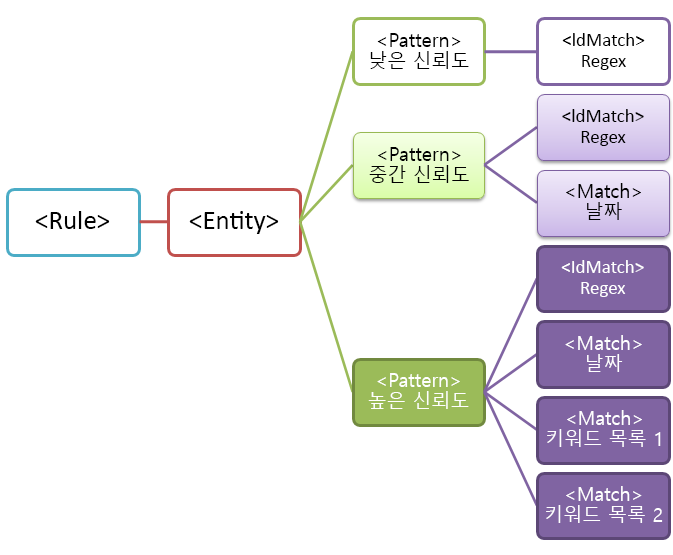
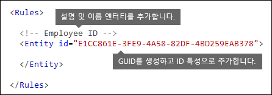
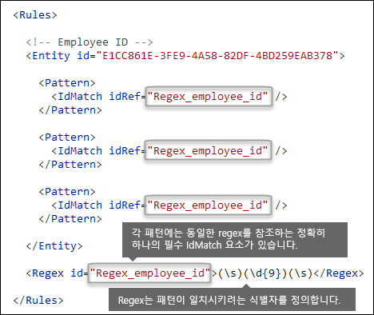
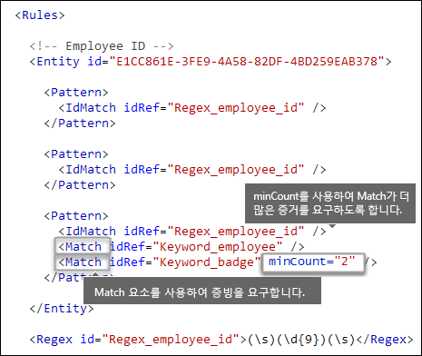
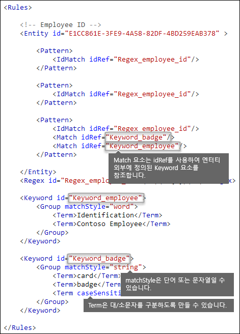
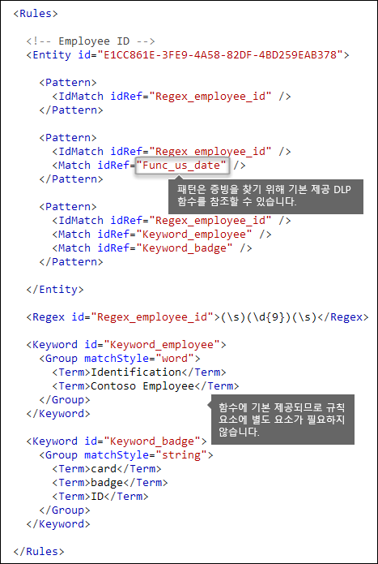
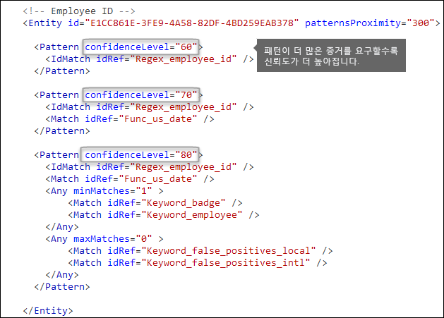
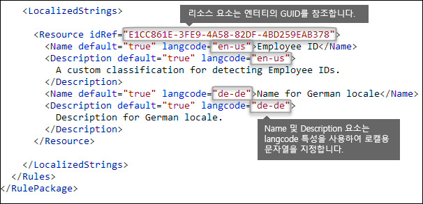
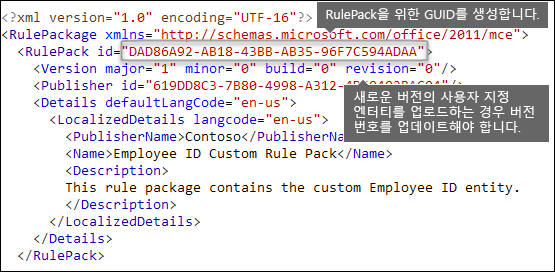

# <a name="create-a-custom-sensitive-information-type-in-security--compliance-center-powershell"></a>보안 및 준수 센터 PowerShell에서 사용자 지정 중요한 정보 유형 만들기

Data loss prevention (DLP) in Microsoft 365 includes many built-in [Sensitive information type entity definitions](sensitive-information-type-entity-definitions.md) that are ready for you to use in your DLP policies. These built-in types can help identify and protect credit card numbers, bank account numbers, passport numbers, and more.
  
But what if you need to identify and protect a different type of sensitive information (for example, an employee ID that uses a format specific to your organization)? To do this, you can create a custom sensitive information type that is defined in an XML file called a *rule package*.
  
This topic shows you how to create an XML file that defines your own custom sensitive information type. You need to know how to create a regular expression. As an example, this topic creates a custom sensitive information type that identifies an employee ID. You can use this example XML as a starting point for your own XML file.
  
After you've created a well-formed XML file, you can upload it to Microsoft 365 by using Microsoft 365 PowerShell. Then you're ready to use your custom sensitive information type in your DLP policies and test that it's detecting the sensitive information as you intended.

> [!NOTE]
> You can also create less complex custom sensitive information types in the Security & Compliance Center UI. For more information, see [Create a custom sensitive information type](create-a-custom-sensitive-information-type.md).

## <a name="important-disclaimer"></a>중요 고지 사항
<!-- this is worded much better than the previous one is -->
Due to the variances in customer environments and content match requirements, Microsoft Support cannot assist in providing custom content-matching definitions; e.g., defining custom classifications or regular expression (also known as RegEx) patterns. For custom content-matching development, testing, and debugging, Microsoft 365 customers will need to rely upon internal IT resources, or use an external consulting resource such as Microsoft Consulting Services (MCS). Support engineers can provide limited support for the feature, but cannot provide assurances that any custom content-matching development will fulfill the customer's requirements or obligations.  As an example of the type of support that can be provided, sample regular expression patterns may be provided for testing purposes. Or, support can assist with troubleshooting an existing RegEx pattern which is not triggering as expected with a single specific content example.

이 토픽에서 [인식해야 할 잠재적인 유효성 검사 문제](#potential-validation-issues-to-be-aware-of)를 참조하세요.

텍스트 처리에 사용되는 Boost.RegEx(이전에는 RegEx++라고 함) 엔진에 대한 자세한 내용은 [Boost.Regex 5.1.3](https://www.boost.org/doc/libs/1_68_0/libs/regex/doc/html/)을 참조하세요.

## <a name="sample-xml-of-a-rule-package"></a>규칙 패키지의 샘플 XML

Here's the sample XML of the rule package that we'll create in this topic. Elements and attributes are explained in the sections below.
  
```xml
<?xml version="1.0" encoding="UTF-16"?>
<RulePackage xmlns="http://schemas.microsoft.com/office/2011/mce">
<RulePack id="DAD86A92-AB18-43BB-AB35-96F7C594ADAA">
    <Version build="0" major="1" minor="0" revision="0"/>
    <Publisher id="619DD8C3-7B80-4998-A312-4DF0402BAC04"/>
    <Details defaultLangCode="en-us">
        <LocalizedDetails langcode="en-us">
            <PublisherName>Contoso</PublisherName>
            <Name>Employee ID Custom Rule Pack</Name>
            <Description>
            This rule package contains the custom Employee ID entity.
            </Description>
        </LocalizedDetails>
    </Details>
</RulePack>
<Rules>
<!-- Employee ID -->
    <Entity id="E1CC861E-3FE9-4A58-82DF-4BD259EAB378" patternsProximity="300" recommendedConfidence="70">
        <Pattern confidenceLevel="60">
            <IdMatch idRef="Regex_employee_id"/>
        </Pattern>
        <Pattern confidenceLevel="70">
            <IdMatch idRef="Regex_employee_id"/>
            <Match idRef="Func_us_date"/>
        </Pattern>
        <Pattern confidenceLevel="80">
            <IdMatch idRef="Regex_employee_id"/>
            <Match idRef="Func_us_date"/>
            <Any minMatches="1">
                <Match idRef="Keyword_badge" minCount="2"/>
                <Match idRef="Keyword_employee"/>
            </Any>
            <Any minMatches="0" maxMatches="0">
                <Match idRef="Keyword_false_positives_local"/>
                <Match idRef="Keyword_false_positives_intl"/>
            </Any>
        </Pattern>
    </Entity>
    <Regex id="Regex_employee_id">(\s)(\d{9})(\s)</Regex>
    <Keyword id="Keyword_employee">
        <Group matchStyle="word">
            <Term>Identification</Term>
            <Term>Contoso Employee</Term>
        </Group>
    </Keyword>
    <Keyword id="Keyword_badge">
        <Group matchStyle="string">
            <Term>card</Term>
            <Term>badge</Term>
            <Term caseSensitive="true">ID</Term>
        </Group>
    </Keyword>
    <Keyword id="Keyword_false_positives_local">
        <Group matchStyle="word">
            <Term>credit card</Term>
            <Term>national ID</Term>
        </Group>
    </Keyword>
    <Keyword id="Keyword_false_positives_intl">
        <Group matchStyle="word">
            <Term>identity card</Term>
            <Term>national ID</Term>
            <Term>EU debit card</Term>
        </Group>
    </Keyword>
    <LocalizedStrings>
        <Resource idRef="E1CC861E-3FE9-4A58-82DF-4BD259EAB378">
            <Name default="true" langcode="en-us">Employee ID</Name>
            <Description default="true" langcode="en-us">
            A custom classification for detecting Employee IDs.
            </Description>
            <Description default="false" langcode="de-de">
            Description for German locale.
            </Description>
        </Resource>
    </LocalizedStrings>
</Rules>
</RulePackage>
```

## <a name="what-are-your-key-requirements-rule-entity-pattern-elements"></a>What are your key requirements? [Rule, Entity, Pattern elements]

시작하기 전에 규칙에 대한 XML 스키마의 기본 구조와 이 구조를 사용하여 올바른 콘텐츠를 식별하도록 사용자 지정 중요한 정보 유형을 정의하는 방법을 이해하면 도움이 됩니다.
  
A rule defines one or more entities (sensitive information types), and each entity defines one or more patterns. A pattern is what DLP looks for when it evaluates content such as email and documents.
  <!-- ok then this is going to be really confusing since the terminology changes.... -->
(A quick note on terminology - if you're familiar with DLP policies, you know that a policy contains one or more rules comprised of conditions and actions. However, in this topic, the XML markup uses rule to mean the patterns that define an entity, also known as a sensitive information type. So in this topic, when you see rule, think entity or sensitive information type, not conditions and actions.)
  
### <a name="simplest-scenario-entity-with-one-pattern"></a>가장 간단한 시나리오: 하나의 패턴을 갖는 엔터티

Here's the simplest scenario. You want your DLP policy to identify content that contains your organization's employee ID, which is formatted as a nine-digit number. So the pattern refers to a regular expression contained in the rule that identifies nine-digit numbers. Any content containing a nine-digit number satisfies the pattern.
  

  
이 패턴은 간단하지만 9자리 숫자를 포함하는 콘텐츠를 일치시켜 직원 ID가 아닐 수 있는 많은 가양성을 식별할 수 있습니다.
  
### <a name="more-common-scenario-entity-with-multiple-patterns"></a>좀 더 일반적인 시나리오: 여러 패턴을 갖는 엔터티

이러한 이유로, 해당 엔터티(예: 9자리 숫자) 외에 뒷받침하는 증거(예: 키워드 또는 날짜)를 식별하는 패턴을 추가적으로 사용하여 엔터티를 정의하는 것이 좀 더 일반적입니다.
  
예를 들어, 직원 ID를 포함하는 콘텐츠를 식별할 확률을 높이기 위해, 채용 날짜도 식별하는 다른 패턴을 정의하고, 9자리 숫자 외에 채용 날짜와 키워드(예: “직원 ID”)를 둘 다 식별하는 또 다른 패턴을 정의할 수 있습니다.
  

  
이 구조는 다음과 같은 몇 가지 중요한 측면을 갖습니다.
  
- Patterns that require more evidence have a higher confidence level. This is useful because when you later use this sensitive information type in a DLP policy, you can use more restrictive actions (such as block content) with only the higher-confidence matches, and you can use less restrictive actions (such as send notification) with the lower-confidence matches.

- The supporting IdMatch and Match elements reference regexes and keywords that are actually children of the Rule element, not the Pattern. These supporting elements are referenced by the Pattern but included in the Rule. This means that a single definition of a supporting element, like a regular expression or a keyword list, can be referenced by multiple entities and patterns.

## <a name="what-entity-do-you-need-to-identify-entity-element-id-attribute"></a>What entity do you need to identify? [Entity element, id attribute]

An entity is a sensitive information type, such as a credit card number, that has a well-defined pattern. Each entity has a unique GUID as its ID.
  
### <a name="name-the-entity-and-generate-its-guid"></a>엔터티에 이름 지정 및 해당 GUID 생성
<!-- why isn't the following in procedure format? -->
Add the Rules and Entity elements. Then add a comment that contains the name of your custom entity - in this example, Employee ID. Later, you'll add the entity name to the localized strings section, and that name is what appears in the UI when you create a DLP policy.
  
Next, generate a GUID for your entity. There are several ways to generate GUIDs, but you can do it easily in PowerShell by typing **[guid]::NewGuid()**. Later, you'll also add the entity GUID to the localized strings section.
  

  
## <a name="what-pattern-do-you-want-to-match-pattern-element-idmatch-element-regex-element"></a>What pattern do you want to match? [Pattern element, IdMatch element, Regex element]

The pattern contains the list of what the sensitive information type is looking for. This can include regexes, keywords, and built-in functions (which perform tasks like running regexes to find dates or addresses). Sensitive information types can have multiple patterns with unique confidences.
  
What all of the below patterns have in common is that they all reference the same regular expression, which looks for a nine-digit number (\d{9}) surrounded by white space (\s) … (\s). This regular expression is referenced by the IdMatch element and is the common requirement for all patterns that look for the Employee ID entity. IdMatch is the identifier that the pattern is to trying to match, such as Employee ID or credit card number or social security number. A Pattern element must have exactly one IdMatch element.
  

  
When satisfied, a pattern returns a count and confidence level, which you can use in the conditions in your DLP policy. When you add a condition for detecting a sensitive information type to a DLP policy, you can edit the count and confidence level as shown here. Confidence level (also called match accuracy) is explained later in this topic.
  

  
When you create your regular expression, keep in mind that there are potential issues to be aware of. For example, if you write and upload a regex that identifies too much content, this can impact performance. To learn more about these potential issues, see the later section [Potential validation issues to be aware of](#potential-validation-issues-to-be-aware-of).
  
## <a name="do-you-want-to-require-additional-evidence-match-element-mincount-attribute"></a>Do you want to require additional evidence? [Match element, minCount attribute]

패턴은 IdMatch에 더해 Match 요소를 사용하여 키워드, regex, 날짜, 주소 등 추가적인 증빙을 요구할 수 있습니다.
  
A Pattern can include multiple Match elements; they can be included directly in the Pattern element or combined by using the Any element. Match elements are joined by an implicit AND operator; all Match elements must be satisfied for the pattern to be matched. You can use the Any element to introduce AND or OR operators (more on that in a later section).
  
You can use the optional minCount attribute to specify how many instances of a match need to be found for each of the Match elements. For example, you can specify that a pattern is satisfied only when at least two keywords from a keyword list are found.
  

  
### <a name="keywords-keyword-group-and-term-elements-matchstyle-and-casesensitive-attributes"></a>키워드 [Keyword, Group 및 Term 요소, matchStyle 및 caseSensitive 특성]

When you identify sensitive information, like an employee ID, you often want to require keywords as corroborative evidence. For example, in addition to matching a nine-digit number, you may want to look for words like "card", "badge", or "ID". To do this, you use the Keyword element. The Keyword element has an id attribute that can be referenced by multiple Match elements in multiple patterns or entities.
  
Keywords are included as a list of Term elements in a Group element. The Group element has a matchStyle attribute with two possible values:
  
- **matchStyle="word"** Word match identifies whole words surrounded by white space or other delimiters. You should always use word unless you need to match parts of words or match words in Asian languages. 
    
- **matchStyle="string"** String match identifies strings no matter what they're surrounded by. For example, "id" will match "bid" and "idea". Use string only when you need to match Asian words or if your keyword may be included as part of other strings. 
    
마지막으로, 콘텐츠가 대소문자를 포함하는 키워드와 정확히 일치하도록 지정하려면 하도록 Term 요소의 caseSensitive 특성을 사용할 수 있습니다.
  

  
### <a name="regular-expressions-regex-element"></a>정규식 [Regex 요소]

In this example, the employee ID entity already uses the IdMatch element to reference a regex for the pattern - a nine-digit number surrounded by whitespace. In addition, a pattern can use a Match element to reference an additional Regex element to identify corroborative evidence, such as a five- or nine-digit number in the format of a US zip code.
  
### <a name="additional-patterns-such-as-dates-or-addresses-built-in-functions"></a>날짜 또는 주소와 같은 추가 패턴 [기본 제공 함수]

In addition to the built-in sensitive information types, DLP also includes built-in functions that can identify corroborative evidence such as a US date, EU date, expiration date, or US address. DLP does not support uploading your own custom functions, but when you create a custom sensitive information type, your entity can reference the built-in functions.
  
예를 들어, 직원 ID 배지에 채용 날짜가 있는 경우 이 사용자 지정 엔터티는 기본 제공 함수 `Func_us_date`를 날짜가 미국에서 일반적으로 사용되는 형식을 갖는 날짜를 식별할 수 있습니다. 
  
자세한 내용은 [DLP 함수가 찾는 항목](what-the-dlp-functions-look-for.md)을 참조하세요.
  

  
## <a name="different-combinations-of-evidence-any-element-minmatches-and-maxmatches-attributes"></a>다양한 증거 조합 [Any 요소, minMatches 및 maxMatches 특성]

In a Pattern element, all IdMatch and Match elements are joined by an implicit AND operator - all of the matches must be satisfied before the pattern can be satisfied. However, you can create more flexible matching logic by using the Any element to group Match elements. For example, you can use the Any element to match all, none, or an exact subset of its children Match elements.
  
The Any element has optional minMatches and maxMatches attributes that you can use to define how many of the children Match elements must be satisfied before the pattern is matched. Note that these attributes define the number of Match elements that must be satisfied, not the number of instances of evidence found for the matches. To define a minimum number of instances for a specific match, such as two keywords from a list, use the minCount attribute for a Match element (see above).
  
### <a name="match-at-least-one-child-match-element"></a>하나 이상의 하위 Match 요소 매치

If you want to require that only a minimum number of Match elements must be met, you can use the minMatches attribute. In effect, these Match elements are joined by an implicit OR operator. This Any element is satisfied if a US-formatted date or a keyword from either list is found.

```xml
<Any minMatches="1" >
     <Match idRef="Func_us_date" />
     <Match idRef="Keyword_employee" />
     <Match idRef="Keyword_badge" />
</Any>
```
    
### <a name="match-an-exact-subset-of-any-children-match-elements"></a>자식 Match 요소의 정확한 하위 집합 일치

If you want to require that an exact number of Match elements must be met, you can set minMatches and maxMatches to the same value. This Any element is satisfied only if exactly one date or keyword is found - any more than that, and the pattern won't be matched.

```xml
<Any minMatches="1" maxMatches="1" >
     <Match idRef="Func_us_date" />
     <Match idRef="Keyword_employee" />
     <Match idRef="Keyword_badge" />
</Any>
```
  
### <a name="match-none-of-children-match-elements"></a>어떤 자식 Match 요소와도 일치하지 않음

If you want to require the absence of specific evidence for a pattern to be satisfied, you can set both minMatches and maxMatches to 0. This can be useful if you have a keyword list or other evidence that are likely to indicate a false positive.
  
For example, the employee ID entity looks for the keyword "card" because it might refer to an "ID card". However, if card appears only in the phrase "credit card", "card" in this content is unlikely to mean "ID card". So you can add "credit card" as a keyword to a list of terms that you want to exclude from satisfying the pattern.
  
```xml
<Any minMatches="0" maxMatches="0" >
    <Match idRef="Keyword_false_positives_local" />
    <Match idRef="Keyword_false_positives_intl" />
</Any>
```

### <a name="match-a-number-of-unique-terms"></a>몇 가지 고유 용어 일치

몇 가지 고유 용어를 일치시키려면 다음 예에 표시된 것처럼 *uniqueResults* 매개 변수를 사용하고 *true*로 설정하세요.

```xml
<Pattern confidenceLevel="75">
    <IdMatch idRef="Salary_Revision_terms" />
    <Match idRef=" Salary_Revision_ID " minCount="3" uniqueResults="true" />
</Pattern>
```

이 예에는 3개 이상의 고유 일치 항목을 사용하여 급여 수정 사항에 대해 패턴이 정의되어 있습니다. 
  
## <a name="how-close-to-the-entity-must-the-other-evidence-be-patternsproximity-attribute"></a>How close to the entity must the other evidence be? [patternsProximity attribute]

Your sensitive information type is looking for a pattern that represents an employee ID, and as part of that pattern it's also looking for corroborative evidence like a keyword such as "ID". It makes sense that the closer together this evidence is, the more likely the pattern is to be an actual employee ID. You can determine how close other evidence in the pattern must be to the entity by using the required patternsProximity attribute of the Entity element.
  

  
For each pattern in the entity, the patternsProximity attribute value defines the distance (in Unicode characters) from the IdMatch location for all other Matches specified for that Pattern. The proximity window is anchored by the IdMatch location, with the window extending to the left and right of the IdMatch.
  

  
The example below illustrates how the proximity window affects the pattern matching where IdMatch element for the employee ID custom entity requires at least one corroborating match of keyword or date. Only ID1 matches because for ID2 and ID3, either no or only partial corroborating evidence is found within the proximity window.
  

  
Note that for email, the message body and each attachment are treated as separate items. This means that the proximity window does not extend beyond the end of each of these items. For each item (attachment or body), both the idMatch and corroborative evidence needs to reside in that item.
  
## <a name="what-are-the-right-confidence-levels-for-different-patterns-confidencelevel-attribute-recommendedconfidence-attribute"></a>What are the right confidence levels for different patterns? [confidenceLevel attribute, recommendedConfidence attribute]

The more evidence that a pattern requires, the more confidence you have that an actual entity (such as employee ID) has been identified when the pattern is matched. For example, you have more confidence in a pattern that requires a nine-digit ID number, hire date, and keyword in close proximity, than you do in a pattern that requires only a nine-digit ID number.
  
The Pattern element has a required confidenceLevel attribute. You can think of the value of confidenceLevel (an integer between 1 and 100) as a unique ID for each pattern in an entity - the patterns in an entity must have different confidence levels that you assign. The precise value of the integer doesn't matter - simply pick numbers that make sense to your compliance team. After you upload your custom sensitive information type and then create a DLP policy, you can reference these confidence levels in the conditions of the rules that you create.
  

  
Entity는 각 Pattern에 대핸 confidenceLevel 외에도 recommendedConfidence 속성을 갖습니다. 권장 신뢰도 속성은 규칙의 신뢰도 수준 기본값이라고 생각하면 됩니다. DLP 정책에서 규칙을 만들 때 규칙에서 사용할 신뢰도 수준을 지정하지 않은 경우에는 규칙이 해당 엔터티의 권장 신뢰도 수준을 사용하여 매치를 수행합니다. RecommendedConfidence 속성은 규칙 패키지의 각 Entity ID에 대한 필수 항목입니다. 이 값이 없는 경우 중요한 정보 유형을 사용 하는 정책을 저장하지 못할 수 있습니다. 
  
## <a name="do-you-want-to-support-other-languages-in-the-ui-of-the-security-amp-compliance-center-localizedstrings-element"></a>Do you want to support other languages in the UI of the Security &amp; Compliance Center? [LocalizedStrings element]

If your compliance team uses the Microsoft 365 Security &amp; Compliance Center to create DLP policies in different locales and in different languages, you can provide localized versions of the name and description of your custom sensitive information type. When your compliance team uses Microsoft 365 in a language that you support, they'll see the localized name in the UI.
  

  
The Rules element must contain a LocalizedStrings element, which contains a Resource element that references the GUID of your custom entity. In turn, each Resource element contains one or more Name and Description elements that each use the langcode attribute to provide a localized string for a specific language.
  

  
Note that you use localized strings only for how your custom sensitive information type appears in the UI of the Security &amp; Compliance Center. You can't use localized strings to provide different localized versions of a keyword list or regular expression.
  
## <a name="other-rule-package-markup-rulepack-guid"></a>다른 규칙 패키지 태그 [RulePack GUID]

Finally, the beginning of each RulePackage contains some general information that you need to fill in. You can use the following markup as a template and replace the ". . ." placeholders with your own info.
  
Most importantly, you'll need to generate a GUID for the RulePack. Above, you generated a GUID for the entity; this is a second GUID for the RulePack. There are several ways to generate GUIDs, but you can do it easily in PowerShell by typing [guid]::NewGuid().
  
The Version element is also important. When you upload your rule package for the first time, Microsoft 365 notes the version number. Later, if you update the rule package and upload a new version, make sure to update the version number or Microsoft 365 won't deploy the rule package.
  
```xml
<?xml version="1.0" encoding="utf-16"?>
<RulePackage xmlns="http://schemas.microsoft.com/office/2011/mce">
  <RulePack id=". . .">
    <Version major="1" minor="0" build="0" revision="0" />
    <Publisher id=". . ." /> 
    <Details defaultLangCode=". . .">
      <LocalizedDetails langcode=" . . . ">
         <PublisherName>. . .</PublisherName>
         <Name>. . .</Name>
         <Description>. . .</Description>
      </LocalizedDetails>
    </Details>
  </RulePack>
  
 <Rules>
    . . .
 </Rules>
</RulePackage>

```

완료되면 RulePack 요소는 다음과 같습니다.
  

  
## <a name="changes-for-exchange-online"></a>Exchange Online의 변경

Previously, you might have used Exchange Online PowerShell to import your custom sensitive information types for DLP. Now your custom sensitive information types can be used in both the Exchange admin center and the Security &amp; Compliance Center. As part of this improvement, you should use Security &amp; Compliance Center PowerShell to import your custom sensitive information types - you can't import them from the Exchange PowerShell anymore. Your custom sensitive information types will continue to work just like before; however, it may take up to one hour for changes made to custom sensitive information types in the Security &amp; Compliance Center to appear in the Exchange admin center.
  
Note that in the Security &amp; Compliance Center, you use the **[New-DlpSensitiveInformationTypeRulePackage](https://docs.microsoft.com/powershell/module/exchange/new-dlpsensitiveinformationtyperulepackage?view=exchange-ps)** cmdlet to upload a rule package. (Previously, in the Exchange admin center, you used the  **ClassificationRuleCollection**` cmdlet.) 
  
## <a name="upload-your-rule-package"></a>규칙 패키지 업로드


규칙 패키지를 업로드하려면 다음 단계를 수행합니다.
  
1. 유니코드 인코딩을 사용하여 .xml 파일로 저장합니다.
    
2. [보안 및 준수 센터 PowerShell에 연결하기](https://go.microsoft.com/fwlink/p/?LinkID=799771)
    
3. 다음 구문을 사용합니다.

   ```powershell
   New-DlpSensitiveInformationTypeRulePackage -FileData (Get-Content -Path "PathToUnicodeXMLFile" -Encoding Byte -ReadCount 0)
   ```

   이 예제에서는 C:\My Documents에서 MyNewRulePack.xml이라는 유니코드 XML 파일을 업로드합니다.

   ```powershell
   New-DlpSensitiveInformationTypeRulePackage -FileData (Get-Content -Path "C:\My Documents\MyNewRulePack.xml" -Encoding Byte -ReadCount 0)
   ```

   구문과 매개 변수에 대한 자세한 내용은 [새로 만들기-DlpSensitiveInformationTypeRulePackage](https://docs.microsoft.com/powershell/module/exchange/new-dlpsensitiveinformationtyperulepackage)를 참조하세요.

   > [!NOTE]
   > 사용자 지정 중요한 정보 유형 모음에 대한 제한은 10 개입니다.

4. 새로운 중요한 정보 유형을 성공적으로 만들었는지 확인하려면 다음 단계를 수행합니다.

   - [DlpSensitiveInformationTypeRulePackage](https://docs.microsoft.com/powershell/module/exchange/get-dlpsensitiveinformationtyperulepackage?view=exchange-ps) cmdlet을 실행하여 새 규칙 패키지가 나열되는지 확인합니다.

     ```powershell
     Get-DlpSensitiveInformationTypeRulePackage
     ``` 

   - [DlpSensitiveInformationType](https://docs.microsoft.com/powershell/module/exchange/get-dlpsensitiveinformationtype?view=exchange-ps) cmdlet을 실행하여 중요한 정보 유형이 나열되는지 확인합니다.

     ```powershell
     Get-DlpSensitiveInformationType
     ``` 

     사용자 지정 중요한 정보 유형의 경우 게시자 속성 값은 Microsoft Corporation이 아닌 다른 값이 됩니다.

   - \<Name\>(을)를 중요한 정보 유형의 이름 값(예: 직원 ID)으로 바꾸고 [Get-DlpSensitiveInformationType](https://docs.microsoft.com/powershell/module/exchange/get-dlpsensitiveinformationtype?view=exchange-ps) cmdlet을 실행합니다.

     ```powershell
     Get-DlpSensitiveInformationType -Identity "<Name>"
     ```
    
## <a name="potential-validation-issues-to-be-aware-of"></a>인식해야 할 잠재적인 유효성 검사 문제

When you upload your rule package XML file, the system validates the XML and checks for known bad patterns and obvious performance issues. Here are some known issues that the validation checks for — a regular expression:
  
- 모든 항목을 일치시키는 "|" 표시는 비어 있는 일치로 간주되므로 정규식을 이 표시로 시작하거나 끝낼 수 없습니다.
    
  예를 들어, "|a" 또는 "b|"는 유효성 검사를 통과하지 못합니다.
    
- ".{0,m}" 패턴은 기능이 없고 성능을 저하시키기만 하므로 정규식을 이 패턴으로 시작하거나 끝낼 수 없습니다.
    
  예를 들어, ".{0,50}ASDF" 또는 "ASDF.{0,50}"는 유효성 검사를 통과하지 못합니다.
    
- ".{0,m}" 또는 ".{1,m}"을 그룹으로 사용할 수 없고, ".\*" 또는 ".+"를 그룹으로 사용할 수 없습니다.
    
  예를 들어, "(.{0,50000})"은 유효성 검사를 통과하지 못합니다.
    
- "{0,m}" 또는 "{1,m}" 리피터가 그룹으로 포함된 문자는 정규식에 사용할 수 없습니다.
    
  예를 들어, "(a\*)"는 유효성 검사를 통과하지 못합니다.
    
- 정규식을 ".{1,m}"으로 시작하거나 끝낼 수 없으며 "."만 사용해야 합니다.
    
  예를 들어, ".{1,m}asdf"는 유효성 검사를 통과하지 못하므로 ".asdf"만 사용해야 합니다.
    
- 바인딩되지 않은 리피터(예: "\*" 또는 "+")는 그룹으로 사용할 수 없습니다.
    
  예를 들어, "(xx)\*" 및 "(xx)+"는 유효성 검사를 통과하지 못합니다.
    
사용자 지정 중요한 정보 유형에 성능에 영향을 줄 수 있는 문제가 포함된 경우 업로드되지 않으며 다음 오류 메시지 중 하나가 표시될 수 있습니다.
  
- **예상보다 더 많은 콘텐츠와 일치하는 일반 수량자(예: '+', '\*')**
    
- **어설션 둘러보기**
    
- **일반 수량자와의 복잡한 그룹화**
    
## <a name="recrawl-your-content-to-identify-the-sensitive-information"></a>콘텐츠를 다시 크롤링하여 중요한 정보 식별

DLP uses the search crawler to identify and classify sensitive information in site content. Content in SharePoint Online and OneDrive for Business sites is recrawled automatically whenever it's updated. But to identify your new custom type of sensitive information in all existing content, that content must be recrawled.
  
Microsoft 365에서 전체 테넌트의 다시 크롤링을 수동으로 요청할 수 없으나 사이트 모음, 목록 또는 라이브러리에 대해서는 다시 크롤링을 요청할 수 있습니다. [사이트, 라이브러리 또는 목록의 크롤링 및 다시 인덱싱을 수동으로 요청](https://docs.microsoft.com/sharepoint/crawl-site-content)을 참조하세요.
  
## <a name="remove-a-custom-sensitive-information-type"></a>사용자 지정 중요한 정보 유형 제거

> [!NOTE]
> 사용자 지정 중요한 정보 유형을 제거하기 전에 DLP 정책이나 Exchange 메일 흐름 규칙(전송 규칙이라고도 함)이 중요한 정보 유형을 계속 참조하지 않는 것을 확인합니다.

보안 및 준수 센터 PowerShell에서 사용자 지정 중요한 정보 유형을 제거하는 두 가지 방법이 있습니다.

- **Remove individual custom sensitive information types**: Use the method documented in [Modify a custom sensitive information type](#modify-a-custom-sensitive-information-type). You export the custom rule package that contains the custom sensitive information type, remove the sensitive information type from the XML file, and import the updated XML file back into the existing custom rule package.

- **사용자 지정 규칙 패키지 및 여기에 포함된 모든 사용자 지정 중요한 정보 유형 제거**: 이 방법은 이 섹션에 설명되어 있습니다.

1. [보안 및 준수 센터 PowerShell에 연결하기](https://go.microsoft.com/fwlink/p/?LinkID=799771)

2. 사용자 지정 규칙 패키지를 제거하려면 [Remove-DlpSensitiveInformationTypeRulePackage](https://docs.microsoft.com/powershell/module/exchange/remove-dlpsensitiveinformationtyperulepackage?view=exchange-ps) cmdlet을 사용합니다.

   ```powershell
   Remove-DlpSensitiveInformationTypeRulePackage -Identity "RulePackageIdentity"
   ```

   Name 값(모든 언어) 또는 `RulePack id` (GUID) 값을 사용하여 규칙 패키지를 식별할 수 있습니다.

   이 예제에서는 "Employee ID Custom Rule Pack"이라는 규칙 패키지를 제거합니다.

   ```powershell
   Remove-DlpSensitiveInformationTypeRulePackage -Identity "Employee ID Custom Rule Pack"
   ```

   구문과 매개 변수에 대한 자세한 내용은 [제거-DlpSensitiveInformationTypeRulePackage](https://docs.microsoft.com/powershell/module/exchange/remove-dlpsensitiveinformationtyperulepackage)를 참조하세요.

3. 사용자 지정 중요한 정보 유형을 성공적으로 제거했는지 확인하려면 다음 단계를 수행합니다.

   - [DlpSensitiveInformationTypeRulePackage](https://docs.microsoft.com/powershell/module/exchange/get-dlpsensitiveinformationtyperulepackage?view=exchange-ps) cmdlet을 실행하고 이 규칙 패키지가 더 이상 나열되지 않는지 확인합니다.

     ```powershell
     Get-DlpSensitiveInformationTypeRulePackage
     ```

   - [DlpSensitiveInformationType](https://docs.microsoft.com/powershell/module/exchange/get-dlpsensitiveinformationtype?view=exchange-ps) cmdlet을 실행하여 제거된 규칙 패키지에서 더 이상 중요한 정보 유형이 나열되지 않는지 확인합니다.

     ```powershell
     Get-DlpSensitiveInformationType
     ```

     사용자 지정 중요한 정보 유형의 경우 게시자 속성 값은 Microsoft Corporation이 아닌 다른 값이 됩니다.

   - \<Name\>(을)를 중요한 정보 유형의 이름 값(예: 직원 ID)으로 바꾸고 [Get-DlpSensitiveInformationType](https://docs.microsoft.com/powershell/module/exchange/get-dlpsensitiveinformationtype?view=exchange-ps) cmdlet을 실행하여 중요한 정보 유형이 더 이상 나열되지 않는지 확인합니다.

     ```powershell
     Get-DlpSensitiveInformationType -Identity "<Name>"
     ```

## <a name="modify-a-custom-sensitive-information-type"></a>사용자 지정 중요한 정보 유형 수정

보안 및 준수 센터 PowerShell에서 사용자 지정 중요한 정보 유형을 수정하려면 다음을 수행해야 합니다.

1. XML 파일에 사용자 지정 중요한 정보 유형을 포함하는 기존 규칙 패키지를 내보냅니다. (또는 기존 XML 파일이 있는 경우이를 내보냅니다)

2. 내보낸 XML 파일의 사용자 지정 중요한 정보 유형을 수정합니다.

3. 기존 규칙 패키지에 업데이트된 XML 파일을 다시 가져옵니다.

보안 및 준수 센터 PowerShell에 연결하려면 [보안 및 준수 센터 PowerShell에 연결](https://go.microsoft.com/fwlink/p/?LinkID=799771)을 참조하세요.

### <a name="step-1-export-the-existing-rule-package-to-an-xml-file"></a>1단계: XML 파일로 기존 규칙 패키지 내보내기

> [!NOTE]
> XML 파일의 복사본이 있는 경우(예: XML 파일을 만들고 가져온 경우) 다음 단계로 건너 뛰고 XML 파일을 수정할 수 있습니다.

1. 아직 모르는 경우 [Get-DlpSensitiveInformationTypeRulePackage](https://docs.microsoft.com/powershell/module/exchange/get-dlpsensitiveinformationtype?view=exchange-ps) cmdlet을 실행하여 사용자 지정 규칙 패키지의 이름을 찾습니다.

   ```powershell
   Get-DlpSensitiveInformationTypeRulePackage
   ```

   > [!NOTE]
   > 기본 제공되는 중요한 정보 유형을 포함하는 기본 제공 규칙 패키지를 Microsoft Rule Package라고 합니다. 보안 및 준수 센터 UI에서 만든 사용자 지정 중요한 정보 유형을 포함하는 규칙 패키지는 Microsoft.SCCManaged.CustomRulePack라고 합니다.

2. [DlpSensitiveInformationTypeRulePackage](https://docs.microsoft.com/powershell/module/exchange/get-dlpsensitiveinformationtyperulepackage?view=exchange-ps) cmdlet을 사용하여 사용자 지정 규칙 패키지를 변수에 저장합니다.

   ```powershell
   $rulepak = Get-DlpSensitiveInformationTypeRulePackage -Identity "RulePackageName"
   ```

   예를 들어, 규칙 패키지의 이름이 "Employee ID Custom Rule Pack"인 경우 다음 cmdlet을 실행합니다.

   ```powershell
   $rulepak = Get-DlpSensitiveInformationTypeRulePackage -Identity "Employee ID Custom Rule Pack"
   ```

3. [Set-Content](https://docs.microsoft.com/powershell/module/microsoft.powershell.management/set-content?view=powershell-6) cmdlet을 실행하여 사용자 지정 규칙 패키지를 XML 파일로 내보냅니다.

   ```powershell
   Set-Content -Path "XMLFileAndPath" -Encoding Byte -Value $rulepak.SerializedClassificationRuleCollection
   ```

   이 예제에서는 규칙 패키지를 C:\My Documents 폴더의 ExportedRulePackage.xml 파일로 내보냅니다.

   ```powershell
   Set-Content -Path "C:\My Documents\ExportedRulePackage.xml" -Encoding Byte -Value $rulepak.SerializedClassificationRuleCollection
   ```

#### <a name="step-2-modify-the-sensitive-information-type-in-the-exported-xml-file"></a>2단계: 내보낸 XML 파일의 중요한 정보 유형 수정

XML 파일의 중요한 정보 유형 및 파일의 기타 요소는 이 항목의 앞부분에 설명되어 있습니다.

#### <a name="step-3-import-the-updated-xml-file-back-into-the-existing-rule-package"></a>3단계: 기존 규칙 패키지에 업데이트된 XML 파일 다시 가져오기

업데이트된 XML을 기존 규칙 패키지로 가져오려면 [Set-DlpSensitiveInformationTypeRulePackage](https://docs.microsoft.com/powershell/module/exchange/set-dlpsensitiveinformationtyperulepackage?view=exchange-ps) cmdlet을 사용합니다.

```powershell
Set-DlpSensitiveInformationTypeRulePackage -FileData ([Byte[]]$(Get-Content -Path "C:\My Documents\External Sensitive Info Type Rule Collection.xml" -Encoding Byte -ReadCount 0))
```

구문과 매개 변수에 대한 자세한 내용은 [설정-DlpSensitiveInformationTypeRulePackage](https://docs.microsoft.com/powershell/module/exchange/set-dlpsensitiveinformationtyperulepackage)를 참조하세요.

## <a name="reference-rule-package-xml-schema-definition"></a>참조: 규칙 패키지 XML 스키마 정의

아래 태그를 복사하여 XSD 파일로 저장하면 규칙 패키지 XML 파일의 유효성 검사를 수행하는 데 사용할 수 있습니다.
  
```xml
<?xml version="1.0" encoding="utf-8"?>
<xs:schema xmlns:mce="http://schemas.microsoft.com/office/2011/mce"
           targetNamespace="http://schemas.microsoft.com/office/2011/mce"
           xmlns:xs="https://www.w3.org/2001/XMLSchema"
           elementFormDefault="qualified"
           attributeFormDefault="unqualified"
           id="RulePackageSchema">
  <!-- Use include if this schema has the same target namespace as the schema being referenced, otherwise use import -->
  <xs:element name="RulePackage" type="mce:RulePackageType"/>
  <xs:simpleType name="LangType">
    <xs:union memberTypes="xs:language">
      <xs:simpleType>
        <xs:restriction base="xs:string">
          <xs:enumeration value=""/>
        </xs:restriction>
      </xs:simpleType>
    </xs:union>
  </xs:simpleType>
  <xs:simpleType name="GuidType" final="#all">
    <xs:restriction base="xs:token">
      <xs:pattern value="[0-9a-fA-F]{8}\-([0-9a-fA-F]{4}\-){3}[0-9a-fA-F]{12}"/>
    </xs:restriction>
  </xs:simpleType>
  <xs:complexType name="RulePackageType">
    <xs:sequence>
      <xs:element name="RulePack" type="mce:RulePackType"/>
      <xs:element name="Rules" type="mce:RulesType">
        <xs:key name="UniqueRuleId">
          <xs:selector xpath="mce:Entity|mce:Affinity|mce:Version/mce:Entity|mce:Version/mce:Affinity"/>
          <xs:field xpath="@id"/>
        </xs:key>
        <xs:key name="UniqueProcessorId">
          <xs:selector xpath="mce:Regex|mce:Keyword|mce:Fingerprint"></xs:selector>
          <xs:field xpath="@id"/>
        </xs:key>
        <xs:key name="UniqueResourceIdRef">
          <xs:selector xpath="mce:LocalizedStrings/mce:Resource"/>
          <xs:field xpath="@idRef"/>
        </xs:key>
        <xs:keyref name="ReferencedRuleMustExist" refer="mce:UniqueRuleId">
          <xs:selector xpath="mce:LocalizedStrings/mce:Resource"/>
          <xs:field xpath="@idRef"/>
        </xs:keyref>
        <xs:keyref name="RuleMustHaveResource" refer="mce:UniqueResourceIdRef">
          <xs:selector xpath="mce:Entity|mce:Affinity|mce:Version/mce:Entity|mce:Version/mce:Affinity"/>
          <xs:field xpath="@id"/>
        </xs:keyref>
      </xs:element>
    </xs:sequence>
  </xs:complexType>
  <xs:complexType name="RulePackType">
    <xs:sequence>
      <xs:element name="Version" type="mce:VersionType"/>
      <xs:element name="Publisher" type="mce:PublisherType"/>
      <xs:element name="Details" type="mce:DetailsType">
        <xs:key name="UniqueLangCodeInLocalizedDetails">
          <xs:selector xpath="mce:LocalizedDetails"/>
          <xs:field xpath="@langcode"/>
        </xs:key>
        <xs:keyref name="DefaultLangCodeMustExist" refer="mce:UniqueLangCodeInLocalizedDetails">
          <xs:selector xpath="."/>
          <xs:field xpath="@defaultLangCode"/>
        </xs:keyref>
      </xs:element>
      <xs:element name="Encryption" type="mce:EncryptionType" minOccurs="0" maxOccurs="1"/>
    </xs:sequence>
    <xs:attribute name="id" type="mce:GuidType" use="required"/>
  </xs:complexType>
  <xs:complexType name="VersionType">
    <xs:attribute name="major" type="xs:unsignedShort" use="required"/>
    <xs:attribute name="minor" type="xs:unsignedShort" use="required"/>
    <xs:attribute name="build" type="xs:unsignedShort" use="required"/>
    <xs:attribute name="revision" type="xs:unsignedShort" use="required"/>
  </xs:complexType>
  <xs:complexType name="PublisherType">
    <xs:attribute name="id" type="mce:GuidType" use="required"/>
  </xs:complexType>
  <xs:complexType name="LocalizedDetailsType">
    <xs:sequence>
      <xs:element name="PublisherName" type="mce:NameType"/>
      <xs:element name="Name" type="mce:RulePackNameType"/>
      <xs:element name="Description" type="mce:OptionalNameType"/>
    </xs:sequence>
    <xs:attribute name="langcode" type="mce:LangType" use="required"/>
  </xs:complexType>
  <xs:complexType name="DetailsType">
    <xs:sequence>
      <xs:element name="LocalizedDetails" type="mce:LocalizedDetailsType" maxOccurs="unbounded"/>
    </xs:sequence>
    <xs:attribute name="defaultLangCode" type="mce:LangType" use="required"/>
  </xs:complexType>
  <xs:complexType name="EncryptionType">
    <xs:sequence>
      <xs:element name="Key" type="xs:normalizedString"/>
      <xs:element name="IV" type="xs:normalizedString"/>
    </xs:sequence>
  </xs:complexType>
  <xs:simpleType name="RulePackNameType">
    <xs:restriction base="xs:token">
      <xs:minLength value="1"/>
      <xs:maxLength value="64"/>
    </xs:restriction>
  </xs:simpleType>
  <xs:simpleType name="NameType">
    <xs:restriction base="xs:normalizedString">
      <xs:minLength value="1"/>
      <xs:maxLength value="256"/>
    </xs:restriction>
  </xs:simpleType>
  <xs:simpleType name="OptionalNameType">
    <xs:restriction base="xs:normalizedString">
      <xs:minLength value="0"/>
      <xs:maxLength value="256"/>
    </xs:restriction>
  </xs:simpleType>
  <xs:simpleType name="RestrictedTermType">
    <xs:restriction base="xs:string">
      <xs:minLength value="1"/>
      <xs:maxLength value="100"/>
    </xs:restriction>
  </xs:simpleType>
  <xs:complexType name="RulesType">
    <xs:sequence>
      <xs:choice maxOccurs="unbounded">
        <xs:element name="Entity" type="mce:EntityType"/>
        <xs:element name="Affinity" type="mce:AffinityType"/>
        <xs:element name="Version" type="mce:VersionedRuleType"/>
      </xs:choice>
      <xs:choice minOccurs="0" maxOccurs="unbounded">
        <xs:element name="Regex" type="mce:RegexType"/>
        <xs:element name="Keyword" type="mce:KeywordType"/>
        <xs:element name="Fingerprint" type="mce:FingerprintType"/>
        <xs:element name="ExtendedKeyword" type="mce:ExtendedKeywordType"/>
      </xs:choice>
      <xs:element name="LocalizedStrings" type="mce:LocalizedStringsType"/>
    </xs:sequence>
  </xs:complexType>
  <xs:complexType name="EntityType">
    <xs:sequence>
      <xs:element name="Pattern" type="mce:PatternType" maxOccurs="unbounded"/>
      <xs:element name="Version" type="mce:VersionedPatternType" minOccurs="0" maxOccurs="unbounded" />
    </xs:sequence>
    <xs:attribute name="id" type="mce:GuidType" use="required"/>
    <xs:attribute name="patternsProximity" type="mce:ProximityType" use="required"/>
    <xs:attribute name="recommendedConfidence" type="mce:ProbabilityType"/>
    <xs:attribute name="workload" type="mce:WorkloadType"/>
  </xs:complexType>
  <xs:complexType name="PatternType">
    <xs:sequence>
      <xs:element name="IdMatch" type="mce:IdMatchType"/>
      <xs:choice minOccurs="0" maxOccurs="unbounded">
        <xs:element name="Match" type="mce:MatchType"/>
        <xs:element name="Any" type="mce:AnyType"/>
      </xs:choice>
    </xs:sequence>
    <xs:attribute name="confidenceLevel" type="mce:ProbabilityType" use="required"/>
  </xs:complexType>
  <xs:complexType name="AffinityType">
    <xs:sequence>
      <xs:element name="Evidence" type="mce:EvidenceType" maxOccurs="unbounded"/>
      <xs:element name="Version" type="mce:VersionedEvidenceType" minOccurs="0" maxOccurs="unbounded" />
    </xs:sequence>
    <xs:attribute name="id" type="mce:GuidType" use="required"/>
    <xs:attribute name="evidencesProximity" type="mce:ProximityType" use="required"/>
    <xs:attribute name="thresholdConfidenceLevel" type="mce:ProbabilityType" use="required"/>
    <xs:attribute name="workload" type="mce:WorkloadType"/>
  </xs:complexType>
  <xs:complexType name="EvidenceType">
    <xs:sequence>
      <xs:choice maxOccurs="unbounded">
        <xs:element name="Match" type="mce:MatchType"/>
        <xs:element name="Any" type="mce:AnyType"/>
      </xs:choice>
    </xs:sequence>
    <xs:attribute name="confidenceLevel" type="mce:ProbabilityType" use="required"/>
  </xs:complexType>
  <xs:complexType name="IdMatchType">
    <xs:attribute name="idRef" type="xs:string" use="required"/>
  </xs:complexType>
  <xs:complexType name="MatchType">
    <xs:attribute name="idRef" type="xs:string" use="required"/>
    <xs:attribute name="minCount" type="xs:positiveInteger" use="optional"/>
    <xs:attribute name="uniqueResults" type="xs:boolean" use="optional"/>
  </xs:complexType>
  <xs:complexType name="AnyType">
    <xs:sequence>
      <xs:choice maxOccurs="unbounded">
        <xs:element name="Match" type="mce:MatchType"/>
        <xs:element name="Any" type="mce:AnyType"/>
      </xs:choice>
    </xs:sequence>
    <xs:attribute name="minMatches" type="xs:nonNegativeInteger" default="1"/>
    <xs:attribute name="maxMatches" type="xs:nonNegativeInteger" use="optional"/>
  </xs:complexType>
  <xs:simpleType name="ProximityType">
    <xs:union>
      <xs:simpleType>
        <xs:restriction base='xs:string'>
          <xs:enumeration value="unlimited"/>
        </xs:restriction>
      </xs:simpleType>
      <xs:simpleType>
        <xs:restriction base="xs:positiveInteger">
          <xs:minInclusive value="1"/>
        </xs:restriction>
      </xs:simpleType>
    </xs:union>
  </xs:simpleType>
  <xs:simpleType name="ProbabilityType">
    <xs:restriction base="xs:integer">
      <xs:minInclusive value="1"/>
      <xs:maxInclusive value="100"/>
    </xs:restriction>
  </xs:simpleType>
  <xs:simpleType name="WorkloadType">
    <xs:restriction base="xs:string">
      <xs:enumeration value="Exchange"/>
      <xs:enumeration value="Outlook"/>
    </xs:restriction>
  </xs:simpleType>
  <xs:simpleType name="EngineVersionType">
    <xs:restriction base="xs:token">
      <xs:pattern value="^\d{2}\.01?\.\d{3,4}\.\d{1,3}$"/>
    </xs:restriction>
  </xs:simpleType>
  <xs:complexType name="VersionedRuleType">
    <xs:choice maxOccurs="unbounded">
      <xs:element name="Entity" type="mce:EntityType"/>
      <xs:element name="Affinity" type="mce:AffinityType"/>
    </xs:choice>
    <xs:attribute name="minEngineVersion" type="mce:EngineVersionType" use="required" />
  </xs:complexType>
  <xs:complexType name="VersionedPatternType">
    <xs:sequence>
      <xs:element name="Pattern" type="mce:PatternType" maxOccurs="unbounded"/>
    </xs:sequence>
    <xs:attribute name="minEngineVersion" type="mce:EngineVersionType" use="required" />
  </xs:complexType>
  <xs:complexType name="VersionedEvidenceType">
    <xs:sequence>
      <xs:element name="Evidence" type="mce:EvidenceType" maxOccurs="unbounded"/>
    </xs:sequence>
    <xs:attribute name="minEngineVersion" type="mce:EngineVersionType" use="required" />
  </xs:complexType>
  <xs:simpleType name="FingerprintValueType">
    <xs:restriction base="xs:string">
      <xs:minLength value="2732"/>
      <xs:maxLength value="2732"/>
    </xs:restriction>
  </xs:simpleType>
  <xs:complexType name="FingerprintType">
    <xs:simpleContent>
      <xs:extension base="mce:FingerprintValueType">
        <xs:attribute name="id" type="xs:token" use="required"/>
        <xs:attribute name="threshold" type="mce:ProbabilityType" use="required"/>
        <xs:attribute name="shingleCount" type="xs:positiveInteger" use="required"/>
        <xs:attribute name="description" type="xs:string" use="optional"/>
      </xs:extension>
    </xs:simpleContent>
  </xs:complexType>
  <xs:complexType name="RegexType">
    <xs:simpleContent>
      <xs:extension base="xs:string">
        <xs:attribute name="id" type="xs:token" use="required"/>
      </xs:extension>
    </xs:simpleContent>
  </xs:complexType>
  <xs:complexType name="KeywordType">
    <xs:sequence>
      <xs:element name="Group" type="mce:GroupType" maxOccurs="unbounded"/>
    </xs:sequence>
    <xs:attribute name="id" type="xs:token" use="required"/>
  </xs:complexType>
  <xs:complexType name="GroupType">
    <xs:sequence>
      <xs:choice>
        <xs:element name="Term" type="mce:TermType" maxOccurs="unbounded"/>
      </xs:choice>
    </xs:sequence>
    <xs:attribute name="matchStyle" default="word">
      <xs:simpleType>
        <xs:restriction base="xs:NMTOKEN">
          <xs:enumeration value="word"/>
          <xs:enumeration value="string"/>
        </xs:restriction>
      </xs:simpleType>
    </xs:attribute>
  </xs:complexType>
  <xs:complexType name="TermType">
    <xs:simpleContent>
      <xs:extension base="mce:RestrictedTermType">
        <xs:attribute name="caseSensitive" type="xs:boolean" default="false"/>
      </xs:extension>
    </xs:simpleContent>
  </xs:complexType>
  <xs:complexType name="ExtendedKeywordType">
    <xs:simpleContent>
      <xs:extension base="xs:string">
        <xs:attribute name="id" type="xs:token" use="required"/>
      </xs:extension>
    </xs:simpleContent>
  </xs:complexType>
  <xs:complexType name="LocalizedStringsType">
    <xs:sequence>
      <xs:element name="Resource" type="mce:ResourceType" maxOccurs="unbounded">
      <xs:key name="UniqueLangCodeUsedInNamePerResource">
        <xs:selector xpath="mce:Name"/>
        <xs:field xpath="@langcode"/>
      </xs:key>
      <xs:key name="UniqueLangCodeUsedInDescriptionPerResource">
        <xs:selector xpath="mce:Description"/>
        <xs:field xpath="@langcode"/>
      </xs:key>
    </xs:element>
    </xs:sequence>
  </xs:complexType>
  <xs:complexType name="ResourceType">
    <xs:sequence>
      <xs:element name="Name" type="mce:ResourceNameType" maxOccurs="unbounded"/>
      <xs:element name="Description" type="mce:DescriptionType" minOccurs="0" maxOccurs="unbounded"/>
    </xs:sequence>
    <xs:attribute name="idRef" type="mce:GuidType" use="required"/>
  </xs:complexType>
  <xs:complexType name="ResourceNameType">
    <xs:simpleContent>
      <xs:extension base="xs:string">
        <xs:attribute name="default" type="xs:boolean" default="false"/>
        <xs:attribute name="langcode" type="mce:LangType" use="required"/>
      </xs:extension>
    </xs:simpleContent>
  </xs:complexType>
  <xs:complexType name="DescriptionType">
    <xs:simpleContent>
      <xs:extension base="xs:string">
        <xs:attribute name="default" type="xs:boolean" default="false"/>
        <xs:attribute name="langcode" type="mce:LangType" use="required"/>
      </xs:extension>
    </xs:simpleContent>
  </xs:complexType>
</xs:schema>
```

## <a name="more-information"></a>추가 정보

- [데이터 손실 방지 정책 개요](data-loss-prevention-policies.md)

- [중요한 정보 유형 엔터티 정의](sensitive-information-type-entity-definitions.md)

- [DLP 함수가 찾는 항목](what-the-dlp-functions-look-for.md)
