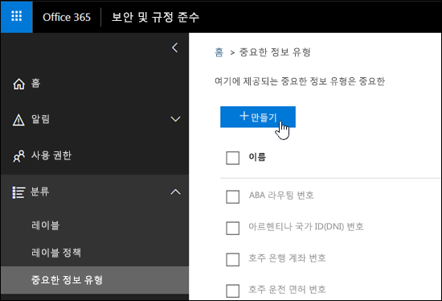
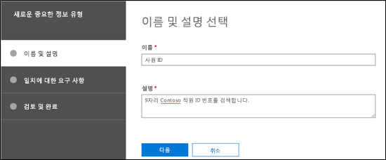
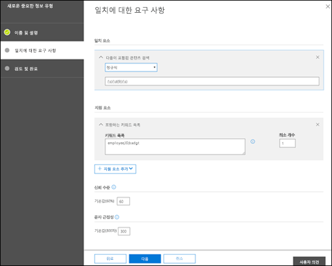
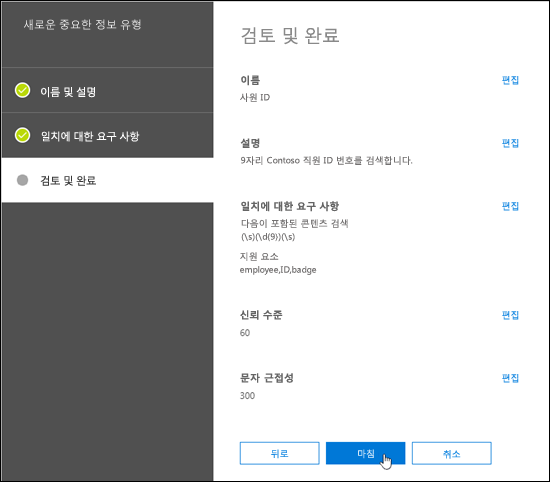
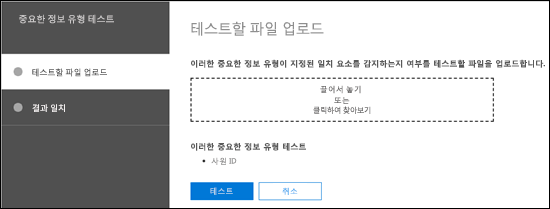

<!-- rename md file to match the display name -->
# 보안 및 준수 센터에서 사용자 지정 중요한 정보 유형 만들기

이 문서를 읽고 보안 및 준수 센터([https://protection.office.com](https://protection.office.com))에서 [사용자 지정 중요한 정보 유형](custom-sensitive-info-types.md)을 만들어 보세요. 이 방법으로 만드는 사용자 지정 중요한 정보 유형은 이름이 `Microsoft.SCCManaged.CustomRulePack`인 규칙 패키지에 추가됩니다.

PowerShell 및 정확한 데이터 매치 기능을 사용하여 사용자 지정 중요한 정보 유형을 만들 수도 있습니다. 해당 방법에 대한 자세한 내용은 다음을 참조하세요.
- [보안 및 준수 센터 PowerShell에서 사용자 지정 중요한 정보 유형 만들기](create-a-custom-sensitive-information-type-in-scc-powershell.md)
- [정확한 데이터 매치(EDM)를 사용하여 DLP를 위한 사용자 지정 중요한 정보 유형 만들기](create-custom-sensitive-information-types-with-exact-data-match-based-classification.md)

## 시작하기 전에

> [!NOTE]
> 사용자 지정 정보 유형을 UI를 통해 작성하고, 테스트하고 배포하려면 전역 관리자 또는 준수 관리자 권한이 있어야 합니다. Office 365에서 [관리자 역할 정보](https://docs.microsoft.com/office365/admin/add-users/about-admin-roles?view=o365-worldwide)를 참조하세요.

- 조직에 DLP(데이터 손실 방지)를 포함하는 구독(예: Office 365 Enterprise)이 있어야 합니다. [메시징 정책 및 규정 준수 서비스 설명](https://docs.microsoft.com/office365/servicedescriptions/exchange-online-protection-service-description/messaging-policy-and-compliance-servicedesc)을 참조하세요. 

- 사용자 지정 중요한 정보 유형을 위해서는 정규식(RegEx)을 잘 알고 있어야 합니다. 텍스트 처리에 사용되는 Boost.RegEx(이전에는 RegEx++라고 함) 엔진에 대한 자세한 내용은 [Boost.Regex 5.1.3](https://www.boost.org/doc/libs/1_68_0/libs/regex/doc/html/)을 참조하세요.

  Microsoft 고객 서비스 및 지원은 사용자 지정 분류 또는 정규식 패턴 만들기를 지원할 수 없습니다. 지원 엔지니어는 테스트 목적으로 샘플 정규식 패턴 제공 또는 예상대로 트리거되지 않는 기존 정규식 패턴 문제 해결 지원과 같은 기능을 제한적으로 지원할 수 있습니다. 그러나 사용자 지정 콘텐츠 일치 개발이 귀하의 요구 사항이나 의무를 충족할 것이라고 확신할 수는 없습니다.

- DLP는 SharePoint Online 및 비즈니스용 OneDrive 사이트에서 중요한 정보를 식별하고 분류하기 위해 검색 크롤러를 사용합니다. 기존 콘텐츠에서 새로운 사용자 지정 중요한 정보 유형을 식별하려면 해당 콘텐츠에 대한 크롤링을 다시 수행해야 합니다. 콘텐츠는 일정을 기반으로 크롤링되지만 사이트 모음, 목록 또는 라이브러리의 콘텐츠를 수동으로 다시 크롤링할 수 있습니다. 자세한 내용은 [사이트, 라이브러리 또는 목록을 크롤링 및 다시 인덱싱하도록 수동으로 요청](https://docs.microsoft.com/sharepoint/crawl-site-content)을 참조하세요.

## 보안 및 준수 센터에서 사용자 지정 중요한 정보 유형 만들기

보안 및 준수 센터에서 **분류** \> **중요한 정보 유형**으로 이동한 후 **만들기**를 클릭합니다.

설정은 매우 명확하며 마법사의 연결 페이지에서 설명합니다.

- **이름**

- **설명**

- **근접**

- **신뢰 수준**

- **기본 패턴 요소**(키워드, 정규식 또는 사전)

- 선택 사항인 **지원 패턴 요소**(키워드, 정규식 또는 사전) 및 해당하는 **최소 비용** 값

시나리오는 다음과 같습니다. "직원", "ID" 및 "배지"라는 키워드와 함께 콘텐츠의 9자리 직원 번호를 검색하는 사용자 지정 중요한 정보 유형이 필요합니다. 이 사용자 지정 중요한 정보 유형을 만들려면 다음 단계를 수행하세요.

1. 보안 및 준수 센터에서 **분류** \> **중요한 정보 유형**으로 이동한 후 **만들기**를 클릭합니다.

    

2. **이름 및 설명 선택** 페이지가 열리면 다음 값을 입력합니다.

  - **이름**: 직원 ID입니다.

  - **설명**: 9자리 Contoso 직원 ID 번호를 검색합니다.

    

    작업을 마친 후 **다음**을 클릭합니다.

3. **일치 요구 사항** 페이지가 열리면 **요소 추가**를 클릭하고 다음 설정을 구성합니다.

    - **다음이 포함된 콘텐츠 검색**:
 
      a. **이 중 하나라도 포함**을 클릭하고 **정규식**을 선택합니다.

      b. 정규식 상자에서 `(\s)(\d{9})(\s)`(앞뒤에 공백이 있는 9자리 숫자) 스트링을 입력합니다.
  
    - **지원 요소**: **지원 요소 추가**를 클릭하고 **이 키워드 목록 포함**을 선택합니다.

    - **이 키워드 목록 포함** 영역이 표시되면 다음 설정을 구성합니다.

      - **키워드 목록**: 직원, ID, 배지 값을 입력합니다.

      - **최소 개수**: 기본값 1을 그대로 둡니다.

    - 기본값인 **신뢰 수준** 값 60을 그대로 둡니다. 

    - 기본값인 **문자 근접** 값 300을 그대로 둡니다.

    

    작업을 마친 후 **다음**을 클릭합니다.

4. **검토 및 완료** 페이지가 열리면 설정을 검토하고 **마침**을 클릭합니다.

    

5. 다음 페이지에서는 **예**를 클릭하여 새로운 사용자 지정 중요한 정보 유형을 테스트할 것을 권장합니다. 자세한 내용은 [보안 및 준수 센터에서 사용자 지정 중요한 정보 유형 테스트](#test-custom-sensitive-information-types-in-the-security--compliance-center)를 참조하세요. 나중에 규칙을 테스트하려면 **아니요**를 클릭합니다.

    

### 작동 여부는 어떻게 확인하나요?

새로운 중요한 정보 유형을 성공적으로 만들었는지 확인하려면 다음 단계를 수행합니다.

  - **분류** \> **중요한 정보 유형**으로 이동하고 새로운 사용자 지정 중요한 정보 유형이 나열되어 있는지 확인하세요.

  - 새로운 사용자 지정 중요한 정보 유형을 테스트합니다. 자세한 내용은, [보안 및 준수 센터에서 사용자 지정 중요한 정보 유형 테스트](#test-custom-sensitive-information-types-in-the-security--compliance-center)를 참조하세요.

## 보안 및 준수 센터에서 사용자 지정 중요한 정보 유형 수정

**참고:**
<!-- check to see if this note contradicts the guidance in "customize a built in sensitive information type customize-a-built-in-sensitive-information-type it sure seems like it does-->
- 사용자 지정 중요한 정보 유형만 수정할 수 있습니다. 기본 제공 중요한 정보 유형은 수정할 수 없습니다. 그러나 PowerShell을 사용하여 기본 제공 사용자 지정 중요한 정보 유형을 내보낸 후 사용자 지정하고 사용자 지정 중요한 정보 유형으로 가져올 수 있습니다. 자세한 내용은 [기본 중요한 정보 유형 사용자 지정](customize-a-built-in-sensitive-information-type.md)을 참조하세요.

- UI에서 만든 사용자 지정 중요한 정보 유형만 수정할 수 있습니다. [PowerShell 프로시저](create-a-custom-sensitive-information-type-in-scc-powershell.md)를 사용하여 사용자 지정 중요한 정보 유형 규칙 패키지를 가져오면 오류가 발생합니다.

보안 및 준수 센터에서 **분류** \> **중요한 정보 유형**으로 이동하고, 수정할 사용자 지정 중요한 정보 유형을 선택한 후 **편집**을 클릭합니다.

  

보안 및 준수 센터에서 사용자 지정 중요한 정보 유형을 만들 때와 동일한 옵션을 사용할 수 있습니다. 자세한 내용은 [보안 및 준수 센터에서 사용자 지정 중요한 정보 유형 만들기](#create-custom-sensitive-information-types-in-the-security--compliance-center)를 참조하세요.

### 작동 여부는 어떻게 확인하나요?

수정한 중요한 정보 유형을 성공적으로 만들었는지 확인하려면 다음 단계를 수행합니다.

  - **분류** \> **중요한 정보 유형**으로 이동하고 수정한 사용자 지정 중요한 정보 유형의 속성을 확인합니다. 

  - 수정한 사용자 지정 중요한 정보 유형을 테스트합니다. 자세한 내용은, [보안 및 준수 센터에서 사용자 지정 중요한 정보 유형 테스트](#test-custom-sensitive-information-types-in-the-security--compliance-center)를 참조하세요.

## 보안 및 준수 센터에서 사용자 지정 중요한 정보 유형 제거 

**참고**:

- 사용자 지정 중요한 정보 유형만 제거할 수 있습니다. 기본 제공 중요한 정보 유형은 제거할 수 없습니다.

- 사용자 지정 중요한 정보 유형을 제거하기 전에 DLP 정책이나 Exchange 메일 흐름 규칙(전송 규칙이라고도 함)이 중요한 정보 유형을 계속 참조하지 않는 것을 확인합니다.

1. 보안 및 준수 센터에서 **분류** \> **중요한 정보 유형**으로 이동하고, 제거할 사용자 지정 중요한 정보 유형을 한 개 이상 선택합니다.

2. 플라이아웃이 열리면 **삭제**(두 개 이상을 선택한 경우 **중요한 정보 유형 삭제**)를 클릭합니다.

    

3. 나타나는 경고 메시지에서 **예**를 클릭합니다.

### 작동 여부는 어떻게 확인하나요?

사용자 지정 중요한 정보 유형을 성공적으로 삭제했는지 확인하려면 **분류** \> **중요한 정보 유형**으로 이동하여 사용자 지정 중요한 정보 유형이 더 이상 나열되지 않는지 확인합니다.

## 보안 및 준수 센터에서 사용자 지정 중요한 정보 유형 테스트

1. 보안 및 준수 센터에서 **분류** \> **중요한 정보 유형**으로 이동합니다.

2. 테스트할 하나 이상의 사용자 지정 중요한 정보 유형을 선택합니다. 플라이아웃이 열리면 **유형 테스트**(두 개 이상을 선택한 경우 **중요한 정보 유형 테스트**)를 클릭합니다.

    

3. **테스트할 파일 업로드** 페이지가 열리면 파일을 끌어서 놓거나 **찾아보기**를 클릭하고 파일을 선택하여 테스트할 문서를 업로드합니다.

    

4. **테스트** 단추를 클릭하여 파일에서 패턴 일치에 대해 문서를 테스트합니다.

5. **결과 일치** 페이지에서 **마침**을 클릭합니다.

    
