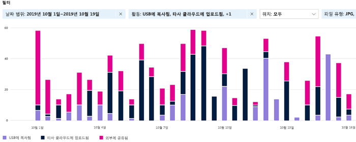

# 활동 탐색기 시작하기Get started with activity explorer

데이터 분류 개요 및 콘텐츠 탐색기 탭을 통해 검색된 후 레이블이 지정된 콘텐츠와 해당 콘텐츠의 위치를 확인할 수 있습니다.The data classification overview and content explorer tabs give you visibility into what content has been discovered and labeled, and where that content is. 활동 탐색기는 사용자가 레이블이 지정된 콘텐츠로 수행한 작업을 모니터링할 수 있도록 하여 이 기능 제품군을 자세히 설명합니다.Activity explorer rounds out this suite of functionality by allowing you to monitor what's being done with your labeled content. 활동 탐색기는 기록 보기를 제공합니다.Activity explorer provides a historical view.

사용할 수 있는 30개가 넘는 여러 가지 필터가 있습니다. 예를 들면:There are over 30 different filters available for use, some are:

- 날짜 범위date range
- 활동 유형activity type
- 위치location
- 사용자user
- 민감도 레이블sensitivity label
- 보존 레이블retention label
- 파일 경로file path
- DLP 정책DLP policy

## 필수 구성 요소Prerequisites

테이터 분류에 액세스하고 이를 사용하는 모든 계정에는 다음 구독 중 하나에서 할당된 라이선스가 있어야 합니다.Every account that accesses and uses data classification must have a license assigned to it from one of these subscriptions:

- Microsoft 365 (E5)Microsoft 365 (E5)
- Office 365 (E5)Office 365 (E5)
- 고급 규정 준수 (E5) 추가 기능Advanced Compliance (E5) add-on
- 고급 위협 인텔리전스 (E5) 추가 기능Advanced Threat Intelligence (E5) add-on

### 권한Permissions

 활동 탐색기 탭에 액세스하려면 계정에 다음 역할이나 역할 그룹 중 하나의 구성원 자격이 할당되어야 합니다.In order to get access to the activity explorer tab, an account must be assigned membership in any one of these roles or role groups.

**Microsoft 365 역할 그룹****Microsoft 365 role groups**

- 전역 관리자Global administrator
- 준수 관리자Compliance administrator
- 보안 관리자Security administrator
- 규정 준수 데이터 관리자Compliance data administrator

## 활동 유형Activity type

Microsoft 365는 SharePoint Online, OneDrive에서 다음과 같은 유형의 활동을 모니터링하고 보고합니다.Microsoft 365 monitors and reports on types of activities across SharePoint Online, and OneDrive like:

- 레이블을 적용함label applied
- 레이블을 변경함(업그레이드, 다운그레이드 또는 제거함)label changed (upgraded, downgraded, or removed)
- 자동 레이블 지정 시뮬레이션auto-labeling simulation

중요 레이블이 지정된 콘텐츠에 어떤 작업이 수행되고 있는지 파악하면 사용자가 이미 적용한 제어(예: [데이터 손실 방지 정책](data-loss-prevention-policies.md))이 유효한지를 파악할 수 있다는 이점이 있습니다.The value of understanding what actions are being taken with your sensitive labeled content is that you can see if the controls that you have already put into place, such as [data loss prevention policies](data-loss-prevention-policies.md) are effective or not. 그렇지 않고, 많은 수의 항목이 `highly confidential` 레이블이 지정되었다가 `general`로 다운그레이드되는 것과 같은 예기치 않은 상황이 발생하는 경우, 다양한 정책을 관리하고 새로운 작업을 수행하여 원치 않은 동작을 제한할 수 있습니다.If not, or if you discover something unexpected, such as a large number of items that are labeled `highly confidential` and are downgraded `general`, you can manage your various policies and take new actions to restrict the undesired behavior.

> [!NOTE]
> 현재 활동 탐색기에서는 Exchange Online의 보존 활동을 모니터링하고 있지 않습니다.Activity explorer doesn't currently monitor retention activities for Exchange Online.

## 참고 항목See also
- [민감도 레이블Sensitivity labels](sensitivity-labels.md)
- [보존 레이블Retention labels](labels.md)
- [중요한 정보 유형 엔터티 정의Sensitive information type entity definitions](sensitive-information-type-entity-definitions.md)
- [보존 정책 개요Overview of retention policies](retention-policies.md)
