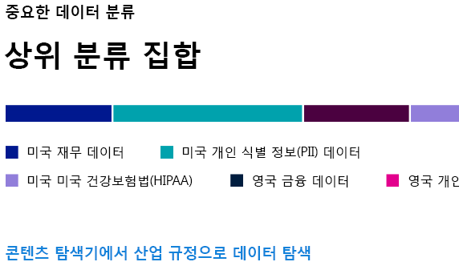
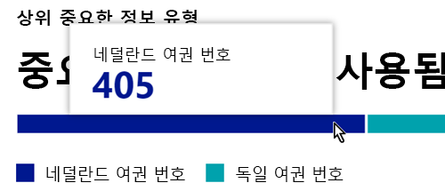
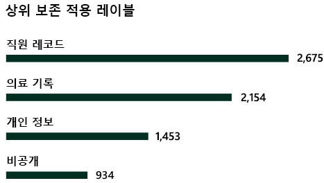

# 데이터 파악 - 데이터 분류 개요Know your data - data classification overview

Microsoft 365 관리자 또는 준수 관리자는 조직의 콘텐츠가 이동하는 위치를 제어하고, 위치에 관계없이 보호하고, 조직의 요구에 따라 보존 및 삭제하기 위해 콘텐츠를 평가하고 태그를 지정할 수 있습니다.As a Microsoft 365 administrator or compliance administrator, you can evaluate and then tag content in your organization in order to control where it goes, protect it no matter where it is and to ensure that it is preserved and deleted according to your organizations needs. 이 작업은 [민감도 레이블](sensitivity-labels.md), [보존 레이블](retention.md#retention-labels) 및 중요한 정보 유형 분류를 적용하여 수행합니다.You do this through the application of [sensitivity labels](sensitivity-labels.md), [retention labels](retention.md#retention-labels), and sensitive information type classification. 검색, 평가 및 태그 지정을 수행하는 방법에는 여러 가지가 있지만, 결과적으로는 많은 수의 문서 및 전자 메일을 이러한 두 레이블 중 하나 또는 둘 다를 사용하여 태그를 지정하고 분류하게 됩니다.There are various ways to do the discovery, evaluation and tagging, but the end result is that you may have very large number of documents and emails that are tagged and classified with one or both of these labels. 보존 레이블 및 민감도 레이블을 적용한 후에는 테넌트 전체에서 레이블이 사용되는 방식과 해당 항목으로 수행 중인 작업을 확인하고자 할 것입니다.After you apply your retention labels and sensitivity labels, you'll want to see how the labels are being used across your tenant and what is being done with those items. 데이터 분류 페이지에는 해당 콘텐츠 본문이 표시됩니다. 특히 다음 정보를 확인할 수 있습니다.The data classification page provides visibility into that body of content, specifically:

- 중요한 정보 유형으로 분류된 항목의 수와 사용된 분류the number items that have been classified as a sensitive information type and what those classifications are
- Microsoft 365 및 Azure Information Protection에서 가장 많이 적용한 민감도 레이블the top applied sensitivity labels in both Microsoft 365 and Azure Information Protection
- 가장 많이 적용한 보존 레이블the top applied retention labels
- 사용자가 중요한 콘텐츠에 대해 수행하는 활동 요약a summary of activities that users are taking on your sensitive content
- 중요한 데이터와 보존된 데이터의 위치the locations of your sensitive and retained data

또한 데이터 분류 페이지에서 다음 기능을 관리합니다.You also manage these features on the data classification page:
- [학습 가능한 분류자trainable classifiers](classifier-learn-about.md)
- [중요한 정보 유형sensitive information types](what-the-sensitive-information-types-look-for.md)

**Microsoft 365 규정 준수 센터** 또는 **Microsoft 365 보안 센터** > **분류** > **데이터 분류**에서 데이터 분류를 찾을 수 있습니다.You can find data classification in the **Microsoft 365 compliance center** or **Microsoft 365 security center** > **Classification** > **Data Classification**.

비디오를 시청하여 데이터 분류 기능에 대해 알아보세요.Take a video tour of our data classification features.

> [!VIDEO https://www.microsoft.com/videoplayer/embed/RE4vx8x]

정책을 만들기 전에 데이터 분류에서 중요한 콘텐츠와 레이블이 지정된 콘텐츠를 검사합니다.Data classification will scan your sensitive content and labeled content before you create any policies. 이를 **제로 변경 관리**라고 합니다.This is called **zero change management**. 이를 통해 모든 보존 및 민감도 레이블이 환경에 미치는 영향을 확인하고, 보호 및 관리 정책 요구 사항을 평가할 수 있습니다.This lets you see the impact that all the retention and sensitivity labels are having in your environment and empower you to start assessing your protection and governance policy needs.

## 필수 구성 요소Prerequisites

테이터 분류에 액세스하고 이를 사용하는 모든 계정에는 다음 구독 중 하나에서 할당된 라이선스가 있어야 합니다.Every account that accesses and uses data classification must have a license assigned to it from one of these subscriptions:

- Microsoft 365 (E5/A5)Microsoft 365 (E5/A5)
- Office 365 (E5)Office 365 (E5)
- 고급 규정 준수 (E5) 추가 기능Advanced Compliance (E5) add-on
- 고급 위협 인텔리전스 (E5) 추가 기능Advanced Threat Intelligence (E5) add-on

### 권한Permissions

 테이터 분류 페이지에 액세스하려면 계정에 다음 역할이나 역할 그룹 중 하나의 구성원 자격이 할당되어야 합니다.In order to get access to the data classification page, an account must be assigned membership in any one of these roles or role groups.

**Microsoft 365 역할 그룹****Microsoft 365 role groups**

- 전역 관리자Global administrator
- 준수 관리자Compliance administrator
- 보안 관리자Security administrator
- 규정 준수 데이터 관리자Compliance data administrator

## 콘텐츠에 가장 많이 사용되는 중요한 정보 유형Sensitive information types used most in your content

Microsoft 365에는 사회 보장 번호 또는 신용 카드 번호를 포함하는 항목과 같은 중요한 정보 유형에 대한 다양한 정의가 포함되어 있습니다.Microsoft 365 comes with many definitions of sensitive information types, such as an item containing a social security number or a credit card number. 중요한 정보 유형에 대한 자세한 내용은 [중요한 정보 유형 엔터티 정의](sensitive-information-type-entity-definitions.md)를 참조하세요.For more information on sensitive information types, see [Sensitive information type entity definitions](sensitive-information-type-entity-definitions.md).

중요한 정보 유형 카드는 조직 전체에서 검색되고 레이블이 지정된 상위 중요한 정보 유형을 보여 줍니다.The sensitive information type card shows the top sensitive information types that have been found and labeled across your organization.

특정 분류 범주에 있는 항목의 수를 확인하려면 해당 범주에 대한 막대를 마우스로 가리킵니다.To find out how many items are in any given classification category, hover over the bar for the category.

> [!NOTE]
> 카드에 "중요한 정보가 포함된 데이터가 없습니다." 메시지가 표시되는 경우If the card displays the message "No data found with sensitive information". 조직에 중요한 정보 유형으로 분류된 항목이 없거나 크롤링된 항목이 없는 것입니다.It means that there are no items in your organization that have been classified as being a sensitive information type or no items that have been crawled. 레이블을 시작하려면 다음을 참조하세요.To get started with labels, see:
>- [민감도 레이블 시작하기Get started with sensitivity labels](get-started-with-sensitivity-labels.md)
>- [보존 정책 및 보존 레이블 시작하기Get started with retention policies and retention labels](get-started-with-retention.md)
>- [중요한 정보 유형 엔터티 정의Sensitive information type entity definitions](sensitive-information-type-entity-definitions.md)

## 콘텐츠에 적용되는 상위 민감도 레이블Top sensitivity labels applied to content

Microsoft 365 또는 AIP(Azure Information Protection)를 통해 항목에 민감도 레이블을 적용하면 다음과 같은 두 가지 상황이 발생합니다.When you apply a sensitivity label to an item either through Microsoft 365 or Azure Information Protection (AIP), two things happen:

- 조직에 항목의 값을 표시하는 태그가 문서에 포함되고, 문서가 이동할 때마다 함께 이동합니다.a tag that indicates the value of the item to your org is embedded in the document and will follow it everywhere it goes
- 이 태그가 있으면 필수 워터마크 또는 암호화와 같은 다양한 보호 동작을 사용할 수 있습니다.the presence of the tag enables various protective behaviors, such as mandatory watermarking or encryption. 엔드포인트 보호를 사용하도록 설정한 경우 항목이 조직의 컨트롤을 벗어나지 않도록 방지할 수도 있습니다.With end point protection enabled you can even prevent an item from leaving your organizational control.

민감도 레이블에 대한 자세한 내용은 [민감도 레이블 알아보기](sensitivity-labels.md)를 참조하세요.For more information on sensitivity labels, see: [Learn about sensitivity labels](sensitivity-labels.md)

데이터 분류 페이지에서 해당 데이터를 표시하려면 SharePoint 및 OneDrive에 있는 파일에 민감도 레이블을 사용하도록 설정되어 있어야 합니다.Sensitivity labels must be enabled for files that are in SharePoint and OneDrive in order for the corresponding data to surface in the data classification page. 자세한 내용은 [SharePoint 및 OneDrive에서 Office 파일에 대한 민감도 레이블 사용](sensitivity-labels-sharepoint-onedrive-files.md)을 참조하세요.For more information, see [Enable sensitivity labels for Office files in SharePoint and OneDrive](sensitivity-labels-sharepoint-onedrive-files.md).

민감도 레이블 카드에는 민감도 레이블별 항목(전자 메일 또는 문서) 수가 표시됩니다.The sensitivity label card shows the number of items (email or document) by sensitivity level.

> [!NOTE]
> 민감도 레이블을 생성 또는 게시하지 않았거나 민감도 레이블이 적용된 콘텐츠가 없는 경우 이 카드에 “검색된 민감도 레이블이 없음” 메시지가 표시됩니다.If you haven't created or published any sensitivity labels or no content has had a sensitivity label applied, this card will display the message "No sensitivity labels detected". 민감도 레이블을 시작하려면 다음을 참조하세요.To get started with sensitivity labels, see:
>- [민감도 레이블](get-started-with-sensitivity-labels.md) 또는 AIP [구성 Azure 정보 보호 정책](https://docs.microsoft.com/azure/information-protection/configure-policy) 시작하기[Get started with sensitivity labels](get-started-with-sensitivity-labels.md) or for AIP [Configure the Azure information protection policy](https://docs.microsoft.com/azure/information-protection/configure-policy)

## 콘텐츠에 적용되는 상위 보존 레이블Top retention labels applied to content

보존 레이블은 조직에서 콘텐츠의 보존과 처리를 관리하는데 사용됩니다.Retention labels are used to manage the retention and disposition of content in your organization. 적용되면 보존 기간 만료 후 삭제 전에 검토 되어야 하는지 및 기록으로 표시 되어야 하는지 여부 등 삭제 전 항목이 어떻게 저장 되는지 관리하는데 사용됩니다.When applied, they can be used to control how an item will be kept before deletion, whether it should be reviewed prior to deletion, when its retention period expires, and whether it should be marked as a record. 자세한 내용은 [보존 정책 및 보존 레이블에 대해 알아보기](retention.md)를 참조하세요.For more information, see [Learn about retention policies and retention labels](retention.md).

적용되는 상위 보존 레이블 카드에는 보존 레이블이 지정된 항목 수가 표시됩니다.The top applied retention labels card shows you how many items have a given retention label.

> [!NOTE]
> 이 카드에 “검색된 보존 레이블이 없음” 메시지가 표시되는 경우 사용자가 보존 레이블을 생성 또는 게시하지 않았거나, 보존 레이블이 적용된 콘텐츠가 없음을 의미합니다.If this card displays the message, "No retention labels detected", it means you haven't created or published any retention labels or no content has had a retention label applied. 보존 레이블을 시작하려면 다음을 참조하세요.To get started with retention labels, see:
>- [보존 정책 및 보존 레이블 시작하기Get started with retention policies and retention labels](get-started-with-retention.md)

## 검색된 상위 활동Top activities detected

이 카드는 사용자가 민감도 레이블이 지정된 항목에 대해 수행하는 가장 일반적인 작업을 빠르게 요약해서 보여 줍니다.This card provides a quick summary of the most common actions that users are taking on the sensitivity labeled items. [활동 탐색기](data-classification-activity-explorer.md)를 사용하여 Microsoft 365에서 레이블이 지정된 콘텐츠 및 Windows 10 엔드포인트에 있는 콘텐츠에 대해 추적하는 8가지 다양한 활동을 드릴다운할 수 있습니다.You can use the [Activity explorer](data-classification-activity-explorer.md) to drill deep down on eight different activities that Microsoft 365 tracks on labeled content and content that is located on Windows 10 endpoints.

> [!NOTE]
> 이 카드에 “검색된 활동 없음" 메시지가 표시되는 경우 파일에 대한 활동이 없었거나 해당 사용자 및 관리자 감사가 켜져 있지 않는 것입니다.If this card displays the message, "No activity detected" it means that there's been no activity on the files or that user and admin auditing isn't turned on. 감사 로그를 설정하려면 다음을 참조하세요.To turn the audit logs on , see:
>- [보안 및 준수 센터에서 감사 로그 검색Search the audit log in security & compliance center](search-the-audit-log-in-security-and-compliance.md)

## 위치별 민감도 및 보존 레이블이 지정된 데이터Sensitivity and retention labeled data by location

데이터 분류 보고 지점은 특정 레이블이 지정된 항목의 수와 해당 위치를 시각적으로 보여 줍니다.The point of the data classification reporting is to provide visibility into the number of items that have which label as well as their location. 이러한 카드를 사용하여 Exchange, SharePoint, OneDrive 등에 있는 레이블이 지정된 항목의 수를 알 수 있습니다.These cards let you know how many labeled items the are in Exchange, SharePoint, and OneDrive etc.

> [!NOTE]
> 이 카드에 “검색된 위치가 없음” 메시지가 표시되는 경우 사용자가 민감도 레이블을 생성 또는 게시하지 않았거나, 보존 레이블이 적용된 콘텐츠가 없음을 의미합니다.If this card displays the message, "No locations detected, it means you haven't created or published any sensitivity labels or no content has had a retention label applied. 민감도 레이블을 시작하려면 다음을 참조하세요.To get started with sensitivity labels, see:
>- [민감도 레이블Sensitivity labels](sensitivity-labels.md)

## 참고 항목See also

- [레이블 활동 보기View label activity](data-classification-activity-explorer.md)
- [레이블 지정된 콘텐츠 보기View labeled content](data-classification-content-explorer.md)
- [민감도 레이블에 대해 알아보기Learn about sensitivity labels](sensitivity-labels.md)
- [보존 정책 및 보존 레이블에 대해 알아보기Learn about retention policies and retention labels](retention.md)
- [중요한 정보 유형 엔터티 정의Sensitive information type entity definitions](sensitive-information-type-entity-definitions.md)
- [학습 가능한 분류자에 대한 자세한 정 (미리 보기)Learn about trainable classifiers (preview)](classifier-learn-about.md)