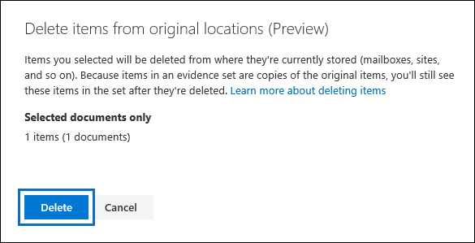
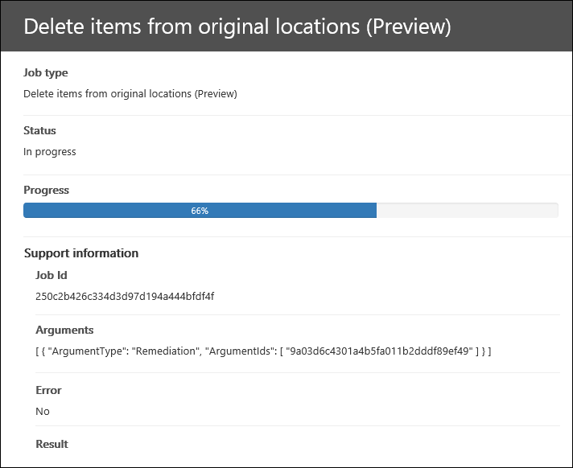
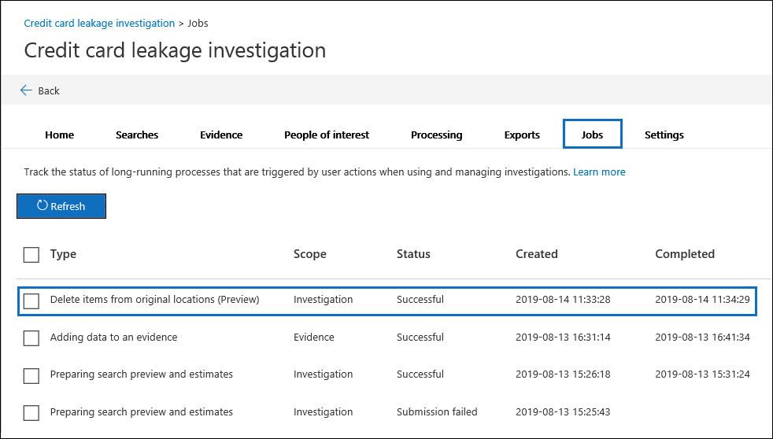

# 원래 위치에서 항목 삭제 (미리 보기)

원래 위치에서 항목을 삭제 하는 기능은 미리 보기에 있습니다.

데이터 조사를 사용 하 여 원래 위치에서 항목을 삭제할 수 있습니다. 즉, 조직 전체에서 Exchange 사서함, SharePoint 사이트 및 OneDrive 계정에서 항목을 삭제할 수 있습니다. 항목을 증거로 수집 했기 때문에 추가 조사를 위해 증거 집합에 보존 되거나 참조로 유지 되는 항목의 복사본을 갖게 됩니다.

## 항목을 삭제 하기 전에

- 항목을 삭제 하려면 보안 & 준수 센터에서 **검색 및 삭제** 역할을 할당 받아야 합니다. 이 역할은 기본 제공 Data Investigator 역할 그룹에 기본적으로 할당 됩니다.

- 이 항목의 절차에서는 조사와 연결 된 검색을 실행 하 고 검색 결과를 증거 집합에 추가 했다고 가정 합니다. 검색 결과가 증명 정보에 있는 후 삭제할 항목을 하나 이상 선택할 수 있습니다. 자세한 내용은 [조사에서 데이터 검색](search-for-data.md)을 참조 하십시오.

- 원본 콘텐츠 위치 (예: Exchange 사서함, SharePoint 사이트 및 OneDrive 계정)의 항목만 삭제 된다는 점을 염두에 두어야 합니다. 이러한 항목은 증거 집합에서 삭제 되지 않습니다. 이는 증명 정보 집합의 항목이 원본의 복사본 이기 때문입니다. 이러한 항목은 증명 정보 집합에 검색 결과를 추가 했을 때 복사 됩니다.

## 항목 삭제

다음 단계를 수행 하 여 원래 위치에서 항목을 삭제 합니다.

1. **데이터 조사** 도구에서 삭제 하려는 항목이 포함 된 데이터 조사를 열고 **증거** 탭을 클릭 합니다.

2. 삭제 하려는 항목을 선택 합니다. 증거 집합의 모든 항목을 선택 하거나 항목의 하위 집합만 선택할 수 있습니다.

   > [!NOTE]
   > SharePoint 및 OneDrive의 문서에 첨부 된 전자 메일 또는 첨부 파일을 선택 하는 경우 해당 항목이 원래 위치에서 삭제 되 면 상위 항목도 선택 되 고 삭제 됩니다. 마찬가지로 첨부 파일이 있는 항목을 선택 하는 경우에는 상위 항목 항목과 모든 첨부 파일이 삭제 됩니다.
 
2. **동작** 을 클릭 한 다음 **원래 위치에서 항목 삭제**를 클릭 합니다.

   

3. 플라이 아웃 페이지에서 삭제할 항목 및 관련 하위 문서 수를 확인 하 고 **삭제**를 클릭 합니다.

   

   > [!NOTE]
   > 이전 스크린샷에서 항목 수는 삭제 하기 위해 선택한 항목 수를 나타냅니다. 문서 수는 부모 항목에 첨부 된 모든 파일을 포함 하는 총 항목 수를 나타냅니다. 예를 들어 하나의 전자 메일 메시지를 선택 하 고 해당 메시지에 첨부 된 Word 문서가 있는 경우 **선택한 문서** 아래에 표시 되는 항목 및 문서 수는 **1 개 항목 (문서 2 개)** 일 뿐입니다.

**작업 탭에서** **원래 위치에서 항목 삭제** 작업의 진행 상태를 추적할 수 있습니다. 작업을 클릭 하 여 플라이 아웃 페이지를 표시 합니다.

작업의 항목이 삭제 되 면 작업 상태가 **성공**으로 설정 됩니다. 또한 완료 된 작업의 시간 및 날짜도 표시 됩니다.

> [!NOTE]
> **원래 위치에서 항목 삭제** 작업의 **일부가 성공적으로 완료** 된 것으로 표시 될 수 있습니다. 이 작업은 여러 가지 상황에서 발생 합니다. 자세한 내용은이 문서의 부분적으로 [성공한 삭제](#partially-successful-deletions) 섹션을 참조 하십시오.

## 항목을 삭제 하면 어떻게 됩니까?

이 때 원래 콘텐츠 위치에서 항목을 삭제 하면 항목이 *일시 삭제*됩니다. 즉, 항목이 특수 위치로 이동 하 고 삭제 된 항목 보존 기간이 만료 되어 항목이 Microsoft 365에서 영구적으로 삭제 되도록 표시 됩니다. 항목을 일시 삭제 하는 것은 보존 기간이 만료 될 때까지 사용자가 계속 이러한 항목을 복구할 수 있음을 의미 합니다. 다음은 Exchange 사서함 및 SharePoint 및 비즈니스용 OneDrive 사이트에서 항목이 일시 삭제 될 때 수행 되는 작업 및 원래 위치에서 항목을 삭제 한 후 사용자가 수행할 수 있는 작업에 대 한 설명입니다.

- **사서함:** 일시 삭제 된 사서함 항목은 사서함의 복구 가능한 항목 폴더로 이동 됩니다. 이 동작은 사용자가 지운 편지함 폴더에서 항목을 삭제 하거나 Shift + Delete를 눌러 항목을 영구적으로 삭제 하는 경우와 비슷합니다. 이때 사용자는 삭제 된 항목 보존 기간이 만료 될 때까지 항목을 복구할 수 있습니다. Microsoft 365에서 삭제 된 항목 보존 기간은 기본적으로 14 일 이지만 관리자는 보존 기간을 30 일로 늘릴 수 있습니다. 보존 기간이 만료 되 면 항목이 숨겨진 폴더 ( *제거* 폴더 라고 함)로 이동 됩니다. 다음 번에 사서함을 처리할 때 항목이 Microsoft 365에서 영구적으로 제거 됩니다. 사서함은 7 일 마다 한 번씩 처리 됩니다.

- **SharePoint 및 OneDrive 사이트:** 사이트에 있는 파일이 나 문서를 일시 삭제 하면 사이트의 휴지통 ( *1 단계* 휴지통이 라고도 함)으로 이동 됩니다. 항목은 93 일 (Microsoft 365의 사이트에 대 한 삭제 된 항목 보존 기간) 동안 휴지통에 남아 있습니다. 93 일 기간 동안 SharePoint의 사이트 모음 관리자 또는 OneDrive의 사용자 또는 관리자가 삭제 된 항목을 복구할 수 있습니다. 1 단계 휴지통에서 항목을 삭제할 수도 있습니다. 이 경우 항목은 *2 단계* 휴지통 이라고 하는 사이트 모음의 휴지통으로 이동 됩니다. 보존 기간은 1 단계 및 2 단계 휴지통에서 모두 93 일입니다. 즉, 처음에 항목을 삭제할 때 2 단계 휴지통 보존을 시작 합니다. 즉, 두 휴지통 모두에 대해 총 최대 보존 시간이 93 일입니다. 2 단계 휴지통에서 항목을 삭제 하는 경우 (관리자가 수동으로 또는 보존 기간이 만료 되 면 자동으로 시작)에는 더 이상 관리자가 해당 휴지통에 액세스할 수 없습니다.

## 콘텐츠 위치를 유지 하는 경우 발생 하는 작업

Microsoft 365에서는 사서함과 사이트를 보류 하거나 보존 정책에 할당할 수 있습니다. 즉, 항목의 보존 기간이 만료 되거나 보존을 제거할 때까지 아무 것도 영구적으로 제거 되지 않습니다. 원래 위치에서 항목을 삭제 해도 항목이 Office 365에서 영구적으로 제거 되지 않을 수 있습니다. 예를 들어 사서함이 보존 되는 경우 일시 삭제 된 항목은 복구 가능한 항목 폴더의 제거 또는 검색에서 다시 사용으로 이동 되 고 보류 기간 또는 보존 기간이 만료 될 때까지 유지 됩니다. 사이트의 경우 휴지통으로 이동 되는 항목의 복사본은 보류 또는 보존 정책을 사이트에 넣을 때 만들어진 보존 보류 라이브러리로 복사 됩니다.

## 부분적으로 성공한 삭제

**원래 위치에서 항목 삭제** 작업의 실행이 완료 된 후에는 작업 상태를 부분적으로 **성공적**으로 수신할 수 있습니다. 일반적으로이 상태는 작업을 성공적으로 실행 했지만 일부 항목이 일시 삭제 되지 않았음을 나타냅니다. 다음은 부분적인 삭제가 발생 하는 이유 목록입니다.

- 사서함 항목이 원본 사서함의 복구 가능한 항목 폴더에 이미 있습니다.

- 사서함 항목이 원본 사서함의 복구 가능한 항목 폴더에서 제거 되었습니다.

- 문서가 SharePoint 또는 OneDrive 사이트의 1 단계 휴지통에 이미 있습니다.

- 문서가 증거 집합에 추가 된 후 다른 SharePoint 사이트로 이동 되었습니다. 이 경우 문서가 이동 된 사이트의 휴지통으로 이동 되지 않습니다.

- 문서가 증거 집합에 추가 된 후 SharePoint 또는 OneDrive에서 영구적으로 삭제 되었습니다 (2 단계 휴지통으로 이동).
