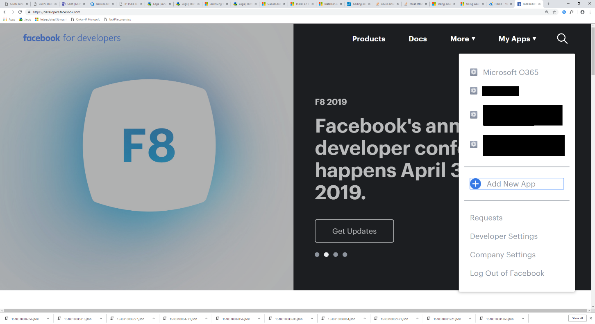
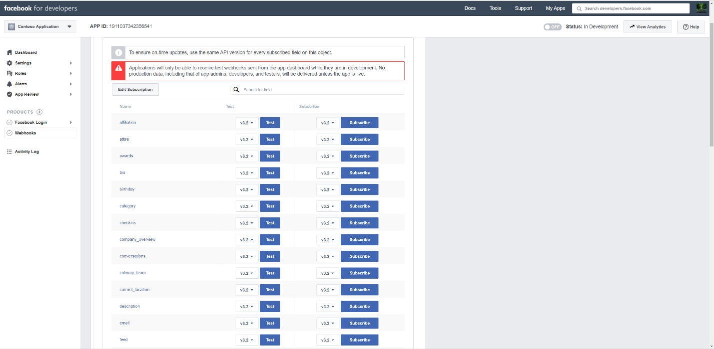
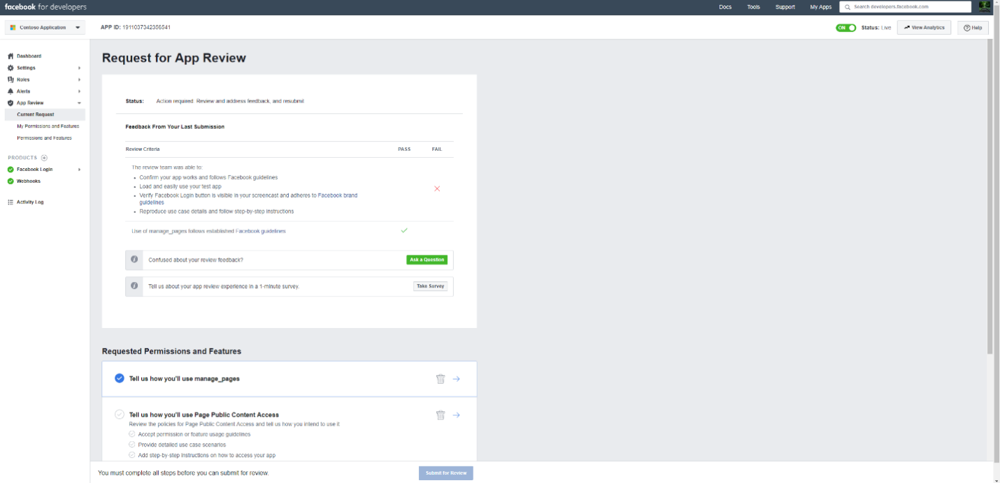

# Facebook Business pages 데이터를 보관 하기 위한 커넥터 배포Deploy a connector to archive Facebook Business pages data

이 문서에는 Microsoft 365 가져오기 서비스를 사용 하 여 Facebook Business 페이지의 데이터를 Microsoft 365로 가져오는 커넥터를 배포 하는 단계별 프로세스가 포함 되어 있습니다.This article contains the step-by-step process to deploy a connector that uses the Microsoft 365 Import service to import data from Facebook Business pages to Microsoft 365. 이 프로세스에 대 한 간략 한 개요와 Facebook 커넥터를 배포 하는 데 필요한 필수 구성 요소 목록은 [facebook 데이터를 보관할 커넥터 설정을](archive-facebook-data-with-sample-connector.md)참조 하십시오.For a high-level overview of this process and a list of prerequisites required to deploy a Facebook connector, see [Set up a connector to archive Facebook data](archive-facebook-data-with-sample-connector.md). 

## 1 단계: Azure Active Directory에 앱 만들기Step 1: Create an app in Azure Active Directory

1. 으로 이동 <https://portal.azure.com> 하 고 Office 365 전역 관리자 계정의 자격 증명을 사용 하 여 로그인 합니다.Go to <https://portal.azure.com> and sign in using the credentials of an Office 365 global admin account.

    

2. 왼쪽 탐색 창에서 **Azure Active Directory**를 클릭 합니다.In the left navigation pane, click **Azure Active Directory**.

    

3. 왼쪽 탐색 창에서 **앱 등록 (미리 보기)** 을 클릭 하 고 **새 등록**을 클릭 합니다.In the left navigation pane, click **App registrations (Preview)** and then click **New registration**.

    

4. 응용 프로그램을 등록 합니다.Register the application. 리디렉션 URI의 응용 프로그램 형식 드롭다운 목록에서 웹을 선택한 다음 URI에 <https://portal.azure.com> 대 한 상자에 입력 합니다.Under Redirect URI, select Web in the application type dropdown list and then type <https://portal.azure.com> in the box for the URI.

   

5. **응용 프로그램 (클라이언트) id** 및 **디렉터리 (테 넌 트) id** 를 복사한 다음 텍스트 파일 또는 기타 안전한 위치에 저장 합니다.Copy the **Application (client) ID** and **Directory (tenant) ID** and save them to a text file or other safe location. 이후 단계에서 이러한 Id를 사용 합니다.You use these IDs in later steps.

   

6. **새 앱에 대 한 인증서 & 비밀으로 이동 합니다.**Go to **Certificates & secrets for the new app.**

   

7. **새 클라이언트 암호** 를 클릭 합니다.Click **New client secret**

   

8. 새 암호를 만듭니다.Create a new secret. 설명 상자에 암호를 입력 하 고 만료 기간을 선택 합니다.In the description box, type the secret and then choose an expiration period. 

    

9. 비밀 값을 복사 하 여 텍스트 파일 또는 기타 저장 위치에 저장 합니다.Copy the value of the secret and save it to a text file or other storage location. 이는 이후 단계에서 사용 하는 AAD 응용 프로그램 비밀입니다.This is the AAD application secret that you use in later steps.

   

## 2 단계: GitHub에서 Azure 계정으로 커넥터 웹 서비스 배포Step 2: Deploy the connector web service from GitHub to your Azure account

1. [이 GitHub 사이트로](https://github.com/microsoft/m365-sample-connector-csharp-aspnet) 이동한 후 **Azure에 배포를**클릭 합니다.Go to [this GitHub site](https://github.com/microsoft/m365-sample-connector-csharp-aspnet) and click **Deploy to Azure**.

    

2. **Azure에 배포**를 클릭 하면 사용자 지정 서식 파일 페이지를 사용 하 여 azure 포털로 리디렉션됩니다.After you click **Deploy to Azure**, you will be redirected to an Azure portal with a custom template page. **기본 사항** 및 **설정** 세부 정보를 입력 하 고 **구매**를 클릭 합니다.Fill in the **Basics** and **Settings** details and then click **Purchase**.

    - **구독:** Facebook Business pages connector 웹 서비스를 배포 하려는 Azure 구독을 선택 합니다.**Subscription:** Select your Azure subscription that you want to deploy the Facebook Business pages connector web service to.
    
    - **리소스 그룹:** 새 리소스 그룹을 선택 하거나 만듭니다.**Resource group:** Choose or create a new resource group. 리소스 그룹은 Azure 솔루션에 대 한 관련 리소스를 포함 하는 컨테이너입니다.A resource group is a container that holds related resources for an Azure solution.

    - **위치:** 위치를 선택 합니다.**Location:** Choose a location.

    - **웹 응용 프로그램 이름:** 커넥터 웹 응용 프로그램의 고유한 이름을 지정 합니다.**Web App Name:** Provide a unique name for the connector web app. Th 이름의 길이는 3에서 18 자 사이 여야 합니다.Th name must be between 3 and 18 characters in length. 이 이름은 Azure app service URL을 만드는 데 사용 됩니다. 예를 들어 **fbconnector** 의 웹 앱 이름을 제공 하는 경우 Azure APP service URL은 **fbconnector.azurewebsites.net**가 됩니다.This name is used to create the Azure app service URL; for example, if you provide the Web app name of **fbconnector** then the Azure app service URL  will be **fbconnector.azurewebsites.net**.
    
    - **tenantId:** 1 단계에서 Azure Active Directory에 Facebook connector 앱을 만든 후 복사한 Microsoft 365 조직의 테 넌 트 ID입니다.**tenantId:** The tenant ID of your Microsoft 365 organization that you copied after creating the Facebook connector app in Azure Active Directory in Step 1.
    
   - **APISecretKey:** 임의의 값을 비밀로 입력할 수 있습니다.**APISecretKey:** You can type any value as the secret. 이는 5 단계에서 커넥터 웹 앱에 액세스 하는 데 사용 됩니다.This is used to access the connector web app in Step 5.
   
     

3. 배포가 성공적으로 완료 되 면 페이지는 다음 스크린샷과 유사 하 게 표시 됩니다.After the deployment is successful, the page will look similar to the following screenshot:

     

## 3 단계: Facebook 앱 등록Step 3: Register the Facebook app

1. <https://developers.facebook.com>으로 이동 하 고 조직의 Facebook Business 페이지의 계정에 대 한 자격 증명을 사용 하 여 로그인 한 다음 **새 앱 추가**를 클릭 합니다.Go to <https://developers.facebook.com>, log in using the credentials for the account for your organization’s Facebook Business pages, and then click **Add New App**.

   

2. 새 앱 ID를 만듭니다.Create a new app ID.

   

3. 왼쪽 탐색 창에서 **제품 추가** 를 클릭 한 다음 **Facebook 로그인** 타일에서 **설정을** 클릭 합니다.In the left navigation pane, click **Add Products** and then click **Set Up** in the **Facebook Login** tile.

   

4. Facebook 로그온 페이지에서 **웹**을 클릭 합니다.On the Integrate Facebook Login page, click **Web**.

   

5. Azure 앱 서비스 URL을 추가 합니다. 예를 `https://fbconnector.azurewebsites.net`들어Add the Azure app service URL; for example `https://fbconnector.azurewebsites.net`.

   

6. Facebook 로그인 설정의 퀵 스타트 섹션을 완료 합니다.Complete the QuickStart section of the Facebook Login setup.

   

7. **Facebook 로그인**아래의 왼쪽 탐색 창에서 **설정을**클릭 하 고 **유효한 OAuth 리디렉션 URI** 상자에 OAuth 리디렉션 URI를 추가 합니다.In the left navigation pane under **Facebook Login**, click **Settings**, and add the OAuth redirect URI in the **Valid OAuth Redirect URIs** box. Connectorserviceuri의 값은 조직의 Azure app 서비스 URL 인 \*\* \<connectorserviceuri>/views/facebookoauth\*\*형식을 사용 합니다. 예를 `https://fbconnector.azurewebsites.net`들면입니다.Use the format **\<connectorserviceuri>/Views/FacebookOAuth**, where the value for connectorserviceuri is the Azure app service URL for your organization; for example, `https://fbconnector.azurewebsites.net`.

   

8. 왼쪽 탐색 창에서 **제품 추가** 를 클릭 한 다음 **webhooks를 클릭 합니다.**In the left navigation pane, click **Add Products** and then click **Webhooks.** **페이지** 풀 다운 메뉴에서 **페이지**를 클릭 합니다.In the **Page** pull-down menu, click **Page**. 

   

9. Webhooks 콜백 URL을 추가 하 고 verify token을 추가 합니다.Add Webhooks Callback URL and add a verify token. 콜백 URL의 형식은 \*\* <connectorserviceuri>/api/FbPageWebhook\*\*형식을 사용 하며, 여기서 connectorserviceuri의 값은 조직의 Azure 앱 서비스 URL입니다. 예를 `https://fbconnector.azurewebsites.net`들어The format of the callback URL, use the format **<connectorserviceuri>/api/FbPageWebhook**, where the value for connectorserviceuri is the Azure app service URL for your organization; for example `https://fbconnector.azurewebsites.net`. 

    Verify 토큰은 강력한 암호와 비슷해야 합니다.The verify token should similar to a strong password. 텍스트 파일 또는 기타 저장소 위치에 verify 토큰을 복사 합니다.Copy the verify token to a text file or other storage location.

        

10. 테스트 하 고 피드의 끝점을 구독 합니다.Test and subscribe to the endpoint for feed.

    

11. 개인 정보 URL, 앱 아이콘 및 비즈니스 사용을 추가 합니다.Add a privacy URL, app icon, and business use. 또한 앱 ID 및 앱 암호를 텍스트 파일 또는 기타 저장 위치에 복사 합니다.Also, copy the app ID and app secret to a text file or other storage location.

    

12. 앱을 공용으로 설정 합니다.Make the app public.

    

13. 관리자 또는 테스터 역할에 사용자를 추가 합니다.Add user to the admin or tester role.

    

14. **페이지 공용 콘텐츠 액세스** 권한을 추가 합니다.Add the **Page Public Content Access** permission.

    

15. 페이지 관리 권한을 추가 합니다.Add Manage Pages permission.

    

16. Facebook에서 검토 한 응용 프로그램을 가져옵니다.Get the application reviewed by Facebook.

    

## 4 단계: 커넥터 웹 응용 프로그램 구성Step 4: Configure the connector web app

1. Https://\<AzureAppResourceName> (여기에서 AzureAppResourceName는 4 단계에서 명명 한 Azure 앱 리소스의 이름)으로 이동 합니다 (예: 이름이 **fbconnector**이면로 `https://fbconnector.azurewebsites.net`이동).Go to https://\<AzureAppResourceName>.azurewebsites.net (where AzureAppResourceName is the name of your Azure app resource that you named in Step 4) For example, if the name is **fbconnector**, go to `https://fbconnector.azurewebsites.net`. 앱의 홈 페이지는 다음 스크린샷 처럼 표시 됩니다.The home page of the app will look like the following screenshot:

   

2. **구성을** 클릭 하 여 로그인 페이지를 표시 합니다.Click **Configure** to display a sign in page.
 
   

3. 테 넌 트 Id 상자에 2 단계에서 받은 테 넌 트 Id를 입력 하거나 붙여 넣습니다.In the Tenant Id box, type or paste your tenant Id (that you obtained in Step 2). 암호 상자에 2 단계에서 구한 APISecretKey를 입력 하거나 붙여 넣은 다음 **구성 설정 설정을** 클릭 하 여 구성 세부 정보 페이지를 표시 합니다.In the password box, type or paste the APISecretKey (that you obtained in Step 2), and then click **Set Configuration Settings** to display the configuration details page.

    

4. 다음 구성 설정을 입력 합니다.Enter the following configuration settings 

   - **Facebook 응용 프로그램 ID:** 3 단계에서 구한 Facebook 응용 프로그램의 앱 ID입니다.**Facebook application ID:** The app ID for the Facebook application that you obtained in Step 3.
   
   - **Facebook 응용 프로그램 암호:** 3 단계에서 얻은 Facebook 응용 프로그램에 대 한 앱 비밀입니다.**Facebook application secret:** The app secret for the Facebook application that you obtained in Step 3.
   
   - **Facebook webhook 확인 토큰:** 3 단계에서 만든 verify 토큰입니다.**Facebook webhooks verify token:** The verify token that you created in Step 3.
   
   - **AAD 응용 프로그램 ID:** 1 단계에서 만든 Azure Active Directory 앱의 응용 프로그램 ID입니다.**AAD application ID:** The application ID for the Azure Active Directory app that you created in Step 1.
   
   - **AAD 응용 프로그램 암호:** 1 단계에서 만든 APISecretKey 암호에 대 한 값입니다.**AAD application secret:** The value for the APISecretKey secret that you created in Step 1.

5. **저장** 을 클릭 하 여 커넥터 설정을 저장 합니다.Click **Save** to save the connector settings.

## 5 단계: Microsoft 365 준수 센터에서 Facebook 커넥터 설정Step 5: Set up a Facebook connector in the Microsoft 365 compliance center

1. 로 이동한 [https://compliance.microsoft.com](https://compliance.microsoft.com) 후 왼쪽 탐색 창에서 **데이터 커넥터** 를 클릭 합니다.Go to [https://compliance.microsoft.com](https://compliance.microsoft.com) and then click **Data connectors** in the left nav.

2. **데이터 커넥터 (미리 보기)** 페이지의 **Facebook Business 페이지**에서 **보기**를 클릭 합니다.On the **Data connectors (preview)** page under **Facebook Business pages**, click **View**.

3. **Facebook business pages** 페이지에서 **커넥터 추가**를 클릭 합니다.On the **Facebook business pages** page, click **Add connector**.

4. **서비스 약관** 페이지에서 **수락**을 클릭 합니다.On the **Terms of service** page, click **Accept**.

5.  **커넥터 응용 프로그램에 대 한 자격 증명 추가** 페이지에서 다음 정보를 입력 한 다음 **연결 유효성 검사**를 클릭 합니다.On the **Add credentials for your connector app** page, enter the following information and then click **Validate connection**.

    

    - **이름** 상자에 **Facebook 뉴스 페이지**와 같은 커넥터의 이름을 입력 합니다.In the **Name** box, type a name for the connector, such as **Facebook news page**.
    
    - **연결 URL** 상자에 Azure 앱 서비스 URL을 입력 하거나 붙여넣습니다. 예를 `https://fbconnector.azurewebsites.net`들어In the **Connection URL** box, type or paste the Azure app service URL; for example `https://fbconnector.azurewebsites.net`.
    
    - **암호** 상자에 2 단계에서 추가한 APISecretKey의 값을 입력 하거나 붙여넣습니다.In the **Password** box, type or paste the value of the APISecretKey that you added in Step 2.
    
    - **Azure 앱 id** 상자에 1 단계에서 만든 AAD 응용 프로그램 id로 호출 되는 응용 프로그램 (클라이언트) id의 값을 입력 하거나 붙여넣습니다.In the **Azure App ID** box, type or paste the value of the Application (client) ID also called as AAD Application ID that you created in Step 1.
 
6. 연결이 성공적으로 확인 되 면 **다음**을 클릭 합니다.After the connection is successfully validated, click **Next**.

7. **Microsoft 365에서 데이터를 가져올 수 있는 권한을 부여** 합니다 페이지에서 APISecretKey를 다시 입력 하거나 붙여 넣은 다음 **로그인 웹 앱**을 클릭 합니다.On the **Authorize Microsoft 365 to import data** page, type or paste the APISecretKey again and then click **Login web app**.

8. **Facebook connector 앱 구성** 페이지에서 **facebook을 사용** 하 여 로그인을 클릭 하 고 조직의 facebook 비즈니스 페이지에 대 한 계정의 자격 증명을 사용 하 여 로그온 합니다.On the **Configure Facebook connector app** page, click **Login with Facebook** and log in using the credentials for the account for your organization's Facebook Business pages. 로그인 한 Facebook 계정에 조직의 Facebook Business 페이지에 대 한 관리자 역할이 할당 되었는지 확인 합니다.Make sure the Facebook account that you logged in to is assigned the admin role for your organization's Facebook Business pages.

   

9. 로그인 한 Facebook 계정으로 관리 되는 비즈니스 페이지 목록이 표시 됩니다.A list of the business pages managed by the Facebook account that you logged in to is displayed. 보관할 페이지를 선택 하 고 **다음**을 클릭 합니다.Select the page to archive and then click **Next**.

    

10. **계속** 을 클릭 하 여 커넥터 서비스 앱의 설정을 종료 합니다.Click **Continue** to exit the setup of the connector service app.

11. **필터 설정** 페이지에서 특정 기간에 해당 하는 항목을 처음 가져올 때 필터를 적용할 수 있습니다.On the **Set filters** page, you can apply a filter to initially import items that are a certain age. 보존 기간을 선택 하 고 **다음**을 클릭 합니다.Select an age, and then click **Next**.

12. **저장소 위치 선택** 페이지에서 Facebook 항목을 가져올 Microsoft 365 사서함의 전자 메일 주소를 입력 하 고 **다음**을 클릭 합니다.On the **Choose storage location** page, type the email address of Microsoft 365 mailbox that the Facebook items will be imported to, and then click **Next**.

13. **관리자 동의 제공**에서 **동의 제공** 을 클릭 한 다음 단계를 따릅니다.On the **Provide admin consent**, click **Provide consent** and then follow the steps. 조직의 데이터에 액세스 하려면 Office 365 가져오기 서비스에 대 한 동의를 제공 하는 전역 관리자 여야 합니다.You must be a global admin to provide consent for the Office 365 Import service to access data in your organization.

14. **다음** 을 클릭 하 여 커넥터 설정을 검토 한 다음 **마침을** 클릭 하 여 커넥터 설치를 완료 합니다.Click **Next** to review the connector settings and then click **Finish** to complete the connector setup.

15. 준수 센터에서 **데이터 커넥터** 페이지로 이동한 다음 **커넥터** 탭을 클릭 하 여 가져오기 프로세스의 진행 상태를 확인 합니다.In the compliance center, go to the **Data connectors** page, and click the **Connectors** tab to see the progress of the import process.
