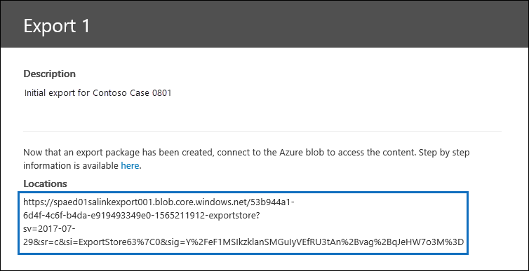
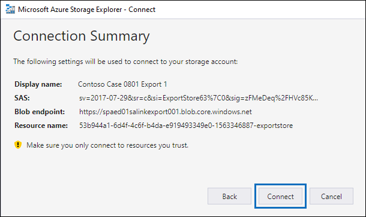
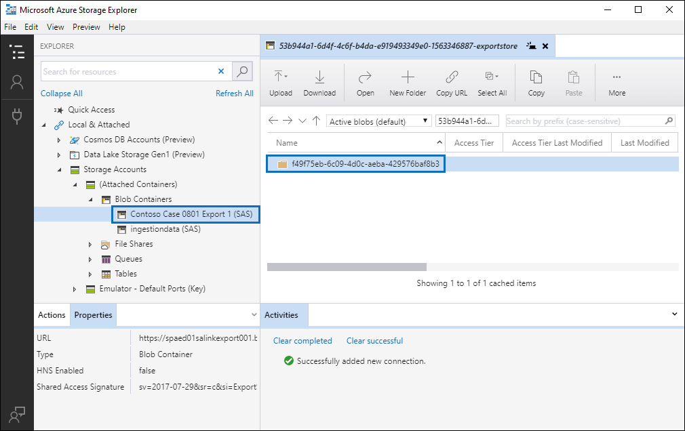
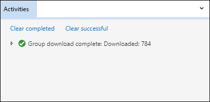

# 내보내기 작업 다운로드Download export jobs

고급 eDiscovery 사례의 검토 집합에서 문서를 내보낼 때 문서는 Microsoft에서 제공한 Azure 저장소 위치 또는 조직에서 관리 하는 Azure 저장소 위치에 업로드 됩니다.When you export documents from a review set in an Advanced eDiscovery case, the documents are uploaded to a Microsoft-provided Azure Storage location or to an Azure Storage location managed by your organization. 사용 되는 Azure Storage location 유형은 문서를 내보낼 때 선택한 옵션에 따라 달라 집니다.The type of Azure Storage location used depends on which option was selected when the documents were exported. 

이 문서에서는 Microsoft Azure Storage Explorer를 사용 하 여 Azure 저장소 위치에 연결 하 여 내보낸 문서를 찾아보고 다운로드 하는 방법에 대 한 지침을 제공 합니다.This article provides instructions for how to use the Microsoft Azure Storage Explorer to connect to an Azure Storage location to browse and download the exported documents. Azure Storage Explorer에 대 한 자세한 내용은 [빠른 시작: Azure Storage Explorer 사용](https://docs.microsoft.com/azure/storage/blobs/storage-quickstart-blobs-storage-explorer)을 참조 하십시오.For more information about Azure Storage Explorer, see [Quickstart: Use Azure Storage Explorer](https://docs.microsoft.com/azure/storage/blobs/storage-quickstart-blobs-storage-explorer).

## 1 단계: Azure Storage Explorer 설치Step 1: Install the Azure Storage Explorer

첫 번째 단계는 Azure Storage Explorer를 다운로드 하 여 설치 하는 것입니다.The first step is to download and install the Azure Storage Explorer. 자세한 내용은 [Azure Storage Explorer 도구](https://go.microsoft.com/fwlink/p/?LinkId=544842)를 참조 하십시오.For instructions, see [Azure Storage Explorer tool](https://go.microsoft.com/fwlink/p/?LinkId=544842). 이 도구를 사용 하 여 3 단계에서 내보낸 문서에 연결 하 고 다운로드 합니다.You use this tool to connect to and download the exported documents in Step 3.

## 2 단계: 내보내기 작업에서 SAS URL 가져오기Step 2: Obtain the SAS URL from the export job

다음 단계에서는 [검토 집합에서 문서를 내보내기](export-documents-from-review-set.md)위해 내보내기 작업을 만들 때 생성 되는 SAS (공유 액세스 서명) URL을 가져옵니다.The next step is to obtain the shared access signature (SAS) URL that's generated when you created the export job to [export documents from a review set](export-documents-from-review-set.md). Microsoft에서 제공한 Azure 저장소 위치 또는 조직에서 관리 하는 Azure 저장소 위치에 업로드 된 문서에 대 한 SAS URL을 복사할 수 있습니다.You can copy the SAS URL for documents that are uploaded to a Microsoft-provided Azure Storage location or an Azure Storage location managed by your organization. 두 경우 모두 SAS URL을 사용 하 여 3 단계에서 Azure 저장소 위치에 연결 합니다.In either case, you use the SAS URL to connect to the Azure Storage location in Step 3.

1. **고급 eDiscovery** 페이지에서 사례로 이동한 후 **내보내기** 탭을 클릭 합니다.On the **Advanced eDiscovery** page, go to the case, and then click the **Exports** tab.

2. **내보내기 탭에서** 다운로드 하려는 내보내기 작업을 클릭 합니다.On the **Exports** tab, click the export job that you want to download.

3. 플라이 아웃 페이지의 **위치**아래에 표시 된 SAS URL을 복사 합니다.On the flyout page, under **Locations**, copy the SAS URL that's displayed. 필요한 경우 3 단계에서 액세스할 수 있도록 파일을 파일로 저장할 수 있습니다.If necessary, you can save it to a file so you can access it in Step 3.
 
   

## 3 단계: Azure 저장소 위치에 연결Step 3: Connect to the Azure Storage location

마지막 단계에서는 Azure Storage Explorer와 SAS URL을 사용 하 여 Azure 저장소 위치에 연결 하 고 내보낸 문서를 로컬 컴퓨터로 다운로드 합니다.The final step is to use the Azure Storage Explorer and the SAS URL to connect to the Azure Storage location and download the documents that you exported to a local computer.

1.  1 단계에서 설치한 Azure Storage Explorer를 엽니다.Open the Azure Storage Explorer that you installed in Step 1.

2. **계정 추가** 아이콘을 클릭 합니다.Click the **Add account** icon. 또는 **저장소 계정을**마우스 오른쪽 단추로 클릭 해도 됩니다.Alternatively, you can right-click **Storage Accounts**.

   

3.  **Azure Storage에 연결** 페이지에서 **SAS (공유 액세스 서명) URI 사용** 을 클릭 한 후 **다음**을 클릭 합니다.On the **Connect to Azure Storage** page, click **Use a shared access signature (SAS) URI** and then click **Next**.

    

4.  **SAS URI로 연결** 페이지에서 URI 상자를 클릭 한 다음 2 단계에서 얻은 SAS URL을 붙여 넣습니다.On the **Attach with SAS URI** page, click in the URI box, and then paste the SAS URL that you obtained in Step 2. 

    

    **표시 이름** 상자에 SAS URL의 일부가 표시 됩니다.Notice that a portion of the SAS URL is displayed in the **Display name** box. 이 이름은 저장소 위치에 연결한 후 **저장소 계정** 에 만들어지는 컨테이너의 표시 이름으로 사용 됩니다.This will be used as the display name of the container that's created under the **Storage accounts** after you connect to the storage location. 이 이름은 Advanced eDiscovery 사례의 ID와 고유 식별자로 구성 됩니다.This name consists of the ID of the Advanced eDiscovery case is from and a unique identifier. 기본 표시 이름을 그대로 유지 하거나 변경할 수 있습니다.You can keep the default display name or change it. 이름을 변경 하는 경우에는 표시 이름이 고유 해야 합니다.If you change it, the display name must be unique.

5.  **다음**을 클릭합니다.Click **Next**.

    **연결 요약** 페이지가 표시 됩니다.The **Connection summary** page is displayed.
   
    

6. **연결 요약** 페이지에서 연결 정보를 검토 한 다음 **연결**을 클릭 합니다.On the **Connection summary** page, review the connection information, and then click **Connect**. 

    **Blob 컨테이너** 노드 ( **저장소 계정** > **(연결 된 컨테이너))** \> 가 열립니다.The **Blob containers** node (under **Storage Accounts** > **(Attached Containers)** \> is opened. 

    

    여기에는 4 단계의 표시 이름으로 이름이 지정 된 컨테이너가 포함 되어 있습니다.It contains a container named with the display name from step 4. 이 컨테이너에는 사용자가 만든 각 내보내기 작업에 대 한 폴더가 포함 됩니다.This container contains a folder for each export job that you've created. 이러한 폴더는 내보내기 작업의 ID에 해당 하는 ID로 이름이 지정 됩니다.These folders are named with an ID that corresponds to the ID of the export job. **작업** 탭에 나열 된 각 **내보내기 데이터 준비** 작업에 대 한 플라이 아웃 페이지의 **지원 정보** 아래에서 이러한 내보내기 id와 내보내기 이름을 찾을 수 있습니다.You can find these export IDs (and the name of the export) under **Support information** on the flyout page for each **Preparing data for export** job listed on the **Jobs** tab.

7. 내보내기 작업 폴더를 두 번 클릭 하 여 엽니다.Double-click the export job folder to open it.

   폴더 및 내보내기 보고서 목록이 표시 됩니다.A list of folders and export reports is displayed.
   
    

   내보내기 작업 폴더에는 다음과 같은 항목이 포함 됩니다.The export job folder contains the following items. 내보내기 폴더의 실제 항목은 내보내기 작업을 만들 때 구성 된 내보내기 옵션에 따라 결정 됩니다.The actual items in the export folder are determined by the export options configured when the export job was created. 자세한 내용은 [문서를 검토 집합에서 내보내기를](export-documents-from-review-set.md)참조 하십시오.For more information, see [Export documents from a review set](export-documents-from-review-set.md).

    - Export_load_file .csv:이 CSV 파일은 내보낸 각 문서에 대 한 정보가 포함 된 자세한 내보내기 보고서입니다.Export_load_file.csv: This CSV file is a detail export report that contains information about each exported document. 이 파일은 문서에 대 한 각 metadata 속성의 열로 구성 됩니다.The file consists of a column for each metadata property for a document. 이 보고서에 포함 된 메타 데이터의 목록 및 설명에 대 한 자세한 내용은 [Advanced eDiscovery의 문서 메타 데이터 필드](document-metadata-fields.md)에 있는 표에서 **내보낸 필드 이름** 열을 참조 하십시오.For a list and description of the metadata that's included in this report, see the **Exported field name** column in the table in [Document metadata fields in Advanced eDiscovery](document-metadata-fields.md).
    
    - 요약 .txt: 내보내기 통계를 포함 하 여 내보내기 요약이 포함 된 텍스트 파일입니다.Summary.txt: A text file that contains a summary of the export including export statistics.
    
    - Extracted_text_files:이 폴더에는 내보낸 각 문서의 텍스트 파일 버전이 들어 있습니다.Extracted_text_files: This folder contains a text file version of each exported document.
     
    - NativeFiles:이 폴더에는 내보낸 각 문서의 네이티브 파일 버전이 포함 되어 있습니다.NativeFiles: This folder contains a native file version of each exported document.
    
    - Error_files:이 폴더에는 내보내기 작업에 오류 파일이 포함 된 경우 다음 항목이 포함 됩니다.Error_files: This folder includes the following items when the export job contains any error files: 
        
      - ExtractionError. csv:이 CSV 파일에는 부모 항목에서 제대로 추출 되지 않은 파일에 대 한 사용 가능한 메타 데이터가 포함 됩니다.ExtractionError.csv: This CSV file contains the available metadata for files that weren't properly extracted from their parent item.
        
      - ProcessingError:이 폴더에는 처리 오류가 있는 문서가 포함 되어 있습니다.ProcessingError: This folder contains documents with processing errors. 이 콘텐츠는 항목 수준으로, 첨부 파일에 처리 오류가 있는 경우 첨부 파일이 들어 있는 문서도이 폴더에 포함 됩니다.This content is at an item level, which means if an attachment had a processing error, the document that contains the attachment will also be included in this folder.
 
8. 내보내기에서 모든 콘텐츠를 내보내려면 내보내기 폴더를 선택 하 고 **다운로드**를 클릭 합니다.To export all contents in the export, select the export folder, and then click **Download**.

9. 내보낸 파일을 다운로드 하려는 위치를 지정 하 고 폴더 선택을 클릭 합니다.Specify the location where you want to download the exported files, and then click Select folder.

    Azure Storage Explorer가 내보내기 프로세스를 시작 합니다.The Azure Storage Explorer starts the export process. 내보낸 항목을 다운로드 하는 상태가 **활동** 창에 표시 됩니다.The status of the downloading the exported items is displayed in the **Activities** pane. 다운로드가 완료 되 면 메시지가 표시 됩니다.A message is displayed when the download is finished.

    

> [!NOTE]
> 전체 내보내기 작업을 다운로드 하는 대신 특정 항목을 선택 하 여 다운로드할 수 있습니다.Instead of downloading the entire export job, you can select specific items to download. 항목을 다운로드 하는 대신 항목을 두 번 클릭 하 여 볼 수 있습니다.And instead of downloading items, you can double-click an item to view it.
