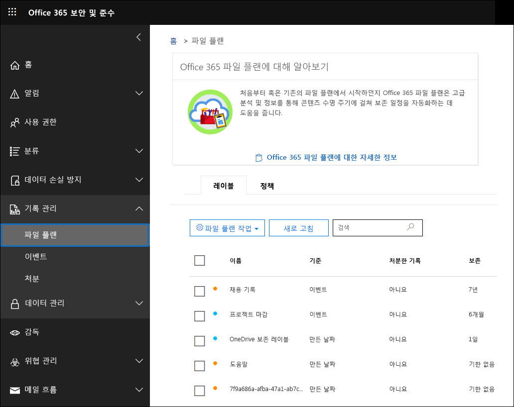
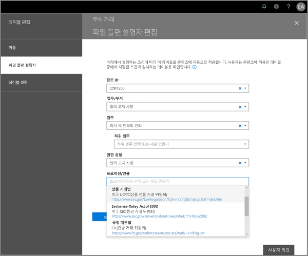
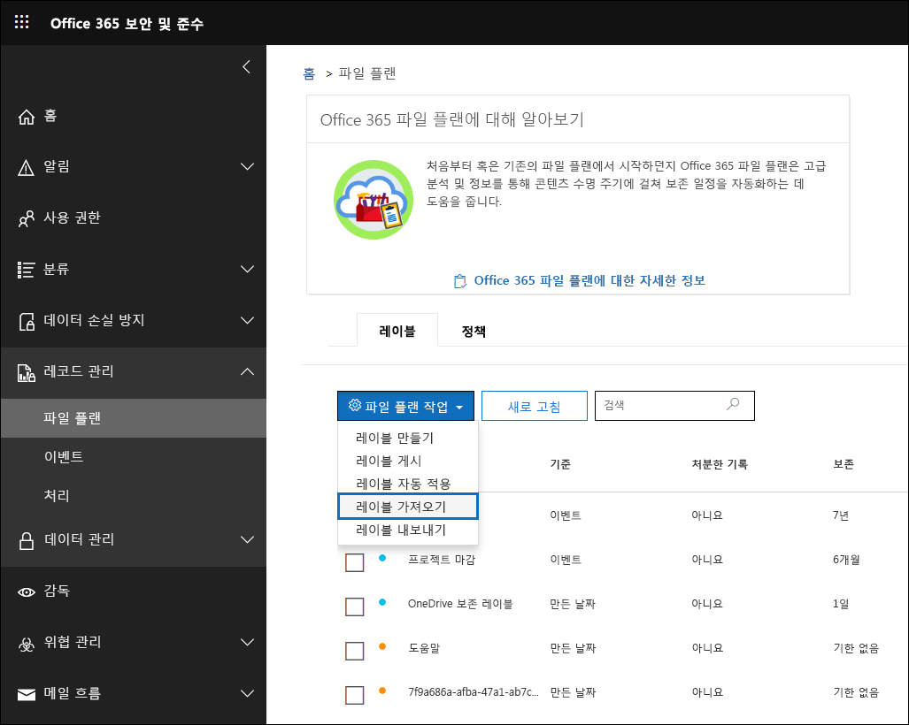
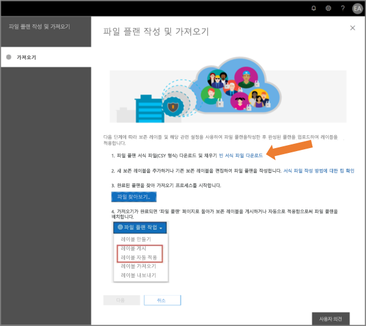
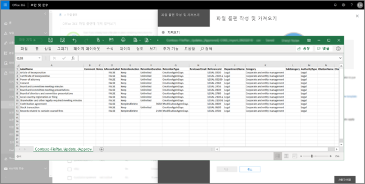
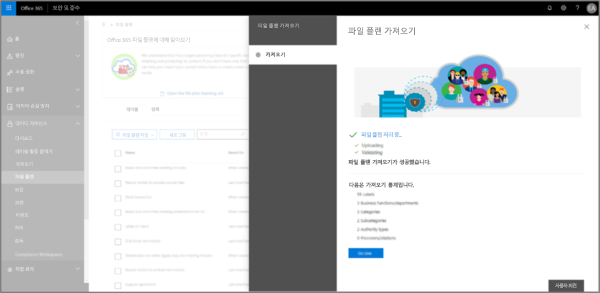
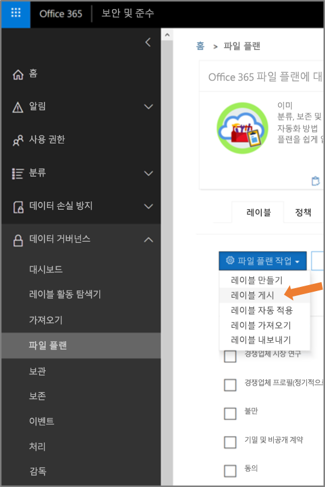

# 파일 계획 관리자 개요Overview of file plan manager

파일 계획 관리자는 보존 레이블 및 보존 레이블 정책에 대한 고급 관리 기능을 제공하고, 생성부터 공동 작업, 레코드 선언, 보존 및 최종 처리에 이르는 전체 콘텐츠 수명 주기 동안 레이블 및 레이블-콘텐츠 간 활동을 트래버스하는 통합 방법을 제공합니다.File plan manager provides advanced management capabilities for retention labels, retention label policies, and provides an integrated way to traverse label and label-to-content activity for your entire content lifecycle – from creation, through collaboration, record declaration, retention, and finally disposition. 

보안 및 준수 센터에서 파일 계획 관리자에 액세스하려면 **레코드 관리** > **파일 계획**으로 이동합니다.To access file plan manager in the security and compliance center, go to **Records management** > **File plan**.

## 파일 계획 관리자 액세스Accessing file plan manager

파일 계획 관리자에 액세스하려면 다음 두 가지 요구 사항이 충족되어야 합니다.There are two requirements to access file plan manager, they are:

- Office 365 Enterprise E5 구독An Office 365 Enterprise E5 subscription.

- 사용자에게 보안 및 준수 센터의 다음 역할 중 하나가 할당되어야 합니다.The user has been in assigned one of the following roles in the security and compliance center:
    
    - 보존 관리자Retention Manager
    
    - 보기 전용 보존 관리자View-only Retention Manager

## 기본 보존 레이블 및 레이블 정책Default retention labels and label policy

보안 및 규정 준수 센터에 보존 레이블이 없는 경우, 왼쪽 탐색에서 **파일 계획**을 처음 선택하면 **Default Data Governance Publishing Policy**라는 레이블 정책이 생성됩니다.If there are no retention labels in the Security & Compliance Center, the first time you choose **File plan** in the left nav, this creates a label policy called **Default Data Governance Publishing Policy**. 

이 레이블 정책에는 세 가지 보존 레이블이 있습니다.This label policy contains three retention labels:

- **운영 프로시저****Operational procedure**
- **비즈니스 일반****Business general**
- **계약****Contract agreement**

이 보존 레이블은 콘텐츠를 삭제하지 않고 보존하도록 구성됩니다.These retention labels are configured only to retain content, not delete content. 이 레이블 정책은 전체 조직에 게시되고 비활성화하거나 제거할 수 있습니다.This label policy will be published to the entire organization and can be disabled or removed. 

**보존 정책을 만들었습니다** 및 **보존 정책에 대한 보존 구성을 만들었습니다**와 같은 활동에 대한 감사 로그를 검토하여 파일 계획 관리자를 열고 첫 번째 실행 환경을 시작한 사용자를 판별할 수 있습니다.You can determine who opened file plan manager and kicked off the first-run experience by reviewing the audit log for the activities **Created retention policy** and **Created retention configuration for a retention policy**.

> [!NOTE]
> 고객 피드백으로 인해, 위에 언급된 기본 보존 레이블과 보존 레이블 정책을 만드는 이 기능을 제거했습니다.Due to customer feedback, we have removed this feature that creates the default retention labels and retention label policy mentioned above. 2019년 4월 11일 이전에 파일 계획 관리자를 연 경우에만 이러한 보존 레이블과 보존 레이블 정책을 볼 수 있습니다.You will only see these retention labels and retention label policy if you opened file plan manager before April 11, 2019.

## 파일 계획 탐색Navigating your file plan

파일 계획 관리자를 사용하면 하나의 보기에서 모든 보존 레이블 및 정책의 설정을 보다 쉽게 검토할 수 있습니다.File plan manager makes it easier see into and across the settings of all your retention labels and policies from one view.

파일 계획 외부에서 만들어진 보존 레이블도 파일 계획에서 사용할 수 있고 그 반대의 경우도 가능합니다.Note that retention labels created outside of the file plan will be available in the file plan and vice versa.

**파일 계획 레이블** 탭에서 다음과 같은 추가 정보 및 기능을 사용할 수 있습니다.On the file plan **Labels** tab, the following additional information and capabilities are available:

### 레이블 설정 열Label settings columns

- **기준**은 보존 기간을 시작할 트리거 유형을 식별합니다. 유효한 값은 다음과 같습니다.**Based on** identifies the type of trigger that will start the retention period. Valid values are:
    - 이벤트Event
    - 만든 날짜When created
    - 마지막으로 수정한 날짜When last modified
    - 레이블을 지정한 날짜When labeled
- **레코드**는 레이블이 적용될 때 항목이 선언된 레코드가 될지를 식별합니다. 유효한 값은 다음과 같습니다.**Record** identifies if the item will become a declared record when the label is applied. Valid values are:
    - 아니요No
    - 예Yes
    - 예(규정)Yes(Regulatory)
- **보존**은 보존 유형을 식별합니다. 유효한 값은 다음과 같습니다.**Retention** identifies the retention type. Valid values are:
    - 유지Keep
    - 유지 및 삭제Keep and delete
    - 삭제Delete
- **처리**는 보존 기간이 끝날 때 콘텐츠에 대해 수행할 작업을 식별합니다. 유효한 값은 다음과 같습니다.**Disposition** identifies what will happen to the content at the end of the retention period. Valid values are:
    - nullnull
    - 작업 없음No action
    - 자동 삭제Auto-delete
    - 검토 필요(즉, 처리 검토)Review required (aka Disposition review)

### 보존 레이블 파일 계획 설명자 열Retention label file plan descriptors columns

이제 보존 레이블 구성에 더 많은 정보를 포함할 수 있습니다.You can now include more information in the configuration of your retention labels. 보존 레이블에 파일 계획 설명자를 삽입하면 파일 계획의 관리 효율성과 구성이 개선됩니다.Inserting file plan descriptors into retention  labels will improve the manageability and organization of your file plan.

시작하기 위해 파일 계획 관리자에서는 직무/부서, 범주, 권한 유형 및 프로비저닝/인용에 대한 기본 제공 값을 제공합니다.To get you started, file plan manager provides some out-of-box values for: Function/department, Category, Authority type and Provision/citation. 보존 레이블을 만들거나 편집할 때 새 파일 계획 설명자 값을 추가할 수 있습니다.You can add new file plan descriptor values when creating or editing a retention label. 파일 계획에 보존 레이블을 가져올 때 파일 계획 설명자를 지정할 수도 있습니다.You can also specify file plan descriptors when importing retention labels into your file plan. 

보존 레이블을 만들거나 편집할 때의 파일 계획 설명자 단계 보기는 다음과 같습니다.Here's a view of the file plan descriptors step when creating or editing a retention label.

파일 계획 관리자의 **레이블** 탭에 표시되는 파일 계획 설명자 열 보기는 다음과 같습니다.Here's a view of the file plan descriptors columns on the **Labels** tab of file plan manager.

## 모든 기존 보존 레이블을 내보내어 오프라인 검토를 분석 및/또는 수행Export all existing retention labels to analyze and/or perform offline reviews

파일 계획 관리자에서 모든 보존 레이블의 세부 정보를 .csv 파일로 내보내 조직의 데이터 거버넌스 이해 관계자와 함께 정기적인 검토를 편리하게 수행할 수 있습니다.From file plan manager, you can export the details of all retention labels into a .csv file to assist you in facilitating periodic compliance reviews with data governance stakeholders in your organization.

모든 보존 레이블의 내보내려면 **파일 계획** 페이지, **파일 계획 작업** \> **레이블 내보내기**로 이동합니다.To export all retention labels: On the **File plan** page, **File plan actions** \> **Export labels**.

모든 기존 보존 레이블을 포함하는 \*.csv 파일이 열립니다.A \*.csv file containing all existing retention labels will open.

## 파일 계획에 보존 레이블 가져오기Import retention labels into your file plan

파일 계획 관리자에서 기존 보존 레이블을 수정할 수 있을 뿐만 아니라 새 보존 레이블을 대량으로 가져올 수 있습니다.In the File plan manager, you can bulk import new retention labels and modify existing retention labels.

새 보존 레이블을 가져오고 기존 보존 레이블을 수정하려면 다음을 수행합니다.To import new retention labels and modify existing retention labels: 

1. **파일 계획** 페이지에서 **파일 계획 작업** > **레이블 가져오기**로 이동합니다.On the **File plan** page, go to **File plan actions** > **Import labels**.

   

   

2. 새 보존 레이블을 가져오려면 빈 서식 파일을 다운로드합니다.Download a blank template to import new retention labels. 또는 조직에서 기존 보존 레이블을 내보낼 때 내보낸 .csv 파일로 시작할 수 있습니다.Alternatively, you can start with the .csv file that is exported when you export the existing retention labels in your organization.

   

3. 서식 파일 채우기Fill-out the template. 다음에서는 파일 계획 서식 파일의 각 속성에 대한 속성 및 유효한 값을 설명합니다.The following describes the properties and valid values for each property in the file plan template. 

   |**속성****Property**|**유형****Type**|**유효한 값****Valid values**|
   |:-----|:-----|:-----|
   |LabelNameLabelName|StringString|이 속성은 보존 레이블의 이름을 지정합니다.This property specifies the name of the retention label.|
   |CommentComment|StringString|관리자의 보존 레이블에 대한 설명을 추가하려면 이 속성을 사용합니다.Use this property to add a description about the retention label for admins. 이 설명은 보안 및 준수 센터에서 레이블을 관리하는 관리자에게만 나타납니다.This description appears only to admins who manage the label in the security and compliance center.|
   |NotesNotes|StringString|사용자의 보존 레이블에 대한 설명을 추가하려면 이 속성을 사용합니다.Use this property to add a description about the retention label for users. 이 설명은 Outlook, SharePoint 및 OneDrive와 같은 앱에서 사용자가 레이블을 가리킬 때 표시됩니다.This description appears when users hover over the label in apps like Outlook, SharePoint, and OneDrive. 이 속성을 비워 두면 레이블의 보존 설정을 설명하는 기본 설명이 표시됩니다.If you leave this property blank, a default description is displayed, which explains the label's retention settings. |
   |IsRecordLabelIsRecordLabel|StringString|이 속성은 레이블이 레코드 레이블인지 여부를 지정합니다.This property specifies whether the label is a record label. 레코드 레이블로 태그가 지정된 항목은 레코드로 선언됩니다.Items tagged with a record label are declared as records. 유효한 값은 다음과 같습니다.Valid values are: **TRUE**: 레이블이 레코드 레이블입니다.**TRUE**: The label is a record label. 레코드로 선언된 항목은 삭제할 수 없습니다.Note that items that are declared as a record can't be deleted.  **FALSE**: 레이블이 레코드 레이블이 아닙니다.**FALSE**: The label isn't a record label. 이 값은 기본값입니다.This is the default value.|
   |RetentionActionRetentionAction|StringString|이 속성은 RetentionDuration 속성에 지정된 값이 만료되는 경우 수행할 작업을 지정합니다.This property specifies what action to take after the value specified by the RetentionDuration property expires. 유효한 값은 다음과 같습니다.Valid values are: **Delete**: RetentionDuration 속성에 지정된 값보다 오래된 항목이 삭제됩니다.**Delete**: Items older than the value specified by the RetentionDuration property are deleted. **Keep**: RetentionDuration 속성에 지정된 기간 동안 항목을 보존하고, 해당 기간이 만료되면 아무 작업도 수행하지 않습니다.**Keep**: Retain items for the duration specified by the RetentionDuration property and then doing nothing when the duration period expires.  **KeepAndDelete**: RetentionDuration 속성에 지정된 기간 동안 항목을 보존하고, 해당 기간이 만료되면 항목을 삭제합니다.**KeepAndDelete**: Retain items for the duration specified by the RetentionDuration property and then delete them when the duration period expires.   |
   |RetentionDurationRetentionDuration|문자열String|이 속성은 콘텐츠를 보관할 일 수를 지정합니다.This property specifies the number of days to retain the content. 유효한 값은 다음과 같습니다.Valid values are: **Unlimited**: 항목이 무기한 보존됩니다.**Unlimited**: Items will be retained indefinitely.  ***n***: 양의 정수입니다(예: **365**).***n***: A positive integer; for example, **365**. 
   |RetentionTypeRetentionType|StringString|이 속성은 콘텐츠 작성 날짜, 이벤트 날짜, 레이블이(태그가) 지정된 날짜 또는 마지막으로 수정한 날짜에서 보존 기간을 계산하는지 여부를 지정합니다.This property specifies whether the retention duration is calculated from the content creation date, event date, labeled (tagged) date, or last modified date. 유효한 값은 다음과 같습니다.Valid values are: **CreationAgeInDays****CreationAgeInDays** **EventAgeInDays****EventAgeInDays** **TaggedAgeInDays****TaggedAgeInDays** **ModificationAgeInDays****ModificationAgeInDays** |
   |ReviewerEmailReviewerEmail|SmtpAddressSmtpAddress|이 속성을 채울 때 보존 기간이 만료되면 처리 검토가 트리거됩니다.When this property is populated, a disposition review will be triggered when the retention duration expires. 이 속성은 **Delete**와 **KeepAndDelete** 보존 작업에 대한 검토자의 전자 메일 주소를 지정합니다.This property specifies the email address of a reviewer for **Delete** and **KeepAndDelete** retention actions. 개별 사용자, 배포 또는 보안 그룹의 전자 메일 주소를 포함할 수 있습니다.You can include the email address of individual users, distribution, or security groups. 전자 메일 주소가 여러 개인 경우 각 주소를 세미콜론으로 구분하여 지정할 수 있습니다.You can specify multiple email addresses separated by semicolons.|
   |ReferenceIdReferenceId|StringString|이 속성은 **참조 ID** 파일 계획 설명자에 표시되는 값을 지정합니다.This property specifies the value that's displayed in the **Reference Id** file plan descriptor.| 
   |DepartmentNameDepartmentName|StringString|이 속성은 **기능/부서** 파일 계획 설명자에 표시되는 값을 지정합니다.This property specifies the value that's displayed in the **Function/department** file plan descriptor.|
   |CategoryCategory|StringString|이 속성은 **범주** 파일 계획 설명자에 표시되는 값을 지정합니다.This property specifies the value that's displayed in the **Category** file plan descriptor.|
   |SubCategorySubCategory|StringString|이 속성은 **하위 범주** 파일 계획 설명자에 표시되는 값을 지정합니다.This property specifies the value that's displayed in the **Sub category** file plan descriptor.|
   |AuthorityTypeAuthorityType|StringString|이 속성은 **기관 유형** 파일 계획 설명자에 표시되는 값을 지정합니다.This property specifies the value that's displayed in the **Authority type** file plan descriptor.|
   |CitationNameCitationName|StringString|이 속성은 **조항/인용** 파일 계획 설명자에 표시된 인용의 이름을 지정합니다(예: "Sarbanes-Oxley Act or 2002").This property specifies the name of the citation displayed in the **Provision/citation** file plan descriptor; for example "Sarbanes-Oxley Act or 2002". |
   |CitationUrlCitationUrl|StringString|이 속성은 **조항/인용** 파일 계획 설명자에 표시되는 URL을 지정합니다.This property specifies the URL that's displayed in the **Provision/citation** file plan descriptor.|
   |CitationJurisdictionCitationJurisdiction|StringString|이 속성은 **조항/인용** 파일 계획 설명자에 표시되는 관할지 또는 에이전시를 지정합니다(예: "미국 SEC(증권 거래 위원회").This property specifies the jurisdiction or agency that's displayed in the **Provision/citation** file plan descriptor; for example, "U.S. Securities and Exchange Commission (SEC)".|
   |RegulatoryRegulatory|StringString|공백으로 남겨 둡니다.Leave blank. 현재, 이 속성은 사용되지 않습니다.This property isn't used at this time.|
   |EventTypeEventType|문자열String|이 속성은 레이블과 연결된 보존 규칙을 지정합니다.This property specifies the retention rule that's associated with the label. 규칙을 고유하게 식별하는 모든 값을 사용할 수 있습니다.You can use any value that uniquely identifies the rule. 예:For example: **이름****Name** **DN(고유 이름)****Distinguished name (DN)** **GUID****GUID**  [Get-RetentionComplianceRule](https://docs.microsoft.com/powershell/module/exchange/policy-and-compliance-retention/get-retentioncompliancerule?view=exchange-ps) cmdlet를 사용하여 사용 가능한 보존 규칙을 볼 수 있습니다.You can use the [Get-RetentionComplianceRule](https://docs.microsoft.com/powershell/module/exchange/policy-and-compliance-retention/get-retentioncompliancerule?view=exchange-ps) cmdlet to view the available retention rules. 한 Office 365 조직에서 레이블을 내보낼 경우 레이블을 다른 Office 365 조직으로 가져올 때 해당 조직의 EventType 속성 값을 사용할 수 없습니다.Note that if you export labels from one Office 365 organization, you can't use the values for the EventType  property from that organization when importing labels to a different Office 365 organization. EventType 값은 조직마다 고유하기 때문입니다.That because the EventType values are unique to an organization. |
   |||

   다음은 보존 레이블에 대한 정보가 포함된 서식 파일의 예입니다.Here's an example the template containing the information about retention labels.

   

4. 파일 계획 가져오기 마법사 페이지의 3단계에서 **파일 찾아보기**를 클릭하여 데이터를 입력한 서식 파일을 업로드합니다.Under step 3 on the import file plan wizard page, click **Browse for files** to upload the filled-out template. 

   파일 계획 관리자에서 항목의 유효성을 검사하고 가져오기 통계를 표시합니다.File plan manager will validate the entries and display the import statistics.

   

   유효성 검사 오류가 발생하면 파일 계획 가져오기가 가져오기 파일로 돌아가서 해당 오류를 손쉽게 수정할 수 있도록 계속해서 가져오기 파일의 모든 항목에 대한 유효성 검사를 수행하고 가져오기 파일의 줄/행 번호를 참조하는 모든 오류를 표시하며, 표시된 오류 결과를 복사합니다.In the event there is a validation error, file plan import will continue to validate every entry in the import file and display all errors referencing line/row numbers in the import file, copy the displayed error results so that you can easily return to the import file and correct the errors.

5. 가져오기가 완료되면 파일 계획 관리자로 돌아가서 새 보존 레이블을 새 보존 레이블 및 기존 보존 레이블 정책과 연결합니다.When the import is complete, return to file plan manager to associate the new retention labels to new or existing retention label policies.

   
