# Microsoft 준수 관리자(기본)

> [!NOTE]
> 이 문서는 이 제품의 이전 버전을 설명합니다. 사용자는 이 버전의 준수 관리자를 사용하지 말고 대신 새로운 [Microsoft 준수 점수](compliance-score.md)를 사용하는 것이 좋습니다.

 *준수 관리자는 21Vianet, Office 365 Germany, Office 365 미국 GCC(Government Community High) 또는 Office 365 미국방부에서 운영하는 Office 365에서 사용할 수 없습니다.*
  
Microsoft [Service Trust Portal](https://docs.microsoft.com/microsoft-365/compliance/get-started-with-service-trust-portal)의 워크플로 기반 위험 평가 도구인 준수 관리자를 사용하여 Microsoft 전문가 서비스 및 Microsoft 클라우드 서비스(예: Microsoft Office 365, Microsoft Dynamics 365 및 Microsoft Azure)와 관련된 조직의 규정 준수 활동을 추적, 할당 및 확인할 수 있습니다. 

규정 준수 관리자:
  
- Microsoft에서 규정(예: HIPAA 및 EU 일반 데이터 보호 규정 또는 GDPR) 준수를 위해 내부적으로 컴파일하는 다양한 표준(예: ISO 27001, ISO 27018 및 NIST) 및 정보에 따라 Microsoft의 클라우드 서비스의 다양한 타사 감사의 일부로 감사자 및 규제 기관에 제공하는 자세한 정보를 이러한 표준 및 규제에 대한 조직의 준수 여부에 대한 자체 평가와 조합합니다.
    
- 조직이 팀 장벽을 넘어 규정 준수 목적을 달성하는 데 도움을 줄 수 있는 준수 및 평가 관련 활동을 할당, 추적 및 기록할 수 있도록 합니다.
    
- 준수 점수를 제공하여 진행 상황을 추적하고 감사 컨트롤의 우선 순위를 설정함으로써 조직의 위험 노출 상황을 줄입니다.
    
- 준수 활동과 관련된 증거 및 기타 아티팩트를 업로드하고 관리하기 위한 보안 리포지토리를 제공합니다.
    
- Microsoft 및 조직이 수행하는 준수 활동을 문서화한 서식 있는 자세한 Microsoft Excel 보고서를 생성하여 감사자, 규제 기관 및 기타 준수 관련자에게 제공할 수 있습니다.

이 규정 준수 관리자의 간략한 데모를 보려면 이 [규정 준수 관리자](https://www.youtube.com/watch?v=r1vs8NdSXKQ) 비디오를 확인하세요.

    
> [!IMPORTANT]
> Compliance Manager is a dashboard that provides a summary of your data protection and compliance stature and recommendations to improve data protection and compliance. The Customer Actions provided in Compliance Manager are recommendations; it is up to each organization to evaluate the effectiveness of these recommendations in their respective regulatory environment prior to implementation. Recommendations found in Compliance Manager should not be interpreted as a guarantee of compliance.

    
## 준수 관리자란?

Compliance Manager is a workflow-based risk assessment tool designed to help you manage regulatory compliance within the shared responsibility model of the cloud. Compliance Manager provides you with a dashboard view of standards and regulations and assessments that contain Microsoft's control implementation details and test results and customer control implementation guidance and tracking for your organization to enter. Compliance Manager provides certification assessment control definitions, guidance on implementation and testing of controls, risk-weighted scoring of controls, role-based access management, and an in-place control action assignment workflow to track control implementation, testing status and evidence management. Compliance Manager optimizes compliance workload by enabling customers to logically group assessments together and apply assessment control testing to identical or related controls, reducing the duplication of effort that might otherwise be required to satisfy identical control requirements across different certifications.

## 준수 관리자의 평가

The core component of Compliance Manager is called an *Assessment*. An Assessment is an assessment of a Microsoft service against a certification standard or data protection regulation (such as ISO 27001:2013, and the GDPR). Assessments help you to discern your organization's data protection and compliance posture against the selected industry standard for the selected Microsoft cloud service. Assessments are completed by the implementation of the controls that map to the certification standard being assessed. 
  
평가의 구조는 클라우드에서 보안 및 준수 위험을 평가하고 준수 표준, 데이터 보호 표준, 규정 또는 법률로 지정된 데이터 보호 수단을 구현하기 위해 Microsoft와 조직 간이 공유되는 책임을 기준으로 합니다.
  
평가는 다음과 같은 몇 가지 구성 요소로 이루어집니다.
  
- **범위 내 서비스** - 각 평가는 범위 내 클라우드 서비스 섹션에 나열되는 특정 Microsoft 서비스 집합에 적용 됩니다. 
    
- **Microsoft-Managed Controls** - For each cloud service, Microsoft implements and manages a set of  *controls*  as part of Microsoft's compliance with various standards and regulations. These controls are organized into  *control families*  that align with the structure from the corresponding certification or regulation that the Assessment is aligned to. For each Microsoft-managed control, Compliance Manager provides details about how Microsoft implemented the control, along with how and when that implementation was tested and validated by an independent third-party auditor. 
    
    Office 365 및 GDPR의 평가에 포함된 **보안** 컨트롤 패밀리의 3가지 Microsoft 관리 컨트롤 예제는 다음과 같습니다. 

    
  
  a. Specifies the following information from the certification or regulation that maps to the Microsoft-managed control.

  - **컨트롤 ID** - 컨트롤이 매핑되는 인증 또는 규정의 섹션 또는 문서 번호입니다.
    
  - **제목** - 해당 인증 또는 규정 의 제목입니다.
    
  - **문서 ID** - 이 필드는 해당 GDPR 문서 번호를 지정하므로 GDPR 평가의 경우에만 포함됩니다.
    
  - **설명** - 선택한 Microsoft 관리 컨트롤에 매핑되는 표준 또는 규정 텍스트입니다.

  b. The Compliance Score for the control, which indicates the level of risk (due to non-compliance or control failure) associated with each Microsoft-managed control. See [Understanding the Compliance Score](#understanding-the-compliance-score) for more information. Note that Compliance Scores are rated from 1 to 10 and are color-coded. Yellow indicates low risk controls, orange indicates medium-risk controls, and red indicated high-risk controls. 
    
  c. Information about the implementation status of a control, the date the control was tested, who performed the test, and the test result.
    
  d. For each control, you can click **More** to see additional information, including details about Microsoft's implementation of the control and details about how the control was tested and validated by an independent third-party auditor. 
    
- **Customer-Managed Controls** - This is the collection of controls that are managed by your organization. Your organization is responsible for implementing these controls as part of your compliance process for a given standard or regulation. Customer-managed controls are also organized into control families for the corresponding certification or regulation. Use the customer-managed controls to implement the recommended actions suggested by Microsoft as part of your compliance activities. Your organization can use the prescriptive guidance and recommended Customer Actions in each customer-managed control to manage the implementation and assessment process for that control.
    
    Customer-managed controls in Assessments also have built-in workflow management functionality that you can use to manage and track your organization's progress towards completing the Assessment. For example, a Compliance Officer in your organization can assign an Action Item to an IT admin who has the responsibility and necessary permissions to perform the actions that are recommended for the control. When that work is complete, the IT admin can upload evidence of their implementation tasks (for example, screenshots of configuration or policy settings) and then assign the Action Item back to the Compliance Officer to evaluate the collected evidence, test the implementation of the control, and record the implementation date and test results in Compliance Manager. For more information, see the [Managing the assessment process](#managing-the-assessment-process) section in the article. 
  
## 권한 및 역할 기반 액세스 제어

준수 관리자는 역할 기반 액세스 제어 사용 권한 모델을 사용합니다. 사용자 역할이 할당된 사용자만 준수 관리자에 액세스할 수 있으며, 각 사용자가 허용하는 작업은 역할 유형에 따라 제한됩니다.
  
더 이상 기본 **게스트 액세스** 역할이 없음을 참고하세요. 각 사용자에게는 준수 관리자로 액세스하고 작업을 하기 위해 역할이 할당되어야 합니다.
  
The following table describes each Compliance Manager permission and what it allows the user do. The table also indicates the role that each permission is assigned to.
  
||**준수 관리자 읽기 권한자**|**준수 관리자 참가자**|**준수 관리자 평가자**|**준수 관리자의 관리자**|**포털 관리자**|
|:-----|:-----|:-----|:-----|:-----|:-----|
|**데이터 읽기** - 사용자는 데이터를 읽을 수 있지만 편집할 수 없습니다.    |             |             |             |             |            |
|**데이터 편집** - 사용자는 테스트 결과 및 테스트 날짜 필드를 제외한 모든 필드를 편집할 수 있습니다.    ||            |             |             |             |
|**테스트 결과 편집** - 사용자는 테스트 결과 및 테스트 날짜 필드를 편집할 수 있습니다.    ||  |             |             |             |
|**평가 관리** - 사용자는 평가를 만들고 보관하고 삭제할 수 있습니다.    |||  |             |             |
|**Manage users** - Users can add other users in their organization to the Reader, Contributor, Assessor, and Administrator roles. Only those users with the Global Administrator role in your organization can add or remove users from the Portal Admin role.    ||||  |             |
   
## 준수 점수 이해하기

대시보드에서 준수 관리자는 타일의 오른쪽 위에 Office 365 평가의 총 점수를 표시합니다. 이는 평가 전반에 대한 총 준수 점수이며, 평가에서 지금까지 구현된 것으로 표시되고 테스트된 각 컨트롤 평가에 대해 받은 누적 점수입니다. 평가를 추가하는 경우 Microsoft에서 구현하고 독립적 제3자가 테스트한 Microsoft 관리 컨트롤에 대한 점수가 이미 적용되었기 때문에 규정 준수 점수가 이미 완료에 근접해 가고 있는 것을 보게될 것입니다.
  
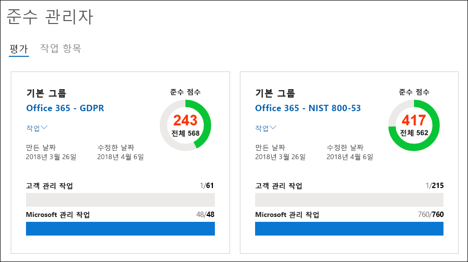
  
나머지 포인트는 성공적인 고객 평가, 고객 관리 컨트롤의 구현 및 테스트에서 가져오며, 고유한 각 값이 전체 준수 점수에 적용됩니다. 
  
각 평가에는 위험 기반 준수 점수가 표시되어 평가에서 Microsoft 관리 및 고객 관리 컨트롤을 포함한 각 컨트롤과 관련된 위험 수준(비준수 또는 컨트롤 오류로 인한 위험)을 평가하는 데 도움이 됩니다. 각 고객 관리 컨트롤에는 1부터 10까지의 가능한 점수(*심각도 순위라고 함)가 할당됩니다. 여기서 컨트롤이 실패할 경우 더 높은 위험 요인과 관련된 컨트롤에 대해 더 많은 점수가 부여되고, 더 낮은 위험 컨트롤에 대해 더 적은 점수가 부여됩니다. 
  
예를 들어, 아래에 표시된 사용자 액세스 관리 평가 컨트롤은 심각도 위험 순위가 매우 높으며 할당된 값 10을 표시합니다.
  
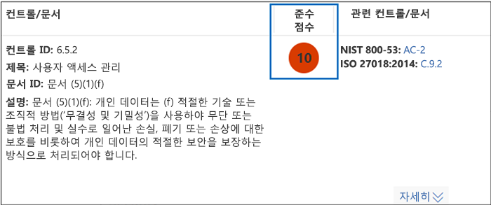
  
 비교해보면 아래에 표시된 정보 백업 평가 컨트롤은 심각도 위험 순위가 좀 더 낮으며 할당된 값 3을 표시합니다. 
  
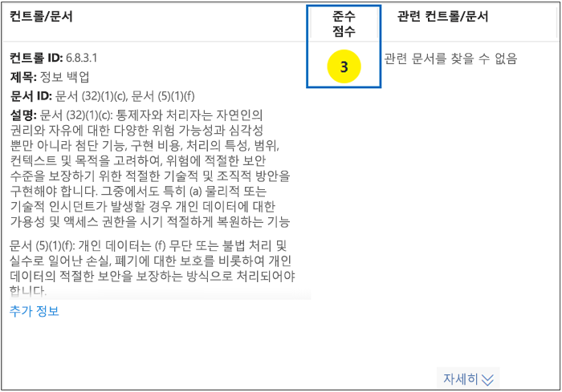
  
The Compliance Manager assigns a default severity ranking to each control. Risk rankings are calculated based on the following criteria:
  
- 컨트롤이 사고가 발생하는 것을 방지 (최고 순위) 하는지, 발생한 사고를 감지하는지 혹은 사고가 미치는 영향 (최저 순위)을 수정하는지의 여부. 심각도 순위와 관련하여 위협을 방지하는 필수적 컨트롤에는 가장 높은 점수가 할당되며, 필수인지 사용자 지정인지에 관계없이 감지 또는 수정 기능이 있는 컨트롤에는 가장 낮은 점수가 할당됩니다.
    
- (구현된) 컨트롤이 필수이므로 사용자가 우회할 수 없는지(예를 들어 사용자가 암호 다시 설정하고 암호 길이 및 문자 요구 사항을 충족해야 함) 또는 사용자 지정이 가능하므로 사용자가 우회할 수 있는지(예를 들어 컴퓨터가 무인 방식으로 작동될 때 사용자에게 화면을 잠그도록 요구하는 비즈니스 규칙)
    
- Controls related to risks to data confidentiality, integrity, and availability, whether these risks come from internal or external threats, and whether the threat is malicious or accidental. For example, controls that would help prevent an external attacker from breaching that network and gaining access to personally identifiable information would be assigned more points than a control related to preventing an employee from accidentally mis-configuring a network router setting that results in a network outage).
    
- 각 컨트롤에 대한 법률 및 외부 요인(예: 계약, 규정 및 공개 약정)
    
The displayed Compliance Score values for the control are applied  *in their entirety*  to the Total Compliance Score on a pass/fail basis--either the control is implemented and passes the subsequent assessment test or it does not; there is no partial credit for a partial implementation. Only when the control has its **Implementation Status** set to **Implemented** or **Alternative Implementation** and the **Test Result** is set to **Passed** are the assigned points added to the Total Compliance Score. 
  
무엇보다도 준수 점수는 컨트롤 관련 오류가 있는 경우 잠재적 위험이 더 높은 컨트롤을 표시하여 구현을 위해 집중할 컨트롤의 우선 순위를 지정하는 데 도움이 됩니다. 위험 기반 우선 순위 지정뿐 아니라 평가 컨트롤이 (동일한 평가 또는 동일한 평가 그룹화에 있는 다른 평가 내의) 다른 컨트롤과 연관되어 있어 하나의 컨트롤을 성공적으로 완료하면 컨트롤 테스트 결과의 동기화에 기반하여 상당한 수고를 줄일 수 있습니다.
  
예를 들어 아래 이미지에서 Office 365 - GDPR 평가는 현재 111개 컨트롤 평가 중 51개가 완료되어 46%가 평가된 상태이며, 준수 총점은 600점 만점 중에서 289점으로 나와 있습니다.
  

  
평가 내에서 GDPR 컨트롤 7.5.5는 5가지 다른 컨트롤(7.4.1, 7.4.3, 7.4.4, 7.4.8, 7.4.9)과 관련이 있으며, 각각 보통에서 높은 심각도 위험 등급 점수인 6 또는 8을 갖습니다. 평가 필터를 통해 이러한 컨트롤을 모두 선택하여 평가 보기에 표시했으며, 해당 컨트롤이 하나도 평가되지 않은 것을 아래에서 확인할 수 있습니다. 
  
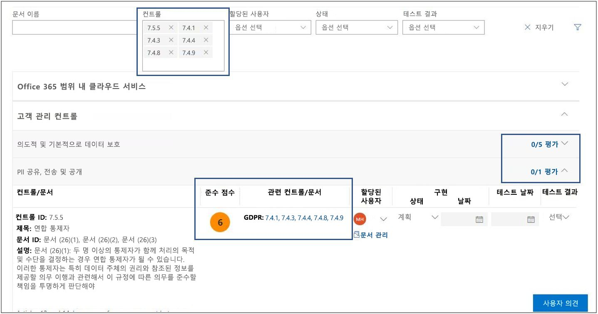 As those 6 controls are related, the completion of any one them will result in a synchronization of those test results across the related controls within this assessment (just as it will for any related controls in an assessment that is in the same assessment grouping). Upon completion of the implementation and testing of GDPR control 7.5.5, the control detail area refreshes to show that all 6 controls have been assessed, with a corresponding increase in the number of assessed controls to 57 and 51% assessed, and a change in total Compliance Score of +40. 
  

  
이 업데이트 확인 대화 상자는 관련 컨트롤의 구현 상태가 관련된 다른 컨트롤에 영향을 미치는 방식으로 변경되려고 할 때 표시됩니다.
  
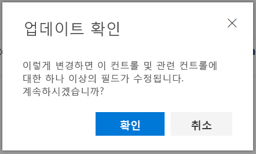
  
> [!NOTE]
> Currently, only Assessments for Office 365 cloud services include a Compliance Score. Assessments for Azure and Dynamics show an assessment status. 

## 준수 점수 방법론

Microsoft 보안 점수와 같은 준수 점수는 다른 동작 기반 점수 지정 시스템과 비슷합니다. 즉, 조직은 데이터 보호, 개인 정보 보호 및 보안 관련 활동을 수행하면 해당 활동의 준수 점수가 증가할 수 있습니다.
  
> [!NOTE]
> The Compliance Score does not express an absolute measure of organizational compliance with any particular standard or regulation. It expresses the extent to which you have adopted controls which can reduce the risks to personal data and individual privacy. No service can guarantee that you are compliant with a standard or regulation, and the Compliance Score should not be interpreted as a guarantee in any way. 
  
Assessments in Compliance Manager are based on the shared responsibility model for cloud computing. In the shared responsibility model, Microsoft and each customer share responsibility for the protection of the customer's data when that data is stored in our cloud.
  
아래의 Office 365 GDPR 평가에 표시된 대로 Microsoft 및 고객은 평가되는 표준 또는 규제의 요구 사항을 충족하도록 설계된 다양한 작업을 각각 수행할 책임이 있습니다. 요구 사항의 합리화 및 이해 다양한 표준 및 규정 전반에 걸친 작업에 대해, 준수 관리자는 제어 프레임워크인 것처럼 모든 표준 및 규정을 처리합니다. 따라서 각 평가에 대해 Microsoft 및 고객이 수행하는 작업은 다양한 컨트롤의 구현 및 유효성 검사를 수반합니다.
  

  
일반적인 작업에 대한 기본 워크플로는 다음과 같습니다.
  
1. The Compliance, Risk, Privacy, and/or Data Protection Officer of an organization assigns the task to someone in the organization to implement a control. That person could be:

    - 비즈니스 정책 소유자
    
    - IT 구현자
    
    - 태스크 수행 책임이 있는 조직의 다른 사람
    
2. That individual performs the tasks necessary to implement the control, uploads evidence of implementation into Compliance Manager, and marks the control(s) tied to the Action as implemented. Once these tasks are completed, they assign the Action to an Assessor for validation. Assessors can be:
    
    - 조직 내에서 컨트롤의 유효성 검사를 수행하는 내부 평가자
    
    - Microsoft의 클라우드 서비스를 감사하는 독립적인 제3자 조직과 같이 준수를 검사하고 확인하고 인증하는 외부 평가자
    
3. 평가자는 컨트롤의 유효성을 검사하고, 증거를 검사하고, 컨트롤을 평가됨으로 표시하고 평가 결과를 표시합니다(예: 통과).
    
평가와 연결된 모든 컨트롤이 평가디면 평가는 완료로 간주됩니다.
  
Every Assessment in Compliance Manager comes pre-loaded with information that provides details about the Actions taken by Microsoft to satisfy the requirements of the controls for which Microsoft is responsible. This information includes details about how Microsoft has implemented each control and how and when Microsoft's implementation was assessed and verified by a third-party auditor. For this reason, the Microsoft Managed Controls for each Assessment are marked as Assessed, and the Compliance Score for the Assessment reflects this.
  
Each Assessment includes a total Compliance Score based on the shared responsibility model. Microsoft's implementation and testing of controls for Office 365 contributes a portion of the total possible points associated with a GDPR assessment. As the customer implements and tests each of the customer Actions, the Compliance Score for the Assessment will increase by the value assigned to the control. 
  
 ### 위험 기반 점수 지정 방법론
  
Compliance Manager uses a risk-based scoring methodology with a scale from 1-10 that assigns a higher value to controls that represent a higher risk in the event the control fails or is non-compliant. The scoring system used by Compliance Score is based on several key factors, such as:
  
- 컨트롤의 필수성
    
- 위협 종류에 따른 컨트롤의 위험 수준
    
- 컨트롤의 외부 구동 요인
    

  
 ### 컨트롤의 필수성
  
컨트롤의 필수성은 컨트롤이 필수인지 또는 사용자 지정인지, 예방용인지, 감지용인지 또는 시정용인지를 기준으로 합니다.
  
 ### 필수 또는 사용자 지정
  
 *Mandatory controls*  are controls that cannot be bypassed either intentionally or accidentally. An example of a common mandatory control is a centrally-managed password policy that sets requirements for password length, complexity, and expiration. Users must comply with these requirements in order to access the system. 
  
 *Discretionary controls*  rely upon users to understand policy and act accordingly. For example, a policy requiring users to lock their computer when they leave it is a discretionary control because it relies on the user. 
  
 ### 예방용, 감지용 또는 시정용
  
 *Preventative controls*  are those that prevent specific risks. For example, protecting information at rest using encryption is a preventative control against attacks, breaches, etc. Separation of duties is a preventative control to manage conflict of interest and to guard against fraud. 
  
 *Detective controls*  are those that actively monitor systems to identify irregular conditions or behaviors that represent risk or that can be used to detect intrusions or determine if a breach has occurred. System access auditing and privileged administrative actions auditing are types of detective monitoring controls; regulatory compliance audits are a type of detective control used to find process issues. 
  
 *Corrective controls*  are those that try to keep the adverse effects of a security incident to a minimum, take corrective action to reduce the immediate effect, and reverse the damage, if possible. Privacy incident response is a corrective control to limit damage and restore systems to an operational state after a breach. 
  
이러한 요소를 통해 각 컨트롤을 평가하여 컨트롤의 필수성을 확인하고, 위험을 기준으로 컨트롤이 나타내는 상대적인 가치를 할당합니다.
  
 **위협**
  
||||
|:-----|:-----|:-----|
||**필수**   |**사용자 지정**   |
|**예방용**   |높은 위험    |중간 위험    |
|**감지용**   |중간 위험    |낮은 위험    |
|**시정용**   |중간 위험    |낮은 위험    |
   
위협은 데이터에 대한 CIA 3요소인 기밀성, 무결성 및 가용성으로 알려진 기본적이면서 보편적으로 허용되는 보안 표준을 위협하는 모든 것을 나타냅니다.
  
- 기밀성은 신뢰할 수 있는 권한 있는 사용자만 정보를 읽고 이해할 수 있음을 의미합니다.
    
- 무결성은 권한 없는 사용자가 정보를 수정하거나 삭제하지 않았음을 의미합니다.
    
- 사용성은 높은 수준의 서비스 품질을 사용하여 정보에 쉽게 액세스할 수 있음을 의미합니다.
    
A failure of any of these characteristics is considered a compromise of the system as a whole. Threats can come from both internal and external sources, and an actor's intent can be accidental or malicious. These factors are estimated in a threat matrix that assigns threat levels of either High, Moderate, or Low to each combination of scenarios.

||**내부** ||**외부**: ||||
|:-----|:-----|:-----|:-----|:-----|:-----|:-----|
||*악의적* |*우발적* |*악의적* |*우발적* |||
|**기밀성** |(H, M 또는 L)    |(H, M 또는 L)    |(H, M 또는 L)    |(H, M 또는 L)|
|**무결성** |(H, M 또는 L)    |(H, M 또는 L)    |(H, M 또는 L)    |(H, M 또는 L)|
|**가용성** |(H, M 또는 L)    |(H, M 또는 L)    |(H, M 또는 L)    |(H, M 또는 L)|
   
 **외부 요인**
  
|**계약**|**규정**|**공개 약정**|
|:-----|:-----|:-----|
|(H, M 또는 L)    |(H, M 또는 L)    |(H, M 또는 L)    |
   
해당 규정, 계약 및 공개 약정 등의 외부 요소는 데이터를 보호하고 데이터 위반을 방지하도록 디자인된 컨트롤에 영향을 미칠 수 있으며 이러한 각 요소에는 높음, 보통 또는 낮음의 위험 값이 할당됩니다.
  
CIA/위협 및 법적/외부 요인으로 표시되는 15가지의 가능한 위험 시나리오에서 이러한 높음, 보통 또는 낮음 위험 값의 예상 발생 횟수를 조합하여 위험 가중치를 부여합니다. 이러한 위험 가중치는 지정된 심각도 값에서 위험이 발생할 가능성 및 발생 횟수를 고려하며, 컨트롤의 심각도 순위를 계산할 때 고려됩니다.
  
해당 심각도 순위에 따라, 컨트롤에는 다음 위험 범주로 그룹화된 1(낮음)~10(높음) 사이의 준수 점수 값이 할당됩니다.
  
|**위험 수준**|**컨트롤 값**|
|:-----|:-----|
|낮음    |1-3    |
|보통    |6    |
|높음    |8    |
|심각    |10    |
   
조직은 준수 점수 값이 가장 높은 평가 컨트롤에 우선 순위를 부여하여 위험이 가장 높은 항목에 집중하며, 완료된 각 컨트롤 평가의 평가 준수 총점에 포인트를 추가하는 방식으로 더 높은 비율의 긍적적 피드백을 받습니다.
  
### 점수 지정 방법 요약
  
The Compliance Score is a core component of the way that Compliance Manager helps organizations understand and manage their compliance. The Compliance Score for an assessment is an expression of the company's compliance with a given standard or regulation as a number, where the higher the score (up to the maximum number of points allocated for the Assessment), the better the company's compliance posture. Understanding the compliance scoring methodology in which assessment controls are assigned risk severity values between 1- 10 (low to high), and how completed control assessments add to the total compliance score is crucial to organizations for prioritizing their actions.

## 평가 그룹화

새 평가를 만들면 평가를 할당할 그룹을 만들거나 기존 그룹에 평가를 할당하라는 메시지가 표시됩니다. 그룹을 사용하면 평가를 논리적으로 구성하고 동일하거나 관련된 고객 관리 컨트롤이 있는 평가 간에 일반 정보 및 워크플로 작업을 공유할 수 있습니다.
  
For example, you could group Assessments by year or teams, departments, or agencies within your organization or group them by year. Here are some examples of groups and the Assessments they might contain.
  
- GDPR 평가 — 2018
    
  - Office 365 + GDPR
    
  - Azure + GDPR
    
  - Dynamics + GDPR
    
- Azure 평가 — 2018
    
  - Azure + GDPR
    
  - Azure + ISO 27001:2013
    
  - Azure + ISO 27018:2014
    
- 데이터 보안 및 개인 정보 보호 평가
    
  - Office 365 + ISO 27001:2013
    
  - Office 365 + ISO 27018:2014
    
  - Azure + ISO 27001:2013
    
  - Azure + ISO 27018:2014
    
> [!TIP]
> 새 평가를 추가하기 전에 먼저 조직에 대한 그룹화 전략을 결정하는 것이 좋습니다. 
  
다음은 평가를 그룹화하기 위한 요구 사항입니다.
  
- 그룹 이름(*그룹 ID라고도 함)은 조직 내에서 고유해야 합니다. 
    
- Groups can contain Assessments for the same certification/regulation, but each group can only contain one Assessment for a specific cloud service/certification pair. For example, a group can't contain two Assessments for Office 365 and GDPR. Similarly, a group can contain multiple Assessments for the same cloud service as long as the corresponding certification/regulation for each one is different.
    
평가가 평가 그룹화에 추가된 후에는 그룹화를 변경할 수 없습니다. 평가 그룹의 이름을 바꿀 수 있으며, 이 경우 해당 그룹과 연관된 모든 평가에서 평가 그룹화 이름이 변경됩니다. 평가와 새 평가 그룹을 만들고 기존 평가에서 정보를 복사할 수 있으며, 이 경우 사실상 다른 평가 그룹에 해당 평가의 복제본이 생성됩니다. 평가를 보관하면 해당 평가와 평가 그룹 사이의 관계도 끊어집니다. 다른 관련 평가에 대한 추가 업데이트는 더 이상 보관된 평가에 반영되지 않습니다.
  
앞에서 설명한 대로 그룹 사용의 한 가지 주요 장점은 동일한 그룹에 있는 두 가지 다른 평가가 동일한 고객 관리 컨트롤을 공유하여 각 컨트롤에 대한 고객 작업이 동일한 경우 한 평가에서 작성한 구현 세부 정보, 테스트 정보 및 컨트롤 상태가 해당 그룹의 다른 모든 평가에서 동일한 컨트롤로 동기화된다는 것입니다. 즉, 평가가 동일한 컨트롤을 공유하고 해당 평가가 동일한 그룹에 있는 경우 한 평가에서만 컨트롤에 대한 평가 프로세스를 관리하면 됩니다. 해당 컨트롤의 결과는 다른 평가와 자동으로 동기화됩니다. 예를 들어, ISO 27001과 ISO 27018은 모두 암호 정책과 관련된 컨트롤을 가지고 있습니다. 하나의 평가에서 컨트롤의 테스트 상태가 "통과"로 설정된 경우 두 평가가 동일한 평가 그룹에 속해 있는 한 다른 평가에서 컨트롤이 업데이트됩니다( "통과"로 표시됨).
  
이러한 예로, 각각 공용 네트워크의 데이터 암호화와 관련이 있는 두 개의 관련 평가 컨트롤(Office 365 - GDPR 평가의 컨트롤 6.10.1.2 및 Office 365 - NIST 800-53 평가의 컨트롤 SC-13)을 고려해 보세요. 이는 기본 그룹의 두 가지 평가에 관련된 평가 컨트롤입니다. 처음에는 이러한 두 평가를 보여 주는 준수 관리자 대시보드에 이 내용이 표시된 대로 두 평가에서 모두 고객 컨트롤 평가가 완료되지 않았습니다.
  
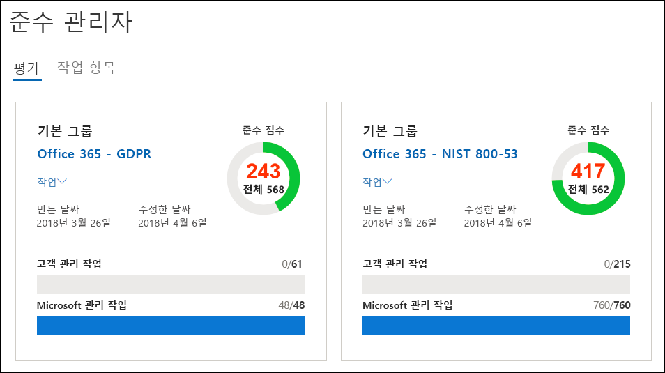
  
**Office 365 — GDPR** 평가를 클릭하고 필터 컨트롤을 사용하여 GDPR 컨트롤 6.10.1.2를 표시하면 NIST 800 53 컨트롤 SC-13이 관련된 컨트롤로 표시됩니다.
  

  
 여기서는 GDPR 컨트롤 6.10.1.2의 구현 및 테스트 완료가 표시됩니다. 
  
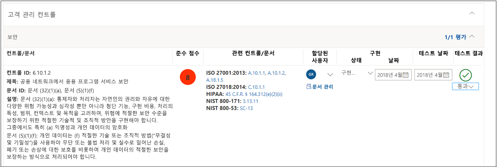
  
그룹화된 평가에서 관련 컨트롤로 이동하여 NIST 800 53 SC-13도 추가 구현 또는 테스트 작업 없이 같은 날짜 및 시간에 완료된 것으로 표시된 것을 볼 수 있습니다.
  

  
대시보드로 돌아가서 각 평가에서 1개의 컨트롤 평가가 완료되어 있고, 각 평가의 준수 총점이 8(각 공유 컨트롤의 준수 점수 값)씩 커진 것을 볼 수 있습니다.
  
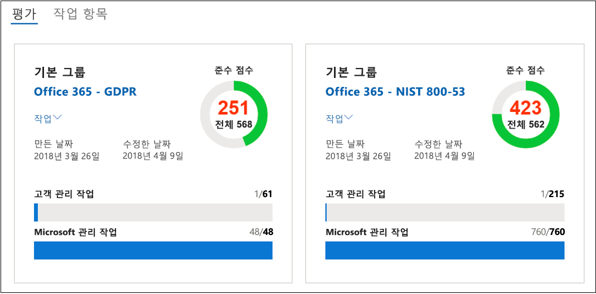

## 관리 기능

테넌트 관리자 계정만 사용할 수 있고, 전역 관리자로 로그인한 경우에만 볼 수 있는 특정 관리 함수가 있습니다.
  
> [!NOTE]
> The Access to Restricted Documents permission in the drop-down list will allow administrators to give users access to restricted documents that Microsoft shares on the Service Trust Portal. The Restricted Documents feature isn't available, but is coming soon. 
  
### 사용자에게 준수 관리자 역할 할당

Each Compliance Manager role has slightly different permissions. You can view the permissions assigned to each role, see which users are in which roles, and add or remove users from that role through the Service Trust Portal by selecting the **Admin** menu item, and then choosing **Settings**. 
  

  
준수 관리자 역할에서 사용자를 추가하거나 제거하려면
  
1. [https://servicetrust.microsoft.com](https://servicetrust.microsoft.com)으로 이동합니다.
    
2. Azure Active Directory 전역 관리자 계정으로 로그인합니다.
    
3. Service Trust Portal 위쪽 메뉴 모음에서 **관리자**를 선택한 후 **설정**을 선택합니다. 
    
4. **역할 선택** 드롭다운 목록에서 관리하려는 역할을 클릭합니다. 
    
5. 각 역할에 추가된 사용자는 **역할 선택** 페이지에 표시됩니다. 
    
6. To add users to this role, click **Add**. In the **Add Users** dialog, click the user field. You can scroll through the list of available users or begin typing the user name to filter the list based on your search term. Click the user to add that account to the **Add Users** list to be provisioned with that role. If you would like to add multiple users concurrently, begin typing a user name to filter the list, and then click the user to add to the list. Click **Save** to provision the selected role to these users. 
    
    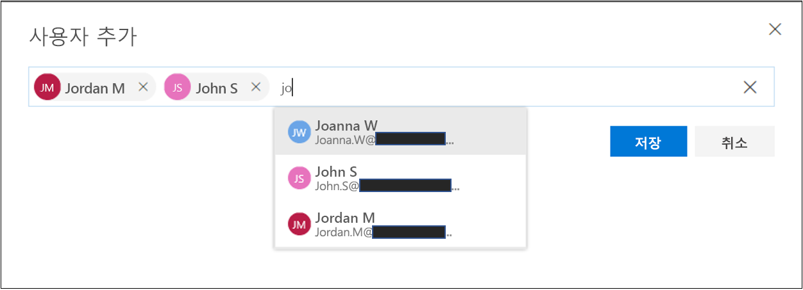
  
7. 이 역할에서 사용자를 제거하려면 사용자를 선택하고 **삭제**를 클릭합니다. 
    
    
 
## 사용자 개인 정보 설정

Certain regulations require that an organization must be able to delete user history data. To enable this, Compliance Manager provides the **User Privacy Settings** functions, that allow administrators to: 
  
- [사용자 검색](#search-for-a-user)

- [계정 데이터 기록의 보고서 내보내기](#export-a-report-of-account-data-history)

- [작업 항목 다시 할당](#reassign-action-items)

- [사용자 데이터 기록 삭제](#delete-user-data-history)
    

  
### 사용자 검색

사용자 계정을 검색하려면
  
1. 별칭(@ 기호 왼쪽에 있는 정보)을 입력하고 오른쪽의 도메인 접미사 목록을 클릭해 도메인 이름을 선택하여 사용자 전자 메일 주소를 입력합니다. 등록된 도메인이 여러 개인 테넌트인 경우 전자 메일 주소 도메인 이름 접미사를 다시 확인하여 올바른지 확인할 수 있습니다.
    
2. 사용자 이름을 올바르게 입력한 경우 **검색**을 클릭합니다. 
    
3. If the user account is not found, the error message 'User not found' will be displayed on the page. Check the user's email address information, make corrections as necessary and click **Search** to try again. 
    
4. 사용자 계정이 있으면 단추 텍스트가 **검색**에서 **지우기**로 바뀌어 반환된 사용자 계정이 아래 표시될 추가 기능에 대한 작동 상황이고, 이러한 기능을 실행하면 이 사용자 계정이 적용될 것임을 나타냅니다. 
    
5. 검색 결과를 지우고 다른 사용자를 검색하려면 **지우기**를 클릭합니다. 
    
### 계정 데이터 기록의 보고서 내보내기

사용자 계정이 식별된 후에는 이 계정에 연결된 존재하는 종속성의 보고서를 생성할 수 있습니다. 이 정보를 사용하여 미해결 작업 항목을 다시 할당하거나 이전에 업로드한 증거에 액세스할 수 있습니다. 
  
 보고서를 생성하고 내보내려면:
  
1. **내보내기**를 클릭하여 반환된 사용자 계정에 현재 할당된 준수 관리자 컨트롤 작업 항목 및 해당 사용자가 업로드한 문서 목록의 보고서를 생성하고 다운로드합니다. 할당된 작업이나 업로드된 문서가 없는 경우 “이 사용자에 대한 데이터 없음”이라는 오류 메시지가 표시됩니다. 
    
2. 보고서는 활성 브라우저 다운로드 창의 백그라운드에서 다운로드되므로, 다운로드 팝업이 표시되지 않으면 브라우저 다운로드 기록을 확인할 수 있습니다.
    
3. 문서를 열어 보고서 데이터를 검토합니다.
    
> [!NOTE]
> This is not a historical report that retains and displays state changes to action item assignment history. The generated report is a snapshot of the control action items assigned at the time that the report is run (date and time stamp written into the report). For instance, any subsequent reassignment of action items will result in different snapshot report data if this report is generated again for the same user. 
  
### 작업 항목 다시 할당

This function enables an organization to remove any active or outstanding dependencies on the user account by reassigning all action item ownership (which includes both active and completed action items) from the returned user account to a new user selected below. This action does not change document upload history for the returned user account. 
  
 다른 사용자에게 작업 항목을 다시 할당하려면
  
1. 입력 상자를 클릭하여 반환된 사용자의 작업 항목을 할당할 조직 내의 다른 사용자를 검색한 후 선택합니다.
    
2. **바꾸기**를 선택하여 반환된 사용자의 모든 컨트롤 작업 항목을 새로 선택한 사용자에게 다시 할당합니다. 
    
3. “현재 사용자의 모든 컨트롤 작업 항목이 선택한 사용자에게 다시 할당됩니다.  이 작업은 취소할 수 없습니다. 계속하시겠습니까?”라는 확인 대화 상자가 표시됩니다.
    
4. 계속하려면 **확인**을 클릭하고, 그렇지 않은 경우 **취소**를 클릭합니다. 
    
> [!NOTE]
> All action items (both active and completed) will be assigned to the newly selected user. However, this action does not affect the document upload history; any documents uploaded by the previously assigned user will still show the date/time and name of the previously assigned user. 
  
Changing the document upload history to remove the previously assigned user will have to be done as a manual process. In that case, the administrator will need to:
  
1. 이전에 다운로드한 내보내기 보고서를 엽니다.
  
2. 원하는 컨트롤 작업 항목을 확인한 후 해당 항목으로 이동합니다.
  
3. **문서 관리**를 클릭하여 해당 컨트롤에 대한 증거 리포지토리로 이동합니다. 
  
4. 문서를 다운로드합니다.
  
5. 증거 리포지토리에서 문서를 삭제합니다.
  
6. Re-upload the document. The document will now have a new upload date, time and Uploaded By username. 
  
### 사용자 데이터 기록 삭제

This sets control action items to 'unassigned' for all action items assigned to the returned user. This also sets uploaded by value to 'user removed' for any documents uploaded by the returned user
  
 사용자 계정 작업 항목 및 문서 업로드 기록을 삭제하려면
  
1. **삭제**를 클릭합니다. 

    A confirmation dialog will be displayed, stating "This will remove all control action item assignments and the document upload history for the selected user. This action cannot be undone. Are you sure you want to continue?"
    
3. 계속하려면 **확인**을 클릭하고, 그렇지 않은 경우 **취소**를 클릭합니다. 
  
## 준수 관리자 사용

준수 관리자는 준수 및 평가 관련 활동을 할당, 추적 및 기록하고, 조직이 팀 장벽을 넘어 규정 준수 목적을 달성하는 데 도움을 줄 수 있는 도구를 제공합니다.
  

## 준수 관리자 액세스

You access Compliance Manager from the Service Trust Portal. Anyone with a Microsoft account or Azure Active Directory organizational account can access Compliance Manager.
  

  
1. [https://servicetrust.microsoft.com](https://servicetrust.microsoft.com/)으로 이동합니다.
    
2. Azure AD(Azure Active Directory) 사용자 계정으로 로그인합니다.
    
3. Service Trust Portal에서 **준수 관리자**를 클릭합니다. 
    
4. When the Non-Disclosure Agreement is displayed, read it, and then click **Agree** to continue. You'll only have to do this once, and then the Compliance Manager dashboard is displayed. 

    시작하기 위해 기본적으로 다음과 같은 평가를 추가했습니다.
    
    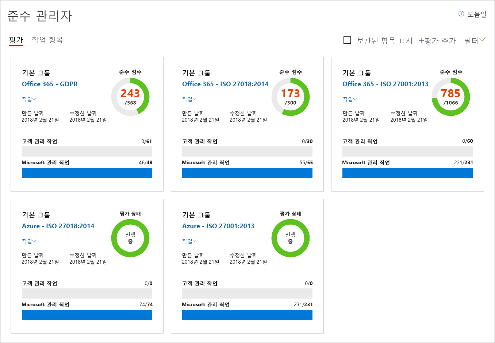
    
5.  **도움말**을 클릭하여 준수 관리자를 간단히 둘러봅니다. 
  
## 작업 항목 보기

준수 관리자를 통해 할당된 모든 컨트롤 평가 작업 항목을 편리하게 볼 수 있으며, 항목에 대한 작업을 빠르고 쉽게 수행할 수도 있습니다. 모든 작업 항목을 보거나, 평가와 연관된 탭을 클릭하여 특정 인증에 해당하는 작업 항목을 선택할 수 있습니다. 예를 들어 아래 그림에서는 GDPR 탭이 선택되었으며, GDPR 평가와 관련된 컨트롤이 표시됩니다.
  

  
작업 항목을 보려면
  
1. 준수 관리자 대시보드로 이동합니다.
    
2. **작업 항목** 링크를 클릭하면 사용자에게 할당된 작업 항목을 표시하도록 페이지가 새로 고쳐집니다. 
    
    By default, all action items are shown. If you have action items across multiple certifications, the names of the certifications will be listed in tabs across the top of the assessment control. To see the action items for a specific certification, click that tab.

## 평가 추가

준수 관리자에 평가를 추가하려면
  
1. 준수 관리자 대시보드에서  **평가 추가**를 클릭합니다. 
    
2. In the **Add an Assessment** window, you can create a new group to add the Assessment to or you can add it to an existing group (the built-in group is named "Initial Group".) Depending on the option you choose, either type the name of a new group or select an existing group from the drop-down list. For more information, see [Grouping Assessments](#grouping-assessments).
    
    그룹을 만드는 경우 기존 그룹의 정보를 새 평가로 복사할 수도 있습니다. 즉, 복사하려는 그룹의 평가에서 고객 관리 컨트롤의 구현 세부 정보와 테스트 계획 및 관리자 응답 필드에 추가된 모든 정보가 새 평가의 동일하거나 관련된 고객 관리 컨트롤에 복사됩니다. 기존 그룹에 새 평가를 추가하는 경우 해당 그룹의 평가에서 일반적인 정보가 새 평가에 복사됩니다. 자세한 내용은 [기존 평가에서 정보 복사](#copying-information-from-existing-assessments)를 참조하세요.
    
3. **다음**을 클릭하고 다음을 수행합니다.
    
    a. **제품 선택** 드롭다운 목록에서 준수를 평가할 Microsoft 클라우드 서비스를 선택합니다. 
    
    b. **인증서 선택** 드롭다운 목록에서 선택한 클라우드 서비스를 평가할 인증서를 선택합니다. 
    
4. **대시보드에 추가**를 클릭하여 평가를 만듭니다. 평가는 준수 관리자 대시보드에서 기존 타일 목록 맨 끝에 새 타일로 추가됩니다. 
    
    준수 관리자 대시보드의 **평가 타일**에는 평가 그룹, 평가의 이름(서비스 이름 및 선택된 인증의 조합으로 자동으로 생성됨), 만든 날짜 및 마지막으로 수정한 날짜, 준수 총점(구현, 테스트 및 통과한 모든 할당된 컨트롤 위험 값의 합계), 진행률 표시기가 표시되고, 평가된 컨트롤 수가 맨 아래쪽에 표시됩니다. 
    
5. 평가 이름을 클릭하여 열고 평가 세부 정보를 확인합니다.
    
6. **작업** 메뉴를 클릭하여 할당된 작업 항목을 보거나, 평가 그룹 이름을 바꾸거나, 평가 보고서를 내보내거나, 평가를 보관합니다. 
    
    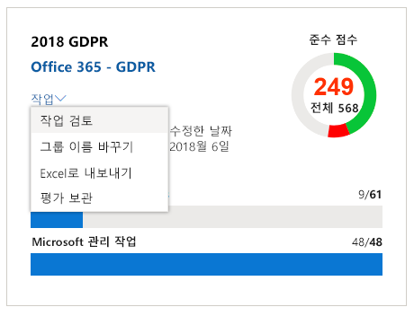

## 기존 평가의 정보 복사

앞에서 설명한 대로 평가 그룹을 만들 때 기존 그룹의 평가에서 새 그룹의 새 평가로 정보를 복사할 수 있습니다. 따라서 완료된 평가 및 테스트 작업을 새 평가의 동일한 고객 관리 컨트롤에 적용할 수 있습니다. 예를 들어, 조직에 모든 GDPR 관련 평가에 대한 그룹이 있는 경우 그룹에 새 평가를 추가할 때 기존 평가 작업에서 일반 정보를 복사할 수 있습니다.
  
고객의 다음 정보를 새 평가에 복사할 수 있습니다.
  
- Assessment Users. An Assessment user is a user who the control is assigned to.
    
- 상태, 테스트 날짜 및 테스트 결과
    
- 구현 세부 정보 및 테스트 계획 정보
    
마찬가지로 동일한 평가 그룹 내에서 공유된 고객 관리 컨트롤의 정보가 동기화됩니다. 또한 동일한 평가 내에서 관련된 고객 관리 컨트롤의 정보도 동기화됩니다.

## 평가 보기

1. 보려는 평가에 해당하는 평가 타일을 찾은 후 평가 이름을 클릭하여 열고 평가와 연결된 Microsoft 및 고객 관리 컨트롤을 보고, 평가의 범위 내 클라우드 서비스 목록도 확인할 수 있습니다. 다음은 Office 365 및 GDPR에 대한 평가 예제입니다.
    
    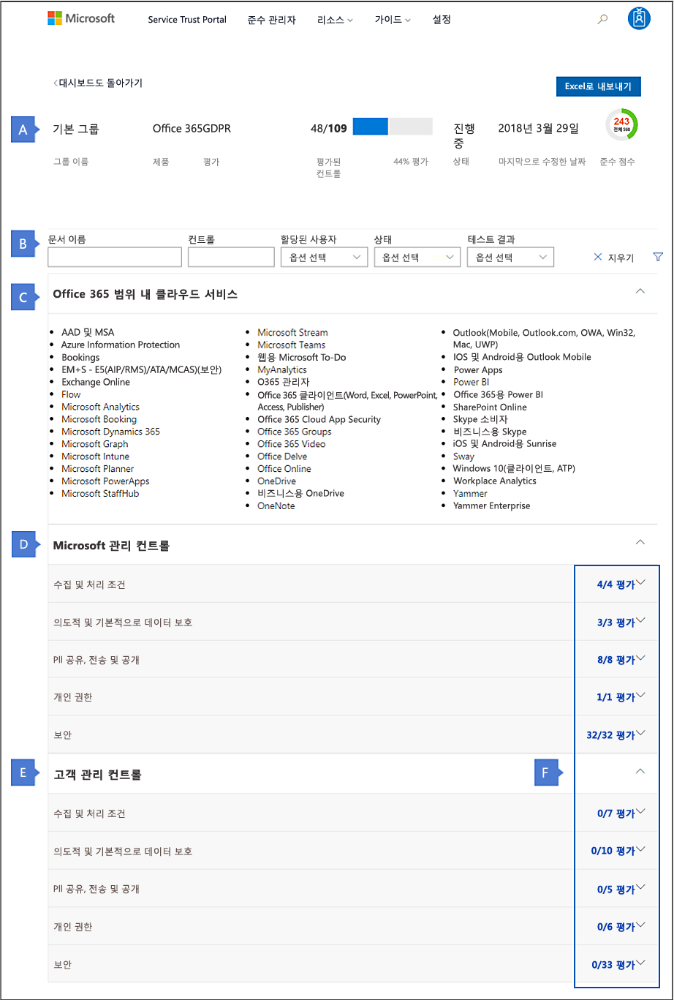
  
1. 이 섹션에는 평가 요약 정보를 평가 그룹, 제품, 평가 이름, 평가 컨트롤 수를 포함하는 평가 요약 정보가 표시됩니다.
    
2. This section shows the Assessment Filter controls. For a more detailed explanation of how to use the Assessment Filter controls see the [Managing the assessment process](#managing-the-assessment-process) section. 
    
3. 이 섹션에는 평가 범위 내에 있는 개별 클라우드 서비스가 표시됩니다.
    
4. 이 섹션에는 Microsoft 관리 컨트롤이 포함되어 있습니다. 관련 컨트롤은 컨트롤 제품군별로 구성됩니다. 컨트롤 제품군을 클릭하여 확장하고 개별 컨트롤을 표시합니다.
    
5. 이 섹션에는 고객 관리 컨트롤이 포함되어 있으며, 또한 컨트롤 제품군별로 구성됩니다. 컨트롤 제품군을 클릭하여 확장하고 개별 컨트롤을 표시합니다.
    
6. 컨트롤 제품군의 총 컨트롤 수와 해당 컨트롤 중 평가된 컨트롤 수를 표시합니다. 준수 관리자의 주요 기능은 고객 관리 컨트롤을 평가할 때 조직의 진행률을 추적하는 것입니다. 자세한 내용은 [준수 점수 이해](#understanding-the-compliance-score) 섹션을 참조하세요. 

## 평가 프로세스 관리

처음에는 평가의 작성자가 유일한 평가 사용자입니다. 각 고객 관리 컨트롤의 경우 작업 항목을 조직의 사용자에게 할당하여 해당 사용자가 권장 고객 작업을 수행하고 증거를 수집하여 업로드할 수 있는 평가 사용자가 되도록 할 수 있습니다. 작업 항목을 할당할 때 권장 고객 작업 및 작업 항목 우선 순위를 비롯한 세부 정보를 포함하는 전자 메일을 사용자에게 보내도록 선택할 수 있습니다. 전자 메일 알림에는 해당 사용자에게 할당된 모든 작업 항목을 나열하는 **작업 항목** 대시보드에 대한 링크가 포함됩니다. 
  
준수 관리자의 워크플로 기능을 사용하여 수행할 수 있는 작업의 목록은 다음과 같습니다.
  
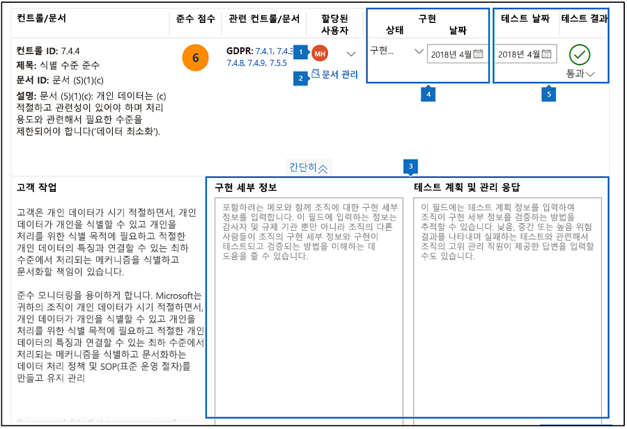
  
1. **필터 옵션을 사용하여 특정 평가 컨트롤 찾기** - 준수 관리자는 **필터 옵션**를 제공하여 평가 컨트롤을 표시하는 보다 세분화된 선택 조건을 제공함으로써 특정 영역에 대한 준수를 정확히 타기팅하는 데 도움을 줍니다. 
    
    페이지 오른쪽에 있는 깔때기형 아이콘을 클릭하여 **필터 옵션** 컨트롤을 표시하거나 숨길 수 있습니다. 이러한 컨트롤을 통해 필터 조건을 지정할 수 있으며, 해당 조건에 맞는 평가 컨트롤만 아래에 표시됩니다. 
  
    - **문서** - 문서 이름을 기준으로 필터링하고 해당 문서와 연관된 평가 컨트롤을 반환합니다. 예를 들어 “Article (5)”를 입력하면 Article (5)(1)(a), Article (5)(1)(b), Article (5)(1)(c) 등 이름에 해당 문자열이 포함된 문서의 선택 목록이 반환됩니다. Article (5)(1)(c)를 선택하면 Article (5)(1)(c)와 연관된 컨트롤이 반환됩니다. 여러 값이 있는 경우 OR 연산자를 사용하는 다중 선택 필드입니다. 예를 들어 Article (5)(1)(a)를 선택한 다음 Article (5)(1)(c)를 추가하면 Article (5)(1)(a) 또는 Article (5)(1)(c)와 연관된 컨트롤이 필터에서 반환됩니다. 
    
      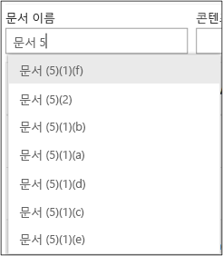
  
    - **컨트롤** - 이름이 필터에 맞는 컨트롤 목록을 반환합니다. 즉, 7.3을 입력하면 7.3.1, 7.3.4, 7.3.5 등과 같은 항목의 선택 목록이 반환됩니다. 이것은 여러 값에 OR 연산자를 사용하는 다중 선택 필드입니다. 예를 들어, 7.3.1을 선택한 후 7.3.4를 선택하면 필터는 7.3.1 또는 7.3.4와 연결된 컨트롤을 반환합니다. 
    
      
  
    - **할당된 사용자** - 선택한 사용자에게 할당된 컨트롤의 목록을 반환합니다. 
    
    - **상태** - 선택된 상태를 갖는 컨트롤 목록을 반환합니다. 
    
    - **테스트 결과** - 선택된 테스트 결과를 갖는 컨트롤 목록을 반환합니다. 
    
    As you apply filter conditions, the view of applicable controls will change to correspond to your filter conditions. Expand the control family sections to show the control details below. 
    
    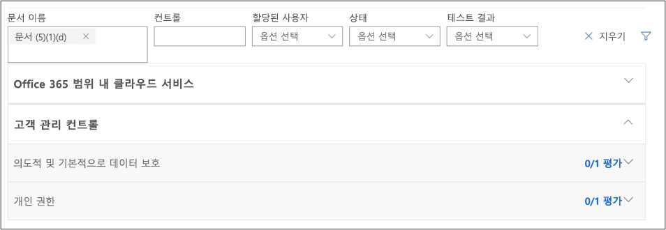
  
2. If after selecting the desired filters no results are shown, that means there are no controls that correspond to the specified filter conditions. For instance, if you select a particular **Assigned User** and then choose a **Control** name that does correspond to the control assigned to that user, no assessments will be shown in the page below. 
    
3. **Assign an Action Item to a user** - You can assign an Action Item to a person to implement the requirements of a certification/regulation, or to test, verify, and document your organization's implementation requirements. When you assign an Action Item, you can choose to send an email to the person that contains details including the recommended Customer Actions and the Action Item priority. You can also unassign or reassign an Action Item to a different person. 
    
4. **문서 관리**고객 관리 컨트롤에는 구현 작업 수행과 테스트 및 유효성 검사 작업 수행과 관련된 문서를 관리할 수 있는 위치도 있습니다. 준수 관리자에서 데이터를 편집할 수 있는 권한이 있는 모든 사용자는 **문서 관리**를 클릭하여 문서를 업로드할 수 있습니다. 문서가 업로드된 후 **문서 관리**를 클릭하여 파일을 보고 다운로드할 수 있습니다. 
    
5. **구현 및 테스트 세부 정보 제공** - 모든 고객 관리 컨트롤에는 사용자가 해당 조직이 인증/규정 요구 사항을 충족하고 조직이 이러한 요구 사항을 충족시키는 방법이 유효한지 검사하고 문서화하기 위해 수행한 단계를 문서화하는 구현 세부 정보를 추가할 수 있는 편집 가능한 필드가 있습니다.
    
6. **Set Status** - Set the Status for each item as part of the assessment process. Available status values are **Implemented**, **Alternative Implementation**, **Planned**, and **Not in Scope**. 
    
7. **테스트 날짜 및 테스트 결과 입력** - 준수 관리자의 평가자 역할이 있는 사용자는 적절한 테스트가 수행되었는지 확인하고 구현 세부 정보, 테스트 계획, 테스트 결과 및 업로드된 모든 증거를 검토한 다음 테스트 날짜 및 테스트 결과를 설정할 수 있습니다. 사용 가능한 테스트 결과 값은 **통과**, **실패 위험 낮음**, **실패 위험 보통** 및 **실패 위험 높음**입니다. 

## 작업 항목 관리

조직에서 평가 프로세스에 관련된 사용자는 준수 관리자를 사용하여 관련이 있는 모든 평가에서 고객 관리 컨트롤을 검토할 수 있습니다. 사용자가 준수 관리자에 로그인하여 **작업 항목** 대시보드를 열면 할당된 작업 항목 목록이 표시됩니다. 사용자에게 할당된 준수 관리자 역할에 따라 구현 또는 테스트 세부 정보를 제공하거나, 상태를 업데이트하거나, 작업 항목을 할당할 수 있습니다. 
  
As certification controls are generally implemented by one person and tested by another, the control action item can be initially assigned to one person for implementation, and once that is complete, that person can reassign the control action item to the next person for control testing and uploading of evidence. This assignment/reassignment of control actions can be performed by any users who have a Compliance Manager role with sufficient permissions, allowing for central management of control assignments, or decentralized routing of control action items, from implementer to tester as appropriate.
  
작업 항목을 할당하려면
  
1. 준수 관리자 대시보드에서 사용하려는 평가의 평가 타일을 찾은 후 평가 이름을 클릭하여 평가 세부 정보 페이지로 이동합니다.
    
2. **필터**를 클릭하고 필터 컨트롤을 사용하여 할당하려는 특정 평가 컨트롤을 찾을 수 있습니다. 또는 
    
3. 아래의 고객 관리 컨트롤 섹션으로 스크롤하고, 컨트롤 패밀리를 확장한 후 할당할 평가 컨트롤을 찾을 때까지 컨트롤 목록을 따라 스크롤합니다.
    
4. **할당된 사용자** 열 아래에서 **할당**을 클릭합니다. 
    
5. In the Assign Action Item dialog box, click the **Assign To** field to populate the list of users to whom the action can be assigned. You can scroll through the list to find the target user or start typing in the field to search for the username. 
    
6. 이 작업 항목을 할당할 사용자를 클릭합니다.
    
7. 알림 정보를 포함하는 전자 메일 알림을 사용자에게 보내려면 **전자 메일 알림 보내기** 확인란을 선택합니다. 
    
8. 해당 사용자에게 표시할 메모를 입력하고 **할당**을 클릭합니다. 
 
    사용자는 각 작업 항목 할당 및 메모가 포함된 알림을 받게 됩니다.
    
The notes that are associated with the action item are persisted in the notes section, available for the next time the action item is assigned. These notes are not read-only, can be edited, replaced or removed by the person assigning the action item.

## 평가의 정보 내보내기

평가를 Excel 파일로 내보내 조직의 준수 관련자가 검토하고 감사자 및 규제 기관에 제공하도록 할 수 있습니다. 이 평가 보고서는 보고서가 생성된 날짜 및 시간 기준의 평가 스냅숏이며, 컨트롤 구현 상태, 컨트롤 테스트 날짜 및 테스트 결과 등 해당 평가의 Microsoft 관리 컨트롤과 고객 관리 컨트롤 둘 다의 세부 정보를 포함하고 업로드된 증거 문서에 대한 링크를 제공합니다. 보관된 평가에는 업로드된 문서에 대한 링크가 유지되지 않으므로 평가를 보관하기 전에 평가 보고서를 내보내는 것이 좋습니다.
  
평가 보고서를 내보내려면
  
- 준수 관리자 대시보드에서 내보내려는 평가 타일에 있는 **작업**을 클릭한 후 **Excel로 내보내기**를 선택합니다.

  또는
    
- 평가 세부 정보 페이지를 보고 있는 경우 페이지 오른쪽 위 모서리에서 평가 준수 점수 위에 있는 **Excel로 내보내기** 단추를 클릭합니다.
    
The assessment report will be downloaded in your browser session. If you don't see a popup informing you of this, you may wish to check your browser's downloads folder.

## 평가 보관

When you have completed an Assessment and no longer need it for compliance purposes, you can archive it. When an Assessment is archived, it is removed from Assessments dashboard.
  
> [!NOTE]
> When an Assessment is Archived, it cannot be 'unarchived' or restored to a read-write in progress state. Please note that Archived Assessments do not retain their links to uploaded evidence documents, so it is highly recommended that you perform an Export of the Assessment before archiving it, as the exported assessment report will contain links to the evidence documents, enabling you to continue to access them. 
  
평가를 보관하려면
  
1. 원하는 평가의 대시보드 타일에서 **작업**을 클릭합니다. 
    
2. **평가 보관**을 선택합니다. 
 
    평가를 보관할 것인지 확인하는 **평가 보관** 대화 상자가 표시됩니다.
    
4. 보관을 계속하려면 **보관** 또는 **취소**를 클릭합니다. 
    
보관된 평가를 보려면
  
1. 준수 관리자 대시보드에서 **보관된 평가 표시** 확인란을 선택합니다. 
    
    보관된 평가가 **보관된 평가** 표시줄 아래에서 나머지 활성 평가 아래에 새로 표시되는 섹션에 표시됩니다.
    
3. 보려는 평가의 이름을 클릭합니다.
    
보관된 평가를 볼 때 일반적으로 편집 가능한 컨트롤(즉, 구현, 테스트 결과)는 전혀 활성화되지 않으며 **관리되는 문서** 단추는 없습니다.

## 검색 사용

  
Click the magnifying glass in the upper right-hand corner of the page by to expand the Search input field, enter your search terms and press Enter. The Search control will appear, with the search term in the search pane input field, and search results will appear beneath.
  
By default, Search returns Document results, and you can use the Filter By dropdown lists to refine the list of documents displayed, to add or remove search results from view. You can use multiple filter attributes at the same time to narrow the returned documents to specific cloud services, categories of compliance or security practices, regions of the world, or industries. Click the document name link to download the document.
  
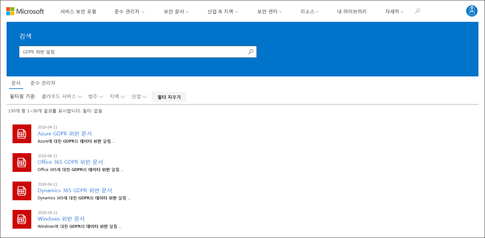
  
준수 관리자 평가 컨트롤에 대한 검색 결과를 표시하려면 준수 관리자 링크를 클릭합니다. 나열된 검색 결과에는 평가가 작성된 날짜, 평가 그룹화 이름, 적용 가능한 클라우드 서비스 및 Microsoft에서 컨트롤을 관리하는지 또는 고객이 컨트롤을 관리하는지가 표시됩니다.
  

  
> [!NOTE]
> Service Trust Portal 보고서 및 문서는 새 버전이 게시되고 12개월 동안 또는 새 버전의 문서가 사용 가능해질 때까지 다운로드할 수 있습니다. 
 
## 지역화 지원

Service Trust Portal enables you to view the page content in different languages. To change the page language, simply click on the globe icon in the lower left corner of the page and select the language of your choice. 
  
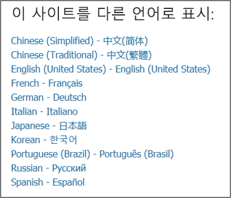

## 고객 관리 컨트롤에 대한 변경 로그

준수 관리자는 클라우드 서비스의 변경 내용뿐 아니라 규정 요구 사항의 변경 내용에 맞춰 정기적으로 업데이트되도록 설계되었습니다. 이러한 업데이트에는 고객 관리 컨트롤의 변경 내용이 포함됩니다. 추가 또는 변경되는 콘텐츠의 세부 정보와 변경이 기존 평가에 미치는 영향에 대한 지침을 포함하여 이러한 변경의 영향 이해를 돕기 위해 변경 로그가 제공됩니다. 일반적으로 두 가지 유형의 변경이 있습니다.
  
- A **Major** change is a significant change to a Customer Action, such as the addition or removal of a control or specific numbered steps, or a change in the guidance around responsibilities, recommendations, or evidence. For Major changes, we recommend that you re-evaluate your implementation and/or assessment of the affected control.
    
- A **Minor** change is an insignificant change to a Customer Actions, such as fixing a typo or formatting issues, or updating or correcting hyperlinks. Minor changes generally do not require the control to be re-evaluated; however, we do recommend that you review the updated Customer Action.
  
### 고객 관리 컨트롤 - 2018년 7월 변경 로그

|**컨트롤 ID**|**평가**|**변경 유형**|**변경 설명**|**고객을 위한 권장 작업**|
|:-----|:-----|:-----|:-----|:-----|:-----|:-----|:-----|:-----|
|45 C.F.R. § 164.308(a)(7)(ii)(A)  |Office 365: HIPAA|중요|Office 365에 대한 HIPAA 평가에 HITECH 컨트롤이 추가되었습니다. |추가된 컨트롤 및 권장되는 고객 작업 검토  |
|45 C.F.R.  164.312(a)(6)(ii)|Office 365: HIPAA|중요|Office 365에 대한 HIPAA 평가에 HITECH 컨트롤이 추가되었습니다.|추가된 컨트롤 및 권장되는 고객 작업 검토 |
45 C.F.R. § 164.312(c)(1)| Office 365: HIPAA|중요| Office 365에 대한 HIPAA 평가에 HITECH 컨트롤이 추가되었습니다. |추가된 컨트롤 및 권장되는 고객 작업 검토  |
45 C.F.R.  § 164.316(b)(2)(iii)| Office 365: HIPAA|중요|Office 365에 대한 HIPAA 평가에 HITECH 컨트롤이 추가되었습니다.|추가된 컨트롤 및 권장되는 고객 작업 검토 |
|

### 고객 관리 컨트롤 - 2018년 4월 변경 로그

|**GDPR**|**HIPAA**|**ISO 27001**|**ISO 27018**|**NIST 800-53**|**NIST 800-171**|**변경 유형**|**변경 설명**|**고객을 위한 권장 작업**|
|:-----|:-----|:-----|:-----|:-----|:-----|:-----|:-----|:-----|
|6.13.2    |||C.16.1.1    |||중요    |이전에는 6.12.1.1로 번호가 매겨졌습니다.    권장 사항에 세부 정보가 추가되었습니다.    |컨트롤 다시 평가: 고객 작업의 업데이트된 지침을 검토하고 컨트롤 구현 및 평가에 대해 권장되는 단계를 따릅니다.    |
||||||3.1.6    |중요    |감사를 사용하도록 설정하고 감사 로그를 검색하는 단계를 비롯한 단계가 지침에 추가되었습니다.    |고객 작업의 업데이트된 권장 사항을 검토합니다.    |
|6.8.2    |||A.10.2    |||중요    |이전에는 6.7.2.9로 번호가 매겨졌습니다.    추가 권장 사항 및 작업 항목으로 지침이 업데이트되었습니다.    |컨트롤 다시 평가: 고객 작업의 업데이트된 지침을 검토하고 컨트롤 구현 및 평가에 대해 권장되는 단계를 따릅니다.    |
|6.6.4    |45 C.F.R. § 164.312(a)(2)(i)              45 C.F.R. § 164.312(d)    |A.9.4.2    ||IA-2    |3.5.1    |중요    |이전에는 6.5.2.3으로 번호가 매겨졌습니다.    추가 권장 사항 및 작업 항목으로 지침이 업데이트되었습니다.    |컨트롤 다시 평가: 고객 작업의 업데이트된 지침을 검토하고 컨트롤 구현 및 평가에 대해 권장되는 단계를 따릅니다.    |
|6.13.1    |45 C.F.R. § 164.308(a)(1)(i)    |A.16.1    |C.16.1    |IR-4(a)    |3.6.1    |중요    |이전에는 6.12.1로 번호가 매겨졌습니다.    추가 권장 사항 및 작업 항목으로 지침이 업데이트되었습니다.    |컨트롤 다시 평가: 고객 작업의 업데이트된 지침을 검토하고 컨트롤 구현 및 평가에 대해 권장되는 단계를 따릅니다.    |
|6.7    ||||||중요    |이전에는 6.6.1.1으로 번호가 매겨졌습니다.    추가 권장 사항 및 작업 항목으로 지침이 업데이트되었습니다.    |컨트롤 다시 평가: 고객 작업의 업데이트된 지침을 검토하고 컨트롤 구현 및 평가에 대해 권장되는 단계를 따릅니다.    |
|6.6.5    |||A.10.8    |IA-3    |3.5.2    |중요    |이전에는 6.5.4.2로 번호가 매겨졌습니다.    추가 권장 사항 및 작업 항목으로 지침이 업데이트되었습니다.    |컨트롤 다시 평가: 고객 작업의 업데이트된 지침을 검토하고 컨트롤 구현 및 평가에 대해 권장되는 단계를 따릅니다.    |
|6.15.1    ||||||중요    |이전에는 6.14.1.3으로 번호가 매겨졌습니다.    추가 권장 사항 및 작업 항목으로 지침이 업데이트되었습니다.    |컨트롤 다시 평가: 고객 작업의 업데이트된 지침을 검토하고 컨트롤 구현 및 평가에 대해 권장되는 단계를 따릅니다.    |
|||||AC-2(h)(2)    ||사소    |감사 사용 블레이드에 대한 링크가 추가되었습니다.    |필요한 작업은 없습니다.    |
|||||AC-2(7)(b)    ||사소    |감사 사용 블레이드에 대한 링크가 추가되었습니다.    |필요한 작업은 없습니다.    |
|||||AC-2(h)(1)    ||사소    |감사 사용 블레이드에 대한 링크가 추가되었습니다.    |필요한 작업은 없습니다.    |
||45 C.F.R. § 164.308(a)(5)(ii)(C)    |||AC-2(g)    ||사소    |감사 사용 블레이드에 대한 링크가 추가되었습니다.    |필요한 작업은 없습니다.    |
|||||AC-2(12)    ||사소    |감사 사용 블레이드에 대한 링크가 추가되었습니다.    |필요한 작업은 없습니다.    |
||45 C.F.R. § 164.312(b)    |A.12.4.3    ||AU-2(d)    ||사소    |감사 사용 블레이드에 대한 링크가 추가되었습니다.    |필요한 작업은 없습니다.    |
|||||AC-2(4)    ||사소    |감사 사용 블레이드에 대한 링크가 추가되었습니다.    |필요한 작업은 없습니다.    |
||||||3.1.7    |사소    |감사 사용 블레이드에 대한 링크가 추가되었습니다.    |필요한 작업은 없습니다.    |
|||A.16.1.7    |C.12.4.2, 2부    |||사소    |감사 사용 블레이드에 대한 링크가 추가되었습니다.    |필요한 작업은 없습니다.    |
|||||AC-2(h)(3)    ||사소    |감사 사용 블레이드에 대한 링크가 추가되었습니다.    |필요한 작업은 없습니다.    |
|||A.12.4.2    ||||사소    |감사 사용 블레이드에 대한 링크가 추가되었습니다.    |필요한 작업은 없습니다.    |
|||A.7.2.8    ||||사소    |콘텐츠 검색 블레이드 및 DSR 포털에 대한 링크가 추가되었습니다.    |필요한 작업은 없습니다.    |
||45 C.F.R. § 164.308(a)(3)(ii)(C)    |||||사소    |감사 사용 블레이드 및 Office 365 관리자 역할 지원 항목에 대한 링크가 추가되었습니다.    |필요한 작업은 없습니다.    |
|5.2.1    ||||||사소    |이전에는 5.2.2로 번호가 매겨졌습니다.    지침 내에서 책임 고객이 명확히 언급되었습니다.    |고객 작업의 업데이트된 권장 사항을 검토합니다.    |
|6.11.1    |45 C.F.R. § 164.312(e)(2)(ii)    |A.10.1.1          A.10.1.2          A.18.1.5    |C.10.1.1    |SC-13    |3.13.11    |사소    |이전에는 6.10.1.2로 번호가 매겨졌습니다.    철자가 수정되었습니다.    |필요한 작업은 없습니다.    |
|7.5.1    ||||||사소    |이전에는 A.7.4.1로 번호가 매겨졌습니다.    철자가 수정되었습니다.    |필요한 작업은 없습니다.    |
|||A.8.2.3    |||3.1.3    |사소    |불필요한 문장이 제거되었습니다.    |필요한 작업은 없습니다.    |
||45 C.F.R. § 164.308(a)(4)(i)    |A.6.1.2    ||AC-5(a)    |3.1.2          3.1.4    |사소    |추가 권장 사항 및 작업 항목으로 지침이 업데이트되었습니다.    |고객 작업의 업데이트된 권장 사항을 검토합니다.    |
||45 C.F.R. § 164.308(a)(7)(ii)(E)    |||RA-2(a)    ||사소    |FWLink를 사용하도록 가져오기 서비스 도움말 항목 링크가 업데이트되었습니다.    |필요한 작업은 없습니다.    |
|

### GDPR 평가 컨트롤 ID 변경 참조 - 2018년 2월에 대한 변경 로그 

|**이전 컨트롤 ID(2017년 11월 미리 보기)**|**새 컨트롤 ID(2018년 2월 GA 릴리스)**|
|:-----|:-----|
|5.2.2    |5.2.1    |
|5.2.3    |5.2.2    |
|5.2.4    |5.2.3    |
|6.1.1.1    |6.2    |
|6.10.1.2    |6.11.1    |
|6.10.2.5    |6.11.2    |
|6.11.1.2    |6.12    |
|6.12.1    |6.13.1    |
|6.12.1.1    |6.13.2    |
|6.12.1.5    |6.13.3    |
|6.14.1.3    |6.15.1    |
|6.14.2.1    |6.15.2    |
|6.14.2.3    |6.15.3    |
|6.2.1.1    |6.3    |
|6.3.2.2    |6.4    |
|6.4.3.1    |6.5.2    |
|6.4.3.2    |6.8.1    |
|6.4.3.3    |6.5.3    |
|6.5.2    |6.6.1    |
|6.5.2.1    |6.6.2    |
|6.5.2.2    |6.6.3    |
|6.5.2.3    |6.6.4    |
|6.5.4.2    |6.6.5    |
|6.6.1.1    |6.7      |
|6.7.2.7    |6.8.1    |
|6.7.2.9    |6.8.2    |
|6.8.1.4    |6.9.1    |
|6.8.4.1    |6.9.3    |
|6.8.4.2    |6.9.4    |
|6.9.2.1    |6.10.1   |
|6.9.2.3    |6.10.2   |
|A.7.1.1    |7.2.1    |
|A.7.1.2    |7.2.2    |
|A.7.1.3    |7.2.3    |
|A.7.1.4    |7.2.4    |
|A.7.1.5    |7.2.5    |
|A.7.1.6    |7.2.6    |
|A.7.1.7    |7.2.7    |
|A.7.2.1    |7.3.1    |
|A.7.2.10   |7.3.9    |
|A.7.2.11   |7.3.10   |
|A.7.2.2    |7.3.2    |
|A.7.2.3    |7.3.3    |
|A.7.2.4    |7.3.4    |
|A.7.2.5    |7.3.5    |
|A.7.2.6    |7.3.6    |
|A.7.2.7    |7.3.7    |
|A.7.2.8    |7.3.8    |
|A.7.3.1    |7.4.1    |
|A.7.3.10   |7.4.10   |
|A.7.3.2    |7.4.2    |
|A.7.3.3    |7.4.3    |
|A.7.3.4    |7.4.4    |
|A.7.3.5    |7.4.5    |
|A.7.3.6    |7.4.6    |
|A.7.3.7    |7.4.7    |
|A.7.3.8    |7.4.8    |
|A.7.3.9    |7.4.9    |
|A.7.4.1    |7.5.1    |
|A.7.4.2    |7.5.2    |
|A.7.4.3    |7.5.3    |
|A.7.4.4    |7.5.4    |
|A.7.4.5    |7.5.5    |
|B.8.1.1    |8.2.1    |
|B.8.1.2    |8.2.2    |
|B.8.1.3    |8.2.3    |
|B.8.1.4    |8.2.4    |
|B.8.1.5    |8.2.5    |
|B.8.1.6    |8.2.6    |
|B.8.2.1    |8.3.1    |
|B.8.3.1    |8.4.1    |
|B.8.3.2    |8.4.2    |
|B.8.3.3    |8.4.3    |
|B.8.4.1    |8.5.1    |
|B.8.4.2    |8.5.2    |
|B.8.4.3    |8.5.4    |
|B.8.4.4    |8.5.5    |
|B.8.4.5    |8.5.3    |
|B.8.4.6    |8.5.6    |
|B.8.4.7    |8.5.7    |
|B.8.4.8    |8.5.8    |
|
   
## 참고 항목

- [준수 관리자 대화형 가이드](https://content.cloudguides.com/guides/Compliance%20Manager)

- [준수 관리자 일반 공급 발표](https://techcommunity.microsoft.com/t5/Security-Privacy-and-Compliance/Announcing-Compliance-Manager-general-availability/ba-p/161922)

- [Microsoft 365에서 GDPR에 도움이 되는 정보 보호 전략 제공](https://blogs.office.com/2018/02/22/microsoft-365-provides-an-information-protection-strategy-to-help-with-the-gdpr)
