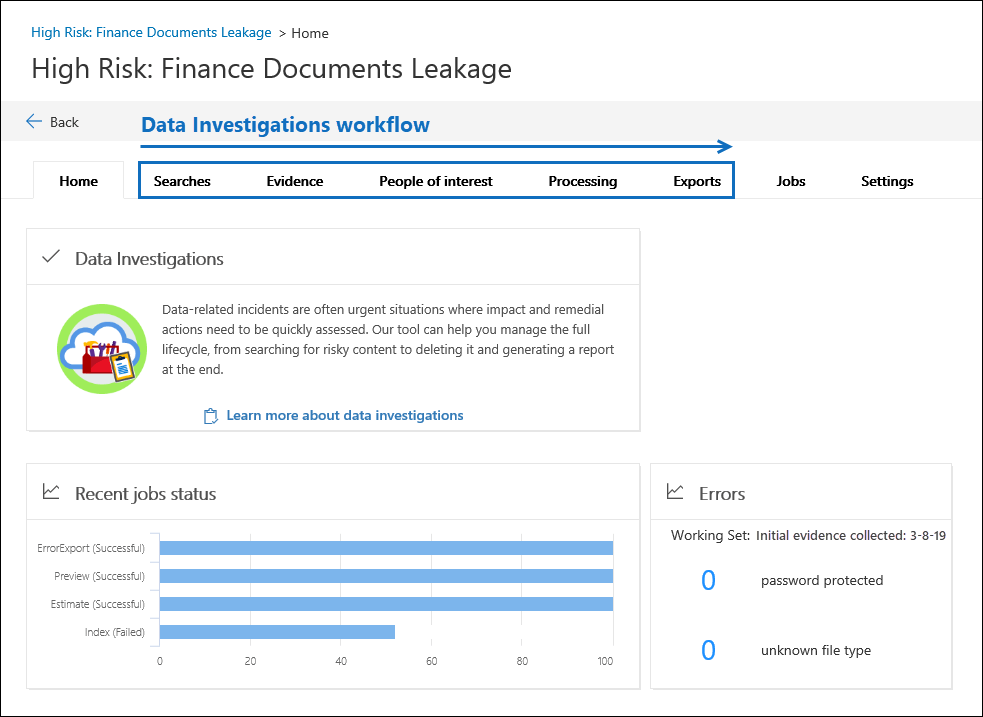

# Microsoft 365의 데이터 조사 개요 (미리 보기)

데이터 분산은 기밀, 중요 또는 악성 콘텐츠가 포함 된 문서가 신뢰할 수 없는 환경으로 릴리스될 때 발생 합니다. 데이터 분산을 검색 하는 경우 환경을 빠르게 포함 하 고, 유출의 크기와 위치를 평가 하 고, 해당 사용자의 활동을 조사 하 고, 서비스에서 분산 된 데이터를 삭제 하는 것이 중요 합니다. 새 데이터 조사 (미리 보기) 도구를 사용 하 여 Office 365에서 중요, 악성 또는 잘못 된 데이터를 검색 하 고, 발생 한 상황을 조사 하 고, 적절 한 작업을 수행 하 여 유출를 수정할 수 있습니다.  

이 문서에서는 새 데이터 조사 (미리 보기) 도구에서 제공 하는 기능을 사용 하 여 데이터 유출 시나리오를 처리 하는 방법을 설명 합니다.

## 권한

데이터 조사에 액세스 하 고이를 수행 하려면 Data investigator 역할 그룹의 구성원 이어야 합니다. 자세한 내용은 [데이터 조사에 대 한 사용 권한 할당](data-investigations-permissions.md)을 참조 하세요.

## 데이터 조사 (미리 보기) 워크플로 

다음 섹션에서는 데이터 조사 (미리 보기)에서 기본 제공 워크플로의 각 단계에 대해 설명 합니다. 다음 스크린샷은 *높은 위험 (금융 문서 누출*) 이라는 조사에 대 한 **홈** 탭을 보여 줍니다. 

## 중요, 악성 또는 잘못 배치 되는 데이터 검색

**검색 탭을** 사용 하 여 검색을 만들어 수정 하려는 데이터에 대 한 Microsoft 365을 찾습니다. 쿼리 기반 검색을 만들고 실행 하 여 분산 된 데이터가 포함 될 수 있는 전자 메일 메시지 및 문서를 식별 한 다음 검토 하 고 분석할 증거로 수집할 수 있습니다. 또한 검색 도구를 사용 하 여 예제 문서를 미리 보고, 검색 결과를 구체화 하 고 개선 하는 데 도움이 되는 검색 통계를 볼 수 있습니다. 조사에 관련 된 모든 데이터가 검색 결과에 포함 되어 있는 것으로 확인 되 면 추가 검토, 영향 평가 및 필요에 따라 수정 작업을 수행 하 여 검색 결과를 증거 집합에 추가 합니다. 자세한 내용은 [조사에서 데이터 검색](search-for-data.md)을 참조 하십시오.

## 증거 검토 및 조사

**증명 정보** 탭을 사용 하 여 live service에서 수집한 데이터 (이 경우 Office 365)를 조사 합니다. 증명 정보 집합의 데이터는 수집한 검색 결과의 스냅숏입니다. 검색 결과를 증거로 추가 하면 파일이, 메타 데이터 및 텍스트를 추출 하기 위해 프로세스가 트리거됩니다. 이 프로세스가 완료 되 면 데이터 조사 도구는 모든 데이터의 새 인덱스를 작성 하 고이를 증거 집합에 추가 합니다. 모든 시간에 민감한 조사에서는 격리 된 환경에서 수집한 증거를 조사 하면서 라이브 서비스의 원래 콘텐츠 위치에 있는 데이터를 삭제 하 여 환경을 빠르게 포함할 수 있습니다. 증거를 수집한 후 쿼리를 더 실행 하 여 시간 범위, 파일 형식, 데이터 소유자 및 기타 조건 유형에 따라 데이터의 범위를 좁힐 수 있습니다. 예를 들어 작성자, 보낸 사람 및 받는 사람 조건을 사용 하 여 데이터 분산에 포함 된 사용자를 빠르게 식별 하 고, 분산 된 데이터를 조직 외부의 사용자와 공유할 수 있습니다.

수집한 증거에 대해 고급 분석을 실행할 수도 있습니다. 이를 통해 일반적인 테마를 제공 하 고 전자 메일 스레드, 정확한 중복 및 거의 중복을 통해 증거를 구성 하 여 조사를 용이 하 게 할 수 있습니다. 추출 된 텍스트 보기 또는 네이티브 파일 형식으로 된 문서를 검토 하 고 조사 결과에 태그를 지정할 수 있습니다. 자세한 내용은 다음을 참조하세요.

  - [증거 데이터 검토](review-data-in-evidence.md)

  - [신속한 조사를 위한 분석 실행](run-analytics-to-investigate-faster.md)

## 관심 있는 사용자 관리

관심 있는 **사람** 탭을 사용 하 여 증명 정보를 조사 하는 동안 관심 있는 사람으로 식별 한 사용자를 추가 하 고 관리 합니다. 관심 있는 사용자를 추가 하면 사서함, OneDrive 계정 등의 데이터 원본이 식별 되 고 매핑됩니다. 그런 다음 해당 사용자의 콘텐츠 위치만 검색 하 여 검색 범위를 지정할 수 있습니다. 이 도구는 원하는 사용자가 범위를 지정 하는 경우 이미지 또는 지원 되지 않는 파일 형식 등의 인덱싱되지 않은 데이터를 reprocesses 하므로 검색이 보다 효율적이 고 정확 합니다. 관심 있는 **사용자** 탭에서 조사에 도움이 되는 사용자에 대 한 감사 로그 작업을 보고 검색할 수도 있습니다. 조사 전체에서 더 관심 있는 사용자를 추가할 수 있습니다. 자세한 내용은 [관심 있는 사용자 관리에서 조사](manage-people-of-interest.md)를 참조 하세요.

## 관심 있는 사용자의 데이터 인덱싱

조사에 관심이 있는 사람을 추가 하면 해당 사용자의 데이터 원본에서 부분적으로 인덱싱된 모든 항목의 인덱스가 다시 됩니다. 이 프로세스를 *고급 인덱싱*이라고 합니다. 고급 인덱싱 검색을 실행 하 여 조사를 위해 데이터를 수집 하는 경우이 데이터를 완벽 하 게 검색할 수 있도록 이미지, 지원 되지 않는 파일 형식 등의 데이터를 reprocesses. **처리** 탭을 사용 하 여 고급 인덱싱 상태를 모니터링 하 고 *오류 수정 관리*라는 프로세스를 사용 하 여 발생할 수 있는 처리 오류를 수정 합니다. 자세한 내용은 확인 [을 위해 데이터를 처리할 때 오류 수정을](error-remediation.md)참조 하십시오.

## 데이터 내보내기

데이터를 내보내려면 **내보내기 탭을 사용 하 여 작업** 을 관리 하 고 증거 집합에서 데이터를 다운로드 합니다. 증거를 내보낼 때 데이터는 Azure 저장 위치로 업로드 된 후 로컬 컴퓨터로 다운로드할 수 있습니다. **내보내기** 탭에서는 내보낸 데이터를 다운로드 하는 데 필요한 Azure 저장소 위치 URL 및 저장소 평가 키를 가져올 수 있습니다. 자세한 내용은 [조사에서 데이터 내보내기를](export-data.md)참조 하십시오.

## 작업 관리

**작업** 탭을 사용 하 여 조사와 관련 된 작업에 대 한 장기 실행 프로세스를 모니터링 합니다. 여기에는 검색을 실행 하 고, 증거 집합에 데이터를 추가 하 고, 데이터를 다시 인덱스 하거나, 증거를 내보내는 작업이 포함 됩니다. 예를 들어 검색 탭에서 많은 데이터 원본을 포함 하 **는 검색을** 만들 수 있습니다. 이 검색 프로세스의 상태는 **작업** 탭에 표시 됩니다. 자세한 내용은 [데이터 조사에서 작업 관리](manage-jobs.md)를 참조 하세요.

## 조사 설정 구성

**설정** 탭을 사용 하 여 조사 수준 설정을 구성 합니다. 여기에는 조사에 구성원 추가, 조사 닫기 또는 삭제, 검색 및 분석 동작 구성 등이 포함 됩니다.
