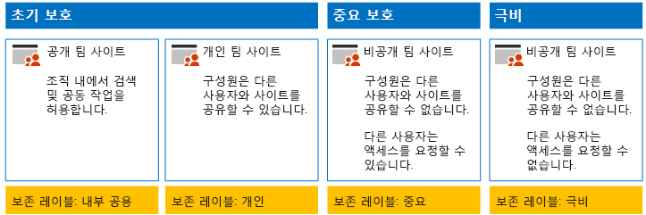
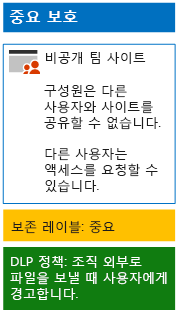
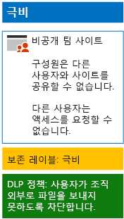

# 보존 레이블 및 DLP를 사용하여 SharePoint Online 파일 보호

이 문서의 단계를 사용하여 초기, 중요 및 극비 SharePoint Online 팀 사이트에 대한 레이블 및 DLP 정책을 디자인하고 배포합니다. 이러한 3계층 보호에 대한 자세한 내용은 [SharePoint Online 사이트 및 파일 보호](../security/office-365-security/secure-sharepoint-online-sites-and-files.md)를 참조하세요.
  
## 작동 방식

1. 원하는 보존 레이블을 만들고 게시합니다. 게시하는데 최대 12시간이 걸릴 수 있습니다.
2. 원하는 SharePoint 사이트에서 문서 라이브러리 설정을 편집하여 원하는 보존 레이블을 라이브러리의 항목에 적용할 수 있습니다.
3. 보존 레이블을 기반으로 작업을 수행하는 DLP 정책을 만듭니다.

사용자가 라이브러리에 문서를 추가하면 기본적으로 문서에 할당된 보존 레이블이 제공됩니다. 사용자는 필요한 경우 레이블을 변경할 수 있습니다. 사용자가 조직 외부에 문서를 공유하면 DLP는 레이블이 할당되었는지 확인하고 DLP 정책이 레이블과 일치하면 작업을 수행합니다. DLP는 이러한 유형의 정책이 구성되어 있는 경우 신용 카드 번호로 파일을 보호하는 것과 같은 다른 정책 일치도 찾습니다. 

## SharePoint Online 사이트에 대한 보존 레이블

SharePoint Online 팀 사이트에 보존 레이블을 만들고 할당하는 경우 다음 세 가지 단계를 수행해야 합니다.
  
### 1단계: 보존 레이블 이름 결정

이 단계에서는 SharePoint Online 팀 사이트에 적용되는 네 가지 정보 보호 수준에 대한 보존 레이블의 이름을 결정합니다. 다음 표에는 각 수준에 권장되는 이름이 나와 있습니다.
  
|**SharePoint Online 팀 사이트 보호 수준**|**레이블 이름**|
|:-----|:-----|
|초기 공용    |내부 공용    |
|초기 개인    |개인    |
|중요    |중요    |
|극비    |극비    |
   
### 2 단계: 보존 레이블 만들기

이 단계에서는 서로 다른 수준의 정보 보호를 위해 결정한 레이블을 만들어 게시합니다.
  
1. 보안 관리자 또는 회사 관리자 역할이 있는 계정으로 [Microsoft 365 규정 준수 포털](https://compliance.microsoft.com)에 로그인합니다.
    
2. 브라우저의 **홈 - Microsoft 365 규정 준수** 탭에서 **분류 > 레이블**을 차례로 클릭합니다.
    
3. **보존 레이블 > 레이블 만들기**를 클릭합니다.
    
4. **레이블 명칭 만들기** 창에서 레이블 이름과 관리자 및 사용자에 대한 설명을 입력하고 **다음**을 클릭합니다.

5. **파일 계획 설명자** 창에서 필요에 따라 작성한 다음, **다음**을 클릭합니다.
    
6. 필요에 따라 **레이블 설정** 창에서 **보존**을 **켜기**로 설정하고 보존 설정을 구성합니다. **다음**을 클릭합니다.
    
7. **설정 검토** 창에서 **레이블 만들기**를 클릭합니다.
    
8. 추가 레이블의 경우 **레이블 만들기**를 클릭한 다음, 필요에 따라 3~7단계를 반복합니다.
    

### 새 레이블을 게시합니다.

그리고 나서 다음의 단계를 사용하여 새 보존 레이블을 게시합니다.
  
1. **레이블** 창에서 **레이블 보존**탭을 클릭한 다음 **레이블 게시**를 클릭합니다.
    
2. **게시할 레이블 선택** 창에서 **게시할 레이블 선택**을 클릭합니다.
    
3. **레이블 선택** 창에서 **추가**를 클릭하고 네 개의 레이블을 모두 선택하고 **추가**를 클릭합니다.
    
4. **완료**를 클릭합니다.
    
5. **게시할 레이블 선택** 창에서 **다음**을 클릭합니다.
    
6. **위치 선택** 창에서 **다음**을 클릭합니다.
    
7. **정책 이름 지정** 창의 **이름**에서 레이블 집합 이름을 입력하고 **다음**을 클릭합니다.
    
8. **설정 검토** 창에서 **레이블 게시**, **닫기**를 차례로 클릭합니다.

    
### 3단계: SharePoint Online 사이트에 보존 레이블 적용하기

다음 단계에 따라 보존 레이블을 SharePoint Online 팀 사이트의 문서 폴더에 적용합니다.
  
1. [Office 365 포털](https://www.office.com)에 로그인하고 **SharePoint** 앱을 클릭합니다.
    
2. 브라우저의 새 **SharePoint** 탭에서 할당된 보존 레이블이 필요한 사이트를 클릭합니다.
    
3. 브라우저의 새 SharePoint 사이트 탭에서 **문서**를 클릭합니다.
    
4. 설정 아이콘을 클릭한 다음 **라이브러리 설정**을 클릭합니다.
    
5. **권한 및 관리** 아래에서 **이 라이브러리의 항목에 레이블 적용**을 클릭합니다.
    
6. **설정 - 레이블 적용**에서 적절한 레이블을 선택하고 **저장**을 클릭합니다.
    
7. SharePoint Online 사이트의 탭을 닫습니다.
    
8. 2-8단계를 반복하여 추가 SharePoint Online 사이트에 보존 레이블을 할당합니다.
    
구성 결과는 다음과 같습니다.
  

  
## SharePoint Online 사이트에 대한 DLP 정책

다음 단계를 사용하여 사용자가 조직 외부의 중요 SharePoint Online 팀 사이트에서 문서를 공유할 때 다른 사용자에게 알려주는 DLP 정책을 구성합니다.

1. 보안 관리자 또는 회사 관리자 역할이 있는 계정으로 [Microsoft 365 규정 준수 포털](https://compliance.microsoft.com/)에 로그인합니다.
    
2. 브라우저의 새 **Microsoft 365 규정 준수** 탭에서 **정책 > 데이터 손실 방지**를 차례로 클릭합니다.
    
3. **홈 > 데이터 손실 방지** 창에서 **정책 만들기**를 클릭합니다.
    
4. **서식 파일로 시작하거나 사용자 지정 정책 만들기** 창에서 **사용자 지정**, **다음**을 차례로 클릭합니다.
    
5. **정책 이름 지정** 창의 **이름**에서 중요 수준 DLP 정책의 이름을 입력하고 **다음**을 클릭합니다.
    
6. **위치 선택** 창에서 **특정 위치 선택 허용**을 선택하고 **다음**을 클릭합니다.
    
7. 위치 목록에서 **Exchange 전자 메일**, **OneDrive 계정** 및 **팀 채팅 및 채널 메시지** 를 사용하지 않도록 설정하고 **다음**을 클릭합니다.
    
8. **보호할 콘텐츠 유형 사용자 지정** 창에서 **편집**을 클릭합니다.
    
9. **보호할 콘텐츠 유형 선택** 창의 드롭다운 상자에서 **추가**, **보존 레이블**을 차례로 클릭합니다.
    
10. **보존 레이블** 창에서 **+추가**를 클릭하고, **중요** 레이블을 선택하고, **추가**를 클릭한 다음, **완료**를 클릭합니다.
    
11. **보호할 콘텐츠 유형 선택** 창에서 **저장**을 클릭합니다.
    
12. **보호할 콘텐츠 유형 사용자 지정** 창에서 **다음**을 클릭합니다.

13. **중요한 정보를 발견하면 ** 창에서 **팁 및 전자 메일 사용자 지정**을 클릭합니다.
    
14. **Customize policy tips and email notifications(정책 팁 및 전자 메일 알림 사용자 지정)** 창에서 **Customize the policy tip text(정책 팁 텍스트 사용자 지정)** 를 클릭합니다.
    
15. 선택적으로 중요한 파일을 보호하기 위해 민감도 레이블을 사용하는지 여부에 따라 텍스트 상자에 다음 팁 중 하나를 입력하거나 붙여 넣습니다.
    
  - 조직 외부의 사용자와 공유하려면 파일을 다운로드한 다음 파일을 엽니다. 파일, 문서 보호, 암호 설정을 차례로 클릭한 다음 강력한 암호를 지정합니다. 암호를 별도의 전자 메일 또는 다른 통신 수단으로 보냅니다.
  - 극비 파일은 암호화를 통해 보호됩니다. IT 부서에서 사용 권한을 부여받은 외부 사용자만 극비 파일을 읽을 수 있습니다.
    
    또는 조직 외부에 파일을 공유하는 방법을 사용자에게 지시하는 사용자 고유의 정책 팁을 입력하거나 붙여넣습니다.
    
16. **확인**을 클릭합니다.
    
17. **중요한 정보를 발견 시 어떠한 작업을 수행하시겠습니까?** 창에서 **다음**을 클릭합니다.
    
18. **정책을 켤까요 아니면 먼저 테스트를 수행할까요?** 창에서 **예, 지금 켜겠습니다.** 를 클릭하고 **다음**을 클릭합니다.
    
19. **설정 검토 창**에서 **만들기**, **닫기**를 차례로 클릭합니다.
    
결과적으로 중요 SharePoint Online 팀 사이트에 대한 구성은 다음과 같습니다.
  

  
그리고 나서 다음 단계를 사용하여 사용자가 조직 외부의 극비 SharePoint Online 팀 사이트에서 문서를 공유할 때 다른 사용자를 차단하는 DLP 정책을 구성합니다.
  
1. 브라우저의 새 **Microsoft 365 규정 준수** 탭에서 **정책 > 데이터 손실 방지**를 차례로 클릭합니다.
    
2. **데이터 손실 방지** 창에서 **정책 만들기**를 클릭합니다.
    
3. **서식 파일로 시작하거나 사용자 지정 정책 만들기** 창에서 **사용자 지정**, **다음**을 차례로 클릭합니다.
    
4. **정책 이름 지정** 창의 **이름**에서 이름에 극비 수준 DLP 정책의 이름을 입력하고 **다음**을 클릭합니다.
    
5. **위치 선택** 창에서 **특정 위치 선택 허용**을 선택하고 **다음**을 클릭합니다.
    
6. 위치 목록에서 **Exchange 전자 메일**, **OneDrive 계정** 및 **팀 채팅 및 채널 메시지** 를 사용하지 않도록 설정하고 **다음**을 클릭합니다.
    
7. **보호할 중요 정보의 유형 사용자 지정** 창에서 **편집**을 클릭합니다.
    
8. **보호할 콘텐츠 유형 선택** 창의 드롭다운 상자에서 **추가**, **보존 레이블**을 차례로 클릭합니다.
    
9. **레이블** 창에서 **추가**를 클릭하고, **극비** 레이블을 선택하고, **추가**를 클릭한 다음, **완료**를 클릭합니다.
    
10. **보호할 콘텐츠 유형 선택** 창에서 **저장**을 클릭합니다.
    
12. **Customize the types of sensitive info you want to protect(보호할 중요 정보 유형 사용자 지정)** 창에서 **다음**을 클릭합니다.
    
13. **중요한 정보를 발견하면 ** 창에서 **팁 및 전자 메일 사용자 지정**을 클릭합니다.
    
14. **Customize policy tips and email notifications(정책 팁 및 전자 메일 알림 사용자 지정)** 창에서 **Customize the policy tip text(정책 팁 텍스트 사용자 지정)** 를 클릭합니다.
    
15. 텍스트 상자에 다음을 입력하거나 붙여넣습니다.
    
  - 조직 외부의 사용자와 공유하려면 파일을 다운로드한 다음 파일을 엽니다. 파일, 문서 보호, 암호 설정을 차례로 클릭한 다음 강력한 암호를 지정합니다. 암호를 별도의 전자 메일 또는 다른 통신 수단으로 보냅니다.
    
    또는 조직 외부의 파일을 공유하는 방법을 사용자에게 지시하는 사용자 고유의 정책 팁을 입력하거나 붙여넣습니다.
    
16. **확인**을 클릭합니다.
    
17. **중요한 정보를 발견 시 어떠한 작업을 수행하시겠습니까?** 창의 **한 번에 특정 양의 중요한 정보가 공유되는 경우 감지** 아래에서, **액세스 제한 또는 콘텐츠 암호화**를 클릭하고 **다음**을 클릭합니다.
    
18. **정책을 켤까요 아니면 먼저 테스트를 수행할까요?** 창에서 **예, 지금 켜겠습니다.** 를 클릭하고 **다음**을 클릭합니다.
    
19. **설정 검토 창**에서 **만들기**, **닫기**를 차례로 클릭합니다.
    
결과적으로 극비 SharePoint Online 팀 사이트에 대한 구성은 다음과 같습니다.
  

### 민감도 레이블 지원이 곧 제공됩니다.

현재 보존 레이블만 조건으로 사용할 수 있습니다. [민감도 레이블](sensitivity-labels.md)은 사용할 수 없습니다. 현재 해당 조건에서 민감도 레이블 사용에 대한 지원을 연구하고 있습니다.
  
## 다음 단계

[민감도 레이블을 사용하여 SharePoint Online 파일 보호](protect-sharepoint-online-files-with-sensitivity-label.md)
    
## 참고 항목

[정치적 캠페인, 비영리 조직 및 기타 기밀 조직에 대한 Microsoft 보안 지침](../security/office-365-security/microsoft-security-guidance-for-political-campaigns-nonprofits-and-other-agile-o.md)
  
[클라우드 도입 및 하이브리드 솔루션](https://docs.microsoft.com/office365/enterprise/cloud-adoption-and-hybrid-solutions)

