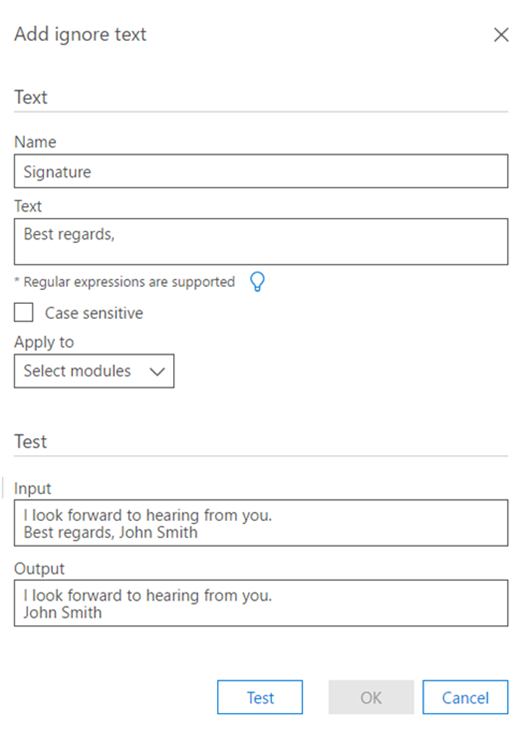
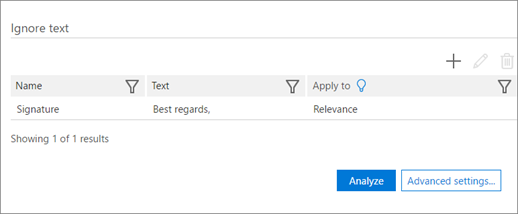

# Advanced eDiscovery에서 분석에 대 한 텍스트 무시 옵션 설정 (클래식)Set Ignore Text option for Analyze in Advanced eDiscovery (classic)

> [!NOTE]
> Advanced eDiscovery를 사용하려면 Office 365 E3의 고급 준수 추가 기능이나 조직을 위한 E5 구독이 필요합니다. 이 요금제가 없는 상태에서 Advanced eDiscovery를 사용하려는 경우에는 [Office 365 Enterprise E5 평가판을 등록](https://go.microsoft.com/fwlink/p/?LinkID=698279)할 수 있습니다.Advanced eDiscovery requires an Office 365 E3 with the Advanced Compliance add-on or an E5 subscription for your organization. If you don't have that plan and want to try Advanced eDiscovery, you can [sign up for a trial of Office 365 Enterprise E5](https://go.microsoft.com/fwlink/p/?LinkID=698279). 
  
텍스트 무시 기능은 분석 (거의 중복, 전자 메일 스레드, 테마) 및 관련성에 따라 다음과 같은 고급 eDiscovery 모듈 전체 또는 일부에 적용할 수 있습니다.The Ignore Text feature can be applied to all or any of the following Advanced eDiscovery modules: Analyze (Near-duplicates, Email Threads, Themes) and Relevance. 무시 된 텍스트는 관련성이 있는 파일에 표시 되지 않으며, 분석/계산은 무시 되는 텍스트를 무시 합니다.Ignored text will not appear in files displayed in Relevance, and the analysis/calculations will discard the ignored text.
  
이미 실행 했던 모듈에 대해 무시 텍스트 기능이 이전에 정의 된 경우에는 텍스트 무시 설정이 이제 수정 되지 않도록 보호 됩니다.If the Ignore Text feature was previously defined for modules that have already run, the Ignore Text setting will now be protected from being modified. 그러나 관련성 모듈에 대 한 텍스트 무시 기능은 언제 든 지 변경 될 수 있습니다.However, the Ignore Text feature for the Relevance module can still be changed at any time.
  
## 무시 텍스트 필터를 적용 하는 방법How Ignore Text filters are applied

여러 Ignore 텍스트 필터는 입력 한 순서 대로 적용 됩니다.Multiple Ignore Text filters are applied in the order that they were entered. 적용 되는 순서를 변경 하려면 삭제 하 고 원하는 순서 대로 다시 입력 해야 합니다.To change the order in which they are applied, they must be deleted and re-entered in the desired order.
  
예를 들어 텍스트 콘텐츠가 "DAVE BOB ALICE 고 전날" 인 경우 다음은 무시 텍스트 항목과 결과의 예입니다.For example, if the text content is: "DAVE BOB ALICE CAROL EVE", the following are samples of Ignore Text entries and the results:
  
||||
|:-----|:-----|:-----|
|**텍스트 항목 무시****Ignore Text entries**   |**==\>**   |**결과****Results**   |
|"ALICE", "BOB의가을""ALICE", "BOB CAROL"    |==\>    |"DAVE 전날""DAVE EVE"    |
|"ALICE", "BOB ALICE 고 대""ALICE", "BOB ALICE CAROL"    |==\>    |"DAVE BOB 고 전날""DAVE BOB CAROL EVE"    |
   
첫 번째 무시 텍스트가 적용 된 후에 문자열이 검색 되지 않으므로 두 번째 Ignore 텍스트 항목은 구현 되지 않습니다.The second Ignore Text entry is not implemented because the string is not found as such AFTER the first Ignore Text has been applied.
  
## 텍스트 무시를 정의할 때 정규식 사용Use regular expressions when defining Ignore Text

정규식은 무시 텍스트를 정의할 때 사용할 수 있습니다.Regular expressions are supported for use when defining Ignore Text. 다음은 정규식 구문과 사용 방법의 예입니다.The following are examples of regular expression syntax and usage:
  
- 시작 부분에서 줄 끝까지 텍스트를 제거 하려면 다음을 수행 합니다.To remove (ignore) text from Begin until the end of a line:
    
     `Begin(.*)$`
    
    여기에서 "Begin"은 줄에서이 문자열의 초기 항목입니다.where "Begin" is the initial occurrence of this string in the line.
    
    예를 들어 다음과 같은 텍스트를 예로 들 있습니다.For example, for the following text:
    
    **"이 문장이 나 첫 번째 줄입니다.****"This is first sentence and first line**
    
    **두 번째 문장이 며 두 번째 줄이 됩니다. "****This is second sentence and second line"**
    
    정규식 first (.\*) $의 결과는 다음과 같습니다.the Regular Expression first(.\*)$ will result in:
    
    **"이는****"This is**
    
    **두 번째 문장이 며 두 번째 줄이 됩니다. "****This is second sentence and second line"**
    
- 전자 메일 스레드 끝에 자동으로 삽입 되는 고 지 사항 및 법률 문서를 제거 하려면:To remove disclaimers and legal statements automatically inserted at the end of email threads:
    
     `Begin(.|\s)*End`
    
    여기서 "Begin" 및 "End"는 줄 바꿈된 텍스트 단락의 시작과 끝에 있는 고유한 문자열입니다.where "Begin" and "End" are unique strings at the beginning and end of a wrapped text paragraph. 
    
    예를 들어 다음 정규식은 Begin 및 End 문자열 사이에 있는 전자 메일 스레드에 있는 고 지 사항 및 법률 자문을 제거 합니다.For example, the following regular expression will remove disclaimers and legal statements that were in the email thread between the Begin and End strings:
    
    **이 메시지에는 기밀 정보 (. | \s)\*확인이 필요한 경우 하드 카피 버전을 요청 하세요.****This message contains confidential information (.|\s)\*If verification is required please request a hard-copy version**
    
- 고 지 사항 (특수 문자 포함)을 제거 하려면To remove a disclaimer (including special characters): 
    
    예를 들어 다음 텍스트 (고 지 사항이 x로 표시 됨)에 대해 다음을 수행 합니다.For example, for the following text (with the disclaimer represented here by x's): 
    
    **/\*\이 메시지에는 기밀 정보가 포함 되어 있습니다. xxxx xxxx****/\*\ This message contains confidential information. xxxx xxxx**
    
    **xxxx xxxx xxxx xxxx xxxx xxxx xxxx****xxxx xxxx xxxx xxxx xxxx xxxx xxxx**
    
    \**xxxx xxxx 확인이 필요한 경우에는 하드 카피 버전을 요청 하세요. /\*\**\**xxxx xxxx If verification is required, please request a hard-copy version. /\*\**
    
    위의 부인 내용을 제거 하는 정규식은 다음과 같습니다.the regular expression to remove the above disclaimer should be: 
    
    **\/\\*\\이 메시지에는 기밀\.정보 (. | \s)\* 확인이 필요한 경우 하드 카피 버전\. 을 요청 하세요.\/\\*\\****\/\\*\\ This message contains confidential information\.(.|\s)\* If verification is required please request a hard-copy version\. \/\\*\\**
    
- 정규식 규칙:Regular expression rules:
    
  - 공백을 제외 하 고 알파벳의 일부가 아닌 모든 문자, "_" 및 "-"은 앞에 "가와 야 합니다\".Any characters that are not part of the alphabet except for space(s), "_" and "-" must be preceded by "\".
    
  - 일반 eExpression 필드의 길이에는 제한이 없습니다.The regular eExpression field can be unlimited length.
    
> [!TIP]
> 정규식의 자세한 설명과 자세한 내용은 [정규식 언어-빠른 참조](https://msdn.microsoft.com/library/az24scfc%28v=vs.110%29.aspx)를 참조 하십시오.For an explanation and detailed syntax of regular expressions, see: [Regular Expression Language - Quick Reference](https://msdn.microsoft.com/library/az24scfc%28v=vs.110%29.aspx). 
  
## 무시 텍스트 규칙 정의Define Ignore Text rule

1. 분석 \*\* \> 분석 옵션 \> 관리\*\* 탭의 **텍스트 무시** 섹션에서 **+** 아이콘을 클릭 하 여 규칙을 추가 합니다.In the **Manage \> Analyze \> Analyze options** tab, in the **Ignore Text** section, click the **+** icon to add a rule. 
    
2. **Ignore 텍스트 추가** 대화 상자의 **이름** 필드에 무시 텍스트 규칙의 이름을 입력 합니다.In the **Add Ignore Text** dialog, in the **Name** field, type a name for the Ignore Text rule. 
    
    
  
3. **텍스트** 상자에 무시할 텍스트를 입력 합니다.In the **Text** box, type the text to be ignored. 텍스트 필드에 무제한의 문자를 사용할 수 있습니다.The text field allows an unlimited number of characters. 
    
    > [!TIP]
    > 위의 창에 표시 된 것 **처럼 전구를 클릭 하** 여 Ignore 텍스트 규칙에 대 한 일반적인 구문 지침을 확인 합니다.As shown in the window above, click **light bulb** to see common syntax guidelines for the Ignore Text rule. 
  
4. 필요한 경우 **대/소문자 구분** 확인란을 선택 합니다.Select the **Case sensitive** check box, if desired. 
    
5. **적용 대상** 목록에서 정의를 적용할 고급 eDiscovery 모듈을 선택 합니다.In the **Apply to** list, select the Advanced eDiscovery modules in which to apply the definition. 
    
6. 예제 텍스트에 대 한 테스트를 실행 하려면 **입력** 텍스트 상자에 예제 텍스트를 입력 하 고 **테스트**를 클릭 합니다.If you want a test run on sample text, type sample text in the **Input** text box and click **Test**. 결과가 **출력** 텍스트 상자에 표시 됩니다.The results are displayed in the **Output** text box. 
    
7. **확인** 을 클릭 하 여 무시 텍스트 규칙을 저장 합니다.Click **OK** to save the Ignore Text rule. 정의 된 Ignore 텍스트 규칙이 표시 됩니다.The defined Ignore Text rule is displayed. 
    
    
  
## 참고 항목See also

[고급 eDiscovery (클래식)Advanced eDiscovery (classic)](office-365-advanced-ediscovery.md)
  
[문서 유사성 이해Understanding document similarity](understand-document-similarity-in-advanced-ediscovery.md)
  
[분석 옵션 설정Setting Analyze options](set-analyze-options-in-advanced-ediscovery.md)
  
[고급 설정 분석 설정Setting Analyze advanced settings](set-analyze-advanced-settings-in-advanced-ediscovery.md)
  
[분석 결과 보기Viewing Analyze results](view-analyze-results-in-advanced-ediscovery.md)

