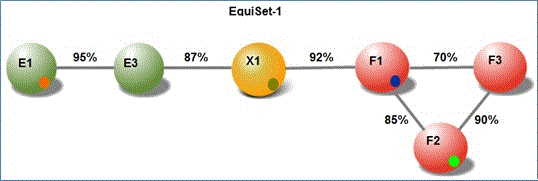

# Advanced eDiscovery의 문서 유사성 이해 (클래식)Understand document similarity in Advanced eDiscovery (classic)

> [!NOTE]
> Advanced eDiscovery를 사용하려면 Office 365 E3의 고급 준수 추가 기능이나 조직을 위한 E5 구독이 필요합니다. 이 요금제가 없는 상태에서 Advanced eDiscovery를 사용하려는 경우에는 [Office 365 Enterprise E5 평가판을 등록](https://go.microsoft.com/fwlink/p/?LinkID=698279)할 수 있습니다.Advanced eDiscovery requires an Office 365 E3 with the Advanced Compliance add-on or an E5 subscription for your organization. If you don't have that plan and want to try Advanced eDiscovery, you can [sign up for a trial of Office 365 Enterprise E5](https://go.microsoft.com/fwlink/p/?LinkID=698279). 
  
Advanced eDiscovery에서 문서 유사성은 두 문서를 중복 항목으로 간주 하는 데 필요한 최소 resemblance 수준입니다.In Advanced eDiscovery, Document Similarity is the minimal level of resemblance required for two documents to be considered as near-duplicates.
  
> [!TIP]
> 대부분의 비즈니스 응용 프로그램에서는 유사도 값 60%-75%를 사용 하는 것이 좋습니다.For most business applications, it is recommended to use a Similarity value of 60%-75%. 아주 불량 OCR (광학 인식) 재질의 경우 낮은 유사도 값을 적용할 수 있습니다.For very poor quality optical character recognition (OCR) material, lower Similarity values can be applied. 
  
> [!NOTE]
> 지정한 사례를 설정 하 고 실행 한 후에는 유사성 값을 변경할 수 없습니다.After it's set and run for a given case, the Similarity value cannot be changed. 
  
유사 중복 (ND) 집합 내에서 유사성 임계값 아래에 resemblance 수준이 있는 문서가 있을 수 있습니다.Within a Near-duplicate (ND) set, there may be documents with a level of resemblance below the Similarity threshold. 문서에서 ND 집합에 가입 하려면 resemblance 수준이 유사도를 초과 하는 ND 집합에 하나 이상의 문서가 있어야 합니다.For a document to join an ND set, there must be at least one document in the ND set with a level of resemblance exceeding the Similarity. 
  
예를 들어 유사도가 80%로 설정 되어 있고 문서 F1이 85%에 있는 문서와 유사 하 게, 문서 F2는 문서 F3과 같은 수준의 90%로 되어 있다고 가정 합니다.For example, assume the Similarity is set to 80%, document F1 resembles document F2 at a level of 85%, and document F2 resembles document F3 at a level of 90%. 
  
그러나 document F1은 문서 F3와 비슷한 수준으로, 임계값 보다 낮은 70%만 사용할 수 있습니다.However, document F1 may resemble document F3 at a level of only 70%, which is below the threshold. 그러나이 예에서 문서 F1, F2 및 F3 모두 하나의 ND 집합에 표시 됩니다.Nonetheless, in this example, documents F1, F2, and F3 all appear in the one ND set. 마찬가지로, 유사도 값을 80%로 설정 하면-1과 EquiSet-2 EquiSet 두 개의 집합을 만들 수 있습니다.Similarly, using a Similarity value of 80%, we may have created two sets, EquiSet-1 and EquiSet-2. EquiSet-1에는 E1 및 E2 문서가 포함 되어 있습니다.EquiSet-1 contains documents E1 and E2. Equiset-2에는 문서 (F1, F2 및 F3가 포함 됩니다.Equiset-2 contains documents F1, F2, and F3. 
  
Resemblance의 수준은 다음과 같이 표시 됩니다.The levels of resemblance are illustrated as follows:
  

  
이제 다른 문서인 X1이 삽입 되었다고 가정 합니다.Assume that another document, X1, is now inserted. X1과 E3 사이의 resemblance은 87%입니다.The resemblance between X1 and E3 is 87%. 마찬가지로 X1과 F1 사이의 resemblance은 92%입니다.Similarly, the resemblance between X1 and F1 is 92%. 따라서 이제 EquiSet-1, EquiSet-2 및 X1이 하나의 ND 집합으로 결합 됩니다.As a result, EquiSet -1, EquiSet -2, and X1 are now combined into one ND set.
  

  
> [!NOTE]
> 한 ND 집합에 두 문서가 할당 되 면 해당 집합에 추가 문서가 추가 되거나 집합이 병합 되는 경우에도 동일한 ND 집합에 함께 유지 됩니다.If any two documents are assigned to one ND set, they will remain together in the same ND set, even if additional documents are added to the set or if the sets are merged. 
  
집합이 병합 된 후에는 새 문서가 집합에 추가 될 때 피벗 문서가 변경 될 수 있습니다.After sets are merged, the Pivot document can change when new documents are added to a set. 
  
## 참고 항목See also

[고급 eDiscovery (클래식)Advanced eDiscovery (classic)](office-365-advanced-ediscovery.md)
  
[분석 옵션 설정Setting Analyze options](set-analyze-options-in-advanced-ediscovery.md)
  
[무시 텍스트 설정Setting ignore text](set-ignore-text-in-advanced-ediscovery.md)
  
[고급 설정 분석 설정Setting Analyze advanced settings](set-analyze-advanced-settings-in-advanced-ediscovery.md)
  
[분석 결과 보기Viewing Analyze results](view-analyze-results-in-advanced-ediscovery.md)

