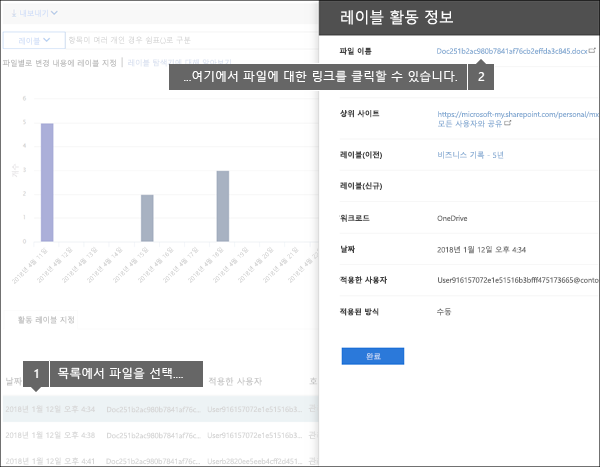

# 문서에 대한 레이블 활동 보기

After you create your labels, you'll want to verify that they're being applied to content as you intended. With the Label Activity Explorer in the Security &amp; Compliance Center, you can quickly search and view label activity for all content across SharePoint and OneDrive for Business over the past 30 days. This is real-time data that gives you a clear view into what's happening in your tenant.
  
예를 들어 레이블 활동 탐색기로 다음을 수행할 수 있습니다.
  
- 각 레이블이 각 날에 적용된 횟수를 확인합니다(최대 30일).
    
- 누가 어떤 파일에 언제 레이블을 지정했는지와 해당 파일이 있는 사이트에 대한 링크를 확인합니다.
    
- 레이블이 변경 또는 제거된 파일, 어느 것이 이전 및 새 레이블인지 및 변경한 사람을 확인합니다.
    
- Filter the data to see all the label activity for a specific label, file, or user. You can also filter label activity by location (SharePoint or OneDrive for Business) and whether the label was applied manually or auto-applied.
    
- View label activity for folders as well as individual documents. Coming soon is the ability to show how many files inside that folder got labeled as a result of the folder getting labeled.
    
보안 &amp; 준수 센터 > **정보 거버넌스** > **레이블 활동 탐색기**에서 레이블 활동 탐색기를 찾을 수 있습니다.
  
레이블 활동 탐색기를 사용하려면 Office 365 Enterprise E5 구독이 있어야 합니다.
  

  
## 파일 또는 폴더에 대한 레이블 활동 보기

At the top of the Label Activity Explorer, you can choose whether to view activities for files or folders. Note that folder activity includes only the folder itself, not the files inside the folder.
  
You might want to see label activity for folders because if you label a folder, all files inside that folder also get that label (except for files that have had a label applied explicitly to them). Therefore, labeling folders might affect a significant number of files. For more information, see [Applying a default retention label to all content in a SharePoint library, folder, or document set](labels.md#applying-a-default-retention-label-to-all-content-in-a-sharepoint-library-folder-or-document-set).
  

  
### 레이블 활동

 **Label activities** includes all label actions: **adding**, **removing**, or **changing** a label. You can use this view to get a comprehensive look at how many files each label's been applied to per day. 
  
### 레이블 변경

 **Label changes** includes the potentially risky actions of **removing** or **changing** a label. You can use this view to quickly see such risky actions and the user who performed them. In the activity list below the chart, you can select a file, and then click a link to that file in the details pane on the right. 
  

  
## 레이블 활동 필터링

You can quickly filter the data to see all the label activity for a specific label, file, or user. You can also filter label activity by location (SharePoint or OneDrive for Business) and whether the label was applied manually or auto-applied.
  

  

