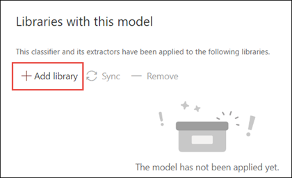

# Microsoft SharePoint Syntex에서 문서 이해 모델 적용

이 문서에서 설명 하는 내용은 Project Cortex 비공개 미리 보기에 대 한 것입니다. [자세한 내용은 Project Cortex를 참조](https://aka.ms/projectcortex)하세요.

 

> [!VIDEO https://www.microsoft.com/videoplayer/embed/RE4CSoL]

 

모델 이해 문서를 게시 한 후 Microsoft 365 테 넌 트에서 SharePoint 문서 라이브러리에이를 적용할 수 있습니다.

> [!NOTE]
> 액세스 권한이 있는 문서 라이브러리에만 모델을 적용할 수 있습니다.

## 문서 라이브러리에 모델을 적용 합니다.

SharePoint 문서 라이브러리에 모델을 적용 하려면 다음을 수행 합니다.

1. 모델 홈 페이지의 **라이브러리에 모델 적용** 타일에서 **모델 게시**를 선택 합니다. 또는 **다음 모델** 의 라이브러리에서 **라이브러리 추가** 섹션을 선택할 수 있습니다.  

     

2. 모델을 적용 하려는 문서 라이브러리가 포함 된 SharePoint 사이트를 선택 합니다. 사이트가 목록에 표시 되지 않으면 검색 상자를 사용 하 여 해당 사이트를 찾습니다. 

     

    > [!NOTE]
    > 모델을 적용할 문서 라이브러리에 대 한 목록 사용 권한 *관리* 또는 *편집* 권한이 있어야 합니다. 

3. 사이트를 선택한 후 모델을 적용할 문서 라이브러리를 선택 합니다. 예제에서 *Contoso 사례 추적* 사이트의 *문서* 문서 라이브러리를 선택 합니다. 

     

4. 모델은 콘텐츠 형식에 연결 되어 있으므로 라이브러리에 적용할 때이를 열로 추출한 레이블로 콘텐츠 형식에 대 한 보기를 만듭니다. 이 보기는 기본적으로 라이브러리의 기본 보기 이며, **고급 설정을** 선택 하 고 **이 새 보기를 기본값으로**선택을 취소 하 여 기본 보기로 설정 하지 않을 수도 있습니다 (선택 사항). 

     

5. 라이브러리에 모델을 적용 하려면 **추가** 를 선택 합니다. 
6. 모델 홈 페이지의 **이 모델을 가진 라이브러리** 섹션에서 나열 된 SharePoint 사이트의 URL을 볼 수 있습니다. 

     

7. 문서 라이브러리로 이동 하 여 모델의 문서 라이브러리 보기에 있는지 확인 합니다. 문서 라이브러리 이름 옆에 있는 정보 단추를 선택 하면 모델이 문서 라이브러리에 적용 되었음을 알리는 메시지가 표시 됩니다.

      

문서 라이브러리에 모델을 적용 한 후에는 사이트에 문서 업로드를 시작 하 고 결과를 확인할 수 있습니다.

모델은 모델의 연결 된 콘텐츠 형식을 가진 모든 파일을 식별 하 고 보기에 나열 합니다. 모델에 추출기가 있으면 보기에 각 파일에서 추출 하는 데이터의 열이 표시 됩니다.

### 문서 라이브러리에 이미 있는 파일에 모델 적용

적용 된 모델을 적용 한 후에 문서 라이브러리에 업로드 된 모든 파일이 처리 되는 동안에는 다음을 수행 하 여 모델을 적용 하기 전에 문서 라이브러리에 이미 있는 파일에서 모델을 실행할 수도 있습니다.

1. 문서 라이브러리에서 모델에 따라 처리할 파일을 선택 합니다.
2. 파일을 선택한 후 **분류 및 추출** 이 문서 라이브러리 리본 메뉴에 표시 됩니다. **분류 및 압축 해제를**선택 합니다.
3. 선택한 파일이 처리할 큐에 추가 됩니다.

        

## 참고 항목
[분류자 만들기](create-a-classifier.md) 
[추출기 만들기](create-an-extractor.md) 
[문서 이해 개요](document-understanding-overview.md) 
[양식 처리 모델 만들기](create-a-form-processing-model.md)  
