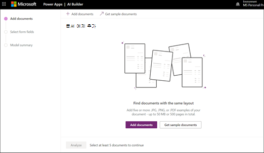

# 양식 처리 모델 만들기 (미리 보기)

> [!Note] 
> 이 문서에서 설명 하는 내용은 Project Cortex 비공개 미리 보기를 위한 것입니다. [자세한 내용은 Project Cortex를 참조](https://aka.ms/projectcortex)하세요.

[AI Builder](https://docs.microsoft.com/ai-builder/overview) 사용-Microsoft PowerApps-Project Cortex 사용자의 기능은 SharePoint 문서 라이브러리에서 직접 [양식 처리 모델](form-processing-overview.md) 을 만들 수 있습니다. 

양식 처리 모델을 만들려면 다음이 포함 됩니다.
 - 1 단계: 콘텐츠 형식을 만들기 위한 원본 프로세스 모델 만들기
 - 2 단계: 예제 파일 추가 및 분석
 - 3 단계: 양식 필드 선택
 - 4 단계: 모델 훈련 및 테스트
 - 5 단계: 모델 게시
 - 6 단계: 모델 사용

## 요구 사항

양식 처리 모델은 사용 하도록 설정 된 SharePoint 문서 라이브러리 에서만 만들 수 있습니다. 양식 처리가 사용 하도록 설정 된 경우 문서 라이브러리의 **자동화** 메뉴 아래에 있는 **AI Builder** **"양식 처리 모델 만들기"** 를 볼 수 있습니다.  문서 라이브러리에서 사용 하도록 설정 해야 하는 경우 관리자에 게 문의 하세요.

  

## 1 단계: 양식 처리 모델 만들기

양식 처리 모델을 만드는 첫 번째 단계는 새 콘텐츠 형식을 정의 하 고 해당 형식에 대 한 새 문서 라이브러리 보기를 만들기 위한 이름을 지정 하는 것입니다.

1. 문서 라이브러리에서 **자동화** 메뉴를 선택 하 고 **AI 작성기**를 선택한 다음 **양식 처리 모델 만들기**를 선택 합니다.

     
2. **새 양식 처리 모델** 창의 **이름** 필드에 모델의 이름 (예: *구매 주문*)을 입력 합니다.

      

3. 양식 처리 모델을 만들 때 새 SharePoint 콘텐츠 형식을 만듭니다. SharePoint 콘텐츠 형식은 공통 특성을 가지 며 특정 콘텐츠에 대 한 열 또는 메타 데이터 속성의 컬렉션을 공유 하는 문서 범주를 나타냅니다. SharePoint 콘텐츠 형식은 [콘텐츠 형식 갤러리]()를 통해 관리 됩니다.

    이 모델을 SharePoint 콘텐츠 형식 갤러리의 기존 콘텐츠 형식에 매핑하려면 해당 스키마를 사용 하려면 **고급 설정을** 선택 합니다. 

4. 모델은 문서 라이브러리에 추출 된 데이터에 대 한 새 보기를 만듭니다. 기본 보기로 설정 하지 않으려면 **보기를 기본값으로 설정을**선택 취소 합니다.
5. **만들기**를 선택합니다.

## 2 단계: 문서 추가 및 분석

새 양식 처리 모델을 만들면 브라우저에서 새 PowerApps AI Builder 폼 처리 모델 페이지가 열립니다. 이 페이지에서는 예제 문서를 추가 하 고 분석할 수 있습니다.  

> [!Note]
> 사용할 예제 파일을 찾는 경우 [양식 처리 모델 입력 문서 요구 사항 및 최적화 팁](https://docs.microsoft.com/ai-builder/form-processing-model-requirements)을 참조 하십시오. 

     
 

1. **문서 추가** 를 클릭 하 여 분석 된 예제 문서를 추가 하 여 추출할 수 있는 명명 된 값 쌍을 확인 합니다. 로컬 저장소, **SharePoint**또는 **Azure Blob 저장소** **에서 업로드**중 하나를 선택할 수 있습니다. 교육을 위해 적어도 5 개의 파일을 사용 해야 합니다.
2. 파일을 추가한 후에는 **분석** 을 선택 하 여 공통적으로 모든 파일에 해당 하는 정보를 확인 합니다. 이 작업을 완료 하려면 몇 분 정도 걸릴 수 있습니다.  
 
      

3. 분석이 완료 되 면 **저장할 양식 필드 선택** 페이지에서 파일을 클릭 하 여 검색 된 필드를 확인 합니다. 

      

## 3 단계: 양식 필드 선택

필드에 대 한 문서를 분석 한 후에는 검색 된 필드와 저장 하려는 항목을 확인할 수 있습니다. 저장 된 필드는 모델의 문서 라이브러리 보기에 열로 표시 되 고 각 문서에서 추출 된 값이 표시 됩니다.

1. 다음 페이지에는 예제 파일 중 하나가 표시 되며, 시스템에서 자동으로 검색 된 모든 일반 필드를 강조 표시 합니다.  

      

2. 저장 하려는 필드를 선택 하 고 확인란을 선택 하 여 선택을 확인 합니다. 예를 들어 구매 주문 모델에서 *날짜*, *PO*및 *요약* 필드를 선택할 수 있습니다.  선택한 경우 필드 이름을 바꿀 수도 있습니다.  

      

3. 필드가 분석을 통해 검색 되지 않은 경우에는 추가를 선택할 수 있습니다. 추출할 정보를 강조 표시 하 고 이름 상자에 지정할 이름을 입력 합니다. 그런 다음 확인을 선택 합니다. 나머지 예제 파일에서 검색 되지 않은 필드를 확인 해야 합니다.
4. 저장할 필드를 선택한 후 **필드 확인** 을 클릭 합니다.  
 
      
 
5. **저장할 양식 필드 선택** 페이지에는 선택한 필드 수가 표시 됩니다. **완료**를 선택합니다.

## 4 단계: 모델 훈련 및 테스트

**모델 요약** 페이지에서는 저장 하려는 필드를 선택한 후 모델을 학습 하 고 테스트할 수 있습니다.

1. **모델 요약** 페이지의 **선택한** 필드 섹션에 저장 된 필드가 표시 됩니다. 예제 파일에 대 한 교육을 시작 하려면 **트레인** 을 선택 합니다. 이 작업을 완료 하는 데 몇 분 정도 걸릴 수 있습니다. 
      
2. 교육이 완료 되었다는 알림이 표시 되 면 **세부 정보 페이지로 이동을**선택 합니다. 
3. **모델 세부 정보** 페이지에서 **빠른 테스트**를 선택 하 여 모델이 작동 하는 방식을 테스트할 수 있습니다. 이렇게 하면 파일을 페이지에 끌어서 놓고 해당 필드가 검색 되는지 확인할 수 있습니다.

## 5 단계: 모델 게시

1. 모델의 결과가 만족 스 러 우면 **게시** 를 선택 하 여 사용 가능 하도록 설정 합니다.
2. 모델이 게시 된 후 **모델 사용**을 선택 합니다. 이렇게 하면 SharePoint 문서 라이브러리에서 실행 되 고 모델에서 식별 된 필드를 추출 하는 PowerAutomate 흐름이 만들어집니다. **흐름 만들기**를 선택 합니다.  
3. 완료 되 면 **흐름을 성공적으로 만들었는지**확인 하는 메시지가 표시 됩니다.
 
 
## 6 단계: 모델 사용

모델을 게시 하 고 PowerAutomate 흐름을 만든 후에는 SharePoint 문서 라이브러리에서 모델을 사용할 수 있습니다.

1. 모델을 게시 한 후 **SharePoint로 이동을** 선택 하 여 문서 라이브러리로 이동 합니다.
2. 문서 라이브러리 모델 보기에서 선택한 필드가 이제 열로 표시 되는지 확인 합니다. 

      

    또한 **문서** 옆의 정보 링크에는 양식 처리 모델이이 문서 라이브러리에 적용 된다는 내용이 확인 됩니다.

       

3. 파일을 문서 라이브러리에 업로드 합니다. 모델에서 콘텐츠 형식으로 식별 되는 모든 파일은 보기에 있는 파일을 나열 하 고 추출 된 데이터를 열에 표시 합니다. 

       

## 참고 항목
  
[파워 자동화 설명서](https://docs.microsoft.com/power-automate/) 
[교육: AI Builder를 사용 하 여 비즈니스 성과 개선](https://docs.microsoft.com/learn/paths/improve-business-performance-ai-builder/?source=learn) 

