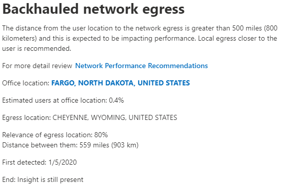
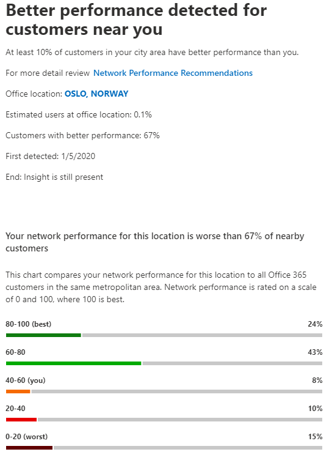
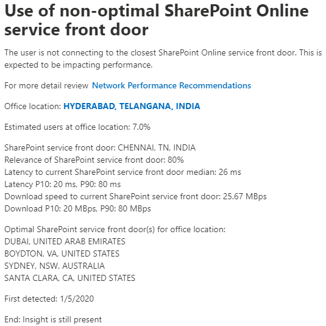

# Microsoft 365 Network Insights (미리 보기)Microsoft 365 Network Insights (preview)

**Network insights** 는 Microsoft 365 테 넌 트에서 수집 된 live 성능 메트릭 이며, 테 넌 트의 관리 사용자만 볼 수 있습니다.**Network insights** are live performance metrics collected from your Microsoft 365 tenant, and available to view only by administrative users in your tenant. Insights는 Microsoft 365 관리 센터에 표시 됩니다 <https://portal.microsoft.com/adminportal/home#/networkperformance> .Insights are displayed in the Microsoft 365 Admin Center at <https://portal.microsoft.com/adminportal/home#/networkperformance>.

Insights는 사무실 사무소에 대 한 네트워크 perimeters 디자인에 도움을 주기 위한 것입니다.Insights are intended to help in designing network perimeters for your office locations. 각 통찰력은 사용자가 테 넌 트에 액세스 하는 각 지리적 위치에 대 한 특정 일반적인 문제의 성능 특성에 대 한 실시간 세부 정보를 제공 합니다.Each insight provides live details about the performance characteristics for a specific common issue for each geographic location where users are accessing your tenant.

각 사무실 위치에 대해 표시할 수 있는 5 가지 특정 네트워크 정보가 있습니다.There are five specific network insights that may be shown for each office location:

- [Backhauled 네트워크 송신Backhauled network egress](#backhauled-network-egress)
- [주변 고객에 게 더 나은 성능 검색Better performance detected for customers near you](#better-performance-detected-for-customers-near-you)
- [최적이 아닌 Exchange Online 서비스 전면 도어 사용Use of a non-optimal Exchange Online service front door](#use-of-a-non-optimal-exchange-online-service-front-door)
- [최적이 아닌 SharePoint Online 서비스 전면 도어 사용Use of a non-optimal SharePoint Online service front door](#use-of-a-non-optimal-sharepoint-online-service-front-door)
- [SharePoint 전면 도어에서 다운로드 속도 낮음Low download speed from SharePoint front door](#low-download-speed-from-sharepoint-front-door)

>[!IMPORTANT]
>네트워크 insights, Microsoft 365 관리 센터의 성능 권장 사항 및 평가는 현재 미리 보기 상태 이며, 기능 미리 보기 프로그램에 등록 되어 있는 Microsoft 365 테 넌 트에만 사용할 수 있습니다.Network insights, performance recommendations and assessments in the Microsoft 365 Admin Center is currently in preview status, and is only available for Microsoft 365 tenants that have been enrolled in the feature preview program.

## Backhauled 네트워크 송신Backhauled network egress

이 통찰력은 네트워크 insights 서비스가 지정 된 사용자 위치에서 네트워크 송신으로의 거리가 500 마일 (800 킬로미터) 보다 크면 Microsoft 365 트래픽이 일반 인터넷에 지 장치 또는 프록시로 backhauled는 것을 의미 합니다.This insight will be displayed if the network insights service detects that the distance from a given user location to the network egress is greater than 500 miles (800 kilometers), indicating that Microsoft 365 traffic is being backhauled to a common Internet edge device or proxy.

이 통찰력은 일부 요약 보기에서 "Egress"로 간략 한 것입니다.This insight is abbreviated as "Egress" in some summary views.

### 시나리오What does this mean?

이는 사무실 위치와 네트워크 송신 사이의 거리가 500 마일 (800 킬로미터) 보다 큼을 식별 합니다.This identifies that the distance between the office location and the network egress is more than 500 miles (800 kilometers). Office 위치는 난독 처리 된 클라이언트 컴퓨터 위치로 식별 되며 네트워크 송신 위치는 역방향 IP 주소를 위치 데이터베이스에 사용 하 여 식별 됩니다.The office location is identified by an obfuscated client machine location and the network egress location is identified by using reverse IP Address to location databases. 컴퓨터에서 Windows 위치 서비스를 사용 하지 않도록 설정 하면 office 위치가 정확 하지 않을 수 있습니다.The office location may be inaccurate if Windows Location Services is disabled on machines. 역방향 IP 주소 데이터베이스 정보가 부정확 한 경우 네트워크 송신 위치가 부정확 하 게 될 수 있습니다.The network egress location may be inaccurate if the reverse IP Address database information is inaccurate.

이러한 통찰력에 대 한 자세한 내용은 사무실 위치, 현재 네트워크 송신 위치, egress 위치의 관련성, 위치 및 현재 송신 지점 간의 거리, 조건이 처음 검색 된 날짜, 조건이 해결 된 날짜 등을 포함 합니다.Details for this insight include the office location, estimated percentage of total tenant user at the location, the current network egress location, relevance of the egress location, the distance between the location and the current egress point, the date the condition was first detected, and the date the condition was resolved.

### 제가 뭘 해야 하나요?What should I do?

이에 대 한 자세한 내용은 연결을 통해 최적의 microsoft 글로벌 네트워크 및 가장 가까운 Microsoft 365 서비스 전면 도어로 경로를 지정할 수 있도록 네트워크를 office 위치에 더 가깝게 egress 것을 권장 합니다.For this insight, we would recommend network egress closer to the office location so that connectivity can route optimally to Microsoft's global network and to the nearest Microsoft 365 service front door. 또한 사용자에 게 네트워크를 닫도록 네트워크가 송신 되도록 설정 하면 향후에도 Microsoft는 네트워크의 현재 상태와 Microsoft 365 서비스 전면 도어를 모두 확장 하는 동시에 성능을 향상 시킬 수 있습니다.Having close network egress to users office locations also allows for improved performance in the future as Microsoft expands both network points of presence and Microsoft 365 service front doors in the future.

이 문제를 해결 하는 방법에 대 한 자세한 내용은 [Office 365 네트워크 연결 원리](microsoft-365-network-connectivity-principles.md)에서 [로컬로 Egress 네트워크 연결](microsoft-365-network-connectivity-principles.md#egress-network-connections-locally) 을 참조 하십시오.For more information about how to resolve this issue, see [Egress network connections locally](microsoft-365-network-connectivity-principles.md#egress-network-connections-locally) in [Office 365 Network Connectivity Principles](microsoft-365-network-connectivity-principles.md).

## 주변 고객에 게 더 나은 성능 검색Better performance detected for customers near you

이 통찰력은 네트워크 insights 서비스에서이 사무실 위치에 있는 조직의 사용자 보다 많은 수의 metro 영역을 검색 하는 경우에 표시 됩니다.This insight will be displayed if the network insights service detects that a significant number of customers in your metro area have better performance than users in your organization at this office location.

이 통찰력은 일부 요약 보기에서 "피어"로 간략 한 것입니다.This insight is abbreviated as "Peers" in some summary views.

### 시나리오What does this mean?

이러한 통찰력은이 사무실 위치와 같은 도시의 Microsoft 365 고객의 집계 성과를 검사 합니다.This insight examines the aggregate performance of Microsoft 365 customers in the same city as this office location. 이러한 통찰력은 사용자의 평균 대기 시간이 인접 한 테 넌 트의 평균 대기 시간 보다 10% 보다 많은 경우에 표시 됩니다.This insight is displayed if the average latency of your users is 10% greater than the average latency of neighboring tenants.

### 제가 뭘 해야 하나요?What should I do?

회사 네트워크 또는 ISP의 대기 시간, 병목 현상 또는 아키텍처 디자인 문제를 포함 하 여 이러한 상황이 발생 하는 여러 가지 이유가 있을 수 있습니다.There could be many reasons for this condition, including latency in your corporate network or ISP, bottlenecks, or architecture design issues. Office 네트워크와 현재 Microsoft 365 전면 도어 간의 경로에 있는 각 홉 사이의 대기 시간을 검사 합니다.Examine the latency between each hop in the route between your office network and the current Microsoft 365 front door. 자세한 내용은 [Office 365 네트워크 연결 원리](microsoft-365-network-connectivity-principles.md)를 참조 하세요.For more information, see [Office 365 Network Connectivity Principles](microsoft-365-network-connectivity-principles.md).

## 최적이 아닌 Exchange Online 서비스 전면 도어 사용Use of a non-optimal Exchange Online service front door

이 통찰력은 네트워크 insights 서비스가 특정 위치의 사용자가 최적의 Exchange Online 서비스 전면 도어에 연결 되지 않는 것을 감지 하는 경우에 표시 됩니다.This insight will be displayed if the network insights service detects that users in a specific location are not connecting to an optimal Exchange Online service front door.

이에 대 한 자세한 정보는 요약 보기의 "라우팅" 이라고 합니다.This insight is abbreviated as "Routing" in some summary views.

### 시나리오What does this mean?

적절 한 성능을 제공 하는 office 위치 도시에서 사용 하기에 적합 한 Exchange Online 서비스 프런트 도어를 나열 합니다.We list Exchange Online service front doors which are suitable for use from the office location city with good performance. 현재 테스트에서이 목록에 없는 Exchange Online 서비스 앞 도어를 사용 하는 경우에는이 권장 사항을 확인 합니다.If the current test shows use of an Exchange Online service front door not on this list, then we call out this recommendation.

### 제가 뭘 해야 하나요?What should I do?

Exchange Online 서비스 프런트 도어를 사용 하는 경우에는 회사 네트워크 egress가 되기 전에 로컬 및 직접 네트워크 송신을 권장 하는 네트워크 교환이 발생 하는 경우가 있습니다.Use of a non-optimal Exchange Online service front door could be caused by network backhaul before the corporate network egress in which case we recommend local and direct network egress. 또한 원격 DNS 재귀 해결 프로그램 서버를 사용 하는 경우에도 DNS 재귀 해결 프로그램 서버를 네트워크 egress에 정렬 하는 것이 좋습니다.It could also be caused by use of a remote DNS Recursive Resolver server in which case we recommend aligning the DNS Recursive Resolver server with the network egress.

## 최적이 아닌 SharePoint Online 서비스 전면 도어 사용Use of a non-optimal SharePoint Online service front door

이 통찰력은 네트워크 insights 서비스가 특정 위치의 사용자가 가장 가까운 SharePoint Online 서비스 앞 도어에 연결 되지 않는 것을 감지 하는 경우에 표시 됩니다.This insight will be displayed if the network insights service detects that users in a specific location are not connecting to the closest SharePoint Online service front door.

이 통찰력은 일부 요약 보기에서 "Afd"로 간략 한 것입니다.This insight is abbreviated as "Afd" in some summary views.

### 시나리오What does this mean?

테스트 클라이언트가 연결 되는 SharePoint Online 서비스 프런트 도어를 식별 합니다.We identify the SharePoint Online service front door that the test client is connecting to. 그런 다음 office 위치 도시에서 해당 도시의 예상 SharePoint Online 서비스 전면 도어를 비교 합니다.Then for the office location city we compare that to the expected SharePoint Online service front door for that city. 일치 하지 않는 경우이 권장 사항을 확인 합니다.If it doesn't match, then we make this recommendation.

### 제가 뭘 해야 하나요?What should I do?

네트워크를 사용 하기 전에 회사 네트워크 송신이 가장 좋지 않은 경우 (예를 들어 로컬 및 직접 네트워크 송신을 권장 하는 경우)에는 최적이 아닌 SharePoint Online 서비스 프런트 도어를 사용할 수 있습니다.Use of a non-optimal SharePoint Online service front door could be caused by network backhaul before the corporate network egress in which case we recommend local and direct network egress. 또한 원격 DNS 재귀 해결 프로그램 서버를 사용 하는 경우에도 DNS 재귀 해결 프로그램 서버를 네트워크 egress에 정렬 하는 것이 좋습니다.It could also be caused by use of a remote DNS Recursive Resolver server in which case we recommend aligning the DNS Recursive Resolver server with the network egress.

## SharePoint 전면 도어에서 다운로드 속도 낮음Low download speed from SharePoint front door

네트워크 insights 서비스가 특정 사무실 위치와 SharePoint Online 간의 대역폭이 1 MBps 미만인 경우이 정보가 표시 됩니다.This insight will be displayed if the network insights service detects that bandwidth between the specific office location and SharePoint Online is less than 1 MBps.

이 통찰력은 일부 요약 보기에서 "처리량"으로 간략하게 정리 되었습니다.This insight is abbreviated as "Throughput" in some summary views.

### 시나리오What does this mean?

사용자가 SharePoint Online에서 가져올 수 있는 다운로드 속도 및 비즈니스용 OneDrive 서비스의 프런트 도어는 초당 메가바이트 (MBps)로 측정 됩니다.The download speed that a user can get from SharePoint Online and OneDrive for Business service front doors is measured in megabytes per second (MBps). 이 값이 1 MBps 보다 작으면 이러한 통찰력을 제공 합니다.If this value is less than 1 MBps then we provide this insight.

### 제가 뭘 해야 하나요?What should I do?

다운로드 속도를 개선 하기 위해 대역폭을 늘려야 할 수도 있습니다.To improve download speeds, bandwidth may need to be increased. 또는 사무실 위치에 있는 사용자 컴퓨터와 SharePoint Online 서비스 전면 도어의 네트워크 정체가 있을 수 있습니다.Alternatively, there may be network congestion between user machines at the office location and the SharePoint Online service front door. 이를 congestive 손실 이라고 하는 경우도 있으며 충분 한 대역폭을 사용할 수 있는 경우에도 사용자가 사용할 수 있는 다운로드 속도를 제한 합니다.This is sometimes called congestive loss and it restricts the download speed available to users even if sufficient bandwidth is available.

## 중국 사용자 최적 네트워크 송신China user optimal network egress

이 정보는 조직에서 다른 지리적 위치에 있는 Microsoft 365 테 넌 트에 연결 하는 사용자가 있는 경우에 표시 됩니다.This insight will be displayed if your organization has users in China connecting to your Microsoft 365 tenant in other geographic locations. 

### 시나리오What does this mean?

조직에 사설 WAN 연결이 있는 경우 중국의 사무실 위치에서 네트워크 WAN 회로를 구성 하는 것이 좋습니다 (다음 위치에서 인터넷으로 네트워크가 송신 됨).If your organization has private WAN connectivity, we recommend configuring a network WAN circuit from your office locations in China that has network egress to the Internet in any of the following locations:

- 홍콩Hong Kong
- 일본Japan
- 대만Taiwan
- 대한민국South Korea
- 싱가포르Singapore
- 말레이시아Malaysia

인터넷 egress 사용자가 이러한 위치 보다 더 멀리 떨어진 경우에는 성능이 저하 되 고 중국에서 egress로 인해 경계 간 혼잡으로 인 한 대기 시간 및 연결 문제가 발생할 수 있습니다.Internet egress further away from users than these locations will reduce performance, and egress in China may cause high latency and connectivity issues due to cross-border congestion.

### 제가 뭘 해야 하나요?What should I do?

이러한 정보와 관련 된 성능 문제를 완화 하는 방법에 대 한 자세한 내용은 [중국 사용자에 대 한 Office 365 전역 테 넌 트 성능 최적화](microsoft-365-networking-china.md)를 참조 하세요.For more information about how to mitigate performance issues related to this insight, see [Office 365 global tenant performance optimization for China users](microsoft-365-networking-china.md).

## 관련 항목Related topics

[Microsoft 365 관리 센터의 네트워크 성능 권장 사항 (미리 보기)Network performance recommendations in the Microsoft 365 Admin Center (preview)](office-365-network-mac-perf-overview.md)

[Microsoft 365 네트워크 평가 (미리 보기)Microsoft 365 network assessment (preview)](office-365-network-mac-perf-score.md)

[M365 관리 센터의 Microsoft 365 connectivity test (preview)Microsoft 365 connectivity test in the M365 Admin Center (preview)](office-365-network-mac-perf-onboarding-tool.md)

[Microsoft 365 네트워크 연결 위치 서비스 (미리 보기)Microsoft 365 Network Connectivity Location Services (preview)](office-365-network-mac-location-services.md)
