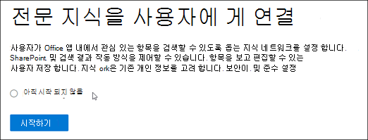
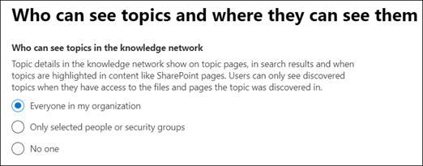
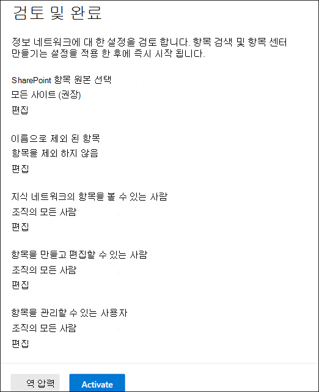

# 지식 관리 설정 (미리 보기)

> [!Note] 
> 이 문서에서 설명 하는 내용은 Project Cortex 비공개 미리 보기를 위한 것입니다. [자세한 내용은 Project Cortex를 참조](https://aka.ms/projectcortex)하세요.

Microsoft 365 관리 센터를 사용 하 여 [기술 자료 관리](knowledge-management-overview.md)를 설정 및 구성할 수 있습니다. 

> [!Important]
> 환경에서 기술 관리를 설정 하 고 구성 하는 최상의 방법을 계획 하는 것이 중요 합니다. 예를 들어 다음과 같은 사항을 고려해 야 합니다.
- 항목에 대해 분석할 SharePoint 사이트를 선택 합니다.
- 항목을 볼 수 있도록 할 사용자입니다.
- 항목 센터에서 항목을 관리 하기 위한 권한을 부여할 사용자를 선택 합니다.
- 항목 센터에서 항목을 만들거나 편집할 수 있는 권한을 부여할 사용자를 선택 합니다.
- 주제 센터에 제공 하려는 이름입니다.

> [!Note]
> 항목을 보고, 항목을 관리 하 고, 항목을 만들고 편집 하는 데 필요한 사용 권한을 사용자에 게 할당 하는 보안 그룹을 만드는 것이 유용할 수 있습니다.

관리자는 설치 후 Microsoft 365 관리 센터에서 기술 관리 설정을 통해 [언제 든 지 선택한 설정을 변경할](manage-knowledge-network.md) 수도 있습니다.

## 요구 사항 
Microsoft 365 관리 센터에 액세스 하 고 조직의 기술 자료 작업을 설정 하려면 전역 관리자 또는 SharePoint 관리자 권한이 있어야 합니다.

## 지식 네트워크 설정

기술 자료 네트워크를 설정 하면 다음과 같은 과정을 거칩니다.

- 검색 항목: 검색에서 제외할 항목 원본 및 항목을 선택 합니다.
- 항목 표시 유형: 검색 및 항목 페이지에서 항목을 강조 표시로 볼 수 있는 사용자를 선택 합니다.
- 항목 사용 권한: 항목을 작성, 편집 및 관리할 수 있는 사용자를 선택 합니다.
- 항목 센터: 주제 센터를 만듭니다.
- 검토: 설정을 확인 하 고 적용 합니다.

지식 네트워크를 설정 하려면 다음을 수행 합니다.

1. Microsoft 365 관리 센터 (admin.microsoft.com)에서 **설치**를 선택 하 고 **조직의 기술 자료** 섹션을 확인 합니다.
2. **조직의 기술 자료** 섹션에서 **사용자에 게 자세한 정보 연결을**클릭 합니다. 

      

3. **사용자에 게 정보 연결** 페이지에서 **시작** 을 클릭 하 여 설치 프로세스를 안내 합니다. 

      

4. **기술 네트워크에서 항목을 찾을 수 있는 방법 선택** 페이지에서 항목 검색을 구성 합니다. **Sharepoint 항목 원본 선택** 섹션에서 검색 중에 항목의 소스로 크롤링할 SharePoint 사이트를 선택 합니다. 해당 활동은 다음과 같습니다. 
    a. **모든 사이트**: 테 넌 트의 모든 SharePoint 사이트 현재 및 미래의 사이트를 캡처합니다. 
    b. **선택한 사이트를 제외한 모두 (모두**): 제외 하려는 사이트의 이름을 입력 합니다.  검색에서 옵트아웃 하려는 사이트의 목록을 업로드할 수도 있습니다. 이후에 만들어진 사이트는 항목 검색의 원본으로 포함 됩니다.  
    c. **선택한 사이트만**: 포함 하려는 사이트의 이름을 입력 합니다. 사이트 목록을 업로드할 수도 있습니다. 앞에서 만든 사이트는 항목 검색의 원본으로 포함 되지 않습니다.  

      
   
5. **이름으로 항목 제외** 섹션에서 검색 된 결과에 포함 하지 않을 항목의 이름을 포함할 수 있습니다. 이 설정을 사용 하 여 중요 한 항목이 지식 네트워크의 일부로 포함 되지 않도록 합니다. 다음과 같은 옵션이 포함 됩니다. 
    a. **항목을 제외 하지 않음**  
    b. 다음 **단어가 포함 된 제외 항목**: 사용자에 게 정보를 표시 하지 않으려는 항목이 있는 경우
   -제공 된 서식 파일을 다운로드 합니다.
   -제외 하려는 항목 이름을 입력 합니다. 일치 유형을 정확히 또는 부분으로 나타내야 합니다. 정확 하 게 일치는 용어에 적합 한 항목을 제외 하는 것을 의미 합니다. 부분 일치는 보다 엄격 하며 용어를 포함 하는 항목이 제외 됩니다. 예를 들어 항목 이름으로 *doc* 를 입력 하면 *Docker* 가 아닌 동안 *doc 어셈블리가* 제외 됩니다. 항목 이름은 대/소문자를 구분 합니다.  
        -  **+**   완성 된 CSV 파일을 가져오려면 선택 합니다. 그런 다음 **업로드**를 선택 합니다. 파일을 성공적으로 처리 한 경우 녹색 확인 표시가 나타납니다. **다음**을 선택합니다. 

6. **주제 및 항목을 볼 수 있는 위치를 볼 수 있는 사용자** 는 항목 표시 여부를 구성 합니다. **정보 네트워크 설정의 항목을 볼 수 있는 사용자** 는 강조 표시 된 항목, 항목 카드, 검색의 항목 대답 및 주제 페이지와 같은 항목 세부 정보에 대 한 액세스 권한을 부여할 사용자를 선택 합니다. 다음을 선택할 수 있습니다. 
    a. **조직의 모든 사람** 
    b. **선택한 사용자 또는 보안 그룹만** 
    c. **아무도 없어** 

       

 > [!Note] 
 > 이 설정을 사용 하면 조직의 모든 사용자를 선택할 수 있지만, 기술 관리 라이선스가 할당 된 사용자만 항목을 볼 수 있습니다. 

7. **항목 관리에 대 한 사용 권한** 페이지에서 항목을 만들거나 편집 하거나 관리할 수 있는 사용자를 선택 합니다. 항목을 **만들고 편집할 수 있는 사용자** 섹션에서 다음을 선택할 수 있습니다. 
    a. **조직의 모든 사람** 
    b. **선택한 사용자 또는 보안 그룹만** 
8. 항목을 **관리할 수 있는 사용자** 섹션에서 다음을 선택할 수 있습니다. 
    a. **조직의 모든 사람** 
    b. **선택한 사용자 또는 보안 그룹** 

      

    **다음**을 선택합니다. 
9. **주제 센터 만들기** 페이지에서 항목 페이지를 볼 수 있고 항목을 관리할 수 있는 주제 센터 사이트를 만들 수 있습니다.  **항목 센터 이름** 상자에 주제 센터의 이름을 입력 합니다. 원하는 경우 **사이트 설명** 상자에 간단한 설명을 입력할 수 있습니다.  

**다음**을 선택합니다. 

      

10. **검토 및 마침** 페이지에서 선택한 설정을 확인 하 고 변경 작업을 선택할 수 있습니다. 선택에 만족 하면 **활성화**를 선택 합니다.

       

11. 이제 시스템에서 항목에 대 한 선택 된 사이트의 분석을 시작 하 고 정보 센터 사이트를 만들기 시작할 것인지 묻는 **기술 네트워크 활성화** 페이지가 표시 됩니다. **완료**를 선택합니다. 

       

12. **사용자에 게 정보를 연결** 페이지로 돌아갑니다. 이 페이지에서 **관리** 를 선택 하 여 구성 설정을 변경할 수 있습니다. 

         

> [!Note]
> 설치가 완료 되 면 관리자는이 페이지로 돌아와 언제 든 지 [선택한 기술 관리 설정을 변경할](manage-knowledge-network.md) 수 있습니다.

## 참고 항목

  

