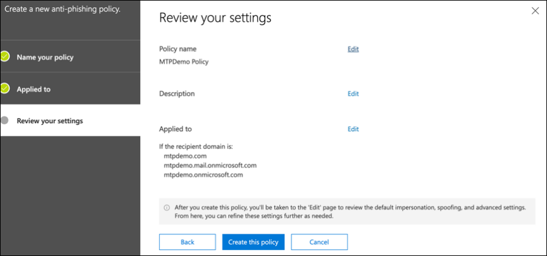
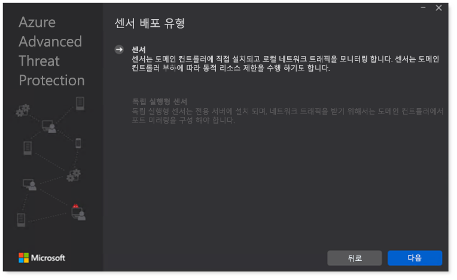

# 평가판 랩 또는 파일럿 환경에 대해 Microsoft Threat Protection 핵심 요소로 구성

[!INCLUDE [Microsoft 365 Defender rebranding](../includes/microsoft-defender.md)]

**적용 대상:**
- Microsoft 위협 방지

Microsoft Threat Protection 평가판 랩 또는 파일럿 환경을 만들고 배포 하는 과정은 다음 세 단계로 진행 됩니다.

 
<table border="0" width="100%" align="center">
  <tr style="text-align:center;">
    <td align="center" style="width:25%; border:0;" >
      <a href= "https://docs.microsoft.com/microsoft-365/security/mtp/prepare-mtpeval?view=o365-worldwide"> 
        
       1 단계: 준비 </a> 
    </td>
     <td align="center">
      <a href="https://docs.microsoft.com/microsoft-365/security/mtp/setup-mtpeval?view=o365-worldwide">
        
       2 단계: 설치 </a> 
    </td>
    <td align="center" bgcolor="#d5f5e3">
      <a href="https://docs.microsoft.com/microsoft-365/security/mtp/config-mtpeval?view=o365-worldwide">
        
       3 단계: 온보드 & 구성 </a> 
</td>

  </tr>
</table>

현재 구성 단계입니다.

준비는 성공적인 배포의 핵심입니다. 이 문서에서는 Microsoft Defender ATP 배포를 준비할 때 고려해 야 할 사항을 안내 합니다.

## Microsoft Threat Protection 핵심 요소로
Microsoft Threat Protection은 핵심 요소로 4 개로 구성 됩니다. 한 번에 네트워크 조직의 보안에 대 한 가치를 제공할 수 있지만 Microsoft Threat Protection 핵심 요소로 4 개를 사용 하도록 설정 하면 조직에 가장 많은 값이 제공 됩니다.
 
  

이 섹션에서는 다음을 구성할 수 있도록 안내 합니다.
-   Office 365 Advanced Threat Protection
-   Azure Advanced Threat Protection 
-   Microsoft Cloud App Security
-   Microsoft Defender Advanced Threat Protection

## Office 365 Advanced Threat Protection 구성
>[!NOTE]
>Office 365 Advanced Threat Protection을 이미 사용 하도록 설정한 경우에는이 단계를 건너뜁니다. 

이러한 설정 중 일부를 결정 하는 데 도움이 되는 *Office 365 Advanced Threat Protection 권장 구성 분석기 (ORCA)* 라는 PowerShell 모듈이 있습니다. ORCAReport에서 관리자 권한으로 실행 하는 경우, get-스팸 방지, 피싱 및 기타 메시지 바이러스 백신 설정을 평가 하는 데 도움이 됩니다. 이 모듈은에서 다운로드할 수 있습니다 https://www.powershellgallery.com/packages/ORCA/ . 

1. [Office 365 보안 & 준수 센터](https://protection.office.com/homepage)  >  **위협 관리**  >  **정책**으로 이동 합니다.
  
 
2. **ATP 피싱 방지**를 클릭 하 고 정책 이름과 설명을 **작성** 하 여 채웁니다 .를 선택 합니다. **다음**을 클릭합니다.
  

>[!NOTE]
>고급 ATP 피싱 방지 정책을 편집 합니다. **Advanced 피싱 임계값** 을 **2-적극적**으로 변경 합니다.
 

3. **조건 추가** 드롭다운 메뉴를 클릭 하 고 도메인을 받는 사람 도메인으로 선택 합니다. **다음**을 클릭합니다.
  
 
4. 설정을 검토 합니다. **이 정책 만들기** 를 클릭 하 여 확인 합니다. 
  
 
5. **Atp 안전한 첨부 파일** 을 선택 하 고 **SharePoint, OneDrive 및 Microsoft 팀에 게 atp 설정** 옵션을 선택 합니다.  
  

6. + 아이콘을 클릭 하 여 새 안전한 첨부 파일 정책을 만들려면 도메인에 받는 사람 도메인으로 적용 합니다. **저장**을 클릭합니다.
  
 
7. 다음으로 **ATP 안전한 링크** 정책을 선택 하 고 연필 아이콘을 클릭 하 여 기본 정책을 편집 합니다.

8. **사용자가 안전 링크를 클릭 하면 추적 안 함** 옵션이 선택 되어 있지 않은 동안 나머지 옵션이 선택 되어 있는지 확인 합니다. 자세한 내용은 [안전한 링크 설정을](https://docs.microsoft.com/microsoft-365/security/office-365-security/recommended-settings-for-eop-and-office365-atp) 참조 하십시오. **저장**을 클릭합니다. 
  

9. 다음으로, **맬웨어 방지** 정책을 선택 하 고 기본값을 선택한 다음 연필 아이콘을 선택 합니다.

10. **설정을** 클릭 하 고 **예를 선택 하 고 기본 알림 텍스트를 사용** 하 여 **맬웨어 검색 응답**을 사용 하도록 설정 합니다. **일반 첨부 파일 형식 필터** 를 설정 합니다. **저장**을 클릭합니다.
   
  
11. [Office 365 Security & 준수 센터](https://protection.office.com/homepage)  >  **검색**  >  **감사 로그 검색** 및 감사 설정으로 이동 합니다.  
  

12. Office 365 ATP와 Microsoft Defender ATP를 통합 합니다. [Office 365 Security & 준수 센터](https://protection.office.com/homepage)  >  **Threat management**  >  **Explorer** 로 이동 하 여 화면의 오른쪽 위 모서리에 있는 **wdatp 설정을** 선택 합니다. Microsoft Defender ATP 연결 대화 상자에서 **WINDOWS ATP에 연결**을 설정 합니다.
  

## Azure Advanced Threat Protection 구성
>[!NOTE]
>Azure Advanced Threat Protection을 이미 사용 하도록 설정한 경우에는이 단계를 건너뜁니다.

1. [Microsoft 365 보안 센터로](https://security.microsoft.com/info) 이동 하 > **기타 리소스**  >  **Azure Advanced Threat Protection**를 선택 합니다.
  

2. **만들기** 를 클릭 하 여 Azure Advanced Threat Protection 마법사를 시작 합니다. 
   

3. **Active Directory 포리스트에 연결 하려면 사용자 이름 및 암호 입력**을 선택 합니다.  
  

4. Active Directory 온-프레미스 자격 증명을 입력 합니다. 이 계정에는 Active Directory에 대 한 읽기 액세스 권한이 있는 모든 사용자 계정이 있을 수 있습니다.
  

5. 그런 다음 **센서 설정 다운로드** 및 도메인 컨트롤러로 파일 전송을 선택 합니다. 
  

6. Azure ATP 센서 설정을 실행 하 고 마법사 팔 로우를 시작 합니다.
   
 
7. 센서 배포 유형에서 **다음** 을 클릭 합니다.
   
 
8. 마법사에서 다음에 입력 해야 하므로 액세스 키를 복사 합니다.
  
 
9. Access 키를 마법사에 복사 하 고 **설치**를 클릭 합니다. 
   

10. 축 하 합니다, 도메인 컨트롤러에서 Azure Advanced Threat Protection을 구성 했습니다.
  
 
11. [Azure AZURE atp](https://go.microsoft.com/fwlink/?linkid=2040449) 설정 섹션에서 **Windows Defender atp**를 선택 하 고 설정/해제를 켭니다. **저장**을 클릭합니다. 
  

>[!NOTE]
>Windows Defender ATP가 Microsoft Defender ATP와 다시 브랜드 되었습니다. 모든 포털에서 다시 브랜딩 변경을 수행 하는 것은 일관성을 위해 롤업 되 고 있습니다.

## Microsoft Cloud App Security 구성
>[!NOTE]
>Microsoft Cloud App Security를 이미 사용 하도록 설정한 경우에는이 단계를 건너뜁니다. 

1. [Microsoft 365 보안 센터로](https://security.microsoft.com/info)이동  >  **More Resources**  >  **microsoft Cloud App security**.
  

2. Azure ATP를 통합 하는 정보 프롬프트에서 **AZURE atp 데이터 통합 사용**을 선택 합니다. 
   

>[!NOTE]
>이 메시지가 표시 되지 않으면 Azure ATP 데이터 통합이 이미 사용 하도록 설정 되었음을 의미할 수 있습니다. 그러나 확실히 모르는 경우 IT 관리자에 게 문의 하 여 확인 합니다. 

3. **설정**으로 이동 하 여 **Azure ATP 통합** 을 설정/해제 한 다음 **저장**을 클릭 합니다. 
  
>[!NOTE]
>새 Azure ATP 인스턴스의 경우이 통합 토글이 자동으로 설정 됩니다. 다음 단계를 진행 하기 전에 Azure ATP 통합을 사용 하도록 설정 했는지 확인 합니다.
 
4. 클라우드 검색 설정 아래에서 **Microsoft DEFENDER ATP 통합**을 선택한 다음 통합을 사용 하도록 설정 합니다. **저장**을 클릭합니다.
  

5. 클라우드 검색 설정에서 **사용자 향상**을 선택한 다음 Azure Active Directory와의 통합을 사용 하도록 설정 합니다.
  

## Microsoft Defender Advanced Threat Protection 구성
>[!NOTE]
>Microsoft Defender Advanced Threat Protection을 이미 사용 하도록 설정한 경우에는이 단계를 건너뜁니다.

1. [Microsoft 365 보안 센터](https://security.microsoft.com/info)  >  **More Resources**  >  **microsoft Defender 보안 센터**리소스로 이동 합니다. **열기**를 클릭합니다. 
   
 
2. Microsoft Defender Advanced Threat Protection 마법사를 따릅니다. **다음**을 클릭합니다. 
   

3. 기본 설정 데이터 저장소 위치, 데이터 보존 정책, 조직 크기 및 미리 보기 기능의 옵트인에 따라를 선택 합니다. 
   
>[!NOTE]
>나중에 데이터 저장 위치와 같은 일부 설정은 변경할 수 없습니다. 
 

**다음**을 클릭합니다. 

4. **계속** 을 클릭 하 고 MICROSOFT Defender ATP 테 넌 트를 프로 비전 합니다.
   

5. 그룹 정책, Microsoft Endpoint Manager 또는 Microsoft Defender ATP에 대 한 로컬 스크립트를 실행 하 여 끝점을 온보드 했습니다. 편의상이 가이드에서는 로컬 스크립트를 사용 합니다.

6. **패키지 다운로드** 를 클릭 하 고 사용자의 끝점에 온 보 딩 스크립트를 복사 합니다.  
   

7. 끝점에서 온 보 딩 스크립트를 관리자로 실행 하 고 Y를 선택 합니다.
   

8. 축 하 합니다, 첫 번째 끝점을 등록 했습니다.  
   

9. Microsoft Defender ATP 마법사의 검색 테스트를 복사 하 여 붙여 넣습니다.
   

10. 관리자 권한 명령 프롬프트에 PowerShell 스크립트를 복사 하 고 실행 합니다. 
   

11. 마법사에서 **Microsoft DEFENDER ATP 사용 시작** 을 선택 합니다.
   
 
12. [Microsoft Defender 보안 센터](https://securitycenter.windows.com/)를 방문 합니다. **설정** 으로 이동한 후 **고급 기능**을 선택 합니다. 
   

13. **Azure Advanced Threat Protection**과의 통합을 사용 하도록 설정 합니다.  
   

14. **Office 365 위협 인텔리전스**와의 통합을 설정 합니다.
   

15. **Microsoft Cloud App Security**와의 통합을 설정 합니다.
   

16. 아래로 스크롤한 후 **기본 설정 저장** 을 클릭 하 여 새 통합을 확인 합니다.
   

## Microsoft Threat Protection 서비스 시작
>[!NOTE]
>2020 년 6 월 1 일부 부터는 Microsoft에서 모든 적격 테 넌 트에 대해 Microsoft Threat Protection 기능을 자동으로 사용 하도록 설정 합니다. 자세한 내용은 [라이선스 자격에 대 한 Microsoft 기술 커뮤니티 문서를](https://techcommunity.microsoft.com/t5/security-privacy-and-compliance/microsoft-threat-protection-will-automatically-turn-on-for/ba-p/1345426) 참조 하세요. 
 

[Microsoft 365 보안 센터로](https://security.microsoft.com/homepage)이동 합니다. **설정** 으로 이동한 후 **Microsoft Threat Protection**을 선택 합니다.
   

보다 포괄적인 지침을 보려면 [Microsoft Threat Protection 설정을](mtp-enable.md)참조 하십시오. 

축하합니다! Microsoft Threat Protection 평가판 랩 또는 파일럿 환경을 만들었습니다. 이제 Microsoft Threat Protection 사용자 인터페이스를 이해 하는 데 도움이 될 수 있습니다. 일상적인 보안 작업을 위해 각 대시보드를 사용 하는 방법을 확인할 수 있는 방법은 [Microsoft Threat Protection 대화형 가이드](https://aka.ms/MTP-Interactive-Guide)를 참조 하세요.

다음으로, 공격을 시뮬레이트하고 상호 제품 기능 검색 방법, 알림을 만들고 끝점에 대 한 fileless 공격에 자동으로 대응 하는 방법을 확인할 수 있습니다.

## 다음 단계
|  [공격 시뮬레이션 단계](mtp-pilot-simulate.md) | Microsoft Threat Protection 파일럿 환경에 대 한 공격 시뮬레이션을 실행 합니다.
|:-------|:-----|
