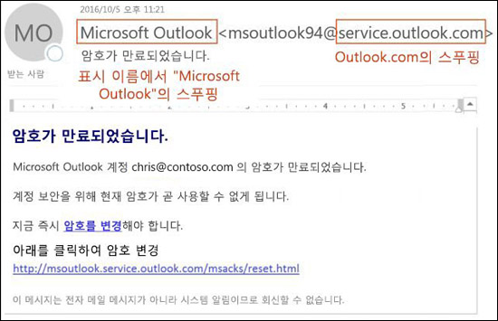
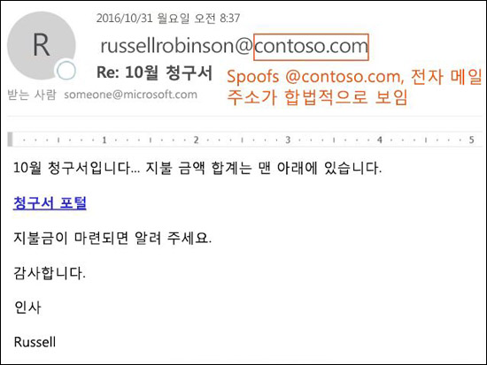
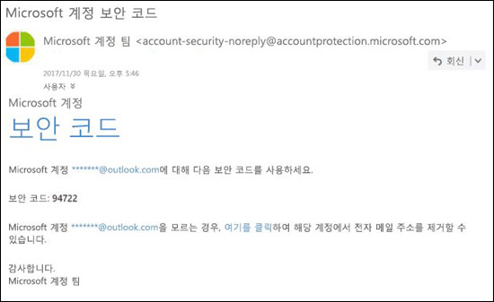

# EOP의 스푸핑 방지 보호 기능

Exchange Online 사서함이 있는 Microsoft 365 조직 또는 Exchange online 사서함이 없는 독립 실행형 EOP(Exchange Online Protection) 조직의 경우, EOP에 가짜(위조) 발신인으로부터 조직을 보호하는 데 도움이 되는 기능이 포함됩니다.

사용자 보호와 관련해 Microsoft는 피싱 위협을 심각한 위험으로 간주합니다. 스푸핑은 공격자가 흔히 사용하는 기술로 **스푸핑된 메시지가 실제 출처가 아닌 다른 사람이나 다른 곳에서 시작된 것처럼 보입니다**. 이 기법은 사용자 자격 증명을 얻기 위해 고안된 피싱 캠페인에서 주로 사용됩니다. EOP의 스푸핑 방지 기술은 특히 메시지 본문에서 보낸 사람 머리글의 위조를 검사합니다(전자 메일 클라이언트에서 메시지 보낸 사람을 표시하는 데 사용됨). EOP에서 보낸 사람 머리글이 위조되었다는 강한 확신이 있는 경우 메시지는 가짜로 식별됩니다.

EOP에서 다음 스푸핑 방지 기술을 사용할 수 있습니다.

- **스푸핑 인텔리전스**: 내부 및 외부 도메인의 보낸 사람으로부터 스푸핑된 메시지를 검토하고 해당 보낸 사람을 허용하거나 차단합니다. 자세한 내용은 [Microsoft 365에 스푸핑 인텔리전스 구성](learn-about-spoof-intelligence.md)을 참조하세요.

- **피싱 방지 정책**: EOP에서 피싱 방지 정책을 사용하면 스푸핑 인텔리전스를 설정 또는 해제하고, Outlook의 인증되지 않은 발신자 신원 확인을 설정 또는 해제하며, 차단된 스푸핑된 발신자(정크 메일 폴더 또는 격리로 이동)에 대한 작업을 지정할 수 있습니다. Office 365 ATP(Advanced Threat Protection)에서 제공하는 고급 피싱 방지 정책에는 가장 방지 설정(보호된 발신자 및 도메인), 사서함 인텔리전스 설정 및 조정 가능한 고급 피싱 임계값 또한 포함되어 있습니다. 자세한 내용은 [Microsoft 365의 피싱 방지 정책](set-up-anti-phishing-policies.md)을 참조하세요.

- **전자 메일 인증**: 모든 스푸핑 방지 작업의 필수 요소는 SPF, DKIM 및 DNS의 DMARC 레코드에서 전자 메일 인증(다른 말로 전자 메일 유효성 검사라고 함)을 사용하는 것입니다. 대상 전자 메일 시스템에서 도메인에 속한 발신자로부터 시작되었다고 주장하는 메시지의 유효성을 검사할 수 있도록 도메인에 대해 이러한 레코드를 구성할 수 있습니다. 인바운드 메시지의 경우 Microsoft 365를 사용하려면 발신자 도메인에 대한 전자 메일 인증을 수행해야 합니다. 자세한 내용은 [Microsoft 365의 전자 메일 인증](email-validation-and-authentication.md)을 참조하세요.

2018년 10월부터 EOP에서 스푸핑 방지 보호를 사용할 수 있습니다. 그때까지는, Office 365 ATP가 있는 조직만 스푸핑 방지 보호 기능을 사용할 수 있습니다.

EOP는 표준 전자 메일 인증 방법과 보낸 사람 신뢰도 기술을 조합하여 인증하지 못하는 메시지를 분석 및 차단합니다.

## 피싱 공격에서 스푸핑을 사용하는 방법

스푸핑 메시지는 사용자에게 다음과 같은 부정적인 영향을 미칩니다.

- **스푸핑된 메시지가 사용자 속이기**: 스푸핑된 메시지는 수신인으로 하여금 링크를 클릭하고 자격 증명을 포기하거나 맬웨어를 다운로드하거나 민감한 콘텐츠가 있는 메시지에 회신하도록 속일 수 있습니다(비즈니스 전자 메일 손상 또는 BEC라고 함).

  다음 메시지는 스푸핑된 발신자 msoutlook94@service.outlook.com을 사용하는 피싱의 예입니다.

  

  이 메일은 service.outlook.com에서 발송되지 않았지만 공격자는 발송된 것처럼 보이도록 **보낸 사람** 머리글 필드를 도용했습니다. 즉 받는 사람이 **암호 변경** 링크를 클릭하고 자격 증명을 넘기도록 속이려고 한 것입니다.

  다음 메일은 도용 당한 전자 메일 도메인 contoso.com을 사용한 BEC의 한 예입니다.

  

  메일이 적법한 것처럼 보이지만 발신자 스푸핑에 해당합니다.

- **사용자가 진짜 메일을 가짜로 혼동**: 피싱에 대해 아는 사용자라도 실제 메일과 스푸핑된 메일 간의 차이를 알아보기 어려울 수 있습니다.

  다음 메일은은 Microsoft Security 계정에서 발송된 실제 암호 재설정 메일의 예입니다.

  

  메일은 정말로 Microsoft에서 발송되었지만 사용자는 의심하도록 훈련받았습니다. 실제 암호 재설정 메일과 가짜 메일 간의 차이점을 구별하기 어렵기 때문에 사용자는 이러한 메일을 무시하거나, 스팸으로 신고하거나, 아니면 쓸데없이 피싱 메일로 Microsoft에 신고할 수 있습니다.

## 다양한 스푸핑 유형

Microsoft는 서로 다른 두 가지 유형의 스푸핑 메일을 구분합니다.

- **조직 내 스푸핑**: _자체_ 스푸핑으로도 알려졌습니다. 예시:

  - 보낸 사람과 받는 사람이 같은 도메인 소속입니다.
    > 보낸 사람: jihoo@contoso.com   To: michelle@contoso.com

  - 보낸 사람과 받는 사람이 같은 도메인의 하위 도메인 소속입니다.
    > 보낸 사람: laura@marketing.fabrikam.com   받는 사람: julia@engineering.fabrikam.com

  - 보낸 사람과 받는 사람이 동일한 조직에 속하는 다른 도메인 소속입니다(즉, 동일한 조직에서 두 도메인이 모두 [허용 도메인](https://docs.microsoft.com/exchange/mail-flow-best-practices/manage-accepted-domains/manage-accepted-domains)으로 구성되어 있음).
    > 발신자: 보낸 사람@microsoft.com   수신자: 받는 사람@bing.com

    스팸봇 수확을 방지하고자 전자 메일 주소에서 공백이 사용됩니다.

  조직 내 스푸핑으로 인해 [복합 인증](email-validation-and-authentication.md#composite-authentication)에 실패하는 메일에는 다음 머리글 값이 포함됩니다.

  `Authentication-Results: ... compauth=fail reason=6xx`

  `X-Forefront-Antispam-Report: ...CAT:SPOOF;...SFTY:9.11`

  - `reason=6xx`은(는) 조직 내 스푸핑임을 나타냅니다.

  - SFTY는 메일의 보안 수준을 말합니다. 9는 피싱, 11은 조직 내 스푸핑을 나타냅니다.

- **도메인 간 스푸핑**: 보낸 사람과 받는 사람 도메인이 다르고 서로 아무 관계가 없습니다(또는 외부 도메인). 예시:
    > 보낸 사람: jihoo@contoso.com   받는 사람: michelle@tailspintoys.com

  도메인 간 스푸핑으로 인해 [복합 인증](email-validation-and-authentication.md#composite-authentication)에 실패하는 메일에는 다음 머리글 값이 포함됩니다.

  `Authentication-Results: ... compauth=fail reason=000/001`

  `X-Forefront-Antispam-Report: ...CAT:SPOOF;...SFTY:9.22`

  - `reason=000`은(는) 메일이 명시적 전자 메일 인증에 실패했음을 나타냅니다. `reason=001`은(는) 메일이 암묵적인 전자 메일 인증에 실패했음을 나타냅니다.

  - SFTY는 메일의 보안 수준을 말합니다. 9는 피싱, .22는 도메인 간 스푸핑을 나타냅니다.

스푸핑과 관련된 범주 및 복합 인증(compauth) 값에 대한 자세한 내용은 [Microsoft 365의 스팸 방지 메시지 머리글](anti-spam-message-headers.md)을 참조하세요.

DMARC에 대한 자세한 내용은 [Microsoft 365의 DMARC를 사용한 전자 메일 유효성 검사](use-dmarc-to-validate-email.md)를 참조하세요.

## 스푸핑으로 표시된 메일 수에 대한 보고서

EOP 조직은 보안 & 준수 센터의 보고서 대시보드에서 **스푸핑 감지** 보고서를 사용할 수 있습니다. 자세한 내용은 [스푸핑 감지 보고서](view-email-security-reports.md#spoof-detections-report)를 참조하세요.

Office 365 ATP 조직은 보안 & 준수 센터의 위협 탐색기를 사용하여 피싱 시도에 대한 정보를 확인할 수 있습니다. 자세한 내용은 [Microsoft 365 위협 조사 및 대응](office-365-ti.md)을 참조하세요.

## 스푸핑 방지 보호 관련 문제

메일 그룹(또는 토록 목록)은 메일을 전달 및 수정하는 방식으로 인해 스푸핑 방지에 문제가 있는 것으로 알려졌습니다.

예를 들어 Gabriela Laureano(glaureano@contoso.com)는 새 관찰에 관심이 있고 birdwatchers@fabrikam.com이라는 메일 그룹에 참여하여 그룹에 다음 메일을 전송합니다.

> **보낸 사람:** "Gabriela Laureano" \<glaureano@contoso.com\>   **받는 사람:** Birdwatcher의 토론 목록 \<birdwatchers@fabrikam.com\>   
**제목:** 산 정상에서 바라보는 파란색 제비의 장관 레이니어 이번 주   이번 주에 레이니어 산에서 이 광경을 확인하고 싶은  사람이 있습니까?

메일 그룹 서버에서 메시지를 수신하고, 내용을 수정하며, 목록 구성원에게 재생합니다. 재생된 메시지의 보낸 사람 주소(glaureano@contoso.com)는 같지만 제목 줄에 태그가 추가되고 메일의 맨 아래에 바닥글이 추가되었습니다. 이러한 수정 유형은 메일 그룹에서 일반적이며 스푸핑 오탐지를 초래할 수 있습니다.

> **보낸 사람:** "Gabriela Laureano" \<glaureano@contoso.com\>   **받는 사람:** Birdwatcher의 토론 목록 \<birdwatchers@fabrikam.com\>   **제목:** [새 구경] 산 정상에서 바라보는 파란색 제비의 장관 레이니어 이번 주    이번 주에 레이니어 산에서 이 광경을 확인하고 싶은  사람이 있습니까?    Birdwatchers 토론 목록에 이 메시지가 전송되었습니다. 구독은 언제든지 취소할 수 있습니다.

메일 그룹 메일이 스푸핑 방지 검사를 통과할 수 있도록 메일 그룹 제어 여부에 따라 다음 단계를 수행하세요.

- 조직이 메일 그룹을 소유한 경우:

  - DMARC.org의 FAQ를 확인하십시오. [메일링 목록을 운영 중이며 DMARC와 상호 운용하고 싶습니다. 어떻게 해야 합니까?](https://dmarc.org/wiki/FAQ#I_operate_a_mailing_list_and_I_want_to_interoperate_with_DMARC.2C_what_should_I_do.3F).

  - 이 블로그 게시물의 지침을 읽으십시오: [메일 그룹 운영자가 DMARC와 상호 작용하여 실패를 방지하는 팁](https://blogs.msdn.microsoft.com/tzink/2017/03/22/a-tip-for-mailing-list-operators-to-interoperate-with-dmarc-to-avoid-failures/).

  - ARC를 지원하기 위해 메일 그룹 서버에 업데이트를 설치하는 것을 고려한다면 [https://arc-spec.org](https://arc-spec.org/)을 참조하십시오.

- 조직이 메일 그룹을 소유하고 있지 않음:

  - 메일 그룹 관리자에게 메일 그룹이 리스트가 받아서 전달 중인 도메인의 전자 메일 인증을 구성할 것을 요청합니다.

    충분한 수의 보낸 사람이 도메인 소유자에게 전자 메일 인증 레코드를 설정해야한다고 회신하면 이들은 작업을 수행하게 됩니다. Microsoft는 도메인 소유자와 함께 필요한 레코드를 게시하기도 하지만 개별 사용자가 요청할 때 더 많은 도움을줍니다.

  - 이메일 클라이언트에서 받은 편지함 규칙을 만들어 메일을 받은 편지함으로 이동합니다. [스푸핑 인텔리전스를 사용해 인증되지 않은 전자 메일의 허용된 송신자 구성](email-validation-and-authentication.md#use-spoof-intelligence-to-configure-permitted-senders-of-unauthenticated-email)에 나온 대로 관리자에게 재정의를 구성하도록 요청할 수도 있습니다.

  - Microsoft 365에서 지원 티켓을 만들면 재정의를 만들어서 메일 그룹을 합법적인 것으로 처리할 수 있습니다. 자세한 내용은 [비즈니스 제품에 대한 고객 지원팀 문의 - 관리자 도움말](../../admin/contact-support-for-business-products.md)을 참조하세요.

그 밖의 모든 시도가 실패하면 Microsoft에 메일을 가양성으로 보고할 수 있습니다. 자세한 내용은 [Microsoft에 메시지와 파일 보고](report-junk-email-messages-to-microsoft.md)를 참조하세요.

Microsoft 지원 티켓으로 사용하도록 관리자에게 문의할 수도 있습니다. Microsoft 엔지니어링 팀은 메시지가 스푸핑으로 표시된 이유를 조사합니다.

## 스푸핑 방지 보호 기능 고려 사항

현재 Microsoft 365로 메시지를 전송하는 관리자의 경우, 전자 메일이 제대로 인증되는지 확인해야 합니다. 인증되지 않으면 스팸 또는 피싱으로 표시될 수 있습니다. 자세한 내용은 [인증 되지 않은 전자 메일을 보내려는 는 정당한 발신자용 솔루션](email-validation-and-authentication.md#solutions-for-legitimate-senders-who-are-sending-unauthenticated-email)을 참조하세요.