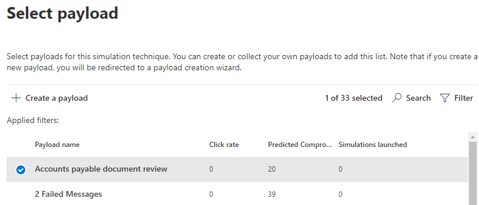

# 피싱 공격 시뮬레이션

Microsoft Defender for Office 365를 통한 Attack 시뮬레이터 교육을 통해 조직의 직원 들에 게 보안 정책 및 사례를 테스트 하 고 조직의 직원이 자신의 공격에 대 한 susceptibility을 절감할 수 있도록 교육을 받을 수도 있습니다. 다음은 attack 시뮬레이터 교육을 사용 하 여 피싱 공격을 시뮬레이션 하는 과정입니다.

[!INCLUDE [Prerelease information](../includes/prerelease.md)]

시뮬레이트된 피싱 공격을 시작 하려면 [Microsoft 365 보안 센터로](https://security.microsoft.com/)이동 합니다. **전자 메일 & 공동 작업** 에서 **공격 시뮬레이터** 를 클릭 하 고 [**시뮬레이션**](https://security.microsoft.com/attacksimulator?viewid=simulations) 탭으로 전환 합니다.

시뮬레이션 **아래** 에서 **시뮬레이션을** 선택 합니다.

> [!NOTE]
> 시뮬레이션을 만들 때 언제 든 지 나중에 시뮬레이션을 계속 구성 하기 위해 저장 하 고 닫을 수 있습니다.

## 소셜 엔지니어링 기술 선택

[MITRE at&t&접시 헤드® 프레임 워크](https://attack.mitre.org/techniques/enterprise/)의 네 가지 방법, 맞게 조정 된을 선택 합니다. 다양 한 방법으로 서로 다른 페이로드를 사용할 수 있습니다.

- **자격 증명** 수집은 사용자 이름 및 암호를 전송 하는 입력란을 사용 하 여 직원 들이 자격 증명을 수집할 수 있도록 시도 합니다.
- **맬웨어 첨부 파일** 에 악의 있는 첨부 파일이 메시지에 추가 됩니다. 이 첨부 파일을 열면 공격자가 대상 장치를 손상 시키는 데 도움이 되는 일부 임의 코드가 실행 됩니다.
- **첨부 파일의 링크** 는 자격 증명 수집 하이브리드의 유형입니다. 공격자가 URL을 전자 메일 첨부 파일에 삽입 합니다. 첨부 파일 내의 URL은 자격 증명을 수집 하는 것과 동일한 방법을 따릅니다.
- **맬웨어에 연결** 하면 잘 알려진 파일 공유 사이트에서 호스트 되는 파일에서 일부 임의 코드가 실행 됩니다. 이 악성 파일에 대 한 링크가 대상으로 전송 된 메시지에 추가 되 고, 클릭 하면 파일을 실행 하 고 공격자가 대상의 장치를 손상 시키는 데 도움이 됩니다.

> [!TIP]
> 각 기술 설명 내에서 **세부 정보 보기** 를 클릭 하면 기술에 대 한 추가 정보 및 해당 기법의 시뮬레이션 단계가 표시 됩니다.
>
> 

이 방법을 선택 하 고 **다음** 을 클릭 한 후에는 시뮬레이션에 이름을 지정 하 고 원하는 경우 설명을 입력 합니다.

## 페이로드 선택

다음으로 기존 페이로드 카탈로그에서 페이로드를 선택 해야 합니다.

페이로드에는 다음과 같은 다양 한 데이터 요소를 선택할 수 있습니다.

- **속도를 클릭** 하면이 페이로드를 클릭 한 사용자의 수가 계산 됩니다.
- **예측 된 손상 률** 은 Microsoft Defender for Office 365 고객 전반에서이 페이로드의 기록 데이터를 기반으로이 페이로드에 의해 손상 될 사용자 비율을 예측 합니다.
- **시뮬레이션이 시작** 됨이 페이로드가 다른 시뮬레이션에서 사용 된 횟수입니다.
- **복잡성** ( **필터** 를 통해 사용 가능)은 공격 대상이 되는 것을 알 수 있는 페이로드 내의 지표 수를 기반으로 계산 됩니다. 더 많은 지표로 인해 복잡도가 낮아집니다.
- **원본** ( **필터** 를 통해 사용 가능)은 해당 페이로드가 테 넌 트에서 만들어졌거나 Microsoft의 기존 페이로드 카탈로그 (전역)에 포함 되어 있는지 여부를 나타냅니다.

목록에서 페이로드를 선택 하 여 해당 페이로드에 대 한 추가 정보를 볼 수 있는 페이로드의 미리 보기를 표시 합니다.

자체 페이로드를 만들려면 [공격 시뮬레이션 학습을 위한 페이로드 만들기](attack-simulation-training-payloads.md)를 읽어보십시오.

## 대상 그룹 지정

이제이 시뮬레이션 대상 그룹을 선택 합니다. **조직의 모든 사용자를 포함** 하거나 **특정 사용자 및 그룹만 포함** 하도록 선택할 수 있습니다. 

**특정 사용자 및 그룹만 포함** 하도록 선택 하는 경우 다음 중 하나를 수행할 수 있습니다.

- **사용자를 추가** 하 여 테 넌 트에 대 한 검색을 활용 하 고 지난 3 개월 동안의 시뮬레이션 대상이 아닌 대상 사용자와 같은 고급 검색 및 필터링 기능을 사용할 수 있습니다.
  
- **CSV에서 가져오기** 기능을 사용 하면이 시뮬레이션에 대해 미리 정의 된 사용자 집합을 가져올 수 있습니다.

## 교육 할당

교육을 통과 하는 직원은 유사한 공격에 덜 취약 하므로 각 시뮬레이션에 대 한 교육을 할당 하는 것이 좋습니다.

교육을 할당 하도록 선택 하거나 직접 교육 코스 및 모듈을 선택할 수 있습니다.

직원 들이 적절 한 시간 내에 교육을 완료 했는지 확인 하기 위해 **교육 기한을** 선택 합니다.

> [!NOTE]
> 강의 및 모듈을 직접 선택 하는 경우에도 사용할 수 있는 모든 과정 및 모듈 뿐 아니라 권장 되는 콘텐츠도 볼 수 있습니다.
>
> 

다음 단계에서는 trainings를 직접 선택 하 고 교육 랜딩 페이지를 사용자 지정 하는 경우 **추가** 해야 합니다. 학습 랜딩 페이지를 미리 볼 수 있을 뿐만 아니라 머리글 및 본문을 변경할 수도 있습니다.

## 세부 정보 시작 및 검토

모든 것이 구성 되었으므로이 시뮬레이션을 즉시 시작 하거나 나중에 예약할 수 있습니다. 또한이 시뮬레이션을 종료 하는 경우를 선택 해야 합니다. 선택한 시간 이후에이 시뮬레이션을 사용한 상호 작용 캡처를 중지 합니다. 

지역에 따른 작업 시간 동안 직원에 게 시뮬레이트된 공격 메시지를 배달 하도록 **지역별 수신 표준 시간대 배달을 사용 하도록 설정** 합니다.

작업이 완료 되 면 **다음** 을 클릭 하 고 시뮬레이션에 대 한 세부 정보를 검토 합니다. 변경할 부분에 대 한 **편집** 을 클릭 하 여 되돌아가서 변경 해야 하는 세부 정보를 변경 합니다. 작업이 완료 되 면 **제출을** 클릭 합니다.
