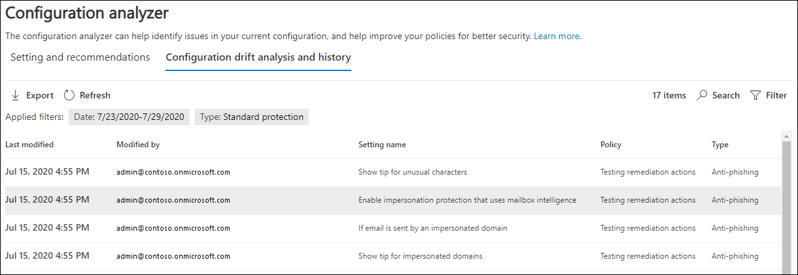

# EOP 및 Office 365 ATP의 보호 정책에 대 한 구성 분석기

> [!NOTE]
> 이 항목에서 설명 하는 기능은 미리 보기 상태 이며, 모든 조직에서 사용할 수 있는 것은 아니며, 변경 될 수 있습니다.

보안 & 준수 센터의 구성 분석기는 [미리 설정 된 보안 정책](preset-security-policies.md)에서 표준 보호 및 엄격한 보호 프로필 설정 아래에 있는 설정을 포함 하는 모든 보안 정책을 찾고 수정 하는 데 사용할 수 있는 중앙 위치를 제공 합니다.

구성 분석기에서는 다음과 같은 유형의 정책을 분석 합니다.

- **EOP (Exchange Online Protection) 정책**: exchange online 사서함을 사용 하는 Microsoft 365 조직과 exchange online 사서함이 없는 독립 실행형 EOP 조직이 포함 됩니다.
  
  - [스팸 방지 정책](configure-your-spam-filter-policies.md)
  - [맬웨어 방지 정책](configure-anti-malware-policies.md)
  - [EOP 피싱 방지 정책](set-up-anti-phishing-policies.md#spoof-settings)

- **Office 365 atp (Advanced Threat Protection) 정책**: 여기에는 Microsoft 365 E5 또는 OFFICE 365 ATP 추가 기능 구독이 있는 조직이 포함 됩니다.

  - ATP 피싱 방지 정책에는 다음이 포함 됩니다.

    - EOP 피싱 방지 정책에서 사용할 수 있는 것과 동일한 [스푸핑 설정](set-up-anti-phishing-policies.md#spoof-settings)
    - [가장 설정](set-up-anti-phishing-policies.md#impersonation-settings-in-atp-anti-phishing-policies)
    - [고급 피싱 임계값](set-up-anti-phishing-policies.md#advanced-phishing-thresholds-in-atp-anti-phishing-policies)

  - [안전한 링크 정책](recommended-settings-for-eop-and-office365-atp.md#safe-links-policy-settings-in-custom-policies-for-specific-users)

  - [안전한 첨부 파일 정책](recommended-settings-for-eop-and-office365-atp.md#safe-attachments-policy-settings-in-custom-policies-for-specific-users)

초기 계획으로 사용 되는 **표준** 및 **엄격한** 정책 설정 값은 [EOP 및 Office 365 ATP 보안에 대 한 권장 설정](recommended-settings-for-eop-and-office365-atp.md)에 설명 되어 있습니다.

## 시작하기 전에 알아야 할 내용은 무엇인가요?

- <https://protection.office.com/>에서 보안 및 준수 센터를 엽니다. **구성 분석기** 페이지로 바로 이동 하려면을 사용 <https://protection.office.com/configurationAnalyzer> 합니다.

- Exchange Online PowerShell에 연결하려면 [Exchange Online PowerShell에 연결](https://docs.microsoft.com/powershell/exchange/connect-to-exchange-online-powershell)을 참조하세요.

- 이 항목의 절차를 수행하려면 먼저 사용 권한을 할당받아야 합니다.

  - 구성 분석기를 사용 하 **고** 보안 정책을 업데이트 하려면 다음 역할 그룹 중 하나의 구성원 이어야 합니다.

    - [보안 및 준수 센터](permissions-in-the-security-and-compliance-center.md)의 **조직 관리** 또는 **보안 관리자**
    - [Exchange Online](https://docs.microsoft.com/Exchange/permissions-exo/permissions-exo#role-groups)의 **조직 관리** 및 **예방 조치 관리**

  - 구성 분석기에 대 한 읽기 전용 액세스를 위해서는 다음 역할 그룹 중 하나의 구성원 이어야 합니다.

    - [보안 및 준수 센터](permissions-in-the-security-and-compliance-center.md)의 **보안 읽기**
    - [Exchange Online](https://docs.microsoft.com/Exchange/permissions-exo/permissions-exo#role-groups)의 **보기 전용 조직 관리**

## 보안 & 준수 센터의 구성 분석기 사용

보안 & 준수 센터에서 **위협 관리** \> **정책** \> **구성 분석기**로 이동 합니다.

구성 분석기에는 두 가지 주요 탭이 있습니다.

- **설정 및 권장 사항**: 표준 또는 Strict를 선택 하 고 해당 설정을 기존 보안 정책과 비교 합니다. 결과에서 설정 값을 조정 하 여 표준 또는 Strict와 같은 수준까지 표시할 수 있습니다.

- **구성 드리프트 분석 및 기록**:이 보기를 사용 하면 시간에 따른 구성 분석기의 결과에 따라 정책에 대해 수행한 변경 내용을 추적할 수 있습니다.

### 구성 분석기의 설정 및 권장 사항 탭

기본적으로 표준 보호 프로필에 대 한 비교에서 탭이 열립니다. 엄격한 **권장 사항 보기**를 클릭 하 여 엄격한 보호 프로필 비교로 전환할 수 있습니다. 다시 전환 하려면 **표준 권장 사항 보기**를 선택 합니다.

기본적으로 **정책 그룹/설정 이름** 열에는 다양 한 유형의 보안 정책 및 개선 해야 하는 정책 (있는 경우)의 설정 수에 대 한 축소 된 보기가 포함 되어 있습니다. 정책 유형은 다음과 같습니다.

- **스팸 방지**
- **피싱 방지**
- **맬웨어 방지**
- **Atp 안전한 첨부 파일** (구독에 ATP가 포함 된 경우)
- **Atp 안전한 링크** (구독에 ATP가 포함 된 경우)

기본 보기에서는 모든 항목이 축소 됩니다. 각 정책 옆에는 정책에서의 비교 결과 요약 (수정할 수 있음)과 표준 또는 엄격한 보호 프로필 (수정할 수 없음)에 대 한 해당 정책의 설정이 표시 됩니다. 다음 정보가 표시 됩니다.

- **녹색**: 모든 기존 정책의 모든 설정은 비교 중인 보호 프로필의 보안 수준 이상 이어야 합니다.
- **주황색**: 기존 정책의 소수의 설정이 비교 중인 보호 프로필 만큼 안전 하지 않습니다.
- **빨강**: 기존 정책에서 상당한 수의 설정이 비교 중인 보호 프로필 만큼 안전 하지 않습니다. 이는 여러 정책에서 몇 가지 설정이 나 한 정책에서의 여러 설정이 될 수 있습니다.

비교 시에는 **모든 설정이** \<**Standard** or **Strict**\> **권장 사항을**따릅니다. 그렇지 않으면 변경할 권장 설정의 수가 표시 됩니다.

**정책 그룹/설정 이름을**확장 하면 주의가 필요한 각 특정 정책의 모든 정책 및 관련 설정이 표시 됩니다. 또는 특정 유형의 정책 (예: **스팸 방지**)을 확장 하 여 주의가 필요한 정책 유형에 서 해당 설정만 볼 수 있습니다.

비교에 대 한 권장 사항 (녹색)이 없는 경우 정책을 확장 하면 아무 것도 표시 되지 않습니다. 향상에 대 한 권장 사항 (주황색 또는 빨간색)이 있는 경우 주의가 필요한 설정이 표시 되 고 해당 정보가 다음 열에 표시 됩니다.

- 주의가 필요한 설정의 이름입니다. 예를 들어 이전 스크린샷에서이는 스팸 방지 정책의 **대량 전자 메일 임계값** 입니다.

- **정책**: 설정이 포함 된 영향을 받는 정책의 이름입니다.

- **적용 대상**: 영향을 받는 정책이 적용 되는 사용자 수입니다.

- **현재 구성**: 설정의 현재 값입니다.

- **마지막으로 수정한**날짜: 정책을 마지막으로 수정한 시간입니다.

- **권장 사항**: 표준 또는 엄격한 보호 프로필의 설정 값입니다. 정책에서 설정 값을 보호 프로필의 권장 값과 일치 하도록 변경 하려면 **채택**을 클릭 합니다. 변경이 성공적으로 수행 되 면 **권장 사항이**적용 된 것을 볼 수 있습니다. **새로 고침** 을 클릭 하 여 추천 항목 수를 줄이고 결과에서 특정 설정/정책 행을 제거 합니다.

### 구성 분석기의 구성 드리프트 분석 및 기록 탭

이 탭에서는 보안 분석기의 정보를 기반으로 사용자 지정 보안 정책에 대 한 변경 내용을 추적할 수 있습니다. 기본적으로 다음과 같은 정보가 표시 됩니다.

- **마지막으로 수정한 날짜**
- **수정한 사람**
- **설정 이름**
- **정책**
- **Type**

결과를 필터링하려면 **필터**를 클릭합니다. **필터** 플라이 아웃이 나타나면 다음 필터 중에서 선택할 수 있습니다.

- **시작 시간** 및 **종료 시간** (날짜)
- **표준 보호** 또는 **엄격한 보호**

결과를 .csv 파일로 내보내려면 **내보내기를**클릭 합니다.

