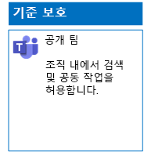
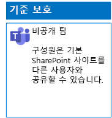
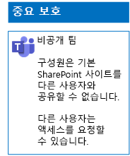
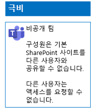

# 파일의 3단계 보호를 위한 Teams 배포Deploy teams for three tiers of protection for files

이 문서의 단계를 사용하여 초기, 중요 및 극비 팀을 디자인하고 배포합니다.Use the steps in this article to design and deploy baseline, sensitive, and highly confidential teams. 이러한 3계층 보호에 대한 자세한 내용은 [Microsoft Teams에서의 파일 보호](secure-files-in-teams.md)를 참조하세요.For more information about these three tiers of protection, see [Secure files in Microsoft Teams](secure-files-in-teams.md).

## 기준 팀Baseline teams

초기 보호에는 공용 및 비공개 팀이 모두 포함됩니다.Baseline protection includes both public and private teams. 공개 팀은 조직의 모든 사용자가 검색하고 액세스할 수 있습니다.Public teams can be discovered and accessed by anybody in the organization. 개인 사이트는 팀과 연결된 Office 365 그룹의 구성원만 검색하고 액세스할 수 있습니다.Private sites can only be discovered and accessed by members of the Office 365 group associated with the team. 이러한 유형의 팀은 모두 구성원이 다른 사용자와 사이트를 공유할 수 있습니다.Both of these types of teams allow members to share the site with others.

### 공개Public

[이 문서](https://support.office.com/article/174adf5f-846b-4780-b765-de1a0a737e2b)의 지침에 따라 공용 액세스 및 사용 권한이 있는 기준 팀을 만듭니다.Follow the instructions in [this article](https://support.office.com/article/174adf5f-846b-4780-b765-de1a0a737e2b) to create a baseline Team with public access and permissions.

구성 결과는 다음과 같습니다.Here is your resulting configuration.

### 비공개Private

[이 문서](https://support.office.com/article/174adf5f-846b-4780-b765-de1a0a737e2b)의 지침에 따라 개인 액세스 및 사용 권한이 있는 기준 팀을 만듭니다.Follow the instructions in [this article](https://support.office.com/article/174adf5f-846b-4780-b765-de1a0a737e2b) to create a baseline Team with private access and permissions.

구성 결과는 다음과 같습니다.Here is your resulting configuration.

## 중요 팀Sensitive teams

중요한 팀의 경우 먼저 [비공개 팀 만들기](https://support.office.com/article/174adf5f-846b-4780-b765-de1a0a737e2b)로 시작합니다.For a sensitive team, you start by [creating a private team](https://support.office.com/article/174adf5f-846b-4780-b765-de1a0a737e2b).

다음으로, 팀 구성원이 공유하지 못하도록 기본 SharePoint 사이트를 구성합니다.Next, you configure the underlying SharePoint site to prevent sharing by team members.

1. 팀의 도구 막대에서 **파일**을 클릭합니다.In the tool bar for the team, click **Files**.

2. 줄임표를 클릭한 다음 **SharePoint에서 열기**를 클릭합니다.Click the ellipsis, and then click **Open in SharePoint**.

3. 기본 SharePoint 사이트의 도구 막대에서 설정 아이콘을 클릭한 다음 **사이트 사용 권한**을 클릭합니다.In the tool bar of the underlying SharePoint site, click the settings icon, and then click **Site permissions**.

4. **사이트 사용 권한** 창에 있는 **공유 설정**에서 **공유 설정 변경**을 클릭합니다.In the **Site permissions** pane, under **Sharing Settings**, click **Change sharing settings**.

5. **사용 권한 공유**에서 **사이트 소유자만 파일, 폴더 및 사이트를 공유할 수 있습니다**를 선택하고 **저장**을 클릭합니다.Under **Sharing permissions**, choose **Only site owners can share files, folders, and the site**, and then click **Save**.

구성 결과는 다음과 같습니다.Here is your resulting configuration.

## 극비 팀Highly confidential teams

극비 팀의 경우 먼저 [비공개 팀 만들기](https://support.office.com/article/174adf5f-846b-4780-b765-de1a0a737e2b)로 시작합니다.With a highly confidential team, you start by [creating a private team](https://support.office.com/article/174adf5f-846b-4780-b765-de1a0a737e2b).

다음으로, 팀 구성원이 공유하고 팀 구성원이 아닌 사용자가 액세스 요청을 못하도록 기본 SharePoint 사이트를 구성합니다.Next, you configure the underlying SharePoint site to prevent sharing by team members and the requesting of access by non-members of the team.

1. 팀의 도구 막대에서 **파일**을 클릭합니다.In the tool bar for the team, click **Files**.

2. 줄임표를 클릭한 다음 **SharePoint에서 열기**를 클릭합니다.Click the ellipsis, and then click **Open in SharePoint**.

3. 기본 SharePoint 사이트의 도구 막대에서 설정 아이콘을 클릭한 다음 **사이트 사용 권한**을 클릭합니다.In the tool bar of the underlying SharePoint site, click the settings icon, and then click **Site permissions**.

4. **사이트 사용 권한** 창에 있는 **공유 설정**에서 **공유 설정 변경**을 클릭합니다.In the **Site permissions** pane, under **Sharing Settings**, click **Change sharing settings**.

5. **사용 권한 공유**에서 **사이트 소유자만 파일, 폴더 및 사이트를 공유할 수 있습니다**를 선택합니다.Under **Sharing permissions**, choose **Only site owners can share files, folders, and the site**.

6. **액세스 요청 허용**을 해제한 다음, **저장**을 클릭합니다.Turn off **Allow access requests**, and then click **Save**.

구성 결과는 다음과 같습니다.Here is your resulting configuration.

## 다음 단계Next step

[보존 레이블 및 DLP를 사용하여 팀에서 파일을 보호Protect files in teams with retention labels and DLP](deploy-teams-retention-DLP.md)

## 참고 항목See also

[Microsoft Teams에서의 파일 보호Secure files in Microsoft Teams](secure-files-in-teams.md)

[클라우드 도입 및 하이브리드 솔루션Cloud adoption and hybrid solutions](https://docs.microsoft.com/office365/enterprise/cloud-adoption-and-hybrid-solutions)
