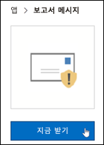
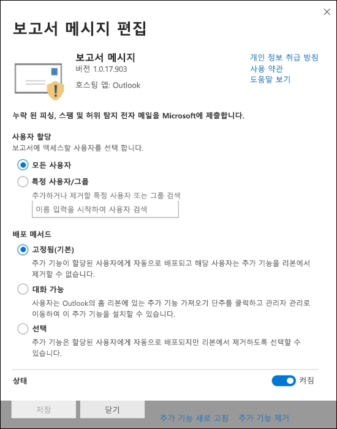

# Office 365에서 보고서 메시지 추가 기능을 사용 하도록 설정

> [!NOTE]
> Exchange Online 사서함을 사용 하는 Office 365 조직의 관리자는 Office 365 보안 & 준수 센터의 전송 포털을 사용 하는 것이 좋습니다. 자세한 내용은 [관리자 제출을 사용 하 여 의심 스러운 스팸, 피싱, url 및 파일을 Microsoft에 제출](admin-submission.md)합니다 .를 참조 하세요.

Outlook 및 웹용 Outlook에 대 한 보고서 메시지 추가 기능 (이전의 Outlook Web App)은 사용자가 가양성 (잘못 된 것으로 표시 된 전자 메일) 또는 거짓 네거티브 (잘못 된 전자 메일 허용)를 Microsoft와 해당 계열사로 쉽게 보고할 수 있도록 합니다. Microsoft는 이러한 전송을 사용 하 여 전자 메일 보호 기술의 효율성을 개선 합니다.

예를 들어 사용자가 많은 양의 메시지를 피싱 메일로 보고 한다고 가정 합니다. 이 정보는 [보안 대시보드](security-dashboard.md) 및 기타 보고서에 있습니다. 조직의 보안 팀에서이 정보를 사용 하 여 피싱 방지 정책을 업데이트 해야 할 수 있습니다. 또는 사용자가 보고서 메시지 추가 기능을 사용 하 여 정크 메일로 플래그를 지정 하지 않은 많은 메시지를 보고 하는 경우 조직의 보안 팀이 [스팸 방지 정책을](configure-your-spam-filter-policies.md)조정 해야 할 수 있습니다.

또한 조직에서 [Office 365 Advanced Threat Protection 계획 1](office-365-atp.md) 또는 [계획 2](office-365-ti.md)를 사용 하는 경우 보고서 메시지 추가 기능은 조직의 보안 팀에 게 보안 정책을 검토 하 고 업데이트 하는 데 사용할 수 있는 유용한 정보를 제공 합니다.

관리자는 조직에 대 한 보고서 메시지 추가 기능을 사용 하도록 설정 하 고 개별 사용자는 자신을 위해 직접 설치할 수 있습니다.

개별 사용자 [의 경우에는 보고서 메시지 추가 기능을 사용 하도록 설정할](#get-the-report-message-add-in-for-yourself)수 있습니다.

Office 365 전역 관리자 또는 Exchange Online 관리자이 고 Exchange가 OAuth 인증을 사용 하도록 구성 되어 있는 경우 [조직에 대 한 보고서 메시지 추가 기능을 사용 하도록 설정할](#get-and-enable-the-report-message-add-in-for-your-organization)수 있습니다. 이제 [중앙 집중식 배포](https://docs.microsoft.com/office365/admin/manage/centralized-deployment-of-add-ins)를 통해 보고서 메시지 추가 기능을 사용할 수 있습니다.

## 시작하기 전에 알아야 할 사항은 무엇인가요?

- 보고서 메시지 추가 기능 이란 대부분의 Office 365 구독과 다음 제품과 함께 작동 합니다.

  - 웹용 Outlook
  - Outlook 2013 SP1 이상
  - Mac용 Outlook 2016
  - Office 365 ProPlus에 포함 된 Outlook

- 보고서 메시지 추가 기능은 현재 사용할 수 없습니다.

  - 온-프레미스 Exchange 조직의 사서함
  - GCC, GCC HIGH 또는 DoD 구독

- 기존 웹 브라우저가 보고서 메시지 추가 기능을 사용 하 여 작동 해야 합니다. 그러나 추가 기능이 사용 가능 하지 않거나 예상 대로 작동 하지 않는 경우 다른 브라우저를 사용해 보세요.

- 조직 설치의 경우 OAuth 인증을 사용 하도록 조직을 구성 해야 합니다. 자세한 내용은 [조직에 대 한 추가 기능의 중앙 집중식 배포가 작동 하는지 확인](../../admin/manage/centralized-deployment-of-add-ins.md)을 참조 하세요.

- 관리자는 전역 관리자 역할 그룹의 구성원 이어야 합니다. 자세한 내용은 [Office 365 보안 & 준수 센터의 사용 권한을](permissions-in-the-security-and-compliance-center.md)참조 하세요.

## 사용자를 위한 보고서 메시지 추가 기능 가져오기

1. Microsoft AppSource로 이동 <https://appsource.microsoft.com/marketplace/apps> 하 여 보고서 메시지 추가 기능을 검색 합니다. 보고서 메시지 추가 기능으로 바로 이동 하려면로 <https://appsource.microsoft.com/product/office/wa104381180>이동 합니다.

2. **지금 다운로드**를 클릭 합니다.

   

3. 대화 상자가 나타나면 사용 약관 및 개인 정보 취급 방침을 검토 하 고 **계속**을 클릭 합니다.

4. 회사 또는 학교 계정 (비즈니스용 사용) 또는 Microsoft 계정 (개인적으로 사용)을 사용 하 여 Office 365에 로그인 합니다.

추가 기능을 설치 하 고 사용 하도록 설정한 후에는 다음 아이콘이 표시 됩니다.

- Outlook에서 아이콘은 다음과 같이 표시 됩니다.

  

- 웹용 Outlook에서 아이콘은 다음과 같이 표시 됩니다.

  

이 추가 기능을 사용 하는 방법에 대 한 자세한 내용은 [보고서 메시지 추가 기능 사용](https://support.office.com/article/b5caa9f1-cdf3-4443-af8c-ff724ea719d2)을 참조 하십시오.

## 조직에 대 한 보고서 메시지 추가 기능 가져오기 및 사용

> [!NOTE]
> 조직에 추가 기능을 표시 하는 데 최대 12 시간이 걸릴 수 있습니다.

1. Microsoft 365 관리 센터에서 **서비스 & 추가** 기능 페이지로 <https://admin.microsoft.com/AdminPortal/Home#/Settings/ServicesAndAddIns>이동한 후 **추가 기능 배포**를 클릭 합니다.

   

2. 나타나는 **새 추가 기능** 플라이 아웃을 배포 합니다 .에서 정보를 검토 하 고 **다음**을 클릭 합니다.

3. 다음 페이지에서 **스토어에서 선택을**클릭 합니다.

   

4. 표시 되는 **추가 기능 선택** 페이지에서 **검색** 상자를 클릭 하 고 **보고서 메시지**를 입력 한 다음 **검색** 을 클릭 합니다. 결과 목록에서 **보고서 메시지** 를 찾은 다음 **추가**를 클릭 합니다.

   

5. 대화 상자가 나타나면 라이선스 및 개인 정보 보호 정보를 검토 하 고 **계속**을 클릭 합니다.

6. **추가 기능 구성** 페이지가 나타나면 다음 설정을 구성 합니다.

   - **할당 된 사용자**: 다음 값 중 하나를 선택 합니다.

     - **모든 사람** (기본값)
     - **특정 사용자/그룹**
     - **저뿐이에요**

   - **배포 방법**: 다음 값 중 하나를 선택 합니다.

     - **Fixed (기본값)**: 추가 기능이 지정 된 사용자에 게 자동으로 배포 되며 제거할 수 없습니다.
     - **사용 가능**: 사용자가 **홈** \> 에 추가 기능을 설치할 수 있습니다 **관리 관리**를 **시작** \> 합니다.
     - **선택 사항**: 추가 기능은 지정 된 사용자에 게 자동으로 배포 되지만 제거할 수 있습니다.

   

   작업이 완료 되 면 **배포**를 클릭 합니다.

7. 표시 되는 **보고서 메시지 배포** 페이지에 진행률 보고서와 추가 기능이 배포 되었다는 확인이 차례로 표시 됩니다. 정보를 읽은 후 **다음**을 클릭 합니다.

   

8. 표시 되는 **추가 기능** 페이지에서 정보를 검토 하 고 **닫기를**클릭 합니다.

   

### 보고서 메시지 추가 기능을 사용 하는 방법 알아보기

추가 기능이 할당 된 사용자는 다음 아이콘을 볼 수 있습니다.

- Outlook에서 아이콘은 다음과 같이 표시 됩니다.

  

- 웹용 Outlook에서 아이콘은 다음과 같이 표시 됩니다.

  

사용자에 게 보고서 메시지 추가 기능에 대 한 알림을 보내는 경우 [보고서 메시지 추가 기능을 사용](https://support.office.com/article/b5caa9f1-cdf3-4443-af8c-ff724ea719d2)하는 링크를 포함 합니다.

### 보고서 메시지 추가 기능의 설정 검토 또는 편집

1. Microsoft 365 관리 센터에서 **서비스 & 추가 기능** 페이지로 이동 <https://admin.microsoft.com/AdminPortal/Home#/Settings/ServicesAndAddIns>합니다.

   

2. **보고서 메시지** 추가 기능을 찾아 선택 합니다.

3. 표시 된 **보고서 메시지** 플라이 아웃 편집에서 조직에 적합 한 설정을 검토 하 고 편집 합니다. 작업을 마쳤으면 **저장**을 클릭합니다.

   
