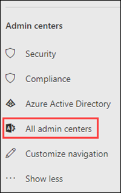
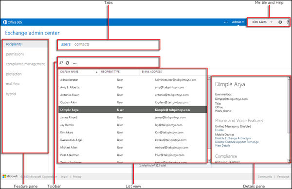

# 독립 실행형 EOP의 Exchange 관리 센터

EAC (Exchange 관리 센터)는 독립 실행형 EOP (Exchange Online Protection)에 대 한 웹 기반 관리 콘솔입니다.

이 항목의 Exchange Online 버전을 찾으시나요? Exchange [Online의 exchange 관리 센터를](https://docs.microsoft.com/exchange/exchange-admin-center)참조 하세요.

## EOP에서 EAC 열기

독립 실행형 EOP 고객은 다음 방법을 사용 하 여 EAC에 액세스할 수 있습니다.

- **Microsoft 365 관리 센터에서 다음을 수행 합니다**.

  1. 으로 이동 하 여 <https://admin.microsoft.com> **모두 표시**를 클릭 합니다.

     

  2. **관리 센터** 섹션에서 **모든 관리 센터**를 클릭 합니다.

     

  3. **모든 관리 센터** 페이지에서 **Exchange Online Protection**을 클릭 합니다.

- 로 직접 이동 `https://admin.protection.outlook.com/ecp/` 합니다.

## EOP의 EAC에 있는 일반적인 사용자 인터페이스 요소

이 섹션에서는 EMC에 있는 사용자 인터페이스 요소에 대해 설명합니다.

### 기능 창

이 창은 EAC에서 수행할 대부분의 작업에 대한 첫 번째 탐색 수준으로, 기능 영역별로 구성됩니다.

- **받는 사람**:이 기능을 통해 그룹 및 외부 연락처를 볼 수 있습니다.

- **사용 권한**: 관리자 역할을 관리할 수 있습니다.

- **준수 관리**:이 기능을 통해 관리자 역할 그룹 보고서 및 관리자 감사 로그 보고서를 찾을 수 있습니다.

- **보호**:이 기능을 통해 맬웨어 방지 정책, 기본 연결 필터 정책 및 dkim을 관리할 수 있습니다.

  > [!NOTE]
  > 맬웨어 방지 정책 및 보안 & 준수 센터의 기본 연결 필터 정책을 관리 해야 합니다. 자세한 내용은 [EOP에서 맬웨어 방지 정책 구성](configure-anti-malware-policies.md) 및 [EOP에서 연결 필터링 구성을](configure-the-connection-filter-policy.md)참조 하세요.

- **메일 흐름**:이 기능을 통해 메일 흐름 규칙 (전송 규칙이 라고도 함), 허용 도메인 및 커넥터를 관리할 수 있을 뿐 아니라 메시지 추적을 실행할 수도 있습니다.

- **하이브리드**:이 기능을 통해 [하이브리드 구성 마법사](https://docs.microsoft.com/Exchange/hybrid-configuration-wizard)를 실행할 수 있으며 [Exchange Online PowerShell 모듈](https://docs.microsoft.com/powershell/exchange/mfa-connect-to-exchange-online-powershell)을 설치할 수 있습니다.

### 탭

탭은 두 번째 탐색 수준입니다. 각 기능 영역에는 각각의 기능을 나타내는 다양한 탭이 있습니다.

### 도구 모음

대부분의 탭은 클릭하면 도구 모음이 표시됩니다. 도구 모음에는 특정 작업을 수행하는 아이콘이 있습니다. 다음 표에서는 아이콘과 그 작업에 대해 설명합니다.

||||
|---|---|---|
|**아이콘**|**이름**|**작업**|
||추가, 새로 만들기|이 아이콘을 사용하면 새 개체를 만들 수 있습니다. 일부 아이콘에는 아래쪽 화살표가 있으며 이 화살표를 클릭하면 만들 수 있는 추가 개체가 표시됩니다.|
||편집|이 아이콘을 사용하면 개체를 편집할 수 있습니다.|
||삭제|이 아이콘을 사용하면 개체를 삭제할 수 있습니다. 일부 삭제 아이콘에는 아래쪽 화살표가 있으며 이 화살표를 클릭하면 추가 옵션이 표시됩니다.|
||검색|이 아이콘을 사용하면 찾으려는 개체에 대한 검색어를 입력할 수 있는 검색 상자가 열립니다.|
||새로 고침|이 아이콘을 사용하면 목록 보기를 새로 고칠 수 있습니다.|
||기타 옵션|이 아이콘을 사용하면 해당 탭의 개체에 대해 수행할 수 있는 기타 작업을 볼 수 있습니다. 예를 들어 **받는 사람 \> 사용자**에서 이 아이콘을 클릭하면 **고급 검색**을 수행할 수 있는 옵션이 표시됩니다.  |
||위쪽 화살표와 아래쪽 화살표|이 아이콘을 사용하면 개체 우선 순위를 위나 아래로 이동할 수 있습니다.|
||제거|이 아이콘을 사용하면 목록에서 개체를 제거할 수 있습니다.|
|

### 목록 보기

탭을 선택하면 대부분의 경우 목록 보기가 표시됩니다. EAC 목록 보기 내에서 약 10,000개의 개체를 볼 수 있습니다. 또한 결과로 페이징할 수 있도록 페이징이 포함되어 있습니다.

### 세부 정보 창

목록 보기에서 개체를 선택하면 해당 개체에 대한 정보가 세부 정보 창에 표시됩니다. 세부 정보 창에 관리 작업이 포함된 경우도 있습니다.

### 내 소식 타일 및 도움말

**내 소식** 타일을 통해 EAC에서 로그아웃하고 다른 사용자로 로그인할 수 있습니다. **도움말** 드롭다운 메뉴에서 다음 작업을 수행할 수 있습니다.

- **도움말**:  온라인 도움말 콘텐츠를 보려면 도움말 아이콘을 클릭 합니다.

- **사용자 의견**: 사용자 의견을 남겨 두세요.

- **커뮤니티**: 커뮤니티 포럼에서 답변을 찾기 위한 질문을 게시 합니다.

- **사용 안 함 버블**: 도움말 버블에는 개체를 만들거나 편집할 때 필드에 대 한 상황에 맞는 도움말이 표시 됩니다. 풍선형 도움말을 끌 수 있으며, 풍선형 도움말을 사용하지 않도록 설정한 경우에는 켤 수 있습니다.

- **명령 로깅 표시**: EAC에서 구성한 사항에 따라 해당 PowerShell 명령을 표시 하는 새 창이 열립니다.

## 지원되는 브라우저

최상의 EAC 사용 환경을 위해 항상 최신 브라우저, Office 클라이언트 및 앱을 사용하는 것이 좋습니다. 또한 소프트웨어 업데이트가 제공되면 이를 설치하는 것이 좋습니다. 서비스의 지원 되는 브라우저 및 시스템 요구 사항에 대 한 자세한 내용은 [Office의 시스템 요구 사항을](https://products.office.com/office-system-requirements)참조 하세요.

## 지원되는 언어

다음은 독립 실행형 EOP에서 EAC에 대해 지원 되 고 사용할 수 있는 언어입니다.

- 암하라어

- 아랍어

- 바스크어(바스크)

- 뱅골어(인도)

- 불가리아어

- 카탈로니아어

- 중국어(간체)

- 중국어(번체)

- 크로아티아어

- 체코어

- 덴마크어

- 네덜란드어

- 네덜란드어

- 영어

- 에스토니아어

- 필리핀어(필리핀)

- 핀란드어

- 프랑스어

- 갈리시아어

- 독일어

- 그리스어

- 구자라트어

- 히브리어

- 힌디어

- 헝가리어

- 아이슬란드어

- 인도네시아어

- 이탈리아어

- 일본어

- 칸나다어

- 카자흐어

- 스와힐리어

- 한국어

- 라트비아어

- 리투아니아어

- 말레이어(브루나이)

- 말레이어(말레이시아)

- 말라얄람어

- 마라티어

- 노르웨이어(복말)

- 노르웨이어(니노르스크)

- 오리야어

- 페르시아어

- 폴란드어

- 포르투갈어(브라질)

- 포르투갈어(포르투갈)

- 루마니아어

- 러시아어

- 세르비아어(키릴 자모, 세르비아)

- 세르비아어(라틴 문자)

- 슬로바키아어

- 슬로베니아어

- 스페인어

- 스웨덴어

- 타밀어

- 텔루구어

- 태국어

- 터키어

- 우크라이나어

- 우르두어

- 베트남어

- 웨일스어
