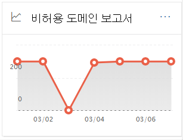

# 보안 도메인 준수 센터의 비허용 & 보고서Non-accepted domain report in the Security & Compliance Center

보안 & **준수 센터의 메일** 흐름 [대시보드에](mail-flow-insights-v2.md) 있는 비허용 도메인 보고서에는 보낸 사람의 도메인이 Microsoft 365 조직에서 허용 도메인으로 구성되지 않은 경우 온-프레미스 전자 메일 조직의 메시지에 대한 정보가 표시됩니다.The **Non-accepted domain** report in the [Mail flow dashboard](mail-flow-insights-v2.md) in the Security & Compliance Center displays information about messages from your on-premises email organization where the sender's domain isn't configured as an accepted domain in your Microsoft 365 organization.

Microsoft 365는 이러한 메시지의 의도가 악의적임을 보여 주기 위한 데이터가 있는 경우 이러한 메시지를 제한할 수 있습니다.Microsoft 365 might throttle these messages if we have data to prove that the intent of these messages is malicious. 따라서 문제가 발생하는 일을 이해하고 해당 문제를 해결하는 데 반드시 중요합니다.Therefore, it's important for you to understand what's happening and to fix the issue.

## 비허용 도메인 보고서에 대한 보고서 보기Report view for the Non-accepted domain report

비허용 도메인 **위산에서 차트를 클릭하면** 허용되지 않는 도메인 **보고서로 가게 됩니다.**Clicking the chart on the **Non-accepted domain** widget will take you to the **Non-accepted domain** report.

기본적으로 영향을 받는 모든 커넥터의 활동이 표시됩니다.By default, the activity for all affected connectors is shown. 데이터 **표시를 클릭하면**드롭다운이 있는 특정 커넥터를 선택할 수 있습니다.If you click **Show data for**, you can select a specific connector from the dropdown.

차트에서 데이터 요소(일)를 가리치치면 커넥터의 총 메시지 개수가 표시됩니다.If you hover over a data point (day) in the chart, you'll see the total number of messages for the connector.

## 비허용 도메인 보고서의 세부 정보 표 보기Details table view for the Non-accepted domain report

보고서 보기에서 **세부 정보 표를** 클릭하면 다음 정보가 표시됩니다.If you click **View details table** in a report view, the following information is shown:

- **날짜****Date**
- **인바운드 커넥터 이름****Inbound connector name**
- **보낸 사람 도메인****Sender domain**
- **메시지 수****Message count**
- **샘플 메시지:** 영향을 받는 메시지 샘플의 메시지 ID**Sample messages**: The message IDs of a sample of affected messages.

세부 정보 **보기에서 필터를** 클릭한 경우 시작 날짜와 종료 날짜로 날짜 **범위를** 지정할 **수 있습니다.**If you click **Filters** in a details table view, you can specify a date range with **Start date** and **End date**.

특정 날짜 범위에 대한 보고서에 대한 정보를 한 명 이상의 받는 사람에게 전자 메일로 보내려면 요청 을 **클릭합니다.**To email the report for a specific date range to one or more recipients, click **Request download**.

표에서 행을 선택하면 다음 정보와 함께 플라이아웃이 나타납니다.When you select a row in the table, a flyout appears with the following information:

- **날짜****Date**
- **인바운드 커넥터 이름****Inbound connector name**
- **보낸 사람 도메인****Sender domain**
- **메시지 수****Message count**
- **샘플 메시지**: 샘플 메시지를 **표시하면 영향을** 받는 [메시지 샘플의](message-trace-scc.md) 메시지 추적 결과를 볼 수 있습니다.**Sample messages**: You can click **View sample messages** to see the [message trace](message-trace-scc.md) results for a sample of the affected messages.

보고서 보기로 돌아가려면 보고서 **보기를 클릭합니다.**To go back to the reports view, click **View report**.

## 관련 항목Related topics

메일 흐름 대시보드의 기타 정보에 대한 내용은 규정 준수 센터의 [보안 흐름 정보를 & 참조하세요.](mail-flow-insights-v2.md)For information about other insights in the Mail flow dashboard, see [Mail flow insights in the Security & Compliance Center](mail-flow-insights-v2.md).
