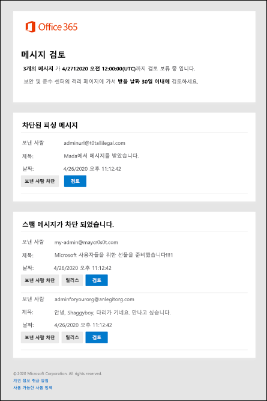

# 사용자 스팸 알림을 사용 하 여 격리 된 메시지 릴리스 및 보고

격리는 Exchange Online 사서함이 있는 Microsoft 365 조직 또는 Exchange Online 사서함이 없는 독립 실행형 EOP(Exchange online Protection) 조직에 위험할 가능성이 있거나 원치 않는 메시지를 보유합니다. 자세한 내용은 [Office 365의 격리](quarantine-email-messages.md)를 참조하세요.

기본적으로 스팸 방지 정책에서는 최종 사용자 스팸 알림이 사용 되지 않도록 설정 됩니다. 관리자가 [최종 사용자 스팸 알림을 사용 하도록 설정](configure-your-spam-filter-policies.md#configure-end-user-spam-notifications)하면 받는 사람에 게 스팸으로, 대량 전자 메일로, 또는 (4 월, 2020) 피싱 메일로 격리 된 메시지에 대 한 주기적인 알림을 받게 됩니다.

> [!NOTE]
> 높은 신뢰도의 피싱, 맬웨어 또는 메일 흐름 규칙 (전송 규칙이 라고도 함)으로 격리 된 메시지는 관리자만 사용할 수 있습니다. 자세한 내용은 [Office 365에서 관리자로 격리된 메시지 관리하기](manage-quarantined-messages-and-files.md)를 참조하세요.

최종 사용자 스팸 알림에는 격리 된 각 메시지에 대 한 다음 정보가 포함 됩니다.

- **보낸 사람**: 격리 된 메시지의 보내기 이름과 전자 메일 주소입니다.

- **제목**: 격리 된 메시지의 제목 줄 텍스트입니다.

- **Date**: 메시지가 격리 된 날짜와 시간 (UTC)입니다.

- **보낸 사람 차단**:이 링크를 클릭 하 여 수신 거부 목록에 보낸 사람을 추가 합니다. 자세한 내용은 [Outlook에서 메일 보낸 사람 차단을](https://support.office.com/article/b29fd867-cac9-40d8-aed1-659e06a706e4)참조 하세요.

- **Release**: 스팸 (피싱 아님) 메시지의 경우 보안 & 준수 센터를 격리 하지 않고 여기에서 메시지를 릴리스할 수 있습니다.

- **검토**: 보안 & 준수 센터에서 격리로 이동 하려면이 링크를 클릭 합니다 (격리 된 메시지를 해제, 삭제 또는 보고할 수 있음). 자세한 내용은 [Office 365의 사용자로 격리 된 메시지 찾기 및 릴리스](find-and-release-quarantined-messages-as-a-user.md)를 참조 하세요.

