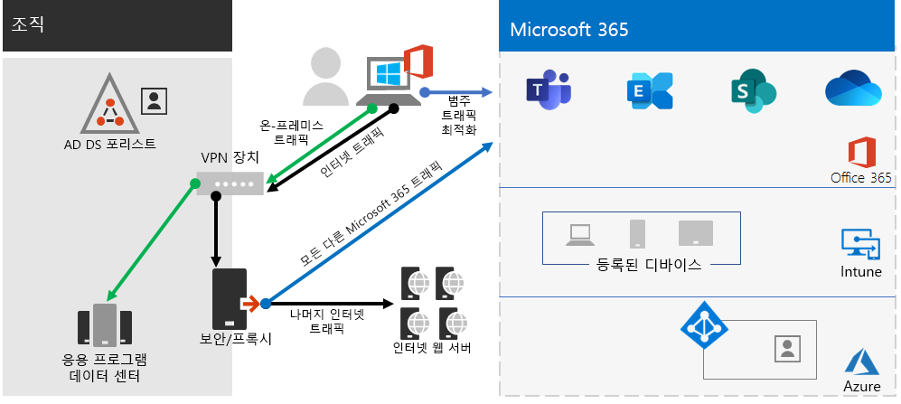
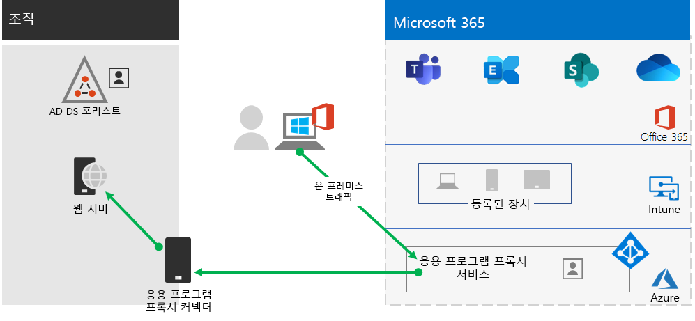
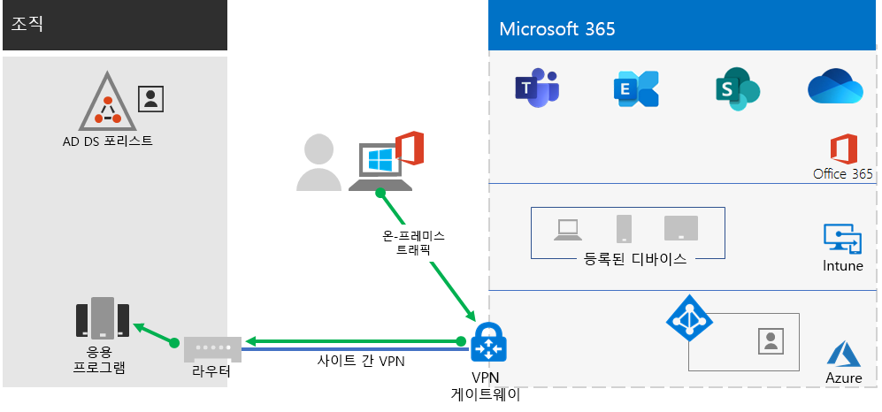
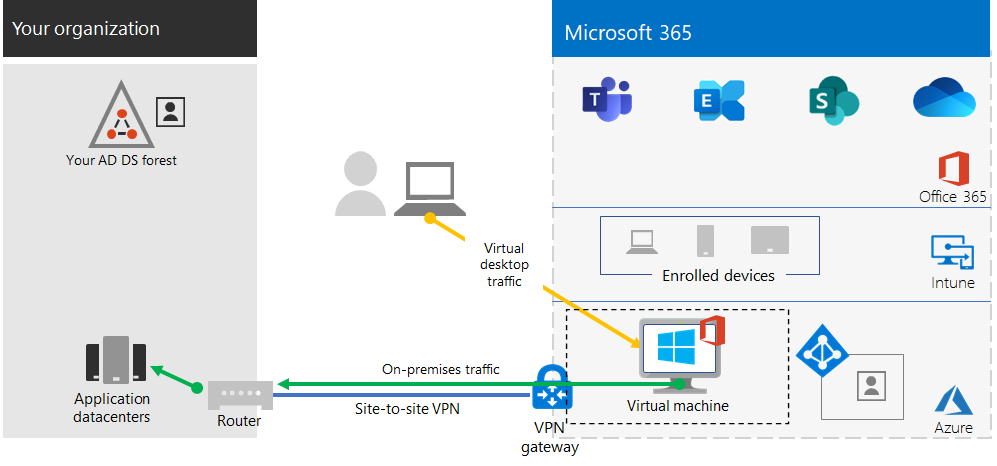

# 2단계.Step 2. 온-프레미스 앱 및 서비스로의 원격 액세스 제공Provide remote access to on-premises apps and services

조직에서 원격 액세스 VPN 솔루션을 사용하는 경우(일반적으로 사용자 장치에는 네트워크의 가장자리에 VPN 서버와 VPN 클라이언트를 설치), 사용자는 온-프레미스 앱과 서버에 액세스하는 데 원격 액세스 VPN 연결을 사용할 수 있습니다.If your organization uses a remote access VPN solution, typically with VPN servers on the edge of your network and VPN clients installed on your users' devices, your users can use remote access VPN connections to access on-premises apps and servers. 하지만 Microsoft 365 클라우드 기반 서비스로의 트래픽을 최적화해야 할 수 있습니다.But you may need to optimize traffic to Microsoft 365 cloud-based services.

사용자가 VPN 솔루션을 사용하지 않는 경우에는 Azure AD(Azure Active Directory) 응용 프로그램 프록시 및 Azure 지점 및 사이트 간(P2S) VPN을 사용하여 모든 앱이 웹 기반 인지에 따라 액세스 권한을 제공할 수 있습니다.If your users do not use a VPN solution, you can use Azure Active Directory (Azure AD) Application Proxy and Azure Point-to-Site (P2S) VPN to provide access, depending on whether all your apps are web-based.

다음과 같은 세 가지 기본 구성이 있습니다.There are three primary configurations:

1. 이미 원격 액세스 VPN 솔루션을 사용하고 있습니다.You are already using a remote access VPN solution.
2. 원격 액세스 VPN 솔루션을 사용하지 않고 있으며 하이브리드 ID가 있어, 사용자는 온-프레미스 웹 기반 앱으로의 원격 액세스만 필요로 합니다.You are not using a remote access VPN solution, you have hybrid identity, and you need remote access only to on-premises web-based apps.
3. 원격 액세스 VPN 솔루션을 사용하지 않고 있어, 온-프레미스 앱으로의 액세스 권한이 필요하며 앱 중 일부는 웹 기반이 아닙니다.You are not using a remote access VPN solution and you need access to on-premises apps, some of which are not web-based.

이 문서에서 설명하는 원격 액세스 구성 옵션을 보려면 이 순서도를 참조하세요.See this flowchart for the remote access configuration options discussed in this article.

또한 원격 액세스 연결을 사용하여 [원격 데스크톱](https://support.microsoft.com/help/4028379/windows-10-how-to-use-remote-desktop)을 사용하여 사용자를 온-프레미스 PC에 연결할 수도 있습니다.With remote access connections, you can also use [Remote Desktop](https://support.microsoft.com/help/4028379/windows-10-how-to-use-remote-desktop) to connect your users to an on-premises PC. 예를 들어 원격 작업자는 원격 데스크톱을 사용 하 여 Windows, iOS 또는 Android 장치에서 사무실의 PC에 연결할 수 있습니다.For example, a remote worker can use Remote Desktop to connect to the PC in their office from their Windows, iOS or Android device. 원격으로 연결되면 바로 앞에 앉아있는 것처럼 사용할 수 있습니다.Once they are remotely connected, they can use it as if they were sitting in front of it.

## Microsoft 365 클라우드 서비스에 대한 원격 액세스 VPN 클라이언트의 성능 최적화Optimize performance for remote access VPN clients to Microsoft 365 cloud services

원격 작업자가 기존 VPN 클라이언트를 사용하 여 조직 네트워크에 대한 원격 액세스 권한을 얻는 경우, VPN 클라이언트에 분할 터널링 지원이 되는지 확인합니다.If your remote workers are using a traditional VPN client to obtain remote access to your organization network, verify that the VPN client has split tunneling support.

분할 터널링을 사용하지 않는 경우에는 모든 원격 작업 트래픽이 조직의 에지 장치로 전송되어 처리된 후 인터넷으로 전송되지 않고 VPN 연결을 통해 전송됩니다.Without split tunneling, all of your remote work traffic gets sent across the VPN connection, where it must be forwarded to your organization’s edge devices, get processed, and then sent on the Internet.

Microsoft 365 트래픽은 조직을 통해 간접 경로를 가져와야 하며 이는 그 후 VPN 클라이언트의 실제 위치에서 멀리 떨어져 있는 Microsoft 네트워크 진입점으로 전달될 수 있습니다.Microsoft 365 traffic must take an indirect route through your organization, which could be the forwarded to a Microsoft network entry point far away from the VPN client’s physical location. 이 간접 경로는 네트워크 트래픽에 대기 시간을 더하여 전반적인 성능을 저하시킵니다.This indirect path adds latency to the network traffic and decreases overall performance. 

분할 터널링을 사용할 경우, 사용자는 특정 유형의 트래픽을 제외하여 VPN 연결을 통해 조직 네트워크에 보내지 않도록 VPN 클라이언트를 구성할 수 있습니다.With split tunneling, you can configure your VPN client to exclude specific types of traffic from being sent over the VPN connection to the organization network.

Microsoft 365 클라우드 리소스에 대한 액세스를 최적화하려면 VPN 연결을 통해 범주 **최적화** Microsoft 365 끝점으로의 트래픽을 제외하도록 분할 터널링 VPN 클라이언트를 구성합니다.To optimize access to Microsoft 365 cloud resources, configure your split tunneling VPN clients to exclude traffic to the **Optimize** category Microsoft 365 endpoints over the VPN connection. 자세한 내용은 [Office 365 끝점 범주](https://docs.microsoft.com/microsoft-365/enterprise/microsoft-365-network-connectivity-principles#new-office-365-endpoint-categories)를 참조하세요.For more information, see [Office 365 endpoint categories](https://docs.microsoft.com/microsoft-365/enterprise/microsoft-365-network-connectivity-principles#new-office-365-endpoint-categories). [여기](https://docs.microsoft.com/microsoft-365/enterprise/urls-and-ip-address-ranges)에서 범주 최적화 끝점 목록을 참조하세요.See the list of Optimize category endpoints [here](https://docs.microsoft.com/microsoft-365/enterprise/urls-and-ip-address-ranges).

이는 VPN 클라이언트가 인터넷을 통해 직접 중요한 Microsoft 365 클라우드 서비스 트래픽을 가장 가까운 진입점으로 Microsoft 네트워크로 전송하고 받도록 해줍니다.This allows the VPN client to send and receive crucial Microsoft 365 cloud service traffic directly over the Internet and to the nearest entry point into the Microsoft network.

자세한 내용과 지침은 [VPN 분산 터널링을 사용한 원격 근무자의 Office 365 연결 최적화](https://docs.microsoft.com/microsoft-365/enterprise/microsoft-365-vpn-split-tunnel??)를 참조하세요. For more information and guidance, see [Optimize Office 365 connectivity for remote users using VPN split tunneling](https://docs.microsoft.com/microsoft-365/enterprise/microsoft-365-vpn-split-tunnel??).

## 모든 앱이 웹 앱이고 하이브리드 ID가 있는 경우 원격 액세스 배포Deploy remote access when all your apps are web apps and you have hybrid identity

원격 작업자가 기존 VPN 클라이언트를 사용하지 않고 온-프레미스 사용자 계정 및 그룹이 Azure AD와 동기화되어 있는 경우, Azure AD 응용 프로그램 프록시를 사용하여 인트라넷 서버에 호스트되는 웹 기반 응용 프로그램에 대한 안전한 원격 액세스를 제공할 수 있습니다.If your remote workers are not using a traditional VPN client and your on-premises user accounts and groups are synchronized with Azure AD, you can use Azure AD Application Proxy to provide secure remote access for web-based applications hosted on intranet servers. 웹 기반 응용 프로그램에는 SharePoint 사이트, Outlook Web Access 서버 또는 기타 웹 기반 기간 업무 비즈니스 응용 프로그램이 포함됩니다.Web-based applications include SharePoint sites, Outlook Web Access servers, or any other web-based line of business applications. 

Azure AD 응용 프로그램 프록시의 구성 요소는 다음과 같습니다.Here are the components of Azure AD Application Proxy.

자세한 내용은 이 [Azure AD 응용 프로그램 프록시 개요](https://docs.microsoft.com/azure/active-directory/manage-apps/application-proxy) 와 [Azure AD 응용 프로그램 프록시 사용에 대한 동영상 파트 3](https://resources.techcommunity.microsoft.com/enabling-remote-work/#security)을 참조하세요.For more information, see this [overview of Azure AD Application Proxy](https://docs.microsoft.com/azure/active-directory/manage-apps/application-proxy) and the [Part 3 video on using Azure AD Application Proxy](https://resources.techcommunity.microsoft.com/enabling-remote-work/#security).

>[!Note]
>Azure AD 응용 프로그램 프록시는 Microsoft 365 구독에 포함되어 있지 않습니다.Azure AD Application Proxy is not included with a Microsoft 365 subscription. 별도의 Azure 구독을 통해 비용을 지불해야 합니다.You must pay for usage with a separate Azure subscription.
>

## 모든 앱이 웹 앱이 아닌 경우의 원격 액세스 배포Deploy remote access when not all your apps are web apps

원격 작업자가 기존 VPN 클라이언트를 사용하고 있지 않고 웹 기반이 아닌 앱이 있는 경우, Azure 지점 및 사이트 간(P2S) VPN을 사용할 수 있습니다.If your remote workers are not using a traditional VPN client and any of your apps are not web-based, you can use an Azure Point-to-Site (P2S) VPN.

P2S VPN 연결은 Azure 가상 네트워크를 통해 원격 작업자의 장치에서 조직 네트워크로의 연결을 안전하게 만듭니다.A P2S VPN connection creates a secure connection from a remote worker’s device to your organization network through an Azure virtual network. 

자세한 내용은 이 [P2S VPN의 개요](https://docs.microsoft.com/azure/vpn-gateway/point-to-site-about)를 참조하세요.For more information, see this [overview of P2S VPN](https://docs.microsoft.com/azure/vpn-gateway/point-to-site-about).

>[!Note]
>Azure P2S VPN은 Microsoft 365 구독에 포함되어 있지 않습니다.Azure P2S VPN is not included with a Microsoft 365 subscription. 별도의 Azure 구독을 통해 비용을 지불해야 합니다.You must pay for usage with a separate Azure subscription.
>

## Windows Virtual Desktop을 배포하여 개인 장치를 사용하는 원격 작업자에게 원격 액세스 기능을 제공Deploy Windows Virtual Desktop to provide remote access for remote workers using personal devices 

개인 장치 및 관리되지 않는 장치만 사용할 수 있는 원격 작업자를 지원하려면 Azure에서 Windows Virtual Desktop을 사용하여 사용자가 집에서 사용할 가상 데스크톱을 만들고 할당합니다.To support remote workers who can only use their personal and unmanaged devices, use Windows Virtual Desktop in Azure to create and allocate virtual desktops for your users to use from home. 가상화된 PC는 조직 네트워크에 연결된 PC와 동일하게 작동합니다.Virtualized PCs can act just like PCs connected to your organization network.

자세한 내용은 다음을 참조하세요.For more information, see: 

- [Windows Virtual Desktop 개요](https://docs.microsoft.com/azure/virtual-desktop/overview).[This overview of Windows Virtual Desktop](https://docs.microsoft.com/azure/virtual-desktop/overview).
- [원격 작업자를 위한 Windows Virtual Desktop 사용에 대한 동영상 파트 2](https://resources.techcommunity.microsoft.com/enabling-remote-work/#productivity).[The Part 2 video on using Windows Virtual Desktop for remote workers](https://resources.techcommunity.microsoft.com/enabling-remote-work/#productivity).

>[!Note]
>Windows Virtual Desktop은 Microsoft 365 구독에 포함되어 있지 않습니다.Windows Virtual Desktop is not included with a Microsoft 365 subscription. 별도의 Azure 구독을 통해 비용을 지불해야 합니다.You must pay for usage with a separate Azure subscription.
>

## 원격 데스크톱 서비스 게이트웨이로 원격 데스크톱 서비스 연결 보호Protect your Remote Desktop Services connections with the Remote Desktop Services Gateway

직원이 온-프레미스 네트워크의 Windows 기반 컴퓨터에 연결할 수 있도록 원격 데스크톱 서비스(RDS)를 사용하는 경우, Edge 네트워크에서 Microsoft 원격 데스크톱 서비스 게이트웨이를 사용해야합니다.If you are using Remote Desktop Services (RDS) to allow employees to connect into Windows-based computers on your on-premises network, you should use a Microsoft Remote Desktop Services gateway in your edge network. 게이트웨이는 SSL(Secure Sockets Layer)을 사용하여 통신을 암호화하고 RDS를 호스트하는 시스템이 인터넷에 직접 노출되는 것을 방지합니다.The gateway uses Secure Sockets Layer (SSL) to encrypt communications and prevents the system hosting RDS from being directly exposed to the Internet.

자세한 내용은 [이 문서](https://www.microsoft.com/security/blog/2020/04/16/security-guidance-remote-desktop-adoption/)를 참조하세요.See [this article](https://www.microsoft.com/security/blog/2020/04/16/security-guidance-remote-desktop-adoption/) for more information.

## 원격 액세스를 위한 관리자 기술 리소스Admin technical resources for remote access

- [원격 직원에 맞게 Office 365 트래픽을 빠르게 최적화하고 인프라의 부하를 줄이는 방법How to quickly optimize Office 365 traffic for remote staff & reduce the load on your infrastructure](https://techcommunity.microsoft.com/t5/office-365-blog/how-to-quickly-optimize-office-365-traffic-for-remote-staff-amp/ba-p/1214571)
- [VPN 분할 터널링을 사용하여 원격 사용자의 Office 365 연결 최적화Optimize Office 365 connectivity for remote users using VPN split tunneling](https://docs.microsoft.com/microsoft-365/enterprise/microsoft-365-vpn-split-tunnel?)

## 2단계의 결과Results of Step 2

원격 작업자를 위한 원격 액세스 솔루션을 배포한 후에는 다음을 수행합니다.After deployment of a remote access solution for your remote workers:

| 원격 액세스 구성Remote access configuration | 결과Results |
|:-------|:-----|
| 원격 액세스 VPN 솔루션이 가동 중입니다A remote access VPN solution is in place | 분할 터널링 및 Microsoft 365 끝점의 범주 최적화에 대한 원격 액세스 VPN 클라이언트를 구성했습니다.You have configured your remote access VPN client for split tunneling and for the Optimize category of Microsoft 365 endpoints. |
| 원격 액세스 VPN 솔루션을 사용하지 않으며 사용자는 온-프레미스 웹 기반 앱으로의 원격 액세스만 필요로 합니다.No remote access VPN solution and you need remote access only to on-premises web-based apps | Azure 응용 프로그램 프록시를 구성했습니다.You have configured Azure Application Proxy. |
| 원격 액세스 VPN 솔루션을 사용하지 않으며 온-프레미스 앱으로의 액세스 권한이 필요하며, 앱 중 일부는 웹 기반이 아닙니다.No remote access VPN solution and you need access to on-premises apps, some of which are not web-based | Azure P2S VPN을 구성했습니다.You have configured Azure P2S VPN. |
| 원격 작업자는 집에서 개인 장치를 사용하고 있습니다.Remote workers are using their personal devices from home | Windows Virtual Desktop을 구성했습니다.You have configured Windows Virtual Desktop. |
| 원격 작업자가 온-프레미스 시스템으로의 RDS 연결을 사용하고 있습니다Remote workers are using RDS connections to on-premises systems | Edge 네트워크에 원격 데스크톱 서비스 게이트웨이를 배포했습니다.You have deployed a Remote Desktop Services gateway in your edge network. |
|||

## 다음 단계Next step

[3단계](empower-people-to-work-remotely-security-compliance.md)를 계속 진행해 Microsoft 365 보안 및 규정 준수 서비스를 배포하여 앱, 데이터 및 장치를 보호하세요.Continue with [Step 3](empower-people-to-work-remotely-security-compliance.md) to deploy Microsoft 365 security and compliance services to protect your apps, data, and devices.
